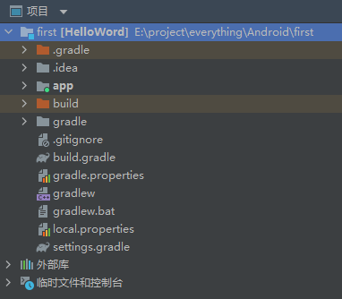

# chapter1.0-安卓启程

## 前言

​		本文是对书《第一行代码——Android开发》第一章的总结, Android 开发作为我心愿单的技能点之一, 一直是想学但是无从下手的状态, 趁着大二下 SCNU 开设移动互联网课程, 尝试学习和掌握这门课程

​		这一个系列将会一直更新下去, 指导课程结束...

​		原书是非常好的教材, 本文仅做本人的快速回顾以及复习使用, 如有遗漏或者错误, 欢迎指出和批评指正

## Android 系统架构

Android 大致可以分为4层架构：**Linux内核层**、**系统运行库层**、**应用框架层**和**应用层**

* **Linux内核层**

Android系统是基于Linux内核的，这一层为Android设备的各种硬件提供了底层的驱动， 如显示驱动、音频驱动、照相机驱动、蓝牙驱动、Wi-Fi驱动、电源管理等。

也就是说, 这一部分提供了一些系统底层的功能, 如对网卡以及各种底层设备的调用, 是对硬件的封装

* **系统运行库层**

这一层通过一些C/C++库为Android系统提供了主要的特性支持, 在这一层还有Android运行时库，它主要提供了一些核心库，允许开发者使用Java语言来 编写Android应用。另外，Android运行时库中还包含了Dalvik虚拟机，它使得每一个Android应用都能运行在独立的进程中，并且拥有一个自己 的虚拟机实例。相较于Java虚拟机，Dalvik和ART都是专门为移动设备定制的，它针对手 机内存、CPU性能有限等情况做了优化处理。

* **应用框架层**

这一层主要提供了构建应用程序时可能用到的各种API，Android自带的一些核心应用就是 使用这些API完成的，

* **应用层**

所有安装在手机上的应用程序都是属于这一层的

谷歌官方介绍如下:  [平台架构  | Platform  | Android Developers](https://developer.android.com/guide/platform?hl=zh-cn)

## 安装环境的搭建

这一部分不再细致的讲解, 大家可以参考网络上的相关教程或者书上的指引安装

安装可能会遇到网络问题等等一些列繁琐的事, 大家也就八仙过海各显神通啦

## 安卓项目结构

当我们选择以 `Empty Activity` 创建后, 这个项目的文件结构如下图所示:

我们分析一下所有的文件:

* **.gradle 和 .idea**

这两个目录下放置的都是Android Studio自动生成的一些文件，我们无须关心，也不要去 手动编辑。

* **app**

项目中的代码、资源等内容都是放置在这个目录下的，我们后面的开发工作也基本是在这 个目录下进行的，待会儿还会对这个目录单独展开讲解。

* **build**

这个目录主要包含了一些在编译时自动生成的文件，不需要过多关心。

* **gradle**

这个目录下包含了gradle wrapper的配置文件

*  **.gitignore**

这个文件是用来将指定的目录或文件排除在版本控制之外的

* **build.gradle**

这是项目全局的gradle构建脚本，通常这个文件中的内容是不需要修改的。稍后我们将会 详细分析gradle构建脚本中的具体内容

* **gradle.properties**

这个文件是全局的gradle配置文件，在这里配置的属性将会影响到项目中所有的gradle编 译脚本

* **gradlew 和gradlew.bat**

这两个文件是用来在命令行界面中执行gradle命令的，其中gradlew是在Linux或Mac系统 中使用的，gradlew.bat是在Windows系统中使用的。

* **local.properties**

这个文件用于指定本机中的Android SDK路径，通常内容是自动生成的，我们并不需要修 改。除非你本机中的Android SDK位置发生了变化，那么就将这个文件中的路径改成新的 位置即可。

* **settings.gradle**

这个文件用于指定项目中所有引入的模块。由于HelloWorld项目中只有一个app模块，因 此该文件中也就只引入了app这一个模块。通常情况下，模块的引入是自动完成的，需要我 们手动修改这个文件的场景可能比较少

### App目录下结构

App 下的目录结构如下图所示

我们分析一下所有的文件:

* **build**

这个目录主要包含了一些在编译时自动生成的文件，不需要过多关心。

* **libs**

如果你的项目中使用到了第三方jar包，就需要把这些jar包都放在libs目录下，放在这个目 录下的jar包会被自动添加到项目的构建路径里。

* **androidTest**

此处是用来编写Android Test测试用例的，可以对项目进行一些自动化测试

* **java**

我们 Java 代码和 Kotlin 代码存放的位置

* **res**

资源文件夹, 所有项目所使用的资源都会整合在这里

* **AndroidManifest.xml**

这是整个Android项目的配置文件，你在程序中定义的所有四大组件都需要在这个文件里注 册，另外还可以在这个文件中给应用程序添加权限声明。由于这个文件以后会经常用到

* **test**

此处是用来编写Unit Test测试用例的，是对项目进行自动化测试的另一种方式。

*  **.gitignore**

这个文件是用来将指定的目录或文件排除在版本控制之外的

* **build.gradle**

这是app模块的gradle构建脚本，这个文件中会指定很多项目构建相关的配置，我们稍后 将会详细分析gradle构建脚本中的具体内容。

* **proguard-rules.pro**

这个文件用于指定项目代码的混淆规则，当代码开发完成后打包成安装包文件，如果不希 望代码被别人破解，通常会将代码进行混淆，从而让破解者难以阅读。