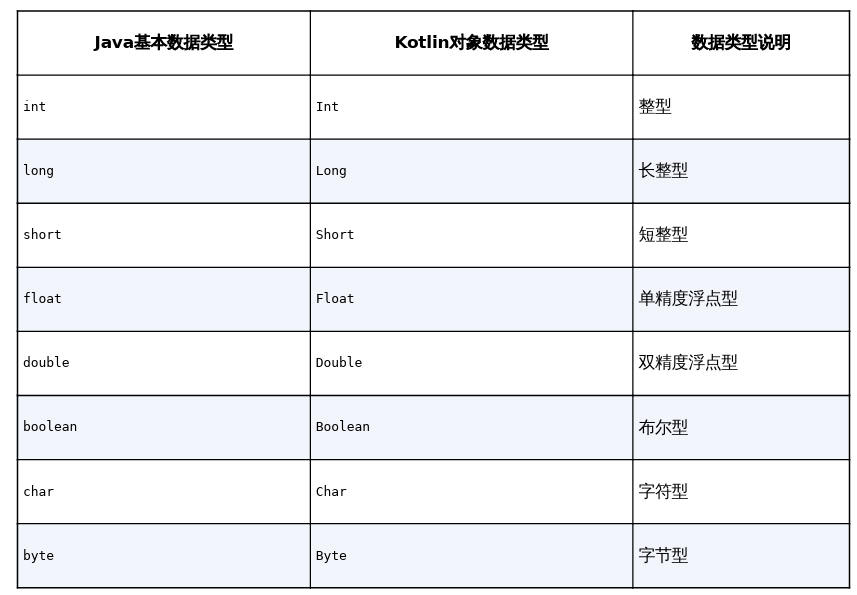
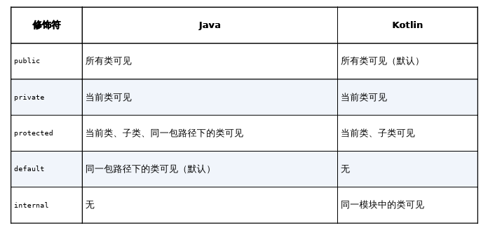

# chapter2.0-快速入门Kotlin

## 运行及开始

我们可以在 `Android Stdio` 中来编写独立的 `Kotlin` 代码, 也可以使用在线网站来编写代码

在线网站如下 : https://try.kotlinlang.org (网站在墙外, 访问需要挂上梯子)

正如所有的编程语言一样, 第一个代码必然是输出 `HelloWorld`

```kotlin
fun main() {
    println("Hello, world!!!")
}
// Hello, world!!!
```

如果你成功运行, 那么就正式进入 `Kotlin` 的学习吧


## 变量的定义和使用

不同于其他的编程语言, `Kotlin` 的定义变量要特别很多, 在 `Kotlin` 中分为可变变量和不可变变量, 他们的定义方式不同

* 可变变量 : `var a` , 对应 Java 用 `final` 修饰的变量
* 不可变变量 : `val a` [value 的简写], 对应着 Java 中没有加 `final` 修饰的变量

```kotlin
fun main() {
    val a = 10
    var b = 100
    println("a + b = " +  (a + b))
}
```

值得注意的是, `Kotlin` 不同于 Java, 在一个语句的末尾不需要加上 `;` 

同时 `Kotlin` 不需要显示指明变量的类型, 编译器会在第一次赋值的时候自动推导变量的类型

也就是说, 如果赋值字符串, 那这个字符串就是字符串类型, 以此类推

当然你也可以自己显式的确定变量的类型

```kotlin
fun main() {
    val a : Int = 10
    var b : String = "100"
    println("a = " + a)
    println("b = " + b)
}
```

我们注意到, 类型的第一个字母的大写的, 说明这是一个类, `Kotlin` 完全抛弃了 Java 中的基本数据类型，全部使用了对象数据类型。在Java 中 `int` 是关键字，而在 Kotlin 中 `Int` 变成了一 个类，它拥有自己的方法和继承结构。




## 函数的定义和使用

函数的定义也和我们平常使用的语言大差不差

```kotlin
fun methodName(param1 : Int, param2 : Int) : Int {
    return 0
}
```

参数名和参数类型, 函数名和返回类型都是我们可以自己改动的

我们以下面这个函数为例子

```kotlin
import kotlin.math.max
fun largeNumber(param1 : Int, param2 : Int) : Int {
    return max(param1, param2)
}

fun main() {
    println(largeNumber(5, 100))
}
```

对于一个我们库函数, 我们需要导入相应的包, 这个包我们可以通过 `Android Stdio` 的代码提示来自动补全, 不需要太过担心

接下来我们简单讲述一下 `Kotlin` 的语法糖

**当一个函数中只有一行代码时，我们不必编写函数体，可以直接将唯一的一行代码写在函数定义的尾部，中间用等号连接即可**

所以上面的代码我们可以改成下面这种形式

```kotlin
import kotlin.math.max
fun largeNumber(param1 : Int, param2 : Int) : Int = max(param1, param2)
```

又因为 `Kotlin` 可以自动推导返回的结果, 所以我们连返回类型都不需要写

于是进一步简化为

```kotlin
import kotlin.math.max
fun largeNumber(param1 : Int, param2 : Int) = max(param1, param2)
```


## 逻辑控制--条件语句

条件语句在 `Kotlin` 中有两种, 分别是 `if` 和 `when`

> #### `if` 语句

`Kotlin` 的 `if` 语句可以按照我们其他语言的 `if` 编写习惯来编写, 比如说 : 

```kotlin
fun largeNumber(num1 : Int, num2 : Int) : Int {
    var ans = 0
    if(num1 < num2)
    	ans = num2
   	else ans = num1
    return ans
}
```

但不同于其他语言的是, `Kotlin` 的 `if` 语句是有返回值的, 返回值就是if语句每 一个条件中最后一行代码的返回值

```kotlin
fun largeNumber(num1 : Int, num2 : Int) : Int {
    val ans = 	if(num1 > num2) num1
    			else num2
    return ans
}
```

仔细观察上述代码，你会发现 `ans` 其实也是一个多余的变量，我们可以直接将 `if` 语句返回

这个时候, 这个函数体就只有一行代码了, 就可以使用我们的语法糖了, 整一个函数就可以简化为下面的形式

```Kotlin
fun largeNumber(num1 : Int, num2 : Int) = if(num1 > num2) num1 else num2
```

注意,这个时候的 `if` 语句必须要有 `else` 分支

> ### `when` 语句

`when` 可以理解是 `switch` 的 `pro max ultra` 版本

假设我们要编写一个根据名字查询成绩的函数, 单纯用 `if` 来实现的话会十分臃肿

```Kotlin
fun queryScore(name : String) =  if(name == "yyym") 100
								 else if(name == "Tom") 90
								 else if(name == "Jim") 80
								 else if(name == "Jack") 70
								 else if(name == "Lily") 60
								 else 0
```

但是如果我们使用 `when` 语句就可以简化 `name == ???` 这一部分了

```kotlin
fun queryScore(name : String) =  when(name) {
    "yyym" -> 100
    "Tom"  -> 90
	"Jim"  -> 80
	"Jack" -> 70
	"Lily" -> 60
    else   -> 0
}
```

when语句允许传入一个任意类型的参数，然后可以在when的结构体中定义一系列的条件，格式 是：

```kotlin
匹配值 -> { 执行逻辑 } 
```

于是我们就可以写出这样的代码

```kotlin
fun checkNumber(num: Number) { 
    when (num) { 
        is Int -> println("number is Int") 
        is Double -> println("number is Double") 
        else -> println("number not support") 
    } 
} 
```

`is` 关键字就是类型匹配的核心，它相当于Java中的 `instanceof` 关键字。由于 `checkNumber()` 函数接收一个 `Number` 类型的参数，这是 `Kotlin` 内置的一个抽象类，像 `Int` 、 `Long` 、`Float` 、`Double` 等与数字相关的类都是它的子类，所以这里就可以使用类型匹配来判断传入的参数到底属于什么类型，如果是 `Int` 型或 `Double`型，就将该类型打印出来，否则就打 印不支持该参数的类型。

`when` 语句可以支持不传入参数

```kotlin
fun queryScore(name: String) = when { 
    name.startsWith("Tom") -> 86 
    name == "Jim" -> 77 
    name == "Jack" -> 95 
    name == "Lily" -> 100 
    else -> 0 
}
```

这样所有开头为 `Tom` 的字符串都会返回 $86$


## 逻辑控制--循环语句

循环语句有 `while` 和 `for` 语句, `while` 语句与 java 的使用方法完全一致, 所以我们不做讲解

`Kotlin` 在 `for` 循环方面做了很大幅度的修改，Java中最常用的 `for-i` 循环在Kotlin中直接被舍弃 了，而 Java 中另一种 `for-each`循环则被 `Kotlin` 进行了大幅度的加强，变成了 `for-in` 循环，所 以我们只需要学习 `for-in` 循环的用法就可以了

 我们首先讲解一下区间的概念, 在 `Kotlin` 中, 我们可以使用下面的代码来定义一个区间

```kotlin
val range = 0..10 
```

它表示一个左闭右闭的区间, 即 $[1, 10]$

```kotlin
val range = 0 until 10
```

它表示一个左闭右开的区间, 即 $[1, 10)$

之后我们就可以使用区间来进行循环了

```kotlin
fun main() {
   	for(i in 1..10)
    	println(i)
    for(i in 1 until 10 step 2) // 指定循环的步数
    	println(i)
}
```

上面的两个循环都是升序,我们也可以降序排序

```kotlin
fun main() {
   	for(i in 10 downTo 1)
    	println(i)
}
```


## 面向对象编程

类的定义其实也和其他的语言相差不大

```kotlin
class Person {
    var name = ""
    var age = 0
    fun eat() {
        println(name + " is eating. He is " + age + " years old.")
    }
}

fun main() {
    val p = Person()
    p.name = "yyym"
    p.age = 18
    p.eat()
}
```


### 继承与构造函数

`Kotlin` 的继承和 Java 有些许的不同, 我们一一讲解

* **类是否可以给继承**

在 java 中, 默认所有的类都是可以给继承的, 除非使用 `final` 变量给这个类限定

但是在 `Kotlin` 默认所有的类(除了抽象类) 都是不可以继承的, 如果需要继承的话, 我们需要加上关键词 `open`

```kotlin
open class Person {
    ...
}
```

* **继承的关键词**

Java 的继承关键词是 `extend` , 但是 `Kotlin` 是使用 `:` 来继承的

```kotlin
class Student : Person() {
    var sno = ""
    var grade = 0
}
```

* **主构造函数**

主构造函数将会是你最常用的构造函数，每个类默认都会有一个不带参数的主构造函数，当然 你也可以显式地给它指明参数。主构造函数的特点是没有函数体，直接定义在类名的后面即 可

```kotlin
class Student(val sno: String, val grade: Int) : Person() { 
} 
```

这个时候, 如果我们需要实例化一个 `Student` 类的时候, 就需要传入主构造函数所需要的参数了

这个时候不需要再类里面显式的

正常情况下, 主构造函数是没有逻辑的, 但是如果我们希望在主构造函数中实现一些逻辑, 我们可以这样实现

```kotlin
class Student(val sno: String, val grade: Int) : Person() { 
    init {
		println("sno is " + sno) 
        println("grade is " + grade) 
    }
} 
```

在 Java 和 `Kotlin` 中， 子类的构造函数必须调用父类的构造函数，可是主构造函数并没有函数体，我们怎样去调用父类的构造函数呢？ 我们可以在 `init` 结构体中调用, 但是大部分时候 `init` 结构体都是不使用的, 所以我们便可以在继承父类的括号中调用父类的构造函数

我们用下面的代码举例:

```kotlin
open class Person(var name :String, var age : Int){
    fun eat() {
        println(name + " is eating. He is " + age + " years old.")
    }
}
class Student(val sno: String, val grade: Int, name : String, age : Int) :
	  Person(name, age) { 
    fun show() {
        println("sno is " + sno + "grade is " + grade)
        eat()
    }
} 

fun main() {
    val s = Student("2022", 2, "yyym", 2)
    s.show()
}
```

假设我们的父类的主构造函数要求了相关的参数, 我们就可以在继承这个类的时候, 将相关的参数传入到父类的构造函数中, 也就是 `:Person(name, age)` 这一部分, 但是我们发现 `Student` 初始时是没有 `name` 和 `age` 字段的, 那么我们也就只能在 `Student`的主构造函数中添加上对应的参数

我们在 `Student` 类的主构造函数中增加 `name` 和 `age` 这两个字段时，不能再将它们声明成 `val`，因为在主构造函数中声明成 `val` 或者 `var` 的参数将自动成为该类的字段，这就会导致和父 类中同名的 `name` 和 `age` 字段造成冲突。因此，这里的 `name` 和 `age` 参数前面我们不用加任何关键字，让它的作用域仅限定在主构造函数当中即可。

* **次构造函数**

任何一个类只能有一个主构造函数，但是可以有多个次构造函数。次构造函数也可 以用于实例化一个类，这一点和主构造函数没有什么不同，只不过它是有函数体的。

你可以简单的理解, 当用户输入的参数缺失的时候, 我们将设置某个参数为默认值

`Kotlin` 规定，当一个类既有主构造函数又有次构造函数时，所有的次构造函数都必须调用主构造 函数（包括间接调用）

```kotlin
class Student(val sno: String, val grade: Int, name : String, age : Int) :
	  Person(name, age) { 
    constructor(name : String, age : Int) : this("", 0, name, age){}
    constructor(name : String) : this(name, 0){}

    .....
} 
```

* **特殊情况** - 类中只有次构造函数，没有主构造函数

当一个类没有显式地定义主构造函数且定义了次构 造函数时，它就是没有主构造函数的。

```kotlin
class Student : Person { 
    constructor(name: String, age: Int) : super(name, age) { 
    } 
}
```

值得注意的是, 这个时候继承父类的 `Person` 后面是没有加上括号的, 这时应为 `Student` 类没有主构造函数, 而没有主构造函数, 就没有必要掉用构造函数了

可以理解为, 连主构造函数都没有, 为什么还需要在主构造函数中调用父类构造函数


### 接口

`Kotlin` 中的接口部分和 `Java` 几乎是完全一致的。

`Kotlin` 是单继承结构的语言，任何一个 类最多只能继承一个父类，但是却可以实现任意多个接口

我们以下面的代码为例子:

```Kotlin
interface Study {
    fun readBooks() 
    fun doHomework() 
}
class Student : Person , Study{ 
    constructor(name: String, age: Int) : super(name, age) {}
    override fun readBooks() = println("reading book")
    override fun doHomework() = println("doint homework")
} 
fun main() {
    val s = Student("yyym", 10)
    s.readBooks()
    s.doHomework()
}
```

接口的实现也和继承一样, 在冒号后面接口, 中间用 `,` 分隔, 实现使用 `override` 关键字

同时我们也可以使用接口来实现多态

```kotlin
fun main() { 
    val student = Student("Jack", 19) 
    doStudy(student) 
} 
fun doStudy(study: Study) { 
    study.readBooks() 
    study.doHomework() 
} 
```

接口中的函数也可以有默认实现:

```kotlin
interface Study {
    fun readBooks() = println("reading book")
    fun doHomework() = println("doint homework")
}
```


### `Kotlin` 函数可见性修饰符

这一部分主要以下面的表为主




### 数据类和单例类

> #### 数据类

数据类就是用来存储一类数据的, 比如图书类, 人员类等等

数据类通常需要重写 `equals()` 、`hashCode()` 、`toString()` 这几个方法。其中，`equals()` 方法用于判断两个数据类是否相等。`hashCode()` 方法作为 `equals()` 的配套方法，也需要一起 重写，否则会导致`HashMap`、`HashSet` 等 `hash`相关的系统类无法正常工作。`toString()` 方法 用于提供更清晰的输入日志

如果我们使用 Java , 就需要自己重写或者使用注解来实现, 但是在 `Kotlin` 中非常简单, 只需要声明成数据类即可

```kotlin
data class Cellphone(val brand: String, val price: Double) // 数据类
fun main() { 
    val cellphone1 = Cellphone("Samsung", 1299.99) 
    val cellphone2 = Cellphone("Samsung", 1299.99) 
    println(cellphone1) 
    println("cellphone1 equals cellphone2 " + (cellphone1 == cellphone2)) 
}
```

> #### 单例类

如果我们希望某个类在全局最多只能拥有一个实例，这时就可以使用单例模式, 这个类就是单例类

```kotlin
object Singleton { 
    fun singletonTest() = println("singletonTest is called.") 
}

fun main() {
    Singleton.singletonTest()
}
```


## 集合的创建和使用

我们指的集合是指 `List` , `Set` , `HashSet` 等容器

我们一一进行讲解

> #### `List`

在 `Kotlin` 中, 定义 `List` 和初始化 `List` 的方法如下:

```kotlin
val list = listOf("Apple", "Banana", "Orange")
```

注意使用 `listOf` 构建的 `List` 是不可以变的, 是不能增加或者删除的

如果我们希望创建一个可以增加或者删除的 `List` 的话, 可以使用下面的方法

```kotlin
val list = mutableListOf("Apple", "Banana", "Orange")
list.add("tem")
list.remove("Apple")
```

如果我们希望遍历数组也可以使用 `for-in`

```kotlin
for(ele in list)
	println(ele)
```

同时也可以使用下标访问某个元素, 如 `list[0]`

> #### `Set`

`Set` 和 `List` 差不多, 唯一区别是 `Set` 不能存放一样的元素, 例子如下

```kotlin
fun main() {
    val list = setOf("Apple", "Banana", "Orange") // 不可变
    val list2 = mutableSetOf("Apple", "Banana", "Orange", "Apple") // 可变
    list2.add("tem")
    list2.remove("Apple")
    for(ele in list2)
    	println(ele)
}
```

> #### `Map `

在 `Kotlin` 中, `Map` 的添加一般使用下面的方式

```kotlin
fun main() {
    val map2 = mapOf("Apple" to 1, "Banana" to 2, "Orange" to 3);
    val map = mutableMapOf("Apple" to 1, "Banana" to 2, "Orange" to 3);
    println(map["Apple"])
    map.put("three", 3)
    map.putAll(setOf("four" to 4, "five" to 5))
    for((key, v) in map)
    	println("key is : " + key + "\tvalue : " + v)
}
```

我们使用 `mapOf` 来创建一个不可以改变的 `Map` , 使用 `mutableMapOf` 来创建一个可以改变的 `Map`

我们同时也可以使用 `for-in` 来进行遍历

> ps : `to` 并不是关键字，而是一个`infix` 函数，以后会讲解


## `Lambda` 编程

这一章其实在 Java 中也有对应的部分, 如果你有相关基础, 那么将非常容易

我们以下面的代码为例子:

```kotlin
fun main() {
    val list = listOf("Apple", "Orange", "Pear", "Grape", "Watermelon") 
    var maxLengthFruit = "" 
    for (fruit in list) { 
        if (fruit.length > maxLengthFruit.length) { 
            maxLengthFruit = fruit 
        } 
    } 
    println("max length fruit is " + maxLengthFruit) 
}
```

我们使用 `Lambda` 后可以改写成下面的部分:

```kotlin
fun main() {
    val list = listOf("Apple", "Orange", "Pear", "Grape", "Watermelon") 
    var maxLengthFruit = list.maxBy { it.length } 
    println("max length fruit is " + maxLengthFruit) 
}
```

重点是这一句 : `var maxLengthFruit = list.maxBy { it.length } `  , 我们如何理解呢?

我们首先看一下 `Lambda` 表达式的基本格式:

```kotlin
{参数名1 : 参数类型, 参数名2 :参数类型 -> 函数体}
```

之后我们介绍一下 `list.maxBy` 函数, 这个函数只是我们讲解 `Lambda` 表达式的例子

`maxBy` 函数的工作原理是根据 我们传入的条件来遍历集合，从而找到该条件下的最大值, 只不过它接收的是一个 `Lambda` 类型的参数，并且会 在遍历集合时将每次遍历的值作为参数传递给 `Lambda` 表达式

那么上面的表达式可以写成 : 

```kotlin
var maxLengthFruit = list.maxBy({ele : String -> ele.length})
```

`Kotlin` 规定，当Lambda参数是函数的最后一个参数时，可以将Lambda表达式移到函数括 号的外面, 于是变成 :

```kotlin
var maxLengthFruit = list.maxBy() {ele : String -> ele.length}
```

如果 `Lambda` 参数是函数的唯一一个参数的话，还可以将函数的括号省略

```kotlin
var maxLengthFruit = list.maxBy {ele : String -> ele.length}
```

`Kotlin` 拥有出色的类型 推导机制，`Lambda` 表达式中的参数列表其实在大多数情况下不必声明参数类型

```kotlin
val maxLengthFruit = list.maxBy { fruit -> fruit.length }
```

当 `Lambda` 表达式的参数列表中只有一个参数时，也不必声明参数名，而是可以使用 `it` 关键字来代替

```kotlin
val maxLengthFruit = list.maxBy { it.length } 
```

> #### 函数式 API

我们直接用代码来展示

```kotlin
fun main() { 
    val list = listOf("Apple", "Banana", "Orange", "Pear", "Grape", "Watermelon") 
    val newList = list.filter { it.length <= 5 } 
                      .map { it.toUpperCase() } 
    for (fruit in newList) { 
        println(fruit) 
    } 
    val anyResult = list.any { it.length <= 5 } 
    val allResult = list.all { it.length <= 5 } 
    println("anyResult is " + anyResult + ", allResult is " + allResult) 
}
```

`fliter` 用来过滤 , `map` 用来重新构造, `any` 判断是否有符合的, `all` 判断是否全部符合

在 Java 中均有对应的部分


## `Kotlin` 使用 `Java` 函数式 API

在 `Kotlin` 中使用 `Java` 的函数式 API 有相关的限制, 如果我们在 `Kotlin` 代码中调用了一个 Java方法，并且该方法接收一个 `Java` 单抽象方法接口参数，就可以使用函数式API。`Java` 单抽象 方法接口指的是接口中只有一个待实现方法，如果接口中有多个待实现方法，则无法使用函数式API。

我们以下面的代码为例子 : (我们调用 Java 的 `Runnable` 函数式接口)

```java
public interface Runnable { 
    void run(); 
} 
```

我们在 `Kotlin` 中使用 : 

```kotlin
fun main() { 
    Thread(object : Runnable { 
        override fun run() { 
            println("Thread is running") 
        } 
    }).start()
}
```

我们可以根据我们之前学的知识来进行简化

```kotlin
Thread(Runnable { 
    println("Thread is running") 
}).start() 
```

我们还可以将 接口名进行省略，这样代码就变得更加精简了, 同时可以将 `Lambda` 表达式移到方法括号的外面。同时，如果 `Lambda` 表达式还是 方法的唯一一个参数，还可以将方法的括号省略

```kotlin
Thread { 
    println("Thread is running") 
}.start() 
```


## 空指针检查

我们看这样一个函数 

```kotlin
fun doStudy(study: Study) { 
    study.readBooks() 
    study.doHomework() 
} 
```

如果 `study` 的 `null` , 那么这两句代码是会导致空指针异常,  但实际上这是不可能发生的, 因为 `Kotlin` 默认所有的参数和变量都是不可以为空的, 如果传递的参数是空的话, 那么就会报错

如果我们希望传入的参数是可以为空的, 那么就应该将参数的类型由 `Study` 改成 `Study?`

```kotlin
fun doStudy(study: Study?)
```

但这个时候就需要使用 `if` 语句来判断 `study` 不为空才能执行后面的两行内容, 否则不允许编译通过, 而且 `if` 语句也不能判断全局变量是否为空 (多线程下无法判断)

这个时候 `kotlin` 提供了一种方式 `?.`

```kotlin
if (a != null) { 
    a.doSomething() 
} 
// 简化后
a ?.doSomething() 
```

同时还有一个 `?:` 方法, 你可以理解为是一个特殊的双目运算符

这个操作符的左右两边都接收一个表达式， 如果左边表达式的结果不为空就返回左边表达式的结果，否则就返回右边表达式的结果

```kotlin
val c = if (a ! = null) a else b
// 化简为
val c = a ?: b
```

我们再来看看这个代码:

```kotlin
var content: String? = "hello" 
fun main() { 
    if (content != null) { 
        printUpperCase() 
    } 
} 
fun printUpperCase() { 
    val upperCase = content.toUpperCase() 
    println(upperCase) 
}
```

这段代码是无法运行的, 哪怕你确定 `content` 已经不为空了, 但是编译器不知道, 所以不能运行

如果我们想要强行通过编译，可以使用非空断言工具，写法是在对象的后面加上`!!`

```kotlin
fun printUpperCase() { 
    val upperCase = content!!.toUpperCase() 
    println(upperCase) 
} 
```

这是一种有风险的写法，意在告诉 `Kotlin`，我非常确信这里的对象不会为空，所以不用你来帮我 做空指针检查了，如果出现问题，你可以直接抛出空指针异常，后果由我自己承担。

最后, 我们在学习一下一个辅助工具 `let` ,这是一个函数。这个函数提供了函数式API的编程接口，并将原始调用对象作为参数传递到 `Lambda` 表达式中

```kotlin
obj.let { obj2 -> 
    // 编写具体的业务逻辑 
} 
```

如果我们使用 `?.` , 那么相当于每次调用一次方法都需要判断是否为空, 但是实际上不需要, 所以我们可以使用 `let` 优化

```kotlin
fun doStudy(study: Study?) { 
    study?.let { 
        it.readBooks() // 用 it 是 Lambda 表达式化简的结果
        it.doHomework() 
    } 
}
```

同时 `let` 也可以用于全局变量判空


## 其他技巧

### 字符串内嵌表达式

我们可以直接在字符串中内嵌表达式的值了, 而无需再使用 `+` 号拼接了

```kotlin
val brand = "Samsung" 
val price = 1299.99 
println("Cellphone(brand=$brand, price=$price)") 
```


### 函数的参数默认值

我们可以给函数设置默认参数, 这样哪怕用户不输入对应参数也可以是默认值

```kotlin
fun printParams(num: Int, str: String = "hello") { 
    println("num is $num , str is $str") 
} 
fun main() { 
    printParams(123) 
} 
```

同时可以使用键值对来精确匹配输入的值

```kotlin
fun printParams(num: Int = 100, str: String) { 
    println("num is $num , str is $str") 
} 
fun main() { 
    printParams(str = "world") 
} 
```

因为有了函数默认值, 所以次构造函数变得不再重要了, 我们完全可以给主构造函数设置默认值

```kotlin
class Student(val sno: String = "", val grade: Int = 0, name: String = "", age: Int = 0) : 
         Person(name, age) { 
} 
```

