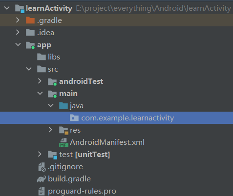
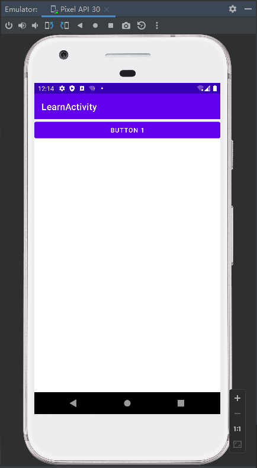
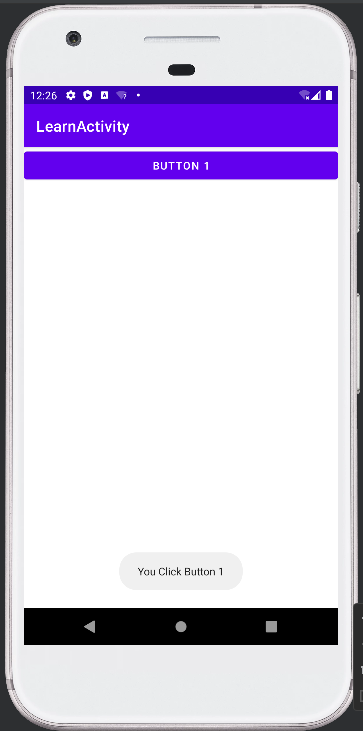

# chapter3.0-Activity初试

## What is Activity

​		Activity是最容易吸引用户的地方，它是一种可以包含用户界面的组件，主要用于和用户进行交 互。一个应用程序中可以包含零个或多个Activity. 换句话说 Activity 就是用户可以看到的一个又一个界面

​		通过本章的学习， 我们将会对 Activity 有更深的了解， 同时也会对前面只是简略讲解的 `kotln` 进行补充


## 创建 Activity 和基础设置

我们首先创建一个新的项目， 即选择 `Empty Activity` ， 这样， 我们的 APP 将不会有任何的 Activity 文件

创建后目录如下 ： 



之后我们在文件夹中建立一个新的 Activity ： 右击com.example.activitytest包→New→Activity→Empty Activity

这样就会弹出一个新建的选项窗口

其中有几个选项需要说明 ： 

* `Generate a Layout File` : 会自动创建一个布局文件 （建议勾选）
* `Launcher Activity` : 将这个页面设为主页面

我们先不设为主页面， 后面手动设置

新建后产生的 Activity 内容如下 ：

```kotlin
package com.example.learnactivity

import androidx.appcompat.app.AppCompatActivity
import android.os.Bundle

class MainActivity : AppCompatActivity() {
    override fun onCreate(savedInstanceState: Bundle?) {
        super.onCreate(savedInstanceState)
        setContentView(R.layout.activity_main)
    }
}
```

`onCreate()` 方法是这个Activity 中默认的创造后方法， 我们将在后面详细讲解

Android程序的设计讲究逻辑和视图分离，最好每一个Activity都能对应一个布局。这个布局文件如果提前勾选了 `Generate a Layout File` 就会自动生成， 默认在 `main/res/layout` 文件夹中, 我的布局文件为 `activity_main.xml` ， 我们需要在 Activity 中确定我们需要哪个 `layout` ， 所以就有了下面的代码

```kotlin
setContentView(R.layout.activity_main)
```


我们来简单看看 `activity_main.xml` 的内容 ：

```xml
<?xml version="1.0" encoding="utf-8"?>
<androidx.constraintlayout.widget.ConstraintLayout xmlns:android="http://schemas.android.com/apk/res/android"
    xmlns:app="http://schemas.android.com/apk/res-auto"
    xmlns:tools="http://schemas.android.com/tools"
    android:layout_width="match_parent"
    android:layout_height="match_parent"
    tools:context=".MainActivity">

</androidx.constraintlayout.widget.ConstraintLayout>
```

看不懂没关系， 我们只要知道这是默认的文件即可， 同时 `Andrio Stdio` 给我们配备了图形化操作页面， 我们可以在图形化界面中操作布局

我们先简单的添加一个 `button` 组件

```xml
<?xml version="1.0" encoding="utf-8"?>
<androidx.constraintlayout.widget.ConstraintLayout xmlns:android="http://schemas.android.com/apk/res/android"
    xmlns:app="http://schemas.android.com/apk/res-auto"
    xmlns:tools="http://schemas.android.com/tools"
    android:layout_width="match_parent"
    android:layout_height="match_parent"
    tools:context=".MainActivity">

    <Button
        android:layout_width="match_parent"
        android:layout_height="wrap_content"
        android:text="Button 1"
        android:id="@+id/button1" />

</androidx.constraintlayout.widget.ConstraintLayout>
```

我们简单在这里解释一下这些参数的含义 ：

* `android:layout_width="match_parent"` : 指定当前元素的宽度

  > `match_parent` ： 和父元素一样宽

* `android:layout_height="wrap_content"` ： 指定当前元素的高度

  > `wrap_content` ： 刚好包含里面的内容就行

* `android:text="Button 1"` ： 设置里面的文字内容

* `android:id="@+id/button1"` : 在XML中定义一 个id， 之后通过这个 id 来应用对象


之前我们说过 : **所有的 Activity 都必须在 `AndroidManifest` 中注册才能使用**

默认 `Android Stdio` 会给我们注册， 但是如果是主页面， 我们必须在 `<intent-fliter>` 中指定对应的 `action` 和 `category`

```xml
<application
             ... >
    <activity
              android:name=".MainActivity"
              android:exported="false" >
        <meta-data
                   android:name="android.app.lib_name"
                   android:value="" />

        <intent-filter>
            <action android:name="android.intent.action.MAIN" />
            <category android:name="android.intent.category.LAUNCHER" />
        </intent-filter>

    </activity>
</application>
```

> **注意， 注册时的 `android:exported="true"` 必须为 true ， 否则页面无法显示**

 我们直接运行就能看到页面了



## 进一步操作 Activity

### 在 Activity 中使用 Toast

 `Toast` 是 `Android` 系统提供的一种非常好的提醒方式，在程序中可以使用它将一些短小的信息通 知给用户，这些信息会在一段时间后自动消失，并且不会占用任何屏幕空间，我们现在就尝试 一下如何在Activity中使用`Toast` 

我们假设当按下按钮 `button 1` 的时候会弹出 `Toast`

我们修改 `onCreate()` 函数

```kotlin
package com.example.learnactivity

import androidx.appcompat.app.AppCompatActivity
import android.os.Bundle
import android.widget.Button
import android.widget.Toast

class MainActivity : AppCompatActivity() {
    override fun onCreate(savedInstanceState: Bundle?) {
        super.onCreate(savedInstanceState)
        setContentView(R.layout.activity_main)

        val button1: Button = findViewById(R.id.button1)
        button1.setOnClickListener {
            Toast.makeText(this, "You Click Button 1", Toast.LENGTH_SHORT).show()
        }
    }
}
```

在Activity中，可以通过 `findViewById()` 方法获取在布局文件中定义的元素，这里我们传入 `R.id.button1` 来得到按钮的实例，这个值是刚才在 `activity_main.xml` 中通过 `android:id` 属性指定的。

`findViewById()` 方法返回的是一个继承自 `View` 的泛型对象，因此 `Kotlin` 无法自动 推导出它是一个 `Button`还是其他控件，所以我们需要将 `button1` 变量显式地声明成 `Button` 类型。

`setOnClickListener()`方法为按钮注册一个监听器，点击按钮时就会执行监听器中的 `onClick()` 方法

`Toast` 的用法非常简单，通过静态方法 `makeText()` 创建出一个 `Toast` 对象，然后调用 `show()` 将 `Toast` 显示出来就可以了。这里需要注意的是，`makeText()` 方法需要传入 $3$ 个参数。第一个 参数是 `Context`，也就是`Toast` 要求的上下文，由于 `Activity` 本身就是一个 `Context` 对象，因此 这里直接传入 `this` 即可。第二个参数是 `Toast` 显示的文本内容。第三个参数是 `Toast` 显示的时长，有两个内置常量可以选择：`Toast.LENGTH_SHORT` 和 `Toast.LENGTH_LONG` 。

效果如下 ： 



我们可以使用 `kotlin-android-extensions` 插件简化我们的代码， 简化掉 `findViewById()`

```kotlin
package com.example.learnactivity

import androidx.appcompat.app.AppCompatActivity
import android.os.Bundle
import android.widget.Button
import android.widget.Toast
import kotlinx.android.synthetic.main.activity_main.*

class MainActivity : AppCompatActivity() {
    override fun onCreate(savedInstanceState: Bundle?) {
        super.onCreate(savedInstanceState)
        setContentView(R.layout.activity_main)
        button1.setOnClickListener {
            Toast.makeText(this, "You Click Button 1", Toast.LENGTH_SHORT).show()
        }
    }
}
```

这种写法其实是 `Kotlin` 编程最推荐的写法，除非特殊情况，后面将尽量不再使用 `findViewById()` 方法，而是会直接调用这些自动生成的控件变量。当然，即使你以后很少会用到 `findViewById()` 方法，我们还是得了解它才行，因为 `kotlin-android-extensions` 这个 插件背后也是通过调用 `findViewById()`方法来实现的。

> 有些时候 `Android Stdio` 不会自动安装这个插件， 我们要手动安装
>
> 1.  在 `app` 目录下的 `build.gradle` 中加入下面的代码
>
> ```gradle
> plugins {
> 	....
>     id 'kotlin-android-extensions'
> }
> ```
>
> 2. 刷新后即可使用 （sync Now）


### 在 Activity 中使用 Menu

Meun 是一个菜单的功能， 它可以充分的利用手机的屏幕空间

我们首先要创建一个 Menu 文件， 我们按照下面的步骤开始创建

`res -> new Direction [menu] -> new  -> Menu Resource File`

我们创建一个 `main.xml` 文件， 并在这个 `xml` 文件中添加两个表项 `add` 和 `remove`

```xml
<?xml version="1.0" encoding="utf-8"?>
<menu xmlns:android="http://schemas.android.com/apk/res/android">
    <item
        android:id="@+id/add_item"
        android:title="Add"/>
    <item
        android:id="@+id/remove_item"
        android:title="Remove"/>
</menu>
```

之后我们在 `MainActivity.kt` 中重写 `onCreateOptionMenu()` 

```kotlin
override fun onCreateOptionsMenu(menu: Menu?): Boolean {
    menuInflater.inflate(R.menu.main, menu)
    return true
}
```

我们来讲解一下上面的两个部分的代码啊

在 `main.xml` 中， 我们创建了两个菜单项，其中标签用来创建具体的某一个菜单项，然后通过 `android:id` 给这个菜单项指定一个唯一的标识符，通过 `android:title` 给这个菜单项指定一 个名称。

接着我们介绍一下第二部分

> 在此之前， 我们先讲解一下 `kotlin` 的一个语法糖
>
> 对于一个类来说， 通常会有 `Getter` 和 `Setter` 相关的方法，如下 Java 代码所示
>
> ```java
>  public class Book {  
>    private int pages; 
>    public int getPages() { 
>       return pages; 
>    } 
>    public void setPages(int pages) { 
>       this.pages = pages; 
>    } 
> } 
> ```
>
> 但是 `kotlin` 不用那么麻烦， 他有一种更加简洁的写法
>
> ```kotlin
> val book = Book() 
> book.pages = 500 
> val bookPages = book.pages
> ```
>
> 这里看上去好像我们是直接对 pages字段进行了赋值和读取。其实这就是Kotlin给我们提供的语法糖，它会在背后自动将上述 代码转换成调用setPages()方法和getPages()方法。

我们刚才在 `onCreateOptionsMenu()` 方法中编写的 `menuInflater` 就使用了这种语法糖， 它实际上是调用了父类的 `getMenuInflater()` 方法。`getMenuInflater()` 方法能够得到一 个`MenuInflater` 对象，再调用它的`inflate()`方法

> `getMenuInflater()` 是 `AppCompatActivity` 类的方法， 而我们的 `MainActivity` 是继承自 `AppCompatActivity` 类, 所以可以使用上述语法糖

`inflate()` 方法接收两个参数：第一个参数用于**指定我们通过哪一个资源文件来创建菜单**，这 里当然是传入 `R.menu.main`；第二个参数用于**指定我们的菜单项将添加到哪一个 `Menu`对象**当中，这里直接使用 `onCreateOptionsMenu()` 方法中传入的 `menu`参数。最后给这个方法返回 `true`，表示允许创建的菜单显示出来，如果返回了`false`，创建的菜单将无法显示。

我们需要在 `item` 被点击后执行指定的逻辑

所以我们需要重写 `onOptionsItemSelected()` 方法

```kotlin
override fun onOptionsItemSelected(item: MenuItem): Boolean {
    when (item.itemId) {
        R.id.add_item -> Toast.makeText(this, "you click add",
                                        Toast.LENGTH_SHORT).show()
        R.id.remove_item -> Toast.makeText(this, "you click remove",
                                           Toast.LENGTH_SHORT).show()
    }
    return true
}
```


### 销毁一个 Activity

销毁一个 Activity 比较简单， 只需要调用 `finnish()` 函数即可

```kotlin
button1.setOnClickListener {
    finish()
}
```


## 使用Intent在Activity 之间穿梭

我们先创建一个新的 `Activity`， 叫做 `SecondActivity` , 同时在页面中放上一个按钮 `button2`

`Activity` 如下：


我们一般使用 `Intent` 来实现不同的 `Activity` 相互转换， 虽然 `Intent` 的功能不止于此， 但是我们现在就只关注 `Activity` 的转换

### 显式 Intent

`Intent`有多个构造函数的重载，其中一个是`Intent(Context packageContext, Class<?> cls)`。这个构造函数接收两个参数：**第一个参数 `Context` 要求提供一个启动 `Activity` 的上下 文；第二个参数 `Class` 用于指定想要启动的目标 `Activity`**，

那么接下来我们应该怎么使用这个 `Intent` 呢？`Activity` 类中提供了一个 `startActivity()` 方法，专门用于启动 `Activity`，它接收一个 `Intent` 参数，这里我们将构建好的 `Intent`传入`startActivity()` 方法就可以启动目标 `Activity` 了。

我们设置 `MainActivity` 按钮按下后的逻辑

```kotlin
button1.setOnClickListener {
    val intent = Intent(this, SecondActivity::class.java)
    startActivity(intent)
}
```

> `SecondActivity::class.java` 的写法就相当于 `Java` 中 `SecondActivity.class`

之后我们就可以通过按下按钮来启动新的页面了


### 隐式 Intent

隐式 `Intent` 是通过注册时候的 `action` 和 `category` 来确定跳转到哪一个 `Activity` 的

我们创建一个 `ThirdActivity` , 和 `SecondActivity` 一样但是按钮变成了 `button3`
