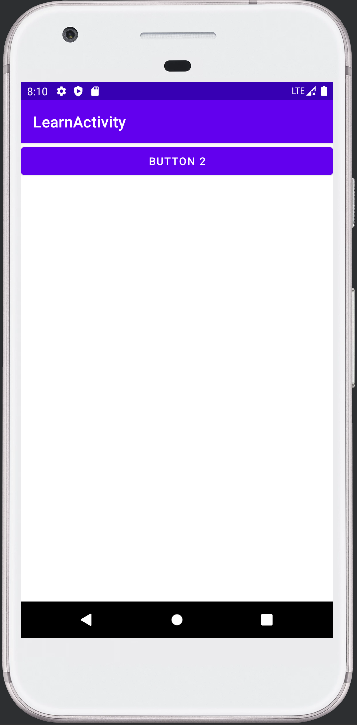
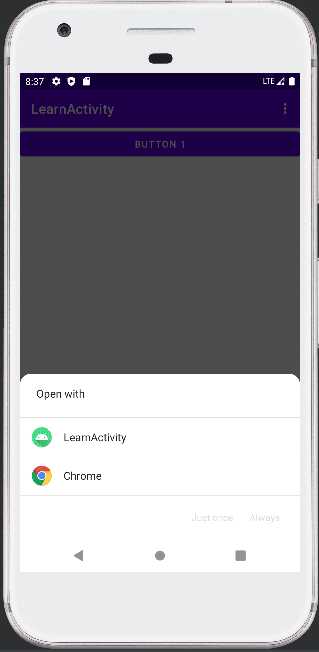
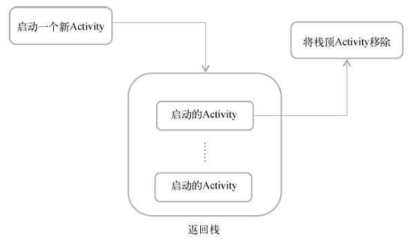
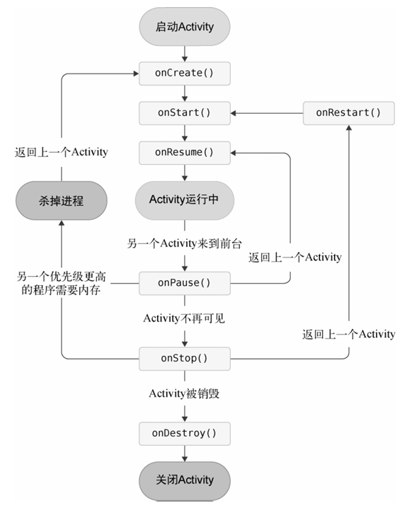
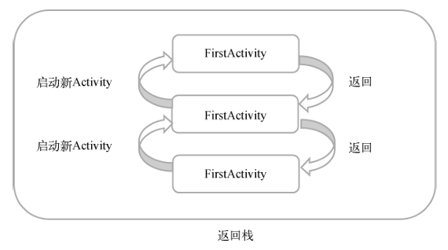
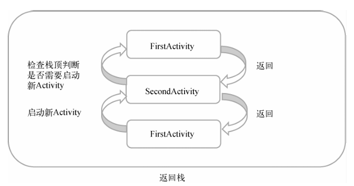
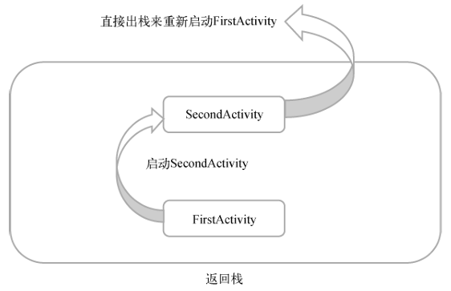
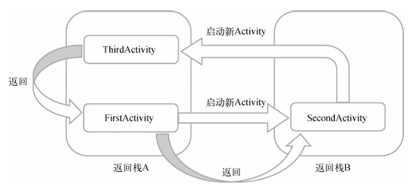

# chapter3.0-Activity初试

## What is Activity

​		Activity是最容易吸引用户的地方，它是一种可以包含用户界面的组件，主要用于和用户进行交 互。一个应用程序中可以包含零个或多个Activity. 换句话说 Activity 就是用户可以看到的一个又一个界面

​		通过本章的学习， 我们将会对 Activity 有更深的了解， 同时也会对前面只是简略讲解的 `kotln` 进行补充


## 创建 Activity 和基础设置

我们首先创建一个新的项目， 即选择 `Empty Activity` ， 这样， 我们的 APP 将不会有任何的 Activity 文件

创建后目录如下 ： 


之后我们在文件夹中建立一个新的 Activity ： 右击com.example.activitytest包→New→Activity→Empty Activity

这样就会弹出一个新建的选项窗口

其中有几个选项需要说明 ： 

* `Generate a Layout File` : 会自动创建一个布局文件 （建议勾选）
* `Launcher Activity` : 将这个页面设为主页面

我们先不设为主页面， 后面手动设置

新建后产生的 Activity 内容如下 ：

```kotlin
package com.example.learnactivity

import androidx.appcompat.app.AppCompatActivity
import android.os.Bundle

class MainActivity : AppCompatActivity() {
    override fun onCreate(savedInstanceState: Bundle?) {
        super.onCreate(savedInstanceState)
        setContentView(R.layout.activity_main)
    }
}
```

`onCreate()` 方法是这个Activity 中默认的创造后方法， 我们将在后面详细讲解

Android程序的设计讲究逻辑和视图分离，最好每一个Activity都能对应一个布局。这个布局文件如果提前勾选了 `Generate a Layout File` 就会自动生成， 默认在 `main/res/layout` 文件夹中, 我的布局文件为 `activity_main.xml` ， 我们需要在 Activity 中确定我们需要哪个 `layout` ， 所以就有了下面的代码

```kotlin
setContentView(R.layout.activity_main)
```


我们来简单看看 `activity_main.xml` 的内容 ：

```xml
<?xml version="1.0" encoding="utf-8"?>
<androidx.constraintlayout.widget.ConstraintLayout xmlns:android="http://schemas.android.com/apk/res/android"
    xmlns:app="http://schemas.android.com/apk/res-auto"
    xmlns:tools="http://schemas.android.com/tools"
    android:layout_width="match_parent"
    android:layout_height="match_parent"
    tools:context=".MainActivity">

</androidx.constraintlayout.widget.ConstraintLayout>
```

看不懂没关系， 我们只要知道这是默认的文件即可， 同时 `Andrio Stdio` 给我们配备了图形化操作页面， 我们可以在图形化界面中操作布局

我们先简单的添加一个 `button` 组件

```xml
<?xml version="1.0" encoding="utf-8"?>
<androidx.constraintlayout.widget.ConstraintLayout xmlns:android="http://schemas.android.com/apk/res/android"
    xmlns:app="http://schemas.android.com/apk/res-auto"
    xmlns:tools="http://schemas.android.com/tools"
    android:layout_width="match_parent"
    android:layout_height="match_parent"
    tools:context=".MainActivity">

    <Button
        android:layout_width="match_parent"
        android:layout_height="wrap_content"
        android:text="Button 1"
        android:id="@+id/button1" />

</androidx.constraintlayout.widget.ConstraintLayout>
```

我们简单在这里解释一下这些参数的含义 ：

* `android:layout_width="match_parent"` : 指定当前元素的宽度

  > `match_parent` ： 和父元素一样宽

* `android:layout_height="wrap_content"` ： 指定当前元素的高度

  > `wrap_content` ： 刚好包含里面的内容就行

* `android:text="Button 1"` ： 设置里面的文字内容

* `android:id="@+id/button1"` : 在XML中定义一 个id， 之后通过这个 id 来应用对象


之前我们说过 : **所有的 Activity 都必须在 `AndroidManifest` 中注册才能使用**

默认 `Android Stdio` 会给我们注册， 但是如果是主页面， 我们必须在 `<intent-fliter>` 中指定对应的 `action` 和 `category`

```xml
<application
             ... >
    <activity
              android:name=".MainActivity"
              android:exported="false" >
        <meta-data
                   android:name="android.app.lib_name"
                   android:value="" />

        <intent-filter>
            <action android:name="android.intent.action.MAIN" />
            <category android:name="android.intent.category.LAUNCHER" />
        </intent-filter>

    </activity>
</application>
```

> **注意， 注册时的 `android:exported="true"` 必须为 true ， 否则页面无法显示**

 我们直接运行就能看到页面了


## 进一步操作 Activity

### 在 Activity 中使用 Toast

 `Toast` 是 `Android` 系统提供的一种非常好的提醒方式，在程序中可以使用它将一些短小的信息通 知给用户，这些信息会在一段时间后自动消失，并且不会占用任何屏幕空间，我们现在就尝试 一下如何在Activity中使用`Toast` 

我们假设当按下按钮 `button 1` 的时候会弹出 `Toast`

我们修改 `onCreate()` 函数

```kotlin
package com.example.learnactivity

import androidx.appcompat.app.AppCompatActivity
import android.os.Bundle
import android.widget.Button
import android.widget.Toast

class MainActivity : AppCompatActivity() {
    override fun onCreate(savedInstanceState: Bundle?) {
        super.onCreate(savedInstanceState)
        setContentView(R.layout.activity_main)

        val button1: Button = findViewById(R.id.button1)
        button1.setOnClickListener {
            Toast.makeText(this, "You Click Button 1", Toast.LENGTH_SHORT).show()
        }
    }
}
```

在Activity中，可以通过 `findViewById()` 方法获取在布局文件中定义的元素，这里我们传入 `R.id.button1` 来得到按钮的实例，这个值是刚才在 `activity_main.xml` 中通过 `android:id` 属性指定的。

`findViewById()` 方法返回的是一个继承自 `View` 的泛型对象，因此 `Kotlin` 无法自动 推导出它是一个 `Button`还是其他控件，所以我们需要将 `button1` 变量显式地声明成 `Button` 类型。

`setOnClickListener()`方法为按钮注册一个监听器，点击按钮时就会执行监听器中的 `onClick()` 方法

`Toast` 的用法非常简单，通过静态方法 `makeText()` 创建出一个 `Toast` 对象，然后调用 `show()` 将 `Toast` 显示出来就可以了。这里需要注意的是，`makeText()` 方法需要传入 $3$ 个参数。第一个 参数是 `Context`，也就是`Toast` 要求的上下文，由于 `Activity` 本身就是一个 `Context` 对象，因此 这里直接传入 `this` 即可。第二个参数是 `Toast` 显示的文本内容。第三个参数是 `Toast` 显示的时长，有两个内置常量可以选择：`Toast.LENGTH_SHORT` 和 `Toast.LENGTH_LONG` 。

效果如下 ： 


我们可以使用 `kotlin-android-extensions` 插件简化我们的代码， 简化掉 `findViewById()`

```kotlin
package com.example.learnactivity

import androidx.appcompat.app.AppCompatActivity
import android.os.Bundle
import android.widget.Button
import android.widget.Toast
import kotlinx.android.synthetic.main.activity_main.*

class MainActivity : AppCompatActivity() {
    override fun onCreate(savedInstanceState: Bundle?) {
        super.onCreate(savedInstanceState)
        setContentView(R.layout.activity_main)
        button1.setOnClickListener {
            Toast.makeText(this, "You Click Button 1", Toast.LENGTH_SHORT).show()
        }
    }
}
```

这种写法其实是 `Kotlin` 编程最推荐的写法，除非特殊情况，后面将尽量不再使用 `findViewById()` 方法，而是会直接调用这些自动生成的控件变量。当然，即使你以后很少会用到 `findViewById()` 方法，我们还是得了解它才行，因为 `kotlin-android-extensions` 这个 插件背后也是通过调用 `findViewById()`方法来实现的。

> 有些时候 `Android Stdio` 不会自动安装这个插件， 我们要手动安装
>
> 1.  在 `app` 目录下的 `build.gradle` 中加入下面的代码
>
> ```gradle
> plugins {
> 	....
>     id 'kotlin-android-extensions'
> }
> ```
>
> 2. 刷新后即可使用 （sync Now）


### 在 Activity 中使用 Menu

Meun 是一个菜单的功能， 它可以充分的利用手机的屏幕空间

我们首先要创建一个 Menu 文件， 我们按照下面的步骤开始创建

`res -> new Direction [menu] -> new  -> Menu Resource File`

我们创建一个 `main.xml` 文件， 并在这个 `xml` 文件中添加两个表项 `add` 和 `remove`

```xml
<?xml version="1.0" encoding="utf-8"?>
<menu xmlns:android="http://schemas.android.com/apk/res/android">
    <item
        android:id="@+id/add_item"
        android:title="Add"/>
    <item
        android:id="@+id/remove_item"
        android:title="Remove"/>
</menu>
```

之后我们在 `MainActivity.kt` 中重写 `onCreateOptionMenu()` 

```kotlin
override fun onCreateOptionsMenu(menu: Menu?): Boolean {
    menuInflater.inflate(R.menu.main, menu)
    return true
}
```

我们来讲解一下上面的两个部分的代码啊

在 `main.xml` 中， 我们创建了两个菜单项，其中标签用来创建具体的某一个菜单项，然后通过 `android:id` 给这个菜单项指定一个唯一的标识符，通过 `android:title` 给这个菜单项指定一 个名称。

接着我们介绍一下第二部分

> 在此之前， 我们先讲解一下 `kotlin` 的一个语法糖
>
> 对于一个类来说， 通常会有 `Getter` 和 `Setter` 相关的方法，如下 Java 代码所示
>
> ```java
>  public class Book {  
>    private int pages; 
>    public int getPages() { 
>       return pages; 
>    } 
>    public void setPages(int pages) { 
>       this.pages = pages; 
>    } 
> } 
> ```
>
> 但是 `kotlin` 不用那么麻烦， 他有一种更加简洁的写法
>
> ```kotlin
> val book = Book() 
> book.pages = 500 
> val bookPages = book.pages
> ```
>
> 这里看上去好像我们是直接对 pages字段进行了赋值和读取。其实这就是Kotlin给我们提供的语法糖，它会在背后自动将上述 代码转换成调用setPages()方法和getPages()方法。

我们刚才在 `onCreateOptionsMenu()` 方法中编写的 `menuInflater` 就使用了这种语法糖， 它实际上是调用了父类的 `getMenuInflater()` 方法。`getMenuInflater()` 方法能够得到一 个`MenuInflater` 对象，再调用它的`inflate()`方法

> `getMenuInflater()` 是 `AppCompatActivity` 类的方法， 而我们的 `MainActivity` 是继承自 `AppCompatActivity` 类, 所以可以使用上述语法糖

`inflate()` 方法接收两个参数：第一个参数用于**指定我们通过哪一个资源文件来创建菜单**，这 里当然是传入 `R.menu.main`；第二个参数用于**指定我们的菜单项将添加到哪一个 `Menu`对象**当中，这里直接使用 `onCreateOptionsMenu()` 方法中传入的 `menu`参数。最后给这个方法返回 `true`，表示允许创建的菜单显示出来，如果返回了`false`，创建的菜单将无法显示。

我们需要在 `item` 被点击后执行指定的逻辑

所以我们需要重写 `onOptionsItemSelected()` 方法

```kotlin
override fun onOptionsItemSelected(item: MenuItem): Boolean {
    when (item.itemId) {
        R.id.add_item -> Toast.makeText(this, "you click add",
                                        Toast.LENGTH_SHORT).show()
        R.id.remove_item -> Toast.makeText(this, "you click remove",
                                           Toast.LENGTH_SHORT).show()
    }
    return true
}
```


### 销毁一个 Activity

销毁一个 Activity 比较简单， 只需要调用 `finnish()` 函数即可

```kotlin
button1.setOnClickListener {
    finish()
}
```


## 使用Intent在Activity 之间穿梭

我们先创建一个新的 `Activity`， 叫做 `SecondActivity` , 同时在页面中放上一个按钮 `button2`

`Activity` 如下：



我们一般使用 `Intent` 来实现不同的 `Activity` 相互转换， 虽然 `Intent` 的功能不止于此， 但是我们现在就只关注 `Activity` 的转换

### 显式 Intent

`Intent`有多个构造函数的重载，其中一个是`Intent(Context packageContext, Class<?> cls)`。这个构造函数接收两个参数：**第一个参数 `Context` 要求提供一个启动 `Activity` 的上下 文；第二个参数 `Class` 用于指定想要启动的目标 `Activity`**，

那么接下来我们应该怎么使用这个 `Intent` 呢？`Activity` 类中提供了一个 `startActivity()` 方法，专门用于启动 `Activity`，它接收一个 `Intent` 参数，这里我们将构建好的 `Intent`传入`startActivity()` 方法就可以启动目标 `Activity` 了。

我们设置 `MainActivity` 按钮按下后的逻辑

```kotlin
button1.setOnClickListener {
    val intent = Intent(this, SecondActivity::class.java)
    startActivity(intent)
}
```

> `SecondActivity::class.java` 的写法就相当于 `Java` 中 `SecondActivity.class`

之后我们就可以通过按下按钮来启动新的页面了


### 隐式 Intent

隐式 `Intent` 是通过注册时候的 `action` 和 `category` 来确定跳转到哪一个 `Activity` 的

我们创建一个 `ThirdActivity` , 和 `SecondActivity` 一样但是按钮变成了 `button3`

我们在 `AndroidManifest` 中注册 `SecondActivity` 的部分增加下面的配置

```xml
<intent-filter>
    <action android:name="com.example.activities.ACTION_START" />
    <category android:name="android.intent.category.DEFAULT" />
</intent-filter>
```

之后我们修改点击 `bottom1` 后的响应逻辑 : 

```kotlin
button1.setOnClickListener {
    val intent = Intent("com.example.activities.ACTION_START")
    startActivity(intent)
}
```

在标签中我们指明了当前 `Activity` 可以响应 `com.example.activities.ACTION_START` 这个 `action` ，而标签则包含了 一些附加信息，更精确地指明了当前 `Activity` 能够响应的 `Intent` 中还可能带有的 `category` 。只 有和中的内容同时匹配 `Intent` 中指定的 `action` 和 `category` 时，这个 `Activity` 才能响应该 `Intent`。

默认的 `category` 是 `android.intent.category.DEFAULT` , 如果 `intent` 发现没有匹配上的 `action` 和 `category` 就会报错

每个 `Intent` 中只能指定一个 `action` ，但能指定多个 `category`


#### 隐式 Intent 的更多用法

使用 `Intent` 可以打开其他应用的 `Activity`

* **打开浏览器界面**

```kotlin
button1.setOnClickListener {
    val intent = Intent(Intent.ACTION_VIEW)
    intent.data = Uri.parse("https://www.baidu.com")
    startActivity(intent)
}
```

我们首先指定了 `Intent` 的 `action` 是 `Intent.ACTION_VIEW` ，这是一个 `Android` 系统内置 的动作，其常量值为 `android.intent.action.VIEW` 。然后通过 `Uri.parse()` 方法将一个 网址字符串解析成一个 `Uri` 对象，再调用 `Intent` 的 `setData()` 方法将这个Uri对象传递进去


我们同时也可以自己书写一个 `Activity` 来响应, 我们同时也可以设置 `data` 属性

> `data` 属性可以配置以下内容 : 
>
> * android:scheme。用于指定数据的协议部分，如上例中的https部分。
> * android:host。用于指定数据的主机名部分，如上例中的www.baidu.com部分。
> * android:port。用于指定数据的端口部分，一般紧随在主机名之后。
> * android:path。用于指定主机名和端口之后的部分，如一段网址中跟在域名之后的内 容。'
> * android:mimeType。用于指定可以处理的数据类型，允许使用通配符的方式进行指定

我们自己建立一个 `Activity` 试着相应一下 :

这个 `Activity` 起名叫 `WebActivity` , 注册的配置如下 : 

```xml
<activity
          android:name=".WebActivity"
          android:exported="false">
    <meta-data
               android:name="android.app.lib_name"
               android:value="" />

    <intent-filter tools:ignore="AppLinkUrlError">
        <action android:name="android.intent.action.VIEW" />
        <category android:name="android.intent.category.DEFAULT" />
        <data android:scheme="https" />
    </intent-filter>

</activity>
```


之后我们点击按钮就会弹出选项　：　




* **打开系统拨号页面**

同理, 我们修改按下 `buttom1` 的逻辑

```kotlin
button1.setOnClickListener {
    val intent = Intent(Intent.ACTION_DIAL)
    intent.data = Uri.parse("tel:10086")
    startActivity(intent)
}
```

按下后就会打开页面 : 


## 在 Activity 中传递信息

### 向下一个 Intent 传递信息

我们使用 `intent` 不仅可以跳转到另一个页面, 同时可以向下一个 `Activity` 传递信息

我们使用 `putExtra()` 方法实现传递信息的功能, 这里 `putExtra()` 方法接收两个参数，第一个参数是键，用于之后从 `Intent` 中取值，第二个参数才是真正要传递的数据

```kotlin
button1.setOnClickListener {
    val message = "Hello SecondActivity"
    val intent = Intent(this, SecondActivity::class.java)
    intent.putExtra("mess", message)
    startActivity(intent)
}
```

之后我们在 `SecondActivity` 中接收信息

```kotlin
override fun onCreate(savedInstanceState: Bundle?) {
    super.onCreate(savedInstanceState)
    setContentView(R.layout.activity_second)

    val message = intent.getStringExtra("mess")
    Toast.makeText(this, "put message is $message", Toast.LENGTH_SHORT).show()
}
```

上述代码中的 `intent` 实际上调用的是父类的 `getIntent()` 方法，该方法会获取用于启动 `SecondActivity`的`Intent`


### 向上一个 Intent 传递信息

实现这个功能有点特殊, 正常情况下, 我们会使用 `startActivity()` 方法来跳转到另一个 `Activity`, 但是如果我们希望下一个 `Intent` 能返回内容给上一个 `Intent` , 那我们就要用另一个函数 `startActivityForResult()` 

`startActivityForResult()` 方法接收两个参数：第一个参数还是 `Intent` ；第二个参数是请求码，用于在之后的回调中判断数据的来源, 请求码只要是一 个唯一值即可

```kotlin
button1.setOnClickListener {
    val intent = Intent(this, SecondActivity::class.java)
    startActivityForResult(intent, 1)
}
```

接下来我们在 `SecondActivity` 中给按钮注册点击事件，并在点击事件中添加返回数据的逻辑

```kotlin
button2.setOnClickListener {
    val intent = Intent(this, MainActivity::class.java)
    val message = "back to Main"
    intent.putExtra("return", message)
    setResult(RESULT_OK, intent)
    finish()
}
```

`setResult()` 方法接收两个参数：第一个参数用于向上一个 `Activity` 返回处理结果，一般只使用 `RESULT_OK` 或 `RESULT_CANCELED` 这 两个值；第二个参数则把带有数据的 `Intent` 传递回去。

之后我们在 `MainActivity` 中来接收数据

```kotlin
override fun onActivityResult(requestCode: Int, resultCode: Int, data: Intent?) {
    super.onActivityResult(requestCode, resultCode, data)
    when (requestCode) {
        1 -> if (resultCode == RESULT_OK) {
            val returnedData = data?.getStringExtra("return")
            Toast.makeText(this, returnedData, Toast.LENGTH_SHORT).show()
        }
    }
}
```

`onActivityResult()` 方法带有3个参数：第一个参数`requestCode`，即我们在启动`Activity`时传入的请求码；第二个参数 `resultCode` ，即我们在返回数据时传入的处理结果；第三个参数 `data`，即携带着返回数据的`Intent`。

由于在一个`Activity` 中有可能调用 `startActivityForResult()` 方法去启动很多不同的 `Activity`，每一个 `Activity` 返回的数据都 会回调到 `onActivityResult()` 这个方法中，因此我们首先要做的就是通过检查 `requestCode` 的值来判断数据来源。确定数据是从`SecondActivity`返回的之后，我们再通过 `resultCode` 的值来判断处理结果是否成功


如果用户是按下 返回键退出的 `Activity` , 处理方式也很简单, 只需要重写 `onBackPressed()` 方法就可以解决这个问题

```kotlin
override fun onBackPressed() { 
    val intent = Intent() 
    intent.putExtra("data_return", "Hello FirstActivity") 
    setResult(RESULT_OK, intent) 
    finish() 
} 
```

> 注意, 实际上 `startActivityForResult()` 等一系列方法已经给安卓官方标为弃用, 现在是使用 `Activity Result API`的组件


## Activity 的生命周期

我们发现, 我们每启动一个新的 `Activity` ，就会覆盖在原 `Activity` 之上，然后点击 `Back` 键会销毁最上面的 `Activity`，下面的 一个 `Activity ` 就会重新显示出来

而这一切都是由返回栈来管理的



### Activity 的状态

每个`Activity` 在其生命周期中最多可能会有4种状态。

* **运行状态**

  > 当一个 `Activity` 位于返回栈的栈顶时，`Activity` 就处于运行状态。系统最不愿意回收的就是处于运行状态的 `Activity`，因为这会带来非常差的用户体验。

* **暂停状态**

  > 当一个 `Activity` 不再处于栈顶位置，**但仍然可见时**，`Activity` 就进入了暂停状态。你可能会 觉得，既然 `Activity` 已经不在栈顶了，怎么会可见呢？这是因为并不是每一个 `Activity` 都会占满整个屏幕，比如对话框形式的 `Activity` 只会占用屏幕中间的部分区域。处于暂停状态的 `Activity` 仍然是完全存活着的，系统也不愿意回收这种 `Activity`（因为它还是可见的，回收 可见的东西都会在用户体验方面有不好的影响），只有在内存极低的情况下，系统才会去考虑回收这种 `Activity`。

* **停止状态**

  > 当一个 `Activity` 不再处于栈顶位置，**并且完全不可见的时候**，就进入了停止状态。系统仍然会为这种`Activity` 保存相应的状态和成员变量，但是这并不是完全可靠的，当其他地方需要内存时，处于停止状态的 `Activity` 有可能会被系统回收。

* **销毁状态**

  > 一个 `Activity` 从返回栈中移除后就变成了销毁状态。系统最倾向于回收处于这种状态的 `Activity`，以保证手机的内存充足。


### Activity 的生存期

`Activity` 类中定义了7个回调方法，覆盖了`Activity`生命周期的每一个环节

* `onCreate()`

  > 这个方法你已经看到过很多次了，我们在每个 `Activity` 中都重写了这个方 法，它会在 `Activity` 第一次被创建的时候调用。你应该在这个方法中完成 `Activity` 的初始化 操作，比如加载布局、绑定事件等

* `onStart()`

  > 这个方法在 `Activity` 由不可见变为可见的时候调用

* `onPause()`

  > 这个方法在系统准备去启动或者恢复另一个 `Activity` 的时候调用。我们通常会在这个方法中将一些消耗CPU的资源释放掉，以及保存一些关键数据，但这个方法的执行速度一定要快，不然会影响到新的栈顶`Activity`的使用

* `onStop()`

  > 这个方法在 `Activity` 完全不可见的时候调用。它和 `onPause()` 方法的主要区别在于，如果启动的新`Activity` 是一个对话框式的 `Activity`，那么 `onPause()` 方法会得到执 行，而 `onStop()` 方法并不会执行

* `onDestroy()`

  > 这个方法在 `Activity` 被销毁之前调用，之后 `Activity` 的状态将变为销毁状态。

* `onRestart()`

  > 这个方法在 `Activity` 由停止状态变为运行状态之前调用，也就是 `Activity` 被重新启动了



### 处理 Activity 被回收的情况

当一个 `Activity` 被回收后, 其中的数据都被销毁了, 我们有些时候希望保留这些数据, ，`Activity` 中还提供了一个 `onSaveInstanceState()` 回调方法，这个方法可以保证在 `Activity` 被回收之前一定会被调用，因此我们可以通过这个方法来解决问题

`onSaveInstanceState()` 方法会携带一个 `Bundle` 类型的参数，`Bundle`提供了一系列的方法 用于保存数据，比如可以使用 `putString()` 方法保存字符串，使用 `putInt()` 方法保存整型数 据，以此类推。每个保存方法需要传入两个参数，第一个参数是键，用于后面从 `Bundle` 中取 值，第二个参数是真正要保存的内容

```kotlin
override fun onSaveInstanceState(outState: Bundle) { 
    super.onSaveInstanceState(outState) 
    val tempData = "Something you just typed" 
    outState.putString("data_key", tempData) 
} 
```

之后我们在 `onCreate()` 中取值即可

```kotlin
override fun onCreate(savedInstanceState: Bundle?) { 
    super.onCreate(savedInstanceState) 
    setContentView(R.layout.activity_main) 
    if (savedInstanceState != null) { 
        val tempData = savedInstanceState.getString("data_key") 
        Log.d(tag, "tempData is $tempData") 
    } 
} 
```

PS : ，`Intent` 还可以结合 `Bundle` 一起用于传递 数据。首先我们可以把需要传递的数据都保存在 `Bundle` 对象中，然后再将 `Bundle` 对象存放在 `Intent` 里。到了目标 `Activity` 之后，先从 `Intent` 中取出 `Bundle`，再从`Bundle` 中一一取出数据


## Activity 的启动模式

启动模式一共有4种，分别是 `standard` 、`singleTop` 、 `singleTask` 和 `singleInstance` ，可以在`AndroidManifest.xml`中通过给标签指定 `android:launchMode`属性来选择启动模式。


### standard

 `standard` 是 `Activity` 默认的启动模式，在不进行显式指定的情况下，所有 `Activity` 都会自动使用这种启动模式。

在 `standard`模式下，每当启动一个新的 `Activity` ，它就会在返回栈中入栈，并处于栈顶的位置。对于使用`standard` 模式的 `Activity`，系统不会在乎这个 `Activity`是否已经在返回栈中存在，每次启动都会创建一个该 `Activity` 的新实例




### singleTop

当 `Activity` 的启动模式指 定为 `singleTop` ，在启动 `Activity` 时如果发现返回栈的栈顶已经是该 `Activity`，则认为可以直接使用它，不会再创建新的Activity实例。



如果是 $1\Rightarrow 2 \Rightarrow 1 \Rightarrow 2$ 这种模式创建的话, 那么 `singleTop` 和 `Standard` 的返回栈是一样的


### singleTask

当 `Activity` 的启动模式指定为 `singleTask` ，每次启动该 `Activity` 时， 系统首先会在返回栈中检查是否存在该 `Activity` 的实例，如果发现已经存在则直接使用该实例， 并把在这个 `Activity` 之上的所有其他 `Activity`统统出栈，如果没有发现就会创建一个新的 `Activity` 实例。



### singleInstance

 `Activity`是允许其他程序调用的，如果想实现其他程序和我们的程序可以共享这个`Activity`的实例, 我们就需要设置为 `singleInstance` 模式

在这种模式下，会有一个单独的返回栈来管理这个 `Activity` ，不管是哪个应用程序来访问这个`Activity`，都共用同一个返回栈，也就解决了共享 `Activity`实例的问题




## Android 开发技巧

### 一次性退出所有 Activity

我们可以使用一个单例类来管理 `Activity` 的启动和销毁, 这样方便我们实现不同的需求

```kotlin
object ActivityCollector { 
    private val activities = ArrayList<Activity>() 
    fun addActivity(activity: Activity) = activities.add(activity)
    
    fun removeActivity(activity: Activity) = activities.remove(activity) 
    
    fun finishAll() { 
        for (activity in activities) { 
            if (!activity.isFinishing)
                activity.finish() 
        } 
        activities.clear() 
    } 
} 
```


### 启动Activity 的最佳写法

当我们需要启动另一个 `Activity` 的时候, 往往需要传递其他的参数或者信息, 但如果你要传的参数过多过杂, 当其他开发人员想要查看相应的信息的时候, 未免会十分困难, 所以我们需要明确我们要传递的参数, 让其他开发者更加易懂

我们在我们写的 `Activity` 中定义一个静态方法 (语法会在接下来讲)

```kotlin
class SecondActivity : BaseActivity() { 
    ... 
    companion object { 
        fun actionStart(context: Context, data1: String, data2: String) { 
            val intent = Intent(context, SecondActivity::class.java) 
            intent.putExtra("param1", data1) 
            intent.putExtra("param2", data2) 
            context.startActivity(intent) 
        } 
    } 
} 
```

这样当其他的 `Activity` 想要调用这个 `SecondActivity` 的时候就只需要一段代码了

```kotlin
button1.setOnClickListener { 
    SecondActivity.actionStart(this, "data1", "data2") 
} 
```


##  Kotlin 进阶教学

### 标准函数 `with` 、`run` 和 `apply`

`Kotlin` 的标准函数指的是 `Standard.kt` 文件中定义的函数，任何 `Kotlin` 代码都可以自由地调用所有的标准函数

**我们先来讲解 `with` 函数**

```kotlin
val result = with(obj) { 
    // 这里是obj的上下文 
    "value" // with函数的返回值 
} 
```

我们以这段代码为例子 : 

```kotlin
val list = listOf("Apple", "Banana", "Orange", "Pear", "Grape") 
val builder = StringBuilder() 
builder.append("Start eating fruits.\n") 
for (fruit in list) { 
    builder.append(fruit).append("\n") 
} 
builder.append("Ate all fruits.") 
val result = builder.toString()
```

我们发现, 我们多次使用 `builder` 的方法, 这样我们就可以使用 `with` 来简化

```kotlin
val list = listOf("Apple", "Banana", "Orange", "Pear", "Grape") 
val result = with(StringBuilder()) { 
    append("Start eating fruits.\n") 
    for (fruit in list) { 
        append(fruit).append("\n") 
    } 
    append("Ate all fruits.") 
    toString() 
} 
```

我们发现, 使用 `with` 我们就把 `builder` 给省略了 , 同时 `Lambda` 表达式的最后一行代码会作为 `with` 函数的返回值返回

**我们再来讲解 `run` 函数**

```kotlin
val result = obj.run { 
    // 这里是obj的上下文 
    "value" // run函数的返回值 
} 
```

其实功能和 `with` 相同, 只不过写法不同, 我们将上述 `with` 代码改成 `run` 代码

```kotlin
val list = listOf("Apple", "Banana", "Orange", "Pear", "Grape") 
val result = StringBuilder().run { 
    append("Start eating fruits.\n") 
    for (fruit in list) {
        append(fruit).append("\n") 
    } 
    append("Ate all fruits.") 
    toString() 
}
```

**我们最后讲解一下 `apply` 函数**

这个函数和前面的两种非常相似, 仅有一点不同

`apply` 函数无法指定返回值，而是会自动返回调用对象本身

```kotlin
val result = obj.apply { 
     // 这里是obj的上下文 
} 
// result == obj 
```

所以上面的代码可以改为 :

```kotlin
val list = listOf("Apple", "Banana", "Orange", "Pear", "Grape") 
val result = StringBuilder().apply { 
    append("Start eating fruits.\n") 
    for (fruit in list) { 
        append(fruit).append("\n") 
    } 
    append("Ate all fruits.") 
} //result 是 StringBuilder 类型
println(result.toString()) 
```


### 定义静态方法

当我们想要通过类名直接访问一个方法的时候 [`class.method()`] , 我们有下面的几种方法

* 使用单例类来实现

```kotlin
object Util {
    fun method() = println("Hello Util")
}
```

> 这种实现机制实际上不是静态方法

* 使用 `companion`

```kotlin
class Util { 
    fun method1() = println("method1") 
    
    companion object { 
        fun method2() = println("method2") 
    } 
 
} 
```

`companion` 里面的函数可以直接使用类名调用

> 这种实现机制实际上不是静态方法
>
> `companion object` 这个关键字实际上会 在 `Util` 类的内部创建一个伴生类，而 `method2()` 方法就是定义在这个伴生类里面的实例方法。只是 `Kotlin` 会保证 `Util` 类始终只会存在一个伴生类对象，因此调用 `Util.method2()` 方法实际上就是调用了 `Util`类中伴生对象的 `method2()`方法

* 使用 `companion` + `@JvmStatic` 注解

```kotlin
class Util { 
    fun method1() = println("method1") 
    
    companion object { 
        @JvmStatic
        fun method2() = println("method2") 
    } 
 
} 
```

> 这是真正的静态方法

* 使用顶层方法

顶层方法指的是那些没有定义在任何类中的方法，比如我们的 `main()` 方法。`Kotlin` 编译器会将所有的顶层方法全部编译成静态方法，因此只要你定义了一 个顶层方法，那么它就一定是静态方法

> 所谓顶层方法, 也就是我们平常定义的函数罢了


> #### 补充

**静态方法和类方法的区别**

**静态方法**：

- 静态方法是类的一部分，但不依赖于类的状态。它们基本上就是普通的函数。
- 静态方法的调用效率较高，因为它们不需要访问类或实例的状态。
- 在编译时，静态方法的地址已经确定，因此调用时不需要额外的查找或解析步骤

**类方法**：

- 类方法可以访问类的变量，并且第一个参数为类本身（通常命名为`cls`）。
- 类方法的调用效率相对较低，因为它们需要在运行时查找类的定义并传递类对象作为参数。
- 在调用类方法时，需要额外的解析步骤，以确定类的位置和方法的地址。


静态方法的效率更高，因为它们不需要访问类或实例的状态，且在编译时已确定地址。

类方法的效率较低，因为它们需要在运行时查找类的定义并传递类对象作为参数

需要注意的是，这些差异通常在微观层面上才会显著，而在大多数应用程序中，这些差异不太会对性能产生重大影响。因此，选择使用哪种方法应该更多地基于代码的可读性和设计需求
