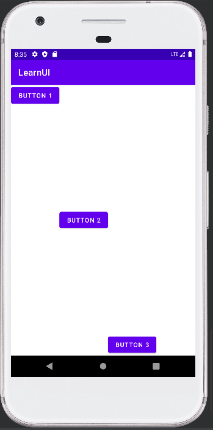
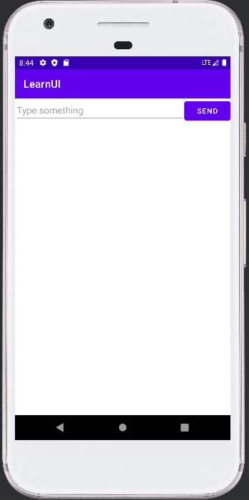
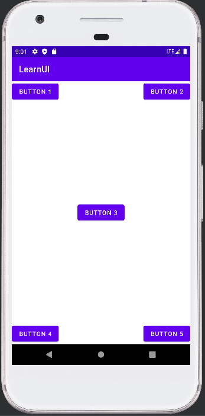
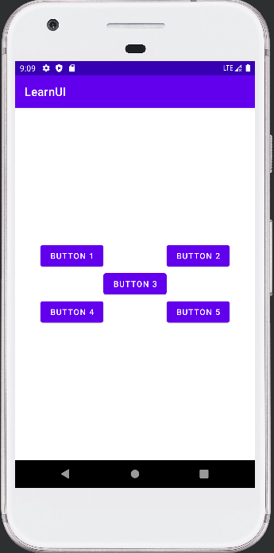
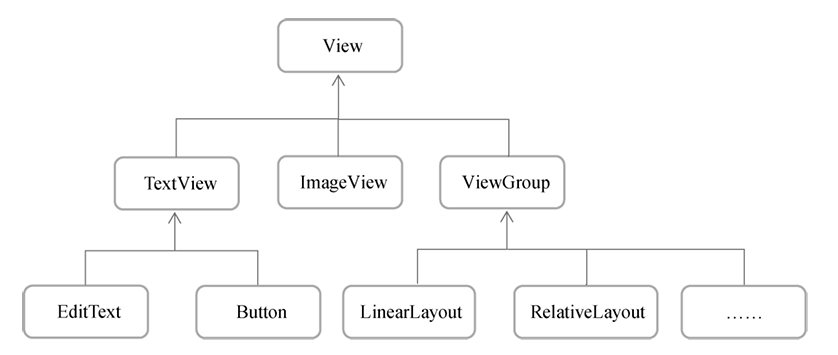
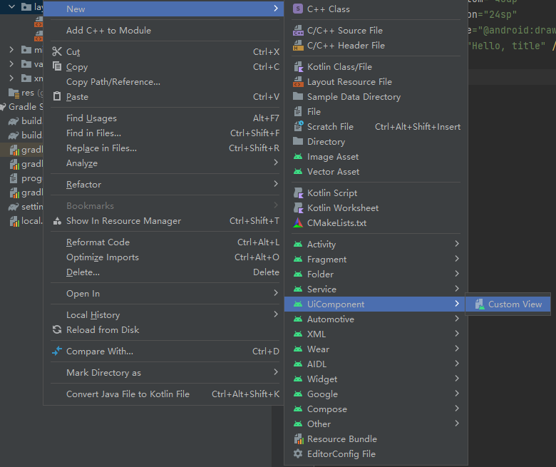
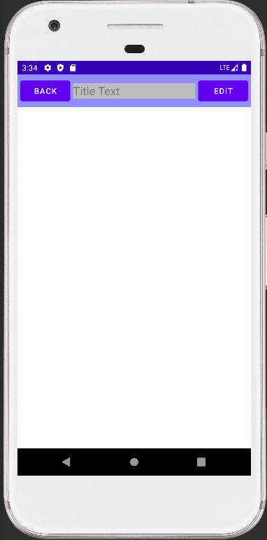
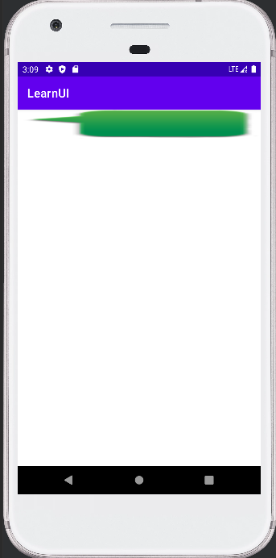
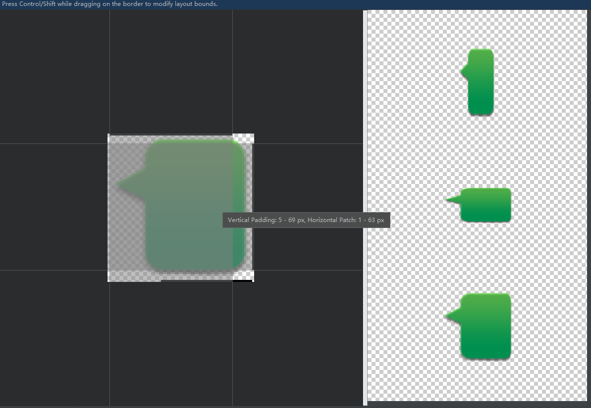
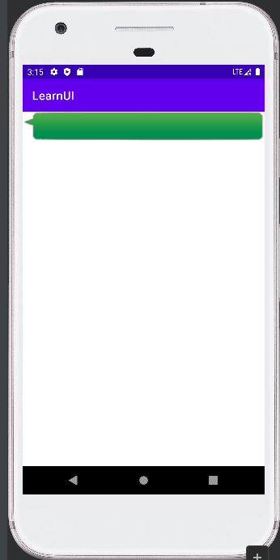

# chapter4.0-UI开发

在这一章中, 我们将介绍在 Android 开发中的许许多多的 UI 控件, 这样我们在实际编写的 Activity 中将不再只是空白了

在 Android Stdio 中, 有图像化的编辑页面, 但是为了方便讲解, 我们还是使用 `xml` 的方式编写

下面我们就一一介绍一些常用的 UI 控件


## 基础控件

### TextView

TextView 可以说是 Android 中最简单的一个控件了，你在前面其实已经和它打过一些交道了。 它主要用于在界面上显示一段文本信息.

 `activity_main.xml` 的代码为:

```xml
<?xml version="1.0" encoding="utf-8"?>
<LinearLayout xmlns:android="http://schemas.android.com/apk/res/android"
    xmlns:app="http://schemas.android.com/apk/res-auto"
    xmlns:tools="http://schemas.android.com/tools"
    android:layout_width="match_parent"
    android:layout_height="match_parent"
    tools:context=".MainActivity">

    <TextView
        android:id="@+id/textView"
        android:layout_width="match_parent"
        android:layout_height="wrap_content"
        android:text="This is TextView"
        tools:ignore="MissingConstraints" />

</androidx.constraintlayout.widget.ConstraintLayout>
```

> 值得注意的是 : `layout_width` 和 `layout_height` 可以是固定值, 固定值的单位是 `dp`
>
> 这是一种屏幕密度无关的尺寸单 位，可以保证在不同分辨率的手机上显示效果尽可能地一致，如50 dp就是一个有效的固定值

我们可以设置文字的对其方式, 可选值有 : top、bottom、start、 end、center

可以用 `|` 来同时指定多个值，这里我们指定的是 `center`，效果等同 于 `center_vertical|center_horizontal`，表示文字在垂直和水平方向都居中对齐

```xml
<TextView
    ....
	android:gravity="center"
	tools:ignore="MissingConstraints" />
```

我们同时也可以设置里面的字体大小和颜色

```xml
<TextView
    ....
	android:gravity="center"
    android:textColor="#00ff00"
    android:textSize="24sp"
	tools:ignore="MissingConstraints" />
```

通过 `android:textColor` 属性可以指定文字的颜色，通过 `android:textSize` 属性可以指定文字的大小。文字大小要使用 `sp` 作为单位，这样当用户在系统中修改了文字显示尺寸时，应用 程序中的文字大小也会跟着变化。


### Button

这个控件我们实际上已经使用过了很多次了, 我们只进行补充

我们发现, 无论我们制定按钮的内容是什么, 内容都会自动转换成大写, 我们可以通过给按钮增加 `android:textAllCaps="false"` 属性来让按钮的内容和我们制定的内容是一样的

同时关于按钮事件的注册, 除了使用函数式API的方式来注册监听器，也可以使用实现接口的方式来进行注册

```kotlin
class MainActivity : AppCompatActivity(), View.OnClickListener { 
 
    override fun onCreate(savedInstanceState: Bundle?) { 
        super.onCreate(savedInstanceState) 
        setContentView(R.layout.activity_main) 
        button.setOnClickListener(this) 
    } 
 
    override fun onClick(v: View?) { 
        when (v?.id) { 
            R.id.button -> { 
                // 在此处添加逻辑 
            } 
        } 
    } 
} 
```

> 这里我们让 `MainActivity` 实现了 `View.OnClickListener` 接口，并重写了`onClick()`方法， 然后在调用 `button` 的`setOnClickListener()` 方法时将 `MainActivity` 的实例传了进去。这样 每当点击按钮时，就会执行 `onClick()`方法中的代码了


### EditText

EditText是程序用于和用户进行交互的另一个重要控件，它允许用户在控件里输入和编辑内容，并可以在程序中对这些内容进行处理

通俗点解释这就是一个打字框

我们可以使用下面的 `xml` 代码来实现:

```xml
<EditText
	android:id="@+id/editText"
	android:layout_width="match_parent"
	android:layout_height="wrap_content"
	tools:ignore="MissingConstraints" />
```

我们也可以在输入框中增加默认的文字: 只需要添加下面的属性即可: `android:hint="这里是默认的文字"`

不过，随着输入的内容不断增多，`EditText` 会被不断地拉长。这是由于 `EditText` 的高度指定的是 `wrap_content`，因此它总能包含住里面的内容，但是当输入的内容过多时，界面就会变得非常难看。我们可以使用 `android:maxLines` 属性来解决这个问题

```xml
<EditText
	android:id="@+id/editText"
	android:layout_width="match_parent"
	android:layout_height="wrap_content"
    android:maxLines="2" 
	tools:ignore="MissingConstraints" />
```

这里通过 `android:maxLines`指定了 `EditText` 的最大行数为两行，这样当输入的内容超过两行 时，文本就会向上滚动，`EditText`则不会再继续拉伸

我们同时也可以通过 Kotlin 代码知道输入框中的内容是什么:

```kotlin
button.setOnClickListener {
    val inputText = editText.text.toString()
    Toast.makeText(this, inputText, Toast.LENGTH_SHORT).show()
}
```

> 在代码中好像调用的是EditText的text属性，实际上调用的却是EditText的getText()方法


### ImageView

这个控件主要是给我们展示图片用的

```xml
<ImageView
    android:id="@+id/imageView"
    android:layout_width="wrap_content"
    android:layout_height="wrap_content"
    android:src="@drawable/img_1"
    tools:ignore="MissingConstraints" />
```

图片通常是放在以 `drawable` 开头的目录下的，并且要带上具体的分辨率。现在最主流的手机屏幕分辨率大多是 `xxhdpi` 的，所以我们在res目录下 再新建一个 `drawable-xxhdpi` 目录，然后将事先准备好的两张图片 `img_1.png` 和 `img_2.png` 复制到该目录当中

这里使用 `android:src` 属性给 `ImageView` 指定了一张图片。由于图片的宽和高都是未知的，所以将 `ImageView` 的宽和高都设定为`wrap_content` ，这样就保证了不管图片的尺寸是多少，都可以完整地展示出来

我们可以使用代码来控制图片的更改

```kotlin
button.setOnClickListener {
    imageView.setImageResource(R.drawable.img_2)
}
```


### ProgressBar

这个控件是一个进度条, 表示我们的程序正在加载一些数据

用法如下:

```xml
<ProgressBar
	android:id="@+id/progressBar"
	android:layout_width="match_parent"
	android:layout_height="wrap_content" />
```

我们可以设置 Android控件的可见属性来设置进度条的消失与显现

所有的 `Android` 控件都具有这个属性，可以通过 `android:visibility` 进行指定，可选值有3种：visible、invisible 和 gone

`visible` 表示控件是可见的，这个值是默认值，不指定 `android:visibility` 时，控件都是可见的

`invisible` 表示控件不可见，但是它仍然占据着原来的位置和大小，可以理解成控件变成透明 状态了

`gone` 则表示控件不仅不可见，而且不再占用任何屏幕空间

我们可以使用代码来控制, 使用的是 `setVisibility()` 方法，允许传入 `View.VISIBLE` 、 `View.INVISIBLE` 和 `View.GONE` 这3种值

```kotlin
button.setOnClickListener {
    progressBar.apply {
        visibility = when(visibility) {
            View.VISIBLE -> View.GONE
            else -> View.VISIBLE
        }
    }
}
```

我们也可以设置为水平进度条 : 只需要增加 ` style="?android:attr/progressBarStyleHorizontal" ` 属性即可

指定成水平进度条后，我们还可以通过 `android:max` 属性给进度条设置一个最大值，然后在代码中动态地更改进度条的进度

```kotlin
button.setOnClickListener {
    progressBar.progress = progressBar.progress + 10
}
```


### AlertDialog

AlertDialog可以在当前界面弹出一个对话框，这个对话框是置顶于所有界面元素之上的，能够 屏蔽其他控件的交互能力，因此AlertDialog一般用于提示一些非常重要的内容或者警告信息

我们直接在代码中展示 AlterDialog

```kotlin
    override fun onCreate(savedInstanceState: Bundle?) {
        super.onCreate(savedInstanceState)
        setContentView(R.layout.activity_main)
        button.setOnClickListener {
            showDialog()
        }
    }

    fun showDialog() {
        AlertDialog.Builder(this).apply {
            setTitle("This is Dialog")
            setMessage("Something important.")
            setCancelable(false)
            setPositiveButton("OK") { _, which ->
                if (which == DialogInterface.BUTTON_POSITIVE) { // 点击 OK 的逻辑
                    showToast(this@MainActivity, "you click OK")
                }
            }
            setNegativeButton("Cancel") { _, which ->
                if (which == DialogInterface.BUTTON_NEGATIVE) { // 点击 Cancel 的逻辑
                    showToast(this@MainActivity, "you click Cancel")
                }
            }
            show()
        }
    }

    private fun showToast(context : Context, mess : String) {
        Toast.makeText(context, mess, Toast.LENGTH_SHORT).show()
    }
```

`_` 是用来表示刻意不使用的变量, 我们姑且称其为 `dialog`

`dialog` 是一个 `DialogInterface` 对象，它代表了正在显示的对话框。你可以使用 `dialog` 来控制对话框的行为

关闭对话框：你可以调用 `dialog.dismiss()` 来关闭对话框

检查对话框是否正在显示：你可以调用 `dialog.isShowing` 来检查对话框是否正在显示

 

## 三种基本布局

### LinearLayout

#### orientation

LinearLayout又称作线性布局，是一种非常常用的布局. 这个布局会将它所包含的控件在线性方向上依次排列

之前我们所有的布局都是线性布局, 并且是在垂直方向上布局的

```xml
<LinearLayout xmlns:android="http://schemas.android.com/apk/res/android" 
    android:orientation="vertical" 
    android:layout_width="match_parent" 
    android:layout_height="match_parent"> 
    ....
</LinearLayout> 
```

我们通过 `android:orientation` 来指定到底是垂直布局还是水平布局

需要注意，如果 `LinearLayout` 的排列方向是 `horizontal` ，内部的控件就绝对不能将宽度指定为 `match_parent` ，否则，单独一个控件就会将整个水平方向占满，其他的控件就没有可放置的位置了。同样的道理，如果 `LinearLayout` 的排列方向是 `vertical`，内部的控件就不能将高度指定为 `match_parent`。


#### layout_gravity

`android:layout_gravity` 用于指定控件在布局中的对齐方式。`android:layout_gravity` 的可选值和 `android:gravity` 差不多，但是需要注 意，当 `LinearLayout` 的排列方向是 `horizontal` 时，只有垂直方向上的对齐方式才会生效。因为此时水平方向上的长度是不固定的，每添加一个控件，水平方向上的长度都会改变，因而无法指定该方向上的对齐方式。同样的道理，当 `LinearLayout` 的排列方向是 `vertical` 时，只有水平方向上的对齐方式才会生效

> 举个简单的例子, 如果指定线性的方向为水平方向, 那么对于竖直方向上来说, 宽度和 `match_parent` 的宽度是一样的
>
> 所以只会在竖直方向上实现 `layout_gravity`

假设我们的布局如下面代码所示

```xml
<?xml version="1.0" encoding="utf-8"?>
<LinearLayout xmlns:android="http://schemas.android.com/apk/res/android"
    xmlns:tools="http://schemas.android.com/tools"
    android:layout_width="match_parent"
    android:layout_height="match_parent"
    android:orientation="horizontal"
    tools:context=".MainActivity">
    
    <Button
        android:id="@+id/button1"
        android:layout_width="wrap_content"
        android:layout_height="wrap_content"
        android:layout_gravity="top"
        android:text="Button 1" />
    <Button
        android:id="@+id/button2"
        android:layout_width="wrap_content"
        android:layout_height="wrap_content"
        android:layout_gravity="center_vertical"
        android:text="Button 2" />
    <Button
        android:id="@+id/button3"
        android:layout_width="wrap_content"
        android:layout_height="wrap_content"
        android:layout_gravity="bottom"
        android:text="Button 3" />
    
</LinearLayout>
```




#### layout_weight

这个属性允许我们使用比例的方式来指定控件的大小，它在手机屏幕的适配性方面可以起到非常重要 的作用

我们编写这样一个布局页面

```xml
<?xml version="1.0" encoding="utf-8"?>
<LinearLayout xmlns:android="http://schemas.android.com/apk/res/android"
    xmlns:tools="http://schemas.android.com/tools"
    android:layout_width="match_parent"
    android:layout_height="match_parent"
    android:orientation="horizontal"
    tools:context=".MainActivity">

    <EditText
        android:id="@+id/input_message"
        android:layout_width="0dp"
        android:layout_height="wrap_content"
        android:layout_weight="1"
        android:hint="Type something" />

    <Button
        android:id="@+id/send"
        android:layout_width="wrap_content"
        android:layout_height="wrap_content"
        android:text="Send" />

</LinearLayout>
```

我们将 `EditText` 和 `Button` 的宽度都指定成了 `0 dp` ，因为我们使用了 `android:layout_weight` 属性，此时控件的宽度就不应该再由 `android:layout_width` 来决定了，这里指定成 `0 dp`是一种比较规范的写法

`EditText` 和 `Button` 里将 `android:layout_weight` 属性的值指定为 $1$, 这表示 `EditText` 和 `Button` 将在水平方向平分宽度

这个属性的原理如下:

系统会先把 `LinearLayout` 下所有控件指定的 `layout_weight` 值相加，得到一个总值， 然后每个控件所占大小的比例就是用该控件的`layout_weight` 值除以刚才算出的总值

为了更加美观, 我们也可以只让 `EditText` 使用 `layout_weight` , 而 button 只需要 `wrap_content` 即可




### RelativeLayout

#### 依靠父元素定位

 RelativeLayout又称作相对布局，也是一种非常常用的布局。和LinearLayout的排列规则不同，RelativeLayout显得更加随意，它可以通过相对定位的方式让控件出现在布局的任何位 置。也正因为如此，RelativeLayout中的属性非常多，不过这些属性都是有规律可循的

我们有如下的布局代码:

```xml
<?xml version="1.0" encoding="utf-8"?>
<RelativeLayout xmlns:android="http://schemas.android.com/apk/res/android"
    xmlns:tools="http://schemas.android.com/tools"
    android:layout_width="match_parent"
    android:layout_height="match_parent"
    android:orientation="horizontal"
    tools:context=".MainActivity">

    <Button
        android:id="@+id/button1"
        android:layout_width="wrap_content"
        android:layout_height="wrap_content"
        android:layout_alignParentLeft="true"
        android:layout_alignParentTop="true"
        android:text="Button 1" />
    <Button
        android:id="@+id/button2"
        android:layout_width="wrap_content"
        android:layout_height="wrap_content"
        android:layout_alignParentRight="true"
        android:layout_alignParentTop="true"
        android:text="Button 2" />
    <Button
        android:id="@+id/button3"
        android:layout_width="wrap_content"
        android:layout_height="wrap_content"
        android:layout_centerInParent="true"
        android:text="Button 3" />
    <Button
        android:id="@+id/button4"
        android:layout_width="wrap_content"
        android:layout_height="wrap_content"
        android:layout_alignParentBottom="true"
        android:layout_alignParentLeft="true"
        android:text="Button 4" />
    <Button
        android:id="@+id/button5"
        android:layout_width="wrap_content"
        android:layout_height="wrap_content"
        android:layout_alignParentBottom="true"
        android:layout_alignParentRight="true"
        android:text="Button 5" />
</RelativeLayout>
```



主要是下面的几个属性:

`android:layout_alignParentLeft` 、 `android:layout_alignParentTop` 、`android:layout_alignParentRight`、 `android:layout_alignParentBottom`、`android:layout_centerInParent`

根据名字实际上已经可以将其作用猜的大差不差了

> 值得补充的是, 有些属性已经弃用, 可以用下面的代替 :
>
> `android:layout_alignParentLeft`  $\Rightarrow$ `android:layout_alignParentStart`
>
> `android:layout_alignParentRight`  $\Rightarrow$ `android:layout_alignParentEnd`


#### 依靠组件定位

除了依赖父元素进行定位外, 我们也可以依赖组件进行定位

```xml
<?xml version="1.0" encoding="utf-8"?>
<RelativeLayout xmlns:android="http://schemas.android.com/apk/res/android"
    xmlns:tools="http://schemas.android.com/tools"
    android:layout_width="match_parent"
    android:layout_height="match_parent"
    android:orientation="horizontal"
    tools:context=".MainActivity">

    <Button
        android:id="@+id/button3"
        android:layout_width="wrap_content"
        android:layout_height="wrap_content"
        android:layout_centerInParent="true"
        android:text="Button 3" />
    <Button
        android:id="@+id/button1"
        android:layout_width="wrap_content"
        android:layout_height="wrap_content"
        android:layout_above="@id/button3"
        android:layout_toStartOf="@id/button3"
        android:text="Button 1" />
    <Button
        android:id="@+id/button2"
        android:layout_width="wrap_content"
        android:layout_height="wrap_content"
        android:layout_above="@id/button3"
        android:layout_toEndOf="@id/button3"
        android:text="Button 2" />
    <Button
        android:id="@+id/button4"
        android:layout_width="wrap_content"
        android:layout_height="wrap_content"
        android:layout_below="@id/button3"
        android:layout_toStartOf="@id/button3"
        android:text="Button 4" />
    <Button
        android:id="@+id/button5"
        android:layout_width="wrap_content"
        android:layout_height="wrap_content"
        android:layout_below="@id/button3"
        android:layout_toEndOf="@id/button3"
        android:text="Button 5" />
</RelativeLayout>
```



> 同理有一些属性已经被弃用了, 不过上面的代码已经替换好了, 替换的内容如下:
>
> `layout_toLeftOf` $\Rightarrow$ `layout_toStartOf`
>
> `layout_toRightOf` $\Rightarrow$ `layout_toEndOf`

`android:layout_above` 属性可以让 一个控件位于另一个控件的上方，需要为这个属性指定相对控件id的引用，这里我们填入了 `@id/button3`，表示让该控件位于 `Button 3` 的上方。其他的属性也是相似的，`android: layout_below` 表示让一个控件位于另一个控件的下方，`android:layout_toLeftOf` 表示 让一个控件位于另一个控件的左侧，`android:layout_toRightOf` 表示让一个控件位于另一 个控件的右侧。**注意，当一个控件去引用另一个控件的id时，该控件一定要定义在引用控件的后面，不然会出现找不到id的情况**

`RelativeLayout` 中还有另外一组相对于控件进行定位的属性，`android:layout_alignLeft` 表示让一个控件的左边缘和另一个控件的左边缘对齐，`android:layout_alignRight` 表示 让一个控件的右边缘和另一个控件的右边缘对齐。此外，还有`android:layout_alignTop` 和 `android:layout_alignBottom`


### FrameLayout

 FrameLayout又称作帧布局，它相比于前面两种布局就简单太多了，因此它的应用场景少了很 多。这种布局没有丰富的定位方式，**所有的控件都会默认摆放在布局的左上角**

除了这种默认效果之外，我们还可以使用 `layout_gravity` 属性来指定控件在布局中的对齐方式

`layout_gravity` 和线性布局的使用方法一样


## 自定义控件

我们所用的所有控件都是直接或间接继承自View的，所用的所有布局都是直接或间接继承自ViewGroup的。View是Android中最基本的一种UI组件，它可以在屏幕上绘制一块矩 形区域，并能响应这块区域的各种事件，因此，我们使用的各种控件其实就是在View的基础上 又添加了各自特有的功能。而ViewGroup则是一种特殊的View，它可以包含很多子View和子 ViewGroup，是一个用于放置控件和布局的容器




### 自定义样式

我们可以在 layout 文件夹下新建一个 `title.xml` 文件 :



我们将内容修改为:

```xml
<LinearLayout xmlns:android="http://schemas.android.com/apk/res/android"
    xmlns:app="http://schemas.android.com/apk/res-auto"
    android:layout_width="match_parent"
    android:layout_height="wrap_content"
    android:background="#928EFF"
    android:orientation="horizontal">


    <Button android:id="@+id/titleBack"
    android:layout_width="wrap_content"
    android:layout_height="wrap_content"
    android:layout_margin="5dp"
    android:text="Back"
    android:textColor="#fff" />

    <TextView
        android:id="@+id/titleText"
        android:layout_width="0dp"
        android:layout_height="wrap_content"
        android:layout_weight="1"
        android:text="Title Text"
        android:layout_gravity="center"
        android:textColor="@color/gray_600"
        android:background="@color/gray_400"
        android:textSize="20sp" />

    <Button
        android:id="@+id/titleEdit"
        android:layout_width="wrap_content"
        android:layout_height="wrap_content"
        android:layout_margin="5dp"
        android:text="Edit"
        android:textColor="#fff" />

</LinearLayout>
```

之后我们如果想要使用这个组件, 我们只需要在我们想要使用的布局文件中引入即可 :

```xml
<include layout="@layout/sample_title" />
```

我们测试一下吧, 因为自定义的组件是一个标题栏, 我们先把系统自带的关掉

```kotlin
override fun onCreate(savedInstanceState: Bundle?) {
    super.onCreate(savedInstanceState)
    setContentView(R.layout.activity_main)
    supportActionBar?.hide()
}
```

测试成功:



### 自定义事件

每一个组件有不同的响应事件, 就比如说标题栏的按钮, 如果不把他组件化, 那么每次使用都需要注册方法, 非常麻烦, 所以我们需要将它封装在自定义的组件中

我们新建一个 `Kotlin` 文件用来注册事件 : 

```kotlin
package com.example.learnui

import android.content.Context
import android.util.AttributeSet
import android.view.LayoutInflater
import android.widget.LinearLayout

class TitleLayout(context: Context, attrs: AttributeSet) : LinearLayout(context, attrs) {
    init {
        LayoutInflater.from(context).inflate(R.layout.sample_title, this)
    }
}
```

这里我们在TitleLayout的主构造函数中声明了Context和AttributeSet这两个参数，在布局中 引入TitleLayout控件时就会调用这个构造函数。然后在init结构体中需要对标题栏布局进行动态加载，这就要借助LayoutInflater来实现了。通过LayoutInflater的from()方法可以构建出一个LayoutInflater对象，然后调用inflate()方法就可以动态加载一个布局文件。 inflate()方法接收两个参数：第一个参数是要加载的布局文件的id，这里我们传入 R.layout.title；第二个参数是给加载好的布局再添加一个父布局，这里我们想要指定为 TitleLayout，于是直接传入this。

这个时候如果我们需要使用这个控件, 我们只需要在想要添加的 xml 文件中添加下面的代码:

```xml
<com.example.learnui.TitleLayout
	android:layout_width="match_parent"
	android:layout_height="wrap_content" />
```

之后我们只需要在 `init` 函数中添加我们想要绑定的事件即可:

```kotlin
class TitleLayout(context: Context, attrs: AttributeSet) : LinearLayout(context, attrs) {
    init {
        LayoutInflater.from(context).inflate(R.layout.sample_title, this)

        titleBack.setOnClickListener {
            val activity = context as Activity
            activity.finish()
        }
        titleEdit.setOnClickListener {
            Toast.makeText(context, "Edi~~", Toast.LENGTH_SHORT).show()
        }
    }
}
```

注意，TitleLayout中接收的context参数实际上是一个Activity的实例，在返回按钮的点击事 件里，我们要先将它转换成Activity类型，然后再调用finish()方法销毁当前的Activity。 Kotlin中的类型强制转换使用的关键字是as


这样我们就将事件注册进了组件中


## ListView

ListView 是当需要展示的内容有许多的时候, 可以通过 ListView 来展示, 他会使用滚动条来实现展示大量数据

### 典型表项布局

如果我们想要在一个布局文件中使用 `ListView` , 我们需要在 `xml` 文件中添加下面的代码

```xml
<ListView
	android:id="@+id/listView"
    android:layout_width="match_parent"
	android:layout_height="match_parent" />
```

之后, 我们添加相应的表项 :

```kotlin
class MainActivity : AppCompatActivity() {

    private val data = listOf("Apple", "Banana", "Orange", "Watermelon",
        "Pear", "Grape", "Pineapple", "Strawberry", "Cherry", "Mango",
        "Apple", "Banana", "Orange", "Watermelon", "Pear", "Grape",
        "Pineapple", "Strawberry", "Cherry", "Mango")

    override fun onCreate(savedInstanceState: Bundle?) {
        super.onCreate(savedInstanceState)
        setContentView(R.layout.activity_main)
        val adapter = ArrayAdapter<String>(this,android.R.layout.simple_list_item_1,data)
        listView.adapter = adapter
    }
}
```

集合中的数据是无法直接传入 `ListView` 中的, 我们要借助适配器来添加数据, 我们这里使用 `ArrayAdapter` 来实现

`ArrayAdapter` 有多个构造函数的重载，由于我们这里提供的数据都是字符串，因此将 `ArrayAdapter` 的泛型指定为 `String`，然后在 `ArrayAdapter` 的构造函数中依次传入 Activity 的实例、ListView子项布局的id，以及数据源。

注意，我们使用了 `android.R.layout.simple_list_item_1` 作为 ListView 子项布局的 id，这是一个 Android内置的布局文件，里面只有一个TextView，可用于简单地显示一段文本


这样一个典型的 ListView 就完成了


### 自定义表项布局

如果使用典型的表项布局, 我们只能简单的展示字符串, 但是我们有些时候需要更加丰富的布局

所以我们需要使用自定义的表项布局, 假设我们现在需要在字符串前面添加一张图片

我们需要先创建一个布局文件 : `fruit_item.xml`

```xml
<?xml version="1.0" encoding="utf-8"?>
<LinearLayout xmlns:android="http://schemas.android.com/apk/res/android"
    android:layout_width="match_parent"
    android:layout_height="60dp">

    <ImageView
        android:id="@+id/fruitImage"
        android:layout_width="40dp"
        android:layout_height="40dp"
        android:layout_gravity="center_vertical"
        android:layout_marginStart="10dp"/>
    <TextView
        android:id="@+id/fruitName"
        android:layout_width="wrap_content"
        android:layout_height="wrap_content"
        android:layout_gravity="center_vertical"
        android:layout_marginStart="10dp" />

</LinearLayout>
```


因为每一个表项有两个数据, 分别是图片和字符串, 所以我们需要自定义一个类来作为重载适配器的类

我们新建一个 `Fruit` 类

```kotlin
class Fruit(val name : String, val imageId : Int) {}
```

有了这个类之后, 我们就可以重载适配器了

```kotlin
class FruitAdapter(activity: Activity, val resourceId : Int, data : List<Fruit>) :
        ArrayAdapter<Fruit>(activity, resourceId, data){

    @SuppressLint("ViewHolder")
    override fun getView(position: Int, convertView: View?, parent: ViewGroup): View {
        val view = LayoutInflater.from(context).inflate(resourceId, parent, false)
        val fruitImage: ImageView = view.findViewById(R.id.fruitImage)
        val fruitName: TextView = view.findViewById(R.id.fruitName)
        val fruit = getItem(position)
        if (fruit != null) {
            fruitImage.setImageResource(fruit.imageId)
            fruitName.text = fruit.name
        }
        return view
    }
}
```

在 `getView()` 方法中，首先使用 `LayoutInflater` 来为这个子项加载我们传入的布局。 `LayoutInflater` 的 `inflate()` 方法接收 $3$个参数，前两个参数我们已经知道是什么意思了， 第三个参数指定成 `false` ，表示只让我们在父布局中声明的 `layout` 属性生效，但不会为这个 `View` 添加父布局。因为一旦 `View` 有了父布局之后，它就不能再添加到 `ListView` 中了。如果你现 在还不能理解这段话的含义，也没关系，只需要知道这是ListView中的标准写法就可以了


之后我们只需要在 `MainActivity` 中注册使用即可:

```kotlin
class MainActivity : AppCompatActivity() {

    private val fruitList = ArrayList<Fruit>()

    override fun onCreate(savedInstanceState: Bundle?) {
        super.onCreate(savedInstanceState)
        setContentView(R.layout.activity_main)
        initFruits() // 初始化水果数据
        val adapter = FruitAdapter(this, R.layout.fruit_item, fruitList)
        listView.adapter = adapter
    }

    private fun initFruits() {
        repeat(2) {
            fruitList.add(Fruit("Apple", R.drawable.apple_pic))
            fruitList.add(Fruit("Banana", R.drawable.banana_pic))
            fruitList.add(Fruit("Orange", R.drawable.orange_pic))
            fruitList.add(Fruit("Watermelon", R.drawable.watermelon_pic))
            fruitList.add(Fruit("Pear", R.drawable.pear_pic))
            fruitList.add(Fruit("Grape", R.drawable.grape_pic))
            fruitList.add(Fruit("Pineapple", R.drawable.pineapple_pic))
            fruitList.add(Fruit("Strawberry", R.drawable.strawberry_pic))
            fruitList.add(Fruit("Cherry", R.drawable.cherry_pic))
            fruitList.add(Fruit("Mango", R.drawable.mango_pic))
        }
    }
}
```

`repeat` 函数是 `Kotlin` 中另外一个非常常用的标准函数，它允许你传入一个数值 $n$，然后会把 Lambda 表达式中的内容执行 $n$ 遍


### 优化性能

#### 缓存 View 组件

getView()方法中还有一个convertView参数，这个参数用于将之前加 载好的布局进行缓存，以便之后进行重用，我们可以借助这个参数来进行性能优化。

我们修改代码为 :

```kotlin
override fun getView(position: Int, convertView: View?, parent: ViewGroup): View {
    val view : View =
    	convertView ?: LayoutInflater.from(context).inflate(resourceId, parent, false)
    val fruitImage: ImageView = view.findViewById(R.id.fruitImage)
    val fruitName: TextView = view.findViewById(R.id.fruitName)
    val fruit = getItem(position)
    if (fruit != null) {
        fruitImage.setImageResource(fruit.imageId)
        fruitName.text = fruit.name
    }
    return view
}
```

如果 convertView 为 null, 我们就正常读取, 否则就用 convertView


#### 缓存 Id

虽然现在已经不会再重复去加载布局，但是 每次在getView()方法中仍然会调用View的findViewById()方法来获取一次控件的实例。 我们可以借助一个ViewHolder来对这部分性能进行优化

我们直接在代码前添加注解即可:

```kotlin
@SuppressLint("ViewHolder")
override fun getView(position: Int, convertView: View?, parent: ViewGroup): View {
    .....
}
```


### ListView 的点击事件

如果我们需要设置点击后或者其他的什么事件, 我们可以在 `MainActivity` 中添加如下的代码:

```kotlin
listView.setOnItemClickListener { _, _, position, _ ->
	val fruit = fruitList[position]
	Toast.makeText(this, fruit.name, Toast.LENGTH_SHORT).show()
}
```

> `setOnItemClickListener()` 方法接收一个 `OnItemClickListener` 参数，这是一个Java单抽象方法接口了


## RecyclerView

RecyclerView 是更简单方便强大的滚动控件

由于是一个比较新的库,  所以我们需要添加相关的依赖

在 `app/build.gradle`  文件中添加下面的内容 :

```gradle
implementation 'androidx.recyclerview:recyclerview:1.2.1'
```

之后只需要在 布局文件中注册使用即可:

```xml
<androidx.recyclerview.widget.RecyclerView
	android:id="@+id/recyclerView"
	android:layout_width="match_parent"
	android:layout_height="match_parent" />
```

之后我们也需要重载适配器:

```kotlin
class FruitAdapter(val fruitList: List<Fruit>) :
    RecyclerView.Adapter<FruitAdapter.ViewHolder>() {

    inner class ViewHolder(view: View) : RecyclerView.ViewHolder(view) {
        val fruitImage: ImageView = view.findViewById(R.id.fruitImage)
        val fruitName: TextView = view.findViewById(R.id.fruitName)
    }

    override fun onCreateViewHolder(parent: ViewGroup, viewType: Int): ViewHolder {
        val view = LayoutInflater.from(parent.context)
            .inflate(R.layout.fruit_item, parent, false)
        return ViewHolder(view)
    }

    override fun onBindViewHolder(holder: ViewHolder, position: Int) {
        val fruit = fruitList[position]
        holder.fruitImage.setImageResource(fruit.imageId)
        holder.fruitName.text = fruit.name
    }

    override fun getItemCount() = fruitList.size
}
```

我们首先定义了一个内部类 `ViewHolder`，它要继承自 `RecyclerView.ViewHolder` 。然后 `ViewHolder` 的主构造函数中要传入一个`View` 参数，这 个参数通常就是 `RecyclerView` 子项的最外层布局，那么我们就可以通过 `findViewById()` 方法来获取布局中`ImageView` 和 `TextView` 的实例了

`FruitAdapter`中也有一个主构造函数，它用于把要展示的数据源传进来，我们后续的操作都 将在这个数据源的基础上进行。

* `onCreateViewHolder()` 方法是用于创建 `ViewHolder`实例的，我们在这个方法中将 `fruit_item` 布局加载进来，然后创建一个`ViewHolder` 实例，并把加载出来的布局传入构造函数当中，最后将 `ViewHolder` 的实例返回

* `onBindViewHolder()`方法用于对 `RecyclerView`子项的数据进行赋值，会在每个子项被滚动到屏幕内的时候执行，这里我们通过 `position` 参数得到当前项的 Fruit 实例，然后再将数据设置到 `ViewHolder` 的 `ImageView` 和 `TextView` 当中即可

* `getItemCount()`方法就非常简单了，它用于告诉`RecyclerView`一共有 多少子项


之后我们就可以在 `mainActivity` 中添加数据代码了, 和之前是差不多的

```kotlin
class MainActivity : AppCompatActivity() {

    private val fruitList = ArrayList<Fruit>()

    override fun onCreate(savedInstanceState: Bundle?) {
        super.onCreate(savedInstanceState)
        setContentView(R.layout.activity_main)
        initFruits() // 初始化水果数据
        val layoutManager = LinearLayoutManager(this)
        recyclerView.layoutManager = layoutManager
        val adapter = FruitAdapter(fruitList)
        recyclerView.adapter = adapter
    }

    private fun initFruits() {...}
}
```

`onCreate()` 方法中先创建了一个 `LinearLayoutManager` 对象，并将它设置到 `RecyclerView` 当中。`LayoutManager`用于指定`RecyclerView` 的布局方式，这里使用的 `LinearLayoutManager`是线性布局的意思，可以实现和 `ListView`类似的效果


### 横向展示

为了方便展示, 我们修改表项的布局文件

```xml
<LinearLayout xmlns:android="http://schemas.android.com/apk/res/android"
    android:orientation="vertical"
    android:layout_width="80dp"
    android:layout_height="wrap_content">

    <ImageView
        android:id="@+id/fruitImage"
        android:layout_width="40dp"
        android:layout_height="40dp"
        android:layout_gravity="center_horizontal"
        android:layout_marginTop="10dp" />

    <TextView
        android:id="@+id/fruitName"
        android:layout_width="wrap_content"
        android:layout_height="wrap_content"
        android:layout_gravity="center_horizontal"
        android:layout_marginTop="10dp" />

</LinearLayout> 
```

这样字符串就在图片的下面了

接下来我们修改MainActivity中的代码

```kotlin
override fun onCreate(savedInstanceState: Bundle?) {
    super.onCreate(savedInstanceState)
    setContentView(R.layout.activity_main)
    initFruits() // 初始化水果数据
    val layoutManager = LinearLayoutManager(this)
    layoutManager.orientation = LinearLayoutManager.HORIZONTAL
    recyclerView.layoutManager = layoutManager
    val adapter = FruitAdapter(fruitList)
    recyclerView.adapter = adapter
}
```

调用 `LinearLayoutManager` 的 `setOrientation` ()方法 设置布局的排列方向。默认是纵向排列的，我们传入`LinearLayoutManager.HORIZONTAL` 表示让布局横行排列


除此之外还有许许多多的布局方式, 大家自行研究


### 表项的点击事件注册

我们只需要在重载适配器中的代码中注册即可 : 

我们在 `onBindViewHolder` 函数中注册:

```kotlin
override fun onBindViewHolder(holder: ViewHolder, position: Int) {
    val fruit = fruitList[position]
    holder.fruitImage.setImageResource(fruit.imageId)
    holder.fruitName.text = fruit.name
    holder.itemView.setOnClickListener {
        Toast.makeText(holder.itemView.context, "you clicked view ${fruit.name}",
                       Toast.LENGTH_SHORT).show()
    }
    holder.fruitImage.setOnClickListener {
        Toast.makeText(holder.itemView.context, "you clicked image ${fruit.name}",
                       Toast.LENGTH_SHORT).show()
    }
}
```

这样我们就可以设置不同item的点击事件了

> 原书中的 `adapterPosition` 已经被弃用, 并且也不是在 `onCreateViewHolder` 中注册了
>
> [如何解决adpterPosition获取Position位置返回-1【kotlin】](https://blog.csdn.net/dailingroom/article/details/109567031)


## 编写页面的最佳实践

### 制作 9-Patch 图片

我们不希望图片均匀拉伸, 只希望有一部分被拉伸, 那么我们就需要制作 `9-patch` 图片

我们在 `MainActivity` 中放置一个对话框， 之后让其大小为 `match_parent`

```xml
<LinearLayout xmlns:android="http://schemas.android.com/apk/res/android" 
    android:layout_width="match_parent" 
    android:layout_height="50dp" 
    android:background="@drawable/message_left"> 
</LinearLayout> 
```



此时图片被严重拉伸, 我们我们制作 9-patch 图片来避免

我们将文件后缀前面加个 `9`, 即 `message_left.png` $\Rightarrow$ `message_left.9.png`

之后我们点击图片就可以编辑了



之后我们重新运行程序就会发现已经被正常拉升了




## Kotlin 进阶教学

### 延迟初始化

如果你的类中存在很多全局变量实例，为了保证它们能够满足 `Kotlin` 的空指针检查语法标准，你不得不做许多的非空判断保护才行，即使你非常确定它们不会为空

我们假设我们现在想要全局初始化一个类 `MsgAdapter` , 但是他的初始化在一个函数中

所以在其他函数中只要使用了这个类, 我们就要判断是否为空

如果是采用我们之前的写法:

```kotlin
class MainActivity : AppCompatActivity(), View.OnClickListener { 
    private var adapter: MsgAdapter? = null 
    override fun onCreate(savedInstanceState: Bundle?) { 
        ... 
        adapter = MsgAdapter(msgList) 
        ... 
    } 
    override fun onClick(v: View?) { 
        ... 
        adapter?.notifyItemInserted(msgList.size - 1) // 其他函数使用时都需要判断是否为空
        ... 
    }
}
```

而当你的代码中有了越来越多的全局变量实例时，这个问题就会变得越来越明显，到时候你可能必须编写大量额外的判空处理代码

但是我们可以使用延时初始化, 延时初始化的关键字为 `lateinit` , 它可以告诉Kotlin编译器，我会在晚些时候对这个变量 进行初始化，这样就不用在一开始的时候将它赋值为null了。

```kotlin
class MainActivity : AppCompatActivity(), View.OnClickListener { 
    private lateinit var adapter: MsgAdapter 
    override fun onCreate(savedInstanceState: Bundle?) { 
        ... 
        adapter = MsgAdapter(msgList) 
        ... 
    } 
    override fun onClick(v: View?) { 
        ... 
        adapter.notifyItemInserted(msgList.size - 1) 
        ... 
    } 
}
```

另外，我们还可以通过代码来判断一个全局变量是否已经完成了初始化，这样在某些时候能够 有效地避免重复对某一个变量进行初始化操作

```kotlin
class MainActivity : AppCompatActivity(), View.OnClickListener { 
    private lateinit var adapter: MsgAdapter 
    override fun onCreate(savedInstanceState: Bundle?) { 
        ... 
        if (!::adapter.isInitialized) { 
            adapter = MsgAdapter(msgList) 
        } 
        ... 
    } 
}
```

具体语法就是这样，`::adapter.isInitialized` 可用于判断 `adapter` 变量是否已经初始化。虽然语法看上去有点奇怪，但这是固定的写法。然后我们再对结果进行取反，如果还没有初始化，那么就立即对 `adapter`变量进行初始化，否则什么都不用做


### 密封类

由于密封类通常可以结合RecyclerView适配器中的ViewHolder一起使用, 它可以在很多时候 帮助你写出更加规范和安全的代码，所以非常值得一学

首先来了解一下密封类具体的作用，这里我们来看一个简单的例子

```kotlin
interface Result 
class Success(val msg: String) : Result 
class Failure(val error: Exception) : Result
```

这里定义了一个 `Result` 接口，用于表示某个操作的执行结果，接口中不用编写任何内容。然后 定义了两个类去实现 `Result` 接口：一个 `Success` 类用于表示成功时的结果，一个 `Failure` 类用于表示失败时的结果

接下来再定义一个getResultMsg()方法，用于获取最终执行结果的信息

```kotlin
fun getResultMsg(result: Result) = when (result) { 
    is Success -> result.msg 
    is Failure -> result.error.message 
    else -> throw IllegalArgumentException() 
}
```

目前为止，代码都是没有问题的，但比较让人讨厌的是，接下来我们不得不再编写一个 else条 件，否则Kotlin编译器会认为这里缺少条件分支，代码将无法编译通过。但实际上Result的执行结果只可能是Success或者Failure，这个else条件是永远走不到的，所以我们在这里直接抛出了一个异常

编写 `else` 条件还有一个潜在的风险。如果我们现在新增了一个 `Unknown` 类并实现 `Result` 接口，用于表示未知的执行结果，但是忘记在 `getResultMsg()` 方法中添加相应的条件分支，编译器在这种情况下是不会提醒我们的，而是会在运行的时候进入 `else` 条件里面，从 而抛出异常并导致程序崩溃

`Kotlin` 的密封类可以很好地解决这个问题

```kotlin
sealed class Result 
class Success(val msg: String) : Result() 
class Failure(val error: Exception) : Result()
```

密封类的关键字是 `sealed class`  , 由于密封类是一个可继承的类，因此在继承它的时候需要在后面加上一对括号

之后我们便可以不使用 `else` 语块了

```kotlin
fun getResultMsg(result: Result) = when (result) { 
    is Success -> result.msg 
    is Failure -> "Error is ${result.error.message}" 
} 
```

在 `when` 语句中传入一个密封类变量作为条件时，Kotlin编译器会自动检查该密封类有哪些子类，并强制要求你将每一个子类所对应 的条件全部处理。这样就可以保证，即使没有编写 `else` 条件，也不可能会出现漏写条件分支的情况

密封类及其所有子类只能定义在同 一个文件的顶层位置，不能嵌套在其他类中，这是被密封类底层的实现机制所限制的
