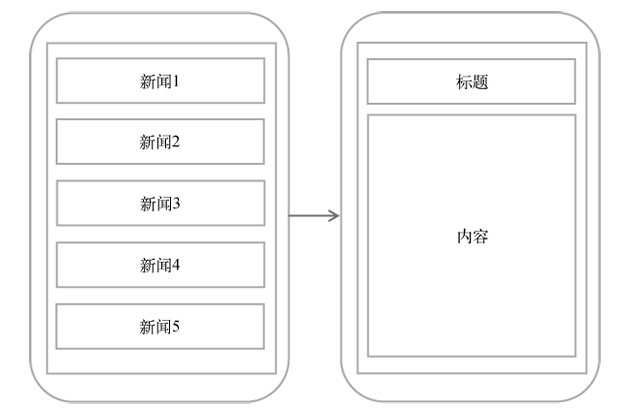
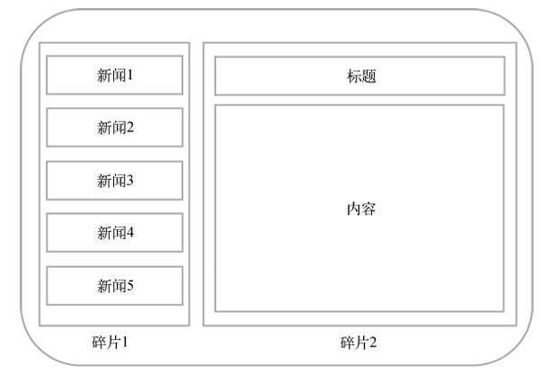
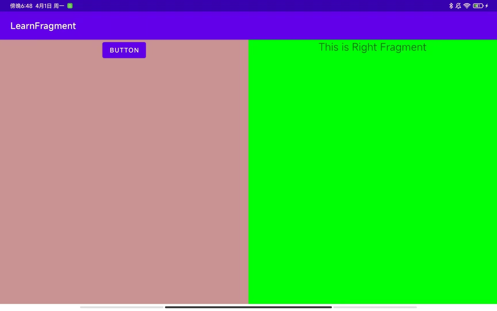
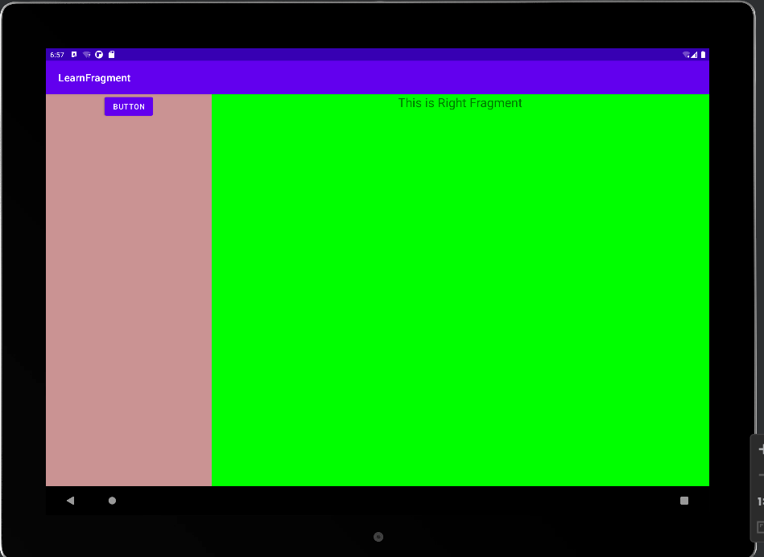
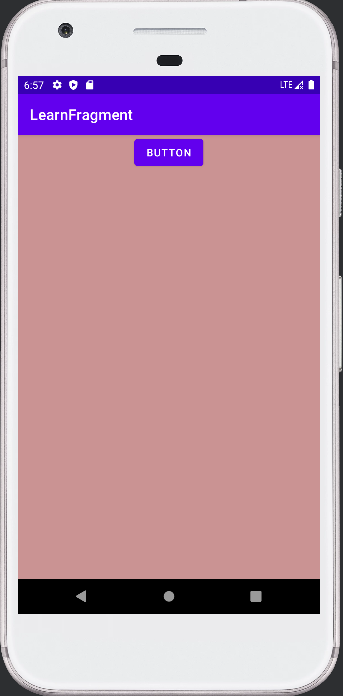
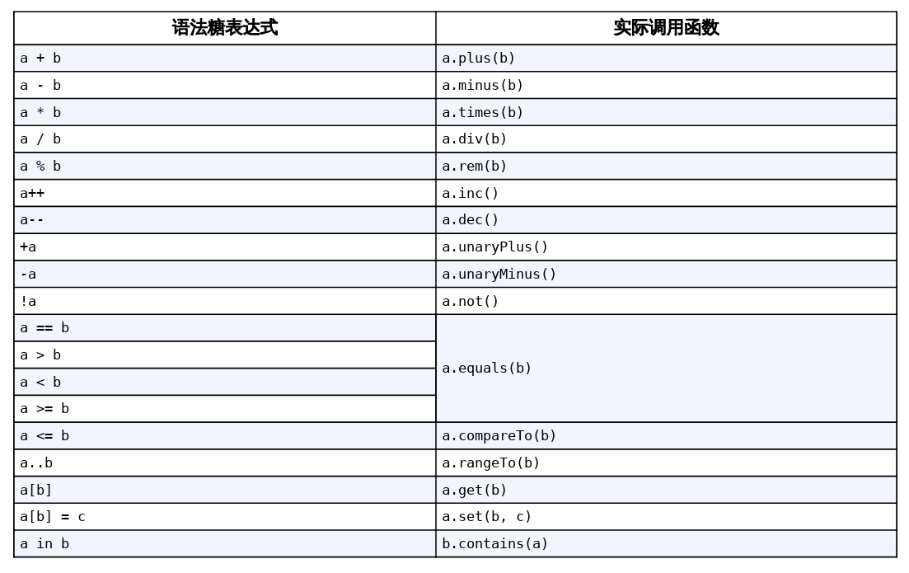

# chapter5.0-探究Fragment

## Fragment 是什么

Fragment是一种可以嵌入在Activity当中的UI片段，它能让程序更加合理和充分地利用大屏幕 的空间，因而在平板上应用得非常广泛

它和 `Activity` 实在是太像了, 可以理解为一个迷你型 `Activity`

至于功能来说, 如果我们使用 `Fragment`, 我们可以在平板上展示更好的页面, 提供更好的观感

举个小小的例子, 一个软件在手机和平板上可以有这样不同的显示效果






## Fragment 的使用

### Fragement 的简单使用

我们先在一个 Activity 中添加两个 `Fragment` , 让他们各占一半的空间

我们先对两个 `Fragement` 的布局文件进行编辑, 我们让 `LeftFragment` 包含一个按钮, `RightFragment` 显示一串文字

```xml
<!-- fragment_left.xml -->
<?xml version="1.0" encoding="utf-8"?>
<LinearLayout xmlns:android="http://schemas.android.com/apk/res/android"
    xmlns:tools="http://schemas.android.com/tools"
    android:layout_width="match_parent"
    android:layout_height="match_parent"
    android:background="#CA9393"
    android:orientation="vertical"
    tools:context=".fragement.LeftFragment">

    <Button
        android:id="@+id/leftFragmentButton"
        android:layout_width="wrap_content"
        android:layout_height="wrap_content"
        android:layout_gravity="center_horizontal"
        android:text="Button" />

</LinearLayout>
```

 ```xml
 <!-- fragment_right.xml -->
 <?xml version="1.0" encoding="utf-8"?>
 <FrameLayout xmlns:android="http://schemas.android.com/apk/res/android"
     xmlns:tools="http://schemas.android.com/tools"
     android:layout_width="match_parent"
     android:layout_height="match_parent"
     android:background="#00ff00"
     tools:context=".fragement.RightFragment">
 
     <TextView
         android:layout_width="wrap_content"
         android:layout_height="wrap_content"
         android:layout_gravity="center_horizontal"
         android:text="This is Right Fragment"
         android:textSize="24sp" />
 
 </FrameLayout>
 ```

之后我们注册这两个 `Fragment`

```kotlin
class LeftFragment : Fragment() {
    override fun onCreateView(
        inflater: LayoutInflater, container: ViewGroup?,
        savedInstanceState: Bundle?
    ): View? {
        return inflater.inflate(R.layout.fragment_left, container, false)
    }
}
```

```kotlin
class RightFragment : Fragment() {
    override fun onCreateView(
        inflater: LayoutInflater, container: ViewGroup?,
        savedInstanceState: Bundle?
    ): View? {
        return inflater.inflate(R.layout.fragment_right, container, false)
    }
}
```

> 注意: 
>
> 有两个不同包下的 `Fragment` 供你选择：一个是系统内置的 `android.app.Fragment` ，一个是 `AndroidX`库中 的 `androidx.fragment.app.Fragment` 。这里请一定要使用 `AndroidX` 库中的 `Fragment`，因 为它可以让 `Fragment` 的特性在所有 `Android` 系统版本中保持一致，而系统内置的 `Fragment` 在 `Android 9.0`版本中已被废弃

之后修改 `activity_main.xml` 文件即可

```xml
<?xml version="1.0" encoding="utf-8"?>
<LinearLayout xmlns:android="http://schemas.android.com/apk/res/android"
    xmlns:tools="http://schemas.android.com/tools"
    android:layout_width="match_parent"
    android:layout_height="match_parent"
    android:orientation="horizontal"
    tools:context=".MainActivity">

    <fragment
        android:id="@+id/leftFrag"
        android:layout_width="0dp"
        android:layout_height="match_parent"
        android:layout_weight="1"
        android:name="com.example.learnfragment.fragement.LeftFragment" />

    <androidx.fragment.app.FragmentContainerView
        android:id="@+id/rightFrag"
        android:layout_width="0dp"
        android:layout_height="match_parent"
        android:layout_weight="1"
        android:name="com.example.learnfragment.fragement.RightFragment" />
    
</LinearLayout>
```

> 虽然说 `<fragment>` 标签是正确的, 但是更推荐使用 `androidx.fragment.app.FragmentContainerView`

之后我们运行即可得到结果:




### 动态添加 Fragment

所谓动态的添加 `Fragment` , 实际上就是我们可以通过一些事件将某个 Fragment 替换成另一个 Fragment

现在我们就来实现点击左侧的按钮, 将右边的 Fragement 替换

我们新建一个新的 `Fragment` 叫 `AnotherRightFragment` , 它与 `RightFragment` 唯一的区别在于背景颜色不同并且文字不同, 这里就不展示代码了

之后我们修改 `activity_main` 的内容, 值得注意的是, 我们不是吧右边的 `Fragment` 写死了, 而是用 `FrameLayout` 代替

```xml
<?xml version="1.0" encoding="utf-8"?>
<LinearLayout xmlns:android="http://schemas.android.com/apk/res/android"
    xmlns:tools="http://schemas.android.com/tools"
    android:layout_width="match_parent"
    android:layout_height="match_parent"
    android:orientation="horizontal"
    tools:context=".MainActivity">

    <fragment
        android:id="@+id/leftFrag"
        android:layout_width="0dp"
        android:layout_height="match_parent"
        android:layout_weight="1"
        android:name="com.example.learnfragment.fragement.LeftFragment" />
	
    <FrameLayout
        android:id="@+id/rightLayout"
        android:layout_width="0dp"
        android:layout_height="match_parent"
        android:layout_weight="1" />

</LinearLayout>
```

> FrameLayout 是Android中最简单的一种布局，所有的控件默认都会摆放在布局的左上角。由于这里仅需要在布局里放入一个Fragment，不需要任何定位，因此非常适合使用 FrameLayout。

之后我们在 `MainActivity` 中添加填充 `Fragment` 的逻辑即可

```kotlin
class MainActivity : AppCompatActivity() {
    override fun onCreate(savedInstanceState: Bundle?) {
        super.onCreate(savedInstanceState)
        setContentView(R.layout.activity_main)
        leftFragmentButton.setOnClickListener {
            replaceFragment(AnotherRightFragment())
        }
        replaceFragment(RightFragment())
    }

    private fun replaceFragment(fragment: Fragment) {
        val fragmentManager = supportFragmentManager
        val transaction = fragmentManager.beginTransaction()
        transaction.replace(R.id.rightLayout, fragment)
        transaction.commit()
    }
}
```

可以看到，首先我们给左侧 `Fragment` 中的按钮注册了一个点击事件，然后调用 `replaceFragment()` 方法动态添加了 `RightFragment`

当点击左侧 `Fragment` 中的按钮时， 又会调用 `replaceFragment()` 方法，将右侧 `Fragment`替换成`AnotherRightFragment`

结合 `replaceFragment()` 方法中的代码可以看出，动态添加 `Fragment` 主要分为 $5$步。

1. 创建待添加 `Fragment` 的实例
2. 获取 `FragmentManager` ，在 `Activity` 中可以直接调用 `getSupportFragmentManager()` 方法获取
3. 开启一个事务，通过调用 `beginTransaction()` 方法开启
4. 向容器内添加或替换 `Fragment` ，一般使用 `replace()` 方法实现，需要传入容器的 `id` 和待添 加的`Fragment` 实例
5. 提交事务，调用 `commit()` 方法来完成

至此, 我们便实现了这个功能


### 在Fragment 中实现返回栈

在上一小节中，我们成功实现了向 `Activity` 中动态添加 `Fragment` 的功能。不过你尝试一下就会发现，通过点击按钮添加了一个 `Fragment` 之后，这时按下 `Back` 键程序就会直接退出。如果我们想实现类似于返回栈的效果，按下 `Back` 键可以回到上一个 `Fragment`

其实很简单，`FragmentTransaction` 中提供了一个 `addToBackStack()` 方法，可以用于将一 个事务添加到返回栈中

即修改 `replaceFragment()` 为:

```kotlin
private fun replaceFragment(fragment: Fragment) {
    val fragmentManager = supportFragmentManager
    val transaction = fragmentManager.beginTransaction()
    transaction.replace(R.id.rightLayout, fragment)
    transaction.addToBackStack(null)
    transaction.commit()
}
```

这里我们在事务提交之前调用了 `FragmentTransaction` 的 `addToBackStack()` 方法，它可以接收一个名字用于描述返回栈的状态，一般传入 `null`即可


### Fragment 和 Activity 之间的交互

> **Activity 与 Fragment 交互**

虽然 `Fragment` 是嵌入在 `Activity` 中显示的，可是它们的关系并没有那么亲密。实际上， `Fragment` 和`Activity` 是各自存在于一个独立的类当中的，它们之间并没有那么明显的方式来直接进行交互

为了方便 `Fragment` 和 `Activity` 之间进行交互，`FragmentManager` 提供了一个类似于 `findViewById()` 的方法，专门用于从布局文件中获取 `Fragment` 的实例

```kotlin
val fragment = supportFragmentManager.findFragmentById(R.id.leftFrag) as LeftFragment
```

同时 `kotlin-android-extensions` 也可以进行简化为 :

```kotlin
val fragment = leftFrag as LeftFragment
```


> **Fragment 与 Activity 交互**

每个 `Fragment` 中都可以通过调用 `getActivity()` 方法来得到和当前 `Fragment` 相关联的 `Activity` 实例，代码如下所示：

```kotlin
if (activity != null) { 
    val mainActivity = activity as MainActivity 
} 
```

这里使用了语法糖

由于 `getActivity()` 方法有可能返回 `null`，因此我们需要先进行一个判空处理。有了 `Activity` 的实例，在`Fragment` 中调用 `Activity` 里的方法就变得轻而易举了。另外当 `Fragment` 中需要使用 `Context`对象时，也可以使用 `getActivity()` 方法，因为获取到的 `Activity` 本身就 是一个 `Context` 对象


## Fragment 的生命周期

Fragment 的生命周期和 Activity 的生命周期大差不差, 也分为下面的几个阶段:

* **运行状态**

当一个Fragment所关联的Activity正处于运行状态时，该Fragment也处于运行状态

* **暂停状态**

当一个Activity进入暂停状态时（由于另一个未占满屏幕的Activity被添加到了栈顶），与 它相关联的Fragment就会进入暂停状态

* **停止状态**

当一个Activity进入停止状态时，与它相关联的Fragment就会进入停止状态，或者通过调用FragmentTransaction的remove()、replace()方法将Fragment从Activity中移 除，但在事务提交之前调用了addToBackStack()方法，这时的Fragment也会进入停止状态。总的来说，进入停止状态的Fragment对用户来说是完全不可见的，有可能会被系统 回收

* **销毁状态**

Fragment总是依附于Activity而存在，因此当Activity被销毁时，与它相关联的 Fragment就会进入销毁状态。或者通过调用FragmentTransaction的remove()、 replace()方法将Fragment从Activity中移除，但在事务提交之前并没有调用 addToBackStack()方法，这时的Fragment也会进入销毁状态。


> Activity 中提供的生命周期的回调函数 Fragment 基本上都有, 但是有许多 Fragment 独有的回调函数

* `onAttach()`：当Fragment和Activity建立关联时调用
* `onCreateView()`：为Fragment创建视图（加载布局）时调用
* `onActivityCreated()`：确保与Fragment相关联的Activity已经创建完毕时调用
* `onDestroyView()`：当与Fragment关联的视图被移除时调用
* `onDetach()`：当Fragment和Activity解除关联时调用

完整的函数回调图片如下图所示 :


## 动态加载布局的方法

在这一节中, 我认为才是到了 Fragment 的核心用法了

之前我们实现 Fragment 可以把它当成一个迷你的 `Activity` , 现在我们要实现的是 **当显示的设备不同的时候(如平板/手机), 我们可以动态的展示不同的效果** , 就像我们一开始展示的图片一样


### 使用限定符

如果你经常使用平板，应该会发现很多平板应用采用的是双页模式（程序会在左侧的面板上显 示一个包含子项的列表，在右侧的面板上显示内容），因为平板的屏幕足够大，完全可以同时 显示两页的内容，但手机的屏幕就只能显示一页的内容，因此两个页面需要分开显示

我们可以借助限定符来实现到底是使用单页模式还是双叶模式

我们修改 `Activity_main` 的文件内容, 我们只留下一个左侧Fragment，并让它充满整个父布局, 它将作为单页模式的布局文件

```xml
<fragment
	android:id="@+id/leftFrag"
	android:layout_width="match_parent"
	android:layout_height="match_parent"
	android:name="com.example.learnfragment.fragement.LeftFragment" />
```

之后我们在 `res` 目录 下新建 `layout-large` 文件夹，在这个文件夹下新建一个布局，也叫作 `activity_main.xml` ，代码如下:

```xml
<LinearLayout xmlns:android="http://schemas.android.com/apk/res/android"
    android:orientation="horizontal"
    android:layout_width="match_parent"
    android:layout_height="match_parent">
    
    <androidx.fragment.app.FragmentContainerView
        android:id="@+id/leftFrag"
        android:name="com.example.learnfragment.fragement.LeftFragment"
        android:layout_width="0dp"
        android:layout_height="match_parent"
        android:layout_weight="1" />

    <androidx.fragment.app.FragmentContainerView
        android:id="@+id/rightFrag"
        android:name="com.example.learnfragment.fragement.RightFragment"
        android:layout_width="0dp"
        android:layout_height="match_parent"
        android:layout_weight="3" />

</LinearLayout>
```

可以看到，`layout/activity_main` 布局只包含了一个 `Fragment` ，即单页模式，而 `layout large/ activity_main` 布局包含了两个`Fragment` ，即双页模式。其中，`large` 就是一个限定 符，那些屏幕被认为是 `large` 的设备就会自动加载 `layout-large` 文件夹下的布局，小屏幕的设备 则还是会加载 `layout` 文件夹下的布局。

这样我们就可以实现在两个不同的设备中展示不同的界面了






**常用的限定符有:**


### 使用最小宽度限定符

在上一小节中我们使用 `large` 限定符成功解决了单页双页的判断问题，不过很快又有一个新的问题出现了：`large` 到底是指多大呢？有时候我们希望可以更加灵活地为不同设备加载布局，不管它们是不是被系统认定为 `large`，这时就可以使用最小宽度限定符`（smallest-width qualifier）`

在res目录下新建 `layout-sw600dp` 文件夹, 这就意味着，当程序运行在屏幕宽度大于等于 `600 dp` 的设备上时，会加载 `layout sw600dp/activity_main`布局，当程序运行在屏幕宽度小于 `600 dp` 的设备上时，则仍然加载 默认的 `layout/activity_main`布局。


## Kotlin 进阶课堂

### 拓展函数

扩展函数表示即使在不修改某个类的源码的情况下，仍然可以打开这个类，向该类添加新的函数

比如说我们希望在 `String` 类里面新增一个新的函数 : `lettersCount()` , 用来计算这个字符串有多少个字母

我们可以直接将我们自己写的函数 "添加到源码中" , 从而可以直接进行调用

拓展函数的结构为:

```kotlin
fun ClassName.methodName(param1: Int, param2: Int): Int { 
    return 0 
}
```

下面我们就来试试写一个拓展函数:

由于我们希望向String类中添加一个扩展函数，因此需要先创建一个String.kt文件。文件名虽 然并没有固定的要求，但是我建议向哪个类中添加扩展函数，就定义一个同名的Kotlin文件，这样便于你以后查找。**最好将其创造为顶层方法**

我们在 `String.kt` 文件中添加这样的代码:

```kotlin
fun String.lettersCount() : Int {
    var num = 0;
    for(char in this) {
        if(char.isLetter())
            num++
    }
    return num
}

fun main() {
    val str = "^&#GH##%%^DDSJGW#**"
    print(str.lettersCount())
}
```

这样便成功实现了拓展函数


### 运算符重载

运算符重载使用的是 `operator` 关键字，只要在指定函数的前面加上`operator` 关键字，就可以实现运算符重载的功能了

这点其实没什么好说的, 重载运算符后, 运算符两边的类型我们都是可以自定义的, 但也要符合逻辑

一般的格式如下:

```kotlin
class Obj { 
    operator fun plus(obj: Obj): Obj { 
        // 处理相加的逻辑 
    } 
}  
```

可重载的运算符所对应的的函数名以及顺序如下:


