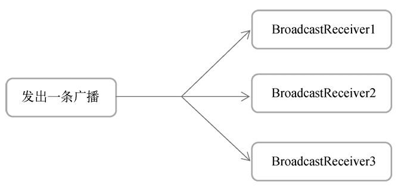
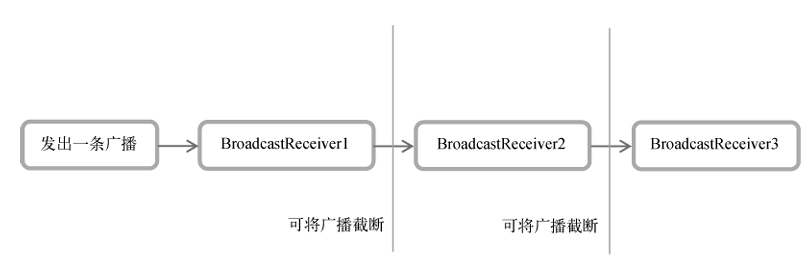

# chapter6.0 - 广播机制

## 广播机制简介

`Android` 中的每个应用程序都可以对自己感兴趣的广播进行注册，这样该程序就只会收到自己所关心的广播内容，这些广播可能是来自 于系统的，也可能是来自于其他应用程序的。`Android` 提供了一套完整的 `API`，允许应用程序自由地发送和接收广播

广播的类型主要有两种, 分别是**标准广播**和**有序广播**

* 标准广播

是一种完全异步执行的广播，在广播发出之后，所有的 `BroadcastReceiver` 几乎会在同一时刻收到这条广播消息，因此它们之间没有任何先后顺 序可言。这种广播的效率会比较高，但同时也意味着它是无法被截断的



* 有序广播

是一种同步执行的广播，在广播发出之后，同一时刻只会有一个 `BroadcastReceiver` 能够收到这条广播消息，当这个`BroadcastReceiver` 中的逻辑执行完毕后，广播才会继续传递。所以此时的 `BroadcastReceiver` 是有先后顺序的， 优先级高的`BroadcastReceiver` 就可以先收到广播消息，并且前面的 `BroadcastReceiver` 还可以截断正在传递的广播，这样后面的`BroadcastReceiver` 就无法收到广播消息了




## 接收系统广播

`Android` 内置了很多系统级别的广播，我们可以在应用程序中通过监听这些广播来得到各种系统的状态信息

接收广播一般使用 `BroadcastReceiver` , 我们来演示一下如何使用 `BroadcastReceiver` 来接收时间变化的广播

注册 BroadcastReceiver的方式一般有两种：

**在代码中注册**和**在AndroidManifest.xml**中注册。其中前者也被称为**动态注册**，后者也被称为**静态注册**


### 动态注册 

我们只需要新建一个类，让它继承自 `BroadcastReceiver`，并重写父类的 `onReceive()` 方法就行了。这样当有广播到来时， `onReceive()` 方法就会得到执行，具体的逻辑就可以在这个方法中处理

我们以下面的代码为例:

```kotlin
class MainActivity : AppCompatActivity() {
    lateinit var timeChangeReceiver : TimeChangeReceiver

    override fun onCreate(savedInstanceState: Bundle?) {
        super.onCreate(savedInstanceState)
        setContentView(R.layout.activity_main)

        val intentFilter = IntentFilter()
        intentFilter.addAction("android.intent.action.TIME_TICK")
        timeChangeReceiver = TimeChangeReceiver()
        registerReceiver(timeChangeReceiver, intentFilter)
    }

    override fun onDestroy() {
        super.onDestroy()
        unregisterReceiver(timeChangeReceiver)
    }

    inner class TimeChangeReceiver : BroadcastReceiver() {
        override fun onReceive(context: Context?, intent: Intent?) {
            Toast.makeText(context, "Time has changed", Toast.LENGTH_SHORT).show()
        }
    }
}
```

我们在MainActivity中定义了一个内部类TimeChangeReceiver，这个类是继承 自BroadcastReceiver的，并重写了父类的onReceive()方法。

观察 `onCreate()` 方法，首先我们创建了一个 `IntentFilter` 的实例，并给它添加了一个 值为 `android.intent.action.TIME_TICK`的 `action` ，为什么要添加这个值呢？因为当系统时间发生变化时，系统发出的正是一条值为 `android.intent.action.TIME_TICK`的广播， 也就是说我们的 `BroadcastReceiver` 想要监听什么广播，就在这里添加相应的 `action`。接下 来创建了一个`TimeChangeReceiver` 的实例，然后调用 `registerReceiver()` 方法进行注 册，将 `TimeChangeReceiver` 的实例和 `IntentFilter`的实例都传了进去，这样 `TimeChangeReceiver` 就会收到所有值为 `android.intent.action.TIME_TICK` 的广播， 也就实现了监听系统时间变化的功能

最后要记得，动态注册的 `BroadcastReceiver` 一定要取消注册才行，这里我们是在 `onDestroy()` 方法中通过调用`unregisterReceiver()`方法来实现的。

> 关于 Android 系统的所有广播, 你可以在本地的以下路径中找到:
>
> **`/platforms/<任意android api版本>/data/broadcast_actions.txt`**
>
> 如 : `E:\environment\AndroidSDK\platforms\android-32\data\broadcast_actions.txt`


### 静态注册

动态注册的 `BroadcastReceiver` 可以自由地控制注册与注销，在灵活性方面有很大的优势。但是它存在着一个缺点，即必须在程序启动之后才能接收广播，因为注册的逻辑是写在 `onCreate()` 方法中的。

如果我们希望在程序运行前也能接收广播, 那么就需要静态注册了

> 其实从理论上来说，动态注册能监听到的系统广播，静态注册也应该能监听到，在过去的 Android系统中确实是这样的。但是由于大量恶意的应用程序利用这个机制在程序未启动的情况 下监听系统广播，从而使任何应用都可以频繁地从后台被唤醒，严重影响了用户手机的电量和 性能，因此Android系统几乎每个版本都在削减静态注册BroadcastReceiver的功能。
>
>  在Android 8.0系统之后，所有隐式广播都不允许使用静态注册的方式来接收了。隐式广播指的 是那些没有具体指定发送给哪个应用程序的广播，大多数系统广播属于隐式广播，但是少数特殊的系统广播目前仍然允许使用静态注册的方式来接收。这些特殊的系统广播列表详见 [这里](https://developer.android.google.cn/guide/components/broadcast-exceptions.html)

现在我们使用静态注册来实现开机的时候弹出 `Toast`

我们新建一个外部类 `BootCompleteReceiver` 类 :  →New→Other→Broadcast Receiver

我们简单修改一下代码, 就让 `onReceive()` 函数只是简单的弹出 `Toast`

```kotlin
class BootCompleteReceiver : BroadcastReceiver() {

    override fun onReceive(context: Context, intent: Intent) {
        Toast.makeText(context, "BOOT FINISH", Toast.LENGTH_SHORT).show()
    }
}
```

之后我们需要在 `AndroidManifest.xml` 文件中注册, 好在我们使用上述创建方法的话, Android Stdio 会帮我们自动注册

```xml
<receiver
	android:name=".BootCompleteReceiver"
	android:enabled="true"
	android:exported="true" />
```

在文件中出现了上述的一个块, 所有静态的 `BroadcastReceiver` 都是在这里进行注册的。它的用法其实和标签非常相似，也是通过`android:name` 指定具体注册哪一个 `BroadcastReceiver` ，而 `enabled` 和 `exported` 属性则是根据我们刚才勾选的状态自动生成的。

不过目前的 `BootCompleteReceiver` 是无法收到开机广播的，因为我们还需要对 `AndroidManifest.xml` 文件进行修改才行

我们增加这样几行:

```xml
<manifest xmlns:android="http://schemas.android.com/apk/res/android" 
          package="com.example.broadcasttest"> 
    <uses-permission android:name="android.permission.RECEIVE_BOOT_COMPLETED" /> 
    ...
    <receiver
        android:name=".BootCompleteReceiver"
        android:enabled="true"
        android:exported="true">
        <intent-filter>
            <action android:name="android.intent.action.BOOT_COMPLETED" />
        </intent-filter>
    </receiver>
</manifest>
```

由于Android系统启动完成后会发出一条值为 `android.intent.action.BOOT_COMPLETED` 的广播，因此我们在标签中又添加了一个标签，并在里面声明了相应的 `action`

这里有非常重要的一点需要说明。`Android` 系统为了保护用户设备的安全和隐私，做了严格的规定：如果程序需要进行一些对用户来说比较敏感的操作，必须在 `AndroidManifest.xml` 文件中进行权限声明，否则程序将会直接崩溃。比如这里接收系统的开机广播就是需要进行权限声明的，所以我们在上述代码中使用标签声明 了 `android.permission.RECEIVE_BOOT_COMPLETED` 权限


> 需要注意的是，不要在 `onReceive()` 方法中添加过多的逻辑或者进行任何的耗时操作，因为 `BroadcastReceiver` 中是不允许开启线程的，当 `onReceive()` 方法运行了较长时间而没有结束时，程序就会出现错误


## 发送自定义广播

### 发送标准广播

我们需要先定义一个我们自己的广播接收程序：

```kotlin
class MyReceiver : BroadcastReceiver() {

    override fun onReceive(context: Context, intent: Intent) {
        Toast.makeText(context, "receive my Broadcast", Toast.LENGTH_SHORT).show()
    }
}
```

之后我们在 `AndroidManifest.xml` 中进行注册：

```xml
<receiver
	android:name=".MyReceiver"
	android:enabled="true"
	android:exported="true">
	<intent-filter>
		<action android:name="org.yyym.broadcastTest.MY_BROADCAST" />
	</intent-filter>
</receiver>
```

这样， `MyReceiver` 就会接受一个 `org.yyym.broadcastTest.MY_BROADCAST` 的广播了

之后我们在 `MainActivity` 中加入一个按钮点击的逻辑用来产生广播

```kotlin
class MainActivity : AppCompatActivity() {

    override fun onCreate(savedInstanceState: Bundle?) {
        super.onCreate(savedInstanceState)
        setContentView(R.layout.activity_main)

        val button : Button = findViewById(R.id.sendBroadcast)
        button.setOnClickListener {
            val intent = Intent("org.yyym.broadcastTest.MY_BROADCAST")
            intent.setPackage(packageName)
            sendBroadcast(intent)
        }
    }
}
```

我们首先构建了一个 `Intent` 对象，并把要发送的广播的值传入。然后调用 `Intent` 的 `setPackage()` 方法，并传入当前应用程序的包名。

`packageName` 是 `getPackageName()` 的语法糖写法，用于获取当前应用程序的包名。

最后调用 `sendBroadcast()` 方法将广播发送出去，这样所有监听 `com.example.broadcasttest.MY_BROADCAST` 这条广播的`BroadcastReceiver` 就会收到消息了。此时发出去的广播就是一条标准广播。

 这里我还得对第2步调用的 `setPackage()` 方法进行更详细的说明。前面已经说过，在 `Android 8.0` 系统之后，静态注册的`BroadcastReceiver` 是无法接收隐式广播的，而默认情况下我们发出的自定义广播恰恰都是隐式广播。因此这里一定要调用`setPackage()` 方法，指定这条广播是发送给哪个应用程序的，从而让它变成一条显式广播，否则静态注册的 `BroadcastReceiver` 将 无法接收到这条广播


### 发送有序广播

和标准广播不同，有序广播是一种同步执行的广播，并且是可以被截断的

我们再建立一个广播接收器

```kotlin
class AnotherReceiver : BroadcastReceiver() {

    override fun onReceive(context: Context, intent: Intent) {
        Toast.makeText(context, "This is another receiver", Toast.LENGTH_SHORT).show()
    }
}
```

同时修改 xml 的配置让它能够接受 `org.yyym.broadcastTest.MY_BROADCAST` 广播

```xml
<receiver
	android:name=".AnotherReceiver"
	android:enabled="true"
	android:exported="true">
    <intent-filter>
        <action android:name="org.yyym.broadcastTest.MY_BROADCAST" />
    </intent-filter>
</receiver>
```

如果此时运行应用, 将会受到两个 Toast 消息, 因为我们之前讲的发送方法发送的是标准广播

接下来我们将标准广播改成有序广播

我们只需要将 `sendBroadcast()` 改成 `sendOrderedBroadcast()` 即可, 如下:

```kotlin
class MainActivity : AppCompatActivity() {

    override fun onCreate(savedInstanceState: Bundle?) {
        super.onCreate(savedInstanceState)
        setContentView(R.layout.activity_main)

        val button : Button = findViewById(R.id.sendBroadcast)
        button.setOnClickListener {
            val intent = Intent("org.yyym.broadcastTest.MY_BROADCAST")
            intent.setPackage(packageName)
            sendOrderedBroadcast(intent, null)
        }
    }
}
```

`sendOrderedBroadcast()` 方法接收两个参数：第一个 参数仍然是Intent；第二个参数是一个与权限相关的字符串，这里传入null就行了

那么该如何设定 `BroadcastReceiver` 的先后顺序呢？当然是在注册的时候进行设定了，修改 AndroidManifest.xml中的代码，如下所示：

```xml
<receiver
	android:name=".AnotherReceiver"
	android:enabled="true"
	android:exported="true">
    <intent-filter android:priority="100">
        <action android:name="org.yyym.broadcastTest.MY_BROADCAST" />
    </intent-filter>
</receiver>
```

我们通过 `android:priority` 属性给 `BroadcastReceiver` 设置了优先级，优先级比较高的 `BroadcastReceiver`就可以先收到广播

既然已经获得了接收广播的优先权，那么MyBroadcastReceiver就可以选择是否允许广播继续 传递了

```kotlin
class AnotherReceiver : BroadcastReceiver() {

    override fun onReceive(context: Context, intent: Intent) {
        Toast.makeText(context, "This is another receiver", Toast.LENGTH_SHORT).show()
        abortBroadcast() // 截断广播
    }
}
```

之后我们就只能收到一个Receiver的回应了


## kotlin-进阶教学

