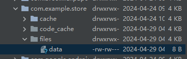
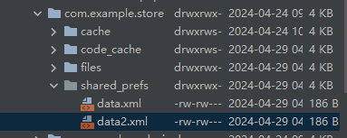
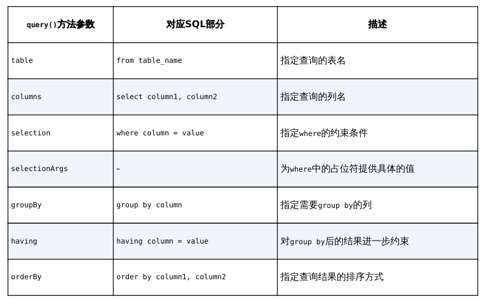

# chapter7.0 - 持久化存储

## 前言

所谓持久化存储, 就是指将那些内存中的瞬时数据保存到存储设备中，保证即使在手机或计算机关机 的情况下，这些数据仍然不会丢失。

我们将主要介绍三种持久化存储手段, 分别是 :

* 文件存储
* `SharedPreferences` 存储
* 数据库存储


## 文件存储

### 保存数据到文件中

我们先来展示一下保存的代码

```kotlin
fun save(inputText: String) {
    try {
        val output = openFileOutput("data", Context.MODE_PRIVATE)
        val writer = BufferedWriter(OutputStreamWriter(output))
        writer.use {
            it.write(inputText)
        }
    } catch (e: IOException) {
        e.printStackTrace()
    }
}
```

`Context` 类中提供了一个 `openFileOutput()` 方法，可以用于将数据存储到指定的文件中。

这个方法接收两个参数：

> 第一个参数是文件名，在文件创建的时候使用，注意这里指定的文件名不可以包含路径，因为所有的文件都默认存储到 `/data/data//files/` 目录下
>
> 第二个参数是文件的操作模式，主要有 **MODE_PRIVATE** 和 **MODE_APPEND** 两种模式可选，默认是 MODE_PRIVATE，表示当指定相同文件名的时候，所写入的内容将会覆盖原文件中的内容，而 MODE_APPEND 则表示如果该文件已存在，就往文件里面追加内容，不存在就创建新文件。
>
> > 其实文件的操作模式本来还有另外两种：**MODE_WORLD_READABLE** 和 **MODE_WORLD_WRITEABLE**。这两种模式表示允许其他应用程序对我们程序中的文件进行读写操作，不过由于这两种模式过于危险，很容易引起应用的安全漏洞，已在Android 4.2版本中被废弃



### 从文件中读取数据

我们先看看从文件中读取数据的代码:

```kotlin
private fun load(): String {
    val content = StringBuilder()
    try {
        val input = openFileInput("data")
        val reader = BufferedReader(InputStreamReader(input))
        reader.use {
            reader.forEachLine {
                content.append(it)
            }
        }
    } catch (e: IOException) {
        e.printStackTrace()
    }
    return content.toString()
}
```

在这段代码中，首先通过 `openFileInput()` 方法获取了一个 `FileInputStream` 对象，然后借助它又构建出了一个 `InputStreamReader` 对象，接着再使用 `InputStreamReader` 构建出 一个 `BufferedReader` 对象，这样我们就可以通过`BufferedReader` 将文件中的数据一行行读 取出来，并拼接到 `StringBuilder` 对象当中，最后将读取的内容返回就可以了。

 注意，这里从文件中读取数据使用了一个 `forEachLine` 函数，这也是 `Kotlin` 提供的一个内置扩展函数，它会将读到的每行内容都回调到Lambda表达式中，我们在Lambda表达式中完成拼接逻辑即可


## SharedPreferences 存储

不同于文件的存储方式，`SharedPreferences` 是使用**键值对**的方式来存储数据的。也就是说， 当保存一条数据的时候，需要给这条数据提供一个对应的键，这样在读取数据的时候就可以通 过这个键把相应的值取出来。而且`SharedPreferences` 还支持多种不同的数据类型存储，如果 存储的数据类型是整型，那么读取出来的数据也是整型的；如果存储的数据是一个字符串，那 么读取出来的数据仍然是字符串。

> 可以理解为是一个 `Map`


### 获取 SharedPreferences 对象

我们主要有以下几种方法来获取

* **`Context`  类中的 `getSharedPreferences()` 方法**

此方法接收两个参数：

第一个参数用于指定 `SharedPreferences` 文件的名称，如果指定的 文件不存在则会创建一个

> `SharedPreferences` 文件都是存放在 `/data/data//shared_prefs/` 目录下的

第二个参数用于指定操作模式，目前只有默认的 `MODE_PRIVATE` 这一种模式可选，它和直接传入 $0$ 的效果是相同的，表示只有当前的应用程序才可以对这个 `SharedPreferences` 文件进行读写。其他几种操作模式均已被废弃

*  **`Activity` 类中的 `getPreferences()` 方法**

这个方法和 `Context` 中的 `getSharedPreferences()` 方法很相似，不过它只接收一个操作模式参数，因为使用这个方法时会自动将当前 `Activity` 的类名作为 `SharedPreferences` 的文件名。


### 从 SharedPreferences 中写入

接下来就是如何往里面添加数据了, 一般可分为以下几步:

1. 调用 `SharedPreferences` 对象的 `edit()` 方法获取一个 `SharedPreferences.Editor` 对象
2. 向 `SharedPreferences.Editor` 对象中添加数据，比如添加一个布尔型数据就使用 `putBoolean()` 方法，添加一个字符串则使用 `putString()` 方法，以此类推
3. 调用 `apply()` 方法将添加的数据提交，从而完成数据存储操作

我们用代码演示如下 :

```kotlin
fun saveBySharedPreferences() {
    val editor = getSharedPreferences("data", Context.MODE_PRIVATE).edit()
    editor.putString("name", "Tom")
    editor.putInt("age", 28)
    editor.putBoolean("married", false)
    editor.apply()
}
```




### 从 SharedPreferences 中读入

接下来就是如何从 `SharedPreferences` 对象中获取数据了, 这也非常简单

`SharedPreferences` 对象中 提供了一系列的 `get` 方法，用于读取存储的数据，每种 `get` 方法都对应了 `SharedPreferences.Editor` 中的一种 `put` 方法，比如读取一个布尔型数据就使用 `getBoolean()` 方法，读取一个字符串就使用 `getString()` 方法。这些 `get` 方法都接收两个参 数：第一个参数是键，传入存储数据时使用的键就可以得到相应的值了；第二个参数是默认值，即表示当传入的键找不到对应的值时会以什么样的默认值进行返回

我们用代码示例解释:

```kotlin
fun getDataFromSharedPreferences() {
    val prefs = getSharedPreferences("data", Context.MODE_PRIVATE)
    val name = prefs.getString("name", "")
    val age = prefs.getInt("age", 0)
    val married = prefs.getBoolean("married", false)
    Toast.makeText(this,
                   "name is $name, age is $age, married is $married", Toast.LENGTH_SHORT).show()
}
```


## SQLite 数据库存储

`SQLite` 是一款轻量级的关系型数据库，它的运算速度非常快，占用资源很少，通常只需要几百KB的内存就足够了，因而特别适合在移动设备上使用。`SQLite` 不仅支持标准的SQL语法，还遵循了数据库的ACID事务，所以只要你以前使用过其他的关系型数据 库，就可以很快地上手SQLite。而SQLite又比一般的数据库要简单得多，它甚至不用设置用户 名和密码就可以使用, **主要是它是安卓自带的数据库, 无需配置**


### 创建数据库

Android为了让我们能够更加方便地管理数据库，专门提供了一个 `SQLiteOpenHelper` 帮助类

首先，你要知道 `SQLiteOpenHelper` 是一个抽象类，这意味着如果我们想要使用它，就需要创建一个自己的帮助类去继承它。`SQLiteOpenHelper` 中有两个抽象方法：`onCreate()` 和 `onUpgrade()` 。我们必须在自己的帮助类里重写这两个方法，然后分别在这两个方法中实现创建和升级数据库的逻辑。

`SQLiteOpenHelper` 中有两个非常重要的实例方法：`getReadableDatabase()` 和 `getWritableDatabase()` 。这两个方法都可以创建或打开一个现有的数据库（如果数据库已存在则直接打开，否则要创建一个新的数据库），并返回一个可对数据库进行读写操作的对象

当数据库不可写入的时候（如磁盘空间已满），`getReadableDatabase()` 方法返回的对象将以只读的方式打开数据库，而 `getWritableDatabase()` 方法则将出现异常

SQLiteOpenHelper中有两个构造方法可供重写, 接收 $4$ 个参数：

> 第一个参数是 `Context`，这个没什么好说的，必须有它才能对数 据库进行操作；
>
> 第二个参数是数据库名，创建数据库时使用的就是这里指定的名称；
>
> 第三个参 数允许我们在查询数据的时候返回一个自定义的 `Cursor`，一般传入 `null` 即可；
>
> 第四个参数表示 当前数据库的版本号，可用于对数据库进行升级操作

之后让我们简单演示一下具体是如何使用的:

```kotlin
class MyDatabaseHelper(val context: Context, name: String, version: Int) :
    SQLiteOpenHelper(context, name, null, version) {

    private val createBook = "create table Book (" +
            "id integer primary key autoincrement," +
            "author text," +
            "price real," +
            "pages integer," +
            "name text)"

    override fun onCreate(db: SQLiteDatabase) {
        db.execSQL(createBook)
        Toast.makeText(context, "Create succeeded", Toast.LENGTH_SHORT).show()
    }

    override fun onUpgrade(db: SQLiteDatabase, oldVersion: Int, newVersion: Int) {
    }
}
```

这样一张数据库表便创建成功了

接下来我们讲讲 `onUpgrade` 方法是如何使用的, 当你想对一张表进行更新的时候, `createBook` 方法是不能够运行的, 这是因为监测到表存在后就不会继续往后执行了, 于是就需要 `onUpgrade` 方法了

我们可以将整个类修改成下面的样子以演示我们的需求:

```kotlin
class MyDatabaseHelper(val context: Context, name: String, version: Int) :
    SQLiteOpenHelper(context, name, null, version) {

    private val createBook = "create table Book (" +
            "id integer primary key autoincrement," +
            "author text," +
            "price real," +
            "pages integer," +
            "name text)"
    
    private val createCategory = "create table Category (" +
            "id integer primary key autoincrement," +
            "category_name text," +
            "category_code integer)"

    override fun onCreate(db: SQLiteDatabase) {
        db.execSQL(createBook)
        db.execSQL(createCategory)
        Toast.makeText(context, "Create succeeded", Toast.LENGTH_SHORT).show()
    }

    override fun onUpgrade(db: SQLiteDatabase, oldVersion: Int, newVersion: Int) {
        db.execSQL("drop table if exists Book")
        db.execSQL("drop table if exists Category")
        onCreate(db)
    }

}
```

如上面的代码, 我们想要创建两张表, 但因为 `Book` 表已经创建了, 所以下面的 `Category` 表无法创建, 所以需要  `onUpgrade` 方法删除掉 `Book` 表后再创建

至于如何调用  `onUpgrade` 方法也很简单: **在创建 `MyDatabaseHelper` 类的时候提高版本号即可**


### 插入数据

我们可以使用 insert 方法来插入数据, 主要语法如下:

`insert` 接收3个参数：

> 第一个参数是表名，我们希望向哪张表 里添加数据，这里就传入该表的名字；
>
> 第二个参数用于在未指定添加数据的情况下给某些可为 空的列自动赋值 `NULL`，一般我们用不到这个功能，直接传入 `null` 即可；
>
> 第三个参数是一个 `ContentValues` 对象，它提供了一系列的 `put()` 方法重载，用于向 `ContentValues` 中添加数据，只需要将表中的每个列名以及相应的待添加数据传入即可

示例如下:

```kotlin
class MainActivity : AppCompatActivity() { 
 
    override fun onCreate(savedInstanceState: Bundle?) { 
        super.onCreate(savedInstanceState) 
        setContentView(R.layout.activity_main) 
        val dbHelper = MyDatabaseHelper(this, "BookStore.db", 2) 
        addData.setOnClickListener { 
            val db = dbHelper.writableDatabase 
            val values1 = ContentValues().apply { 
                put("name", "The Da Vinci Code") 
                put("author", "Dan Brown") 
                put("pages", 454) 
                put("price", 16.96) 
            } 
            db.insert("Book", null, values1) // 插入第一条数据 
        } 
    } 
} 
```


### 更新数据

同理, 我们使用 `upgrade` 方法:

`upgrade` 接收4个参数：

> 第一个参数和 `insert()` 方法一样，也是表名，指定更新哪张表里的数据；
>
> 第二个参数是 `ContentValues` 对象，要把更新数据在这里组装进去；
>
> 第三、第四个参数用于约束更 新某一行或某几行中的数据，不指定的话默认会更新所有行

```kotlin
class MainActivity : AppCompatActivity() { 
 
    override fun onCreate(savedInstanceState: Bundle?) { 
        super.onCreate(savedInstanceState) 
        setContentView(R.layout.activity_main) 
        val dbHelper = MyDatabaseHelper(this, "BookStore.db", 2) 
        updateData.setOnClickListener { 
            val db = dbHelper.writableDatabase 
            val values = ContentValues() 
            values.put("price", 10.99) 
            db.update("Book", values, "name = ?", arrayOf("The Da Vinci Code")) 
        } 
    } 
}
```

第三个参数对应的是SQL语句的where部分，表示更新所有name等于?的行，而?是一 个占位符，可以通过第四个参数提供的一个字符串数组为第三个参数中的每个占位符指定相应 的内容


### 删除数据

`SQLiteDatabase` 中提供了一个 `delete()` 方法，专门用于删除数据。

这个方法接收3个参数： 

> 第一个参数仍然是表名，这个没什么好说的；
>
> 第二、第三个参数用于约束删除某一行或某几行 的数据，不指定的话默认会删除所有行

如下面的代码所示:

```kotlin
class MainActivity : AppCompatActivity() { 
    
    override fun onCreate(savedInstanceState: Bundle?) { 
        super.onCreate(savedInstanceState) 
        setContentView(R.layout.activity_main) 
        val dbHelper = MyDatabaseHelper(this, "BookStore.db", 2) 
        deleteData.setOnClickListener { 
            val db = dbHelper.writableDatabase 
            db.delete("Book", "pages > ?", arrayOf("500")) 
        } 
    } 
}
```


### 查询数据

`SQLiteDatabase` 中提供了一个 `query()` 方法用于对数据进行查询。

这 个方法的参数非常复杂，最短的一个方法重载也需要传入7个参数。

> 第一个参数还是表名，表示我们希望从哪张表中查询数据。 
>
> 第二个参数用于指定去查询哪几列，如果不指定则默认查询所有列。
>
> 第三、第四个参数用于约束查询某一行或某几行的数据，不指定则默认查询所有行的数据。
>
> 第五个参数用于指定需要去 `group by` 的列，不指定则表示不对查询结果进行group by操作。
>
> 第六个参数用于对 `group by` 之后的数据进行进一步的过滤，不指定则表示不进行过滤。
>
> 第七个参数用于指定查询结果的排序方式，不指定则表示使用默认的排序方式。

与之对应的 SQL 语句如下图所示:



调用 `query()` 方 法后会返回一个 `Cursor` 对象，查询到的所有数据都将从这个对象中取出

我们简单演示一下 `SELECT * FROM Book;` 的操作:

```kotlin
class MainActivity : AppCompatActivity() { 
 
    override fun onCreate(savedInstanceState: Bundle?) { 
        super.onCreate(savedInstanceState) 
        setContentView(R.layout.activity_main) 
        val dbHelper = MyDatabaseHelper(this, "BookStore.db", 2) 
        queryData.setOnClickListener { 
            val db = dbHelper.writableDatabase 
            val cursor = db.query("Book", null, null, null, null, null, null) 
            if (cursor.moveToFirst()) { 
                do { 
                    // 遍历Cursor对象，取出数据并打印 
                    val name = cursor.getString(cursor.getColumnIndex("name")) 
                    val author = cursor.getString(cursor.getColumnIndex("author")) 
                    val pages = cursor.getInt(cursor.getColumnIndex("pages")) 
                    val price = cursor.getDouble(cursor.getColumnIndex("price")) 
                    Log.d("MainActivity", "book name is $name") 
                    Log.d("MainActivity", "book author is $author") 
                    Log.d("MainActivity", "book pages is $pages") 
                    Log.d("MainActivity", "book price is $price") 
                } while (cursor.moveToNext()) 
            } 
            cursor.close() 
        } 
    } 
} 
```

最后注意要将 `cursor` 关闭, 也就是 `cursor.close()`


### 使用SQL 操作数据库

我们也可以直接使用 SQL 语言来执行操作:

主要操作如下:

* 添加数据:

  ```kotlin
  db.execSQL("insert into Book (name, author, pages, price) values(?, ?, ?, ?)", 
      arrayOf("The Da Vinci Code", "Dan Brown", "454", "16.96") 
  ) 
  db.execSQL("insert into Book (name, author, pages, price) values(?, ?, ?, ?)", 
      arrayOf("The Lost Symbol", "Dan Brown", "510", "19.95") 
  ) 
  ```

* 更新数据

  ```kotlin
  db.execSQL("update Book set price = ? where name = ?", arrayOf("10.99", "The Da Vinci Code"))
  ```

* 删除数据

  ```kotlin
  db.execSQL("delete from Book where pages > ?", arrayOf("500"))
  ```

* 查询数据

  ```kotlin
  val cursor = db.rawQuery("select * from Book", null) 
  ```

  

### 事务操作

我们直接用代码解释如何开启事务:

```kotlin
class MainActivity : AppCompatActivity() { 
    override fun onCreate(savedInstanceState: Bundle?) { 
        super.onCreate(savedInstanceState) 
        setContentView(R.layout.activity_main) 
        val dbHelper = MyDatabaseHelper(this, "BookStore.db", 2) 
        replaceData.setOnClickListener { 
            val db = dbHelper.writableDatabase 
            db.beginTransaction() // 开启事务 
            try { 
                // ..... 执行语句
                db.setTransactionSuccessful() // 事务已经执行成功 
            } catch (e: Exception) { 
                e.printStackTrace() 
            } finally { 
                db.endTransaction() // 结束事务 
            } 
        } 
    } 
}
```


## Kotlin 进阶课堂

### 高阶函数的应用