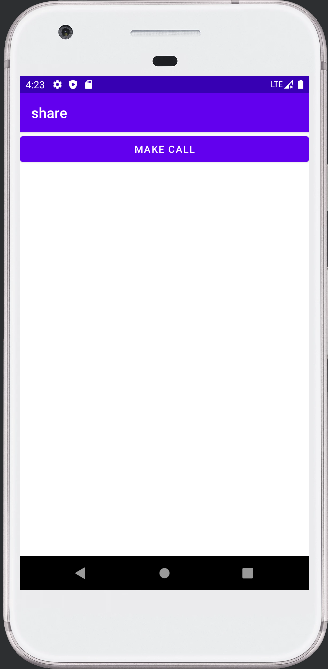
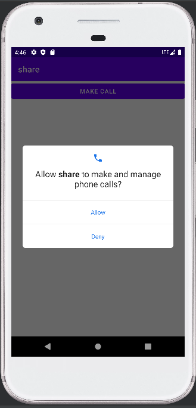
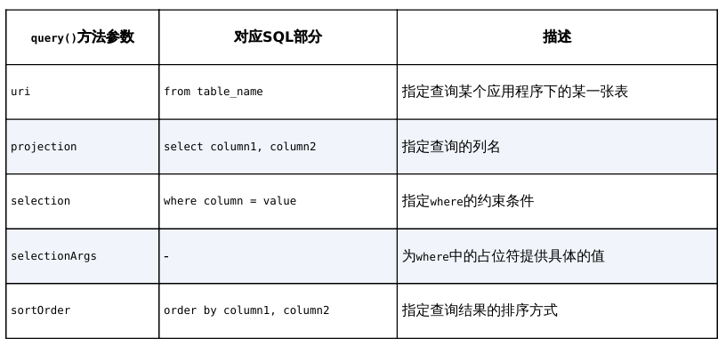

# chapter8.0 - 跨程序共享数据

## 前言

在这一章中, 我们将学习如何将数据在不同的程序中共享

让其他程序进行二次开发的数据是可以共享的。例如系统的通讯录程序，它的数据库中保存了很多联系人信息，如果这些数据都不允许第三方程序进行访问的话，恐怕很多应用的功能就要大打折扣了

实现这一效果使用的技术是 `ContentProvider`


## ContentProvider 简介

`ContentProvider` 主要用于在不同的应用程序之间实现数据共享的功能，它提供了一套完整的机制，允许一个程序访问另一个程序中的数据，同时还能保证被访问数据的安全性。目前，使用 `ContentProvider` 是 `Android` 实现跨程序共享数据的标准方式

`ContentProvider` 可以选择只对哪一部分数据进行共享，从而保证我们程序中的隐私数据不会有泄漏的风险


## 运行时权限

在讲解 `ContentProvider` 前我们先要了解什么是运行时权限

### Android 权限机制详解

在我们之前讲解广播机制的时候有下面的权限声明:

```xml
<uses-permission android:name="android.permission.RECEIVE_BOOT_COMPLETED" /> 
```

在声明使用了这个权限后, 用户在安装应用的时候就会有提示说明这个 App 需要哪些权限, 从而决定是否安装

但是有些软件会一次性申请完所有的权限, 为了限制这些企业的滥用, 又提出了运行时权限

就比如如果在应用中使用摄像头, 就会弹出申请使用摄像头的权限提醒弹窗

也就是说，用户不需要在安装软件的时候一次性授权所有申请的权限，而是可以在软件的 使用过程中再对某一项权限申请进行授权。比如一款相机应用在运行时申请了地理位置定位权 限，就算我拒绝了这个权限，也应该可以使用这个应用的其他功能，而不是像之前那样直接无法安装它

Android现 在将常用的权限大致归成了两类，一类是**普通权限**，一类是**危险权限**。准确地讲，其实还有一 些特殊权限，不过这些权限使用得相对较少


### 在程序运行时申请权限

我们以申请 `CALL_PHONE` 权限为例子, 这个权限因为拨打电话会涉及用户手机的资费问题，因而被列为了危险权限

我们简单讲代码写一下, 当点击按钮后就会跳转拨打电话按钮去拨打 `10086`

`MainActivity` 代码如下 : 

```kotlin
class MainActivity : AppCompatActivity() {
    override fun onCreate(savedInstanceState: Bundle?) {
        super.onCreate(savedInstanceState)
        setContentView(R.layout.activity_main)
        makeCall.setOnClickListener {
            try {
                val intent = Intent(Intent.ACTION_CALL)
                intent.data = Uri.parse("tel:10086")
                startActivity(intent)
            } catch (e: SecurityException) {
                e.printStackTrace()
            }
        }
    }
}
```



当我们点击按钮的时候, 不出意外是报错了:

```
W/System.err: java.lang.SecurityException: Permission Denial: starting Intent { act=android.intent.action.CALL dat=tel:xxxxx cmp=com.android.server.telecom/.components.UserCallActivity } from ProcessRecord{7c83f7c 14132:com.example.share/u0a162} (pid=14132, uid=10162) with revoked permission android.permission.CALL_PHONE
```

可以看出，这是由于权限被禁止所导致的，因为 Android 6.0及以上系统在使用危险权限时必须进行运行时权限处理

下面我们就来展示一下标准的运行时获取权限的方法:

```kotlin
class MainActivity : AppCompatActivity() {
    override fun onCreate(savedInstanceState: Bundle?) {
        super.onCreate(savedInstanceState)
        setContentView(R.layout.activity_main)
        makeCall.setOnClickListener {
            if (ContextCompat.checkSelfPermission(this,
                Manifest.permission.CALL_PHONE) != PackageManager.PERMISSION_GRANTED ) {
                ActivityCompat.requestPermissions(this,
                    arrayOf(Manifest.permission.CALL_PHONE), 1)
            } else {
                call()
            }
        }
    }

    override fun onRequestPermissionsResult( requestCode: Int,
        permissions: Array<out String>, grantResults: IntArray ) {
        super.onRequestPermissionsResult(requestCode, permissions, grantResults)
        when ( requestCode ) {
            1 -> {
                if ( grantResults.isNotEmpty() &&
                     grantResults[0] == PackageManager.PERMISSION_GRANTED ) {
                    call()
                } else {
                    Toast.makeText( this, "You denied the permission",
                        Toast.LENGTH_SHORT).show()
                }
            }
        }
    }

    private fun call() {
        try {
            val intent = Intent(Intent.ACTION_CALL)
            intent.data = Uri.parse("tel:10086")
            startActivity(intent)
        } catch (e: SecurityException) {
            e.printStackTrace()
        }
    }
}
```

> **注意: Manifest 要导入的包是 android.Manifest ** 不要导错了

我们简单分析一下上面的过程 :

* 我们借助 `ContextCompat.checkSelfPermission()` 来检验我们是否已经拥有了某一个权限, 如果拥有了就直接执行, 否则就申请

> `checkSelfPermission()` 方法接收两 个参数：
>
> 第一个参数是Context, 大部分情况为 `this`
>
> 第二个参数是具体的权限名，比如打电 话的权限名就是 `Manifest.permission.CALL_PHONE`
>
> 我们将方法的返回值和 `PackageManager.PERMISSION_GRANTED` 做比较，相等就说明用户已经授权，不等就表示用户没有授权

* 接着就是如何申请权限了, 我们调用 `ActivityCompat.requestPermissions()` 向用户申请权限

> `requestPermissions()` 方法接收 $3$ 个参数：
>
> 第一个参数要求是 Activity 的实例；
>
> 第二个参数 是一个 String 数组，我们把要申请的权限名放在数组中即可；
>
> 第三个参数是请求码，只要是唯 一值就可以了，这里传入了 $1$

* 用户界面会弹出权限选择框, 无论是哪种结果都会回调 `onRequestPermissionsResult()`

> 授权的结果则会封装在 `grantResults` 参数当中。
>
> 这里我们只需要判断一下最后的授权结果：
>
> 如果用户同意的话，就调用 `call()` 方法拨打电话；
>
> 如果用户拒绝的话，我们只能放弃操作，并且弹出一条失败提示



> 如果用户同意后下次就不需要再申请了


## 访问其他程序中的数据

### ContentResolver 的基本用法

对于每一个应用程序来说，如果想要访问 `ContentProvider` 中共享的数据，就一定要借助 `ContentResolver` 类，我们可以通过 `Context` 中的 `getContentResolver()` 方法获取该类的实例。

`ContentResolver` 中提供了一系列的方法用于对数据进行增删改查操作，其中 `insert()` 方法用于添加数据，`update()` 方法用于更新数据，`delete()` 方法用于删除数据，`query()` 方法用于查询数据。

`ContentResolver` 中的增删改查方法都是不接收表名参数的，而是 使用一个Uri参数代替，这个参数被称为内容URI。内容URI给ContentProvider中的数据建立 了唯一标识符

主要由两部分组成：**`authority` 和 `path`**。

> `authority` 是用于对不同的应用程序 做区分的，一般为了避免冲突，会采用应用包名的方式进行命名。`path` 是用于对同一应用程序中不同的表做区分的，通常会添加到authority的后面

除此之外我们还需要加上协议声明: 最后的结果如下:

```
content://com.example.app.provider/table1 
content://com.example.app.provider/table2 
```

得到了内容URI字符串之后，我们还需要将它解析成Uri对象才可以作为参数传入, 解析方式如下:

```kotlin
val uri = Uri.parse("content://com.example.app.provider/table1")
```

之后我们便可以使用这个 uri 来查数据了

```kotlin
val cursor = contentResolver.query(uri, projection, selection, selectionArgs, sortOrder)
```

参数含义如下:



之后的操作就和数据库的操作一致了, 这里就不做赘述了


## 创建自己的ContentProvider

在这一章我们将学会是如何提供给其他应用访问数据的接口的


### 创建ContentProvider 的步骤

如果想要实现跨程序共享数据的功能，可以通过新建一个类去继承 `ContentProvider` 的方式来实现。`ContentProvider` 类中有6个抽象方法，我们在使用子类继承 它的时候，需要将这 $6$ 个方法全部重写

```kotlin
class MyProvider : ContentProvider() { 
    override fun onCreate(): Boolean { 
        return false 
    } 
    override fun query(uri: Uri, projection: Array<String>?, selection: String?, 
            selectionArgs: Array<String>?, sortOrder: String?): Cursor? { 
        return null 
    } 
    override fun insert(uri: Uri, values: ContentValues?): Uri? { 
        return null 
    } 
    override fun update(uri: Uri, values: ContentValues?, selection: String?, 
            selectionArgs: Array<String>?): Int { 
        return 0 
    } 
    override fun delete(uri: Uri, selection: String?, selectionArgs: Array<String>?): Int { 
        return 0 
    } 
    override fun getType(uri: Uri): String? { 
        return null 
    }
}
```

