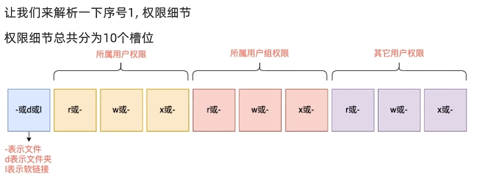

# Linux 命令

## 基础命令

### ls 命令

```shell
ls [-a -l -h] [Linux 路径]
```

ls 命令是查看文件夹内容

-----


```shell
ls 
```

不使用参数和参数表示 ： 以平铺的形式列出当前工作目录下的内容

PS ： 刚启动的时候会启动到HOME目录下的用户名路劲 ：即： home/yyym

```shell
ls /        ---查看根目录
ls /home/yyym    ---查看某一目录
```

可选项参数

> `-a`  将所有文件列出， 包括隐藏的文件和文件夹
>
> > 文件或者文件夹名字前面以 `.` 开头的就是隐藏文件
>
> `-l` 将内容由平铺换成列表展示，同时展示的信息更多，包括创建时间等等
>
> `-h` 用容易阅读的形式列出文件的大小，如 K， M， G (单位)
>
> > 必须和 -l 混合使用，即 `-lh`
> >
> > PS:  可以简写 ： `-l -a`  $\Longrightarrow$ `-la`


### cd 命令

```shell
cd [Linux 路径]
```

切换工作目录

---


> 不写路径  $\Longrightarrow$ 直接回到用户的home目录里
>
> 写了路径  $\Longrightarrow$  到指定的路径


### pwd 命令

```shell
pwd
```

查看当前的工作目录


### 特殊路径符

>`.` 	表示当前目录
>
>`..` 	表示上一级目录
>
>`~`		表示home/yyym目录


### mkdir 命令

```shell
mkdir [-p] Linux 路径
```

创建文件夹

-----


> `-p` 表示是否创建不存在的父目录，即可以更好的创建多级目录

```shell
mkdir learn
mkdir -p test/learn
```

如果没有 `-p` 那么就无法在不存在的文件夹里面创建文件

创建目录需要权限


### touch 命令

```shell
touch Linux路径
```

创建文件

----


```shell
touch text.txt
```


### cat 命令

```shell
cat Linux路径
```

查看文件的内容

----


```shell
cat /lib/alsa/init/00main
```


### more 命令

```shell
more Linux路径
```

more同样可以查看文件内容， 不过可以一页一页的展示

-----


> 空格翻页
>
> `q` 表示退出


### cp 命令

```shell
cp [-r] 参数一 参数二
```

用于复制文件夹\文件

----


> `-r`  表示是否递归的复制文件夹
>
> 参数一： 表示被赋值的文件或文件夹
>
> 参数二： 表示要复制的地方


### mv 命令

```shell
mv 参数一 参数二
```

用于移动文件/文件夹

PS ： 同时也可以实现改名效果

---


```shell
mv ~/learn/test.txt ~/test   ---移动
mv ~/test/test ~/test/test.txt  ---改名
```


### rm 命令

```shell
rm [-r -f] 参数一 参数二 .....
```

用来删除文件、文件夹

-----


> `-r` 与 cp 命令的 -r 参数一样，用来删除文件夹
>
> `-f` 表示强制删除（不会弹出确认信息）
>
> > root 用户删除删除才会弹出确认信息


### 模糊匹配

> `*` 表示通配符， 即匹配任何内容
>
> `test*` 表示匹配所有以test开头的文件
>
> `*test` 表示匹配所有以test结尾的文件
>
> `*test*` 表示匹配所有包含test的文件


### which 命令

```
which 命令
```

用来查找一系列命令程序文件的存放地址

----


### find 命令

```
find 起始路径 -name "被查找的文件名"
```

按照文件名查找

```
find 起始路径 -size +n [kMG]
```

```
find 起始路径 -size -n [kMG]
```

按照文件大小查找， + 表示大于， -表示小于

PS : 小写的k

-----


### grep 命令

```
grep [-n] 关键字 文件路径
```

从文件中通过关键字过滤文件行

文件路径可以作为管道符输入

---


`-n` ： 可选项， 便是显示匹配的行和行号

关键字 ： 表示要过滤的关键字， 尽量用`""` 来包裹

相当于Window 的 `ctrl + f`


### wc 命令  

```
wc [-c -m -l -w] 文件路径
```

统计文件的信息

文件路径可以作为管道符输入

---


`-c ` 统计字节数

`-m ` 统计字符数量

`-l`  统计行数

`-w`  统计单词数量 


### 管道符

管道符 `|`

将管道符左边命令的结果当作右边命令的输入 （相当于子查询）

举例 ：

```
cat text.cpp | grep "content"
```

管道符可以一直嵌套


### echo 命令

```
echo 输出的内容
```

相当于Linux 系统的print

----


echo 后面的内容使用`` 包裹会执行里面的命令，并将结果输出


### 重定向符 > / >>

`>` 将左侧命令的结果，覆盖写入到符号右端的指定文件

`>>` 将左侧命令的结果， 追加写入到符号指定的文件中


### tail 命令

```
tail [-f -num] [Linux 路径]
```

查看尾部的内容

只有 `tail` 查看最后的十条信息

`-num` 指定指定看的行数 -5， -9

`-f` 实时查看尾部的内容


## 权限管理

### su 命令和 exit 命令

```
su [-] [用户名]
```

`-` 代表是否在切换用户的时候加载环境变量， 建议带上

用户名可省略， 不写默认root

可以用exit退回到上一个用户


### sudo 命令

```
sudo 其他命令
```

为某一条命令临时赋予管理员权限

并不是所有的用户都可以使用sudo， 我们要为普通用户配置sudo认证


### 用户组


### groupadd 命令

```
graupadd 用户组名
```

创建一个用户组名

### groupdel 命令

```
graupdel 用户组名
```

删除掉一个用户组

### useradd 命令

```
useradd [-g -d] 用户名
```

添加用户

> `-g` 表示加入指定的用户组，不加-g 会创建一个同名用户组然后加入，注意：-g指定的用户组要存在
>
> `-d` 指定该用户的文件存储地址，如果不指定，默认 /home/用户名

### userdel 命令

```
userdel [-r] 用户名
```

删除用户

> `-r` 加上后删除 /home目录下的， 不使用会保留home目录

### id 命令

```
id [用户名]
```

查看用户所属组

> 如果不指定用户名， 则默认查看自身

### usermod -aG 命令

```
usermod -aG 组名 用户名
```

将用户添加道某个组

### getent 命令

```
getent passwd
```

查看所有的用户名和用户组

信息包括:

用户名：密码（x）：用户ID：组ID：描述信息：HOME目录：执行终端（默认bash）

```
getent group
```

查看所有的组名

信息包括：

组名称：组认证（显示为X）：组ID

### 查看权限控制信息





### chmod 命令

```
chmod [-R] 权限 文件或文件夹
```

修改文件或者文件夹的权限信息（只有文件，文件夹的用户和root用户才能修改）

> `-R` 加入 -R表示影响道本身和内部文件，不加只影响自身

权限：

`u=xxx, g=xxx, o=xxx`

u表示用户权限， g表示用户组权限， o表示其他人的权限

示例

```
chmod -R u=rwx, g=rx, o=r test
```

快捷方式：


可以用三位数字来表示，所以上面的示例可以写成

```
chmod  -R 754 test
```

### chown 命令

```
chown [-R] [用户] [:] [用户组] 文件或者文件夹
```

修改文件，文件夹所属的用户以及用户组（此命令仅root用户有效）

> `-R` 加入 -R表示影响道本身和内部文件，不加只影响自身
>
> 用户： 表示修改成什么用户
>
> 用户组：表示修改什么用户组
>
> ： 用于分割用户以及用户组


## 使用技巧

### yum 命令下载程序

```
yum [-y] [install | remove | search] 软件名称
```

> `-y` 	无需手动确认安装或者卸载过程
>
> install ： 安装 
>
> remove ： 卸载
>
> search ： 搜索

yum需要root权限

yum需要联网


### syscemctl


