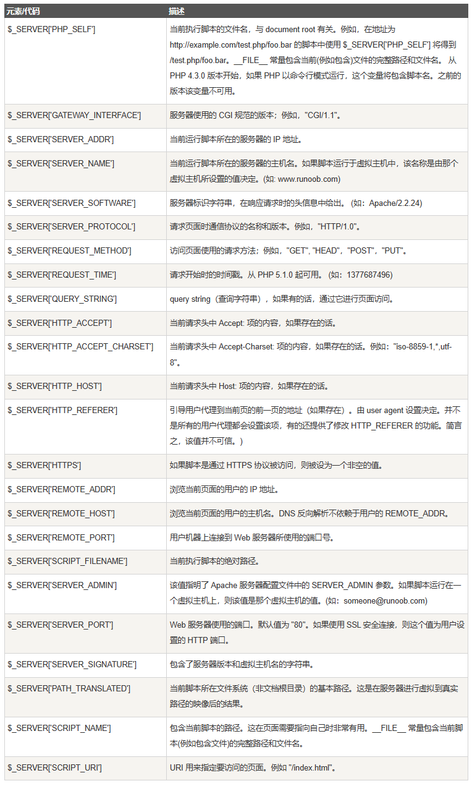

# PHP 快速手册

## 基本说明

基本的 `php` 语法

```php
<?php
// php 代码
?>
```

注释有两种 `//` `/* */` 同 `C` 语言一样


## 变量

`php` 中的变量是弱类型, 不用指明类型

```php
<?php
$a = 100;
$b = 200;
$z = $a +$b;
echo $z;
?>
```

变量也有局部作用域和全局作用域

可以使用 **`global`** 关键字

```php
<?php
$x=5;
$y=10;
 
function myTest() {
    global $x,$y;
    $y=$x+$y;
}
 
myTest();
echo $y; // 输出 15
?>
```

PHP 将所有全局变量存储在一个名为 `$GLOBALS[index]` 的数组中。 *index* 保存变量的名称。这个数组可以在函数内部访问，也可以直接用来更新全局变量。

```php
<?php
$x=5;
$y=10;
 
function myTest() {
    $GLOBALS['y']=$GLOBALS['x']+$GLOBALS['y'];
} 
 
myTest();
echo $y;
?>
```

当一个函数完成时，它的所有变量通常都会被删除。然而，有时候您希望某个局部变量不要被删除。

要做到这一点，请在您第一次声明变量时使用 **static** 关键字：

```php
<?php
function myTest() {
    static $x=0;
    echo $x;
    $x++;
    echo PHP_EOL;    // 换行符
}
 
myTest();
myTest();
myTest();
?>
```


## `echo` 和 `print`

echo 和 print 区别:

- echo - 可以输出一个或多个字符串
- print - 只允许输出一个字符串，返回值总为 1

**提示：**echo 输出的速度比 print 快， echo 没有返回值，print有返回值1。


## 比较

虽然 PHP 是弱类型语言，但也需要明白变量类型及它们的意义，因为我们经常需要对 PHP 变量进行比较，包含松散和严格比较。

- 松散比较：使用两个等号 **==** 比较，只比较值，不比较类型。
- 严格比较：用三个等号 **===** 比较，除了比较值，也比较类型。

例如，"42" 是一个字符串而 42 是一个整数。**FALSE** 是一个布尔值而 **"FALSE"** 是一个字符串。


## 常量

常量是一个简单值的标识符。该值在脚本中不能改变。

一个常量由英文字母、下划线、和数字组成,但数字不能作为首字母出现。 (**常量名不需要加 $ 修饰符**)。

**注意：** 常量在整个脚本中都可以使用。

设置常量，使用 define() 函数，函数语法如下：

```
bool define (string $name , mixed $value [, bool $case_insensitive = false ] )
```

```php
<?php
// 区分大小写的常量名
define("GREETING", "欢迎访问 Runoob.com");
echo GREETING;    // 输出 "欢迎访问 Runoob.com"
echo '<br>';
echo greeting;   // 输出 "greeting"，但是有警告信息，表示该常量未定义
?>
```


## 字符串

### PHP 并置运算符

在 PHP 中，只有一个字符串运算符。

并置运算符 (.) 用于把两个字符串值连接起来。

下面的实例演示了如何将两个字符串变量连接在一起：

```php
<?php
$txt1="Hello world!";
$txt2="What a nice day!";
echo $txt1 . " " . $txt2;
?>
```

### PHP strlen() 函数

```php
<?php
echo strlen("Hello world!");
?>
```

### PHP strpos() 函数

strpos() 函数用于在字符串内查找一个字符或一段指定的文本。

如果在字符串中找到匹配，该函数会返回第一个匹配的字符位置。如果未找到匹配，则返回 FALSE。

下面的实例在字符串 "Hello world!" 中查找文本 "world"：

```php
<?php
echo strpos("Hello world!","world");
?>
```


## 数组

```php
<?php
$cars=array("Volvo","BMW","Toyota");
echo "I like " . $cars[0] . ", " . $cars[1] . " and " . $cars[2] . ".";
?>
```

### 获取数组的长度 - count() 函数

```php
<?php
$cars=array("Volvo","BMW","Toyota");
echo count($cars);
?>
```

```php
<?php
$arr = array();
$arr[] = 9;
$arr[] = "aaaa";
for($i = 0 ; $i < count($arr); $i ++) {
    echo $arr[$i] . " ";
}
?>
```

## PHP 关联数组

```php
$age=array("Peter"=>"35","Ben"=>"37","Joe"=>"43");
```

```php
$age['Peter']="35";
$age['Ben']="37";
$age['Joe']="43";
```

```php
<?php
$age=array("Peter"=>"35","Ben"=>"37","Joe"=>"43");
echo "Peter is " . $age['Peter'] . " years old.";
?>
```

```php
<?php
$age=array("Peter"=>"35","Ben"=>"37","Joe"=>"43");
 
foreach($age as $x=>$x_value) {
    echo "Key=" . $x . ", Value=" . $x_value;
    echo "<br>";
}
?>
```

## 排序

- sort() - 对数组进行升序排列
- rsort() - 对数组进行降序排列
- asort() - 根据关联数组的值，对数组进行升序排列
- ksort() - 根据关联数组的键，对数组进行升序排列
- arsort() - 根据关联数组的值，对数组进行降序排列
- krsort() - 根据关联数组的键，对数组进行降序排列

```php
<?php
	$cars=array("Volvo","BMW","Toyota");
	sort($cars);
?>
```

## PHP 超级全局变量

PHP中预定义了几个超级全局变量（superglobals） ，这意味着它们在一个脚本的全部作用域中都可用。 你不需要特别说明，就可以在函数及类中使用。

PHP 超级全局变量列表:

- $GLOBALS
- $_SERVER
- $_REQUEST
- $_POST
- $_GET
- $_FILES
- $_ENV
- $_COOKIE
- $_SESSION

### $GLOBALS

$GLOBALS 是PHP的一个超级全局变量组，在一个PHP脚本的全部作用域中都可以访问。

$GLOBALS 是一个包含了全部变量的全局组合数组。变量的名字就是数组的键。

以下实例介绍了如何使用超级全局变量 $GLOBALS:

```php
<?php 
$x = 75; 
$y = 25;
 
function addition() { 
    $GLOBALS['z'] = $GLOBALS['x'] + $GLOBALS['y']; 
}
 
addition(); 
echo $z; 
?>
```

### $_SERVER

$_SERVER 是一个包含了诸如头信息(header)、路径(path)、以及脚本位置(script locations)等等信息的数组。这个数组中的项目由 Web 服务器创建。不能保证每个服务器都提供全部项目；服务器可能会忽略一些，或者提供一些没有在这里列举出来的项目。

以下实例中展示了如何使用$_SERVER中的元素:

```php
<?php 
echo $_SERVER['PHP_SELF'];
echo "<br>";
echo $_SERVER['SERVER_NAME'];
echo "<br>";
echo $_SERVER['HTTP_HOST'];
echo "<br>";
echo $_SERVER['HTTP_REFERER'];
echo "<br>";
echo $_SERVER['HTTP_USER_AGENT'];
echo "<br>";
echo $_SERVER['SCRIPT_NAME'];
?>
```



### $_REQUEST

$_REQUEST 用于收集HTML表单提交的数据。

以下实例显示了一个输入字段（input）及提交按钮(submit)的表单(form)。 当用户通过点击 "Submit" 按钮提交表单数据时, 表单数据将发送至<form>标签中 action 属性中指定的脚本文件。 在这个实例中，我们指定文件来处理表单数据。如果你希望其他的PHP文件来处理该数据，你可以修改该指定的脚本文件名。 然后，我们可以使用超级全局变量 $_REQUEST 来收集表单中的 input 字段数据:

```php+HTML
<html>
    <body>
        <form method="post" action="<?php echo $_SERVER['PHP_SELF'];?>">
            Name: <input type="text" name="fname">
            <input type="submit">
        </form>

    <?php 
    $name = $_REQUEST['fname']; 
    echo $name; 
    ?>
    </body>
</html>
```

### $_POST

$_POST 被广泛应用于收集表单数据，在HTML form标签的指定该属性："method="post"。

以下实例显示了一个输入字段（input）及提交按钮(submit)的表单(form)。 当用户通过点击 "Submit" 按钮提交表单数据时, 表单数据将发送至<form>标签中 action 属性中指定的脚本文件。 在这个实例中，我们指定文件来处理表单数据。如果你希望其他的PHP文件来处理该数据，你可以修改该指定的脚本文件名。 然后，我们可以使用超级全局变量 $_POST 来收集表单中的 input 字段数据:

```php+HTML
<html>
<body>
 
<form method="post" action="<?php echo $_SERVER['PHP_SELF'];?>">
Name: <input type="text" name="fname">
<input type="submit">
</form>
 
<?php 
$name = $_POST['fname']; 
echo $name; 
?>
 
</body>
</html>
```


### $_GET

$_GET 同样被广泛应用于收集表单数据，在HTML form标签的指定该属性："method="get"。

$_GET 也可以收集URL中发送的数据。

假定我们有一个包含参数的超链接HTML页面：

```php+HTML
<html>
<body>

<a href="test_get.php?subject=PHP&web=runoob.com">Test $GET</a>

</body>
</html>
```

当用户点击链接 "Test \$GET", 参数 "subject" 和 "web" 将发送至"test_get.php",你可以在 "test_get.php" 文件中使用 $_GET 变量来获取这些数据。

以下实例显示了 "test_get.php" 文件的代码:

```php+HTML
<html>
<body>
 
<?php 
echo "Study " . $_GET['subject'] . " @ " . $_GET['web'];
?>
 
</body>
</html>
```


**\$\_GET、\$\_POST 和 $\_REQUEST 的区别？**

**$_GET** 变量接受所有以 **get** 方式发送的请求，及浏览器地址栏中的 **?** 之后的内容。

**$_POS**T 变量接受所有以 post 方式发送的请求，例如，一个 form 以 **method=post** 提交，提交后 php 会处理 post 过来的全部变量。

**$_REQUEST** 支持两种方式发送过来的请求，即 **post** 和 **get** 它都可以接受，显示不显示要看传递方法，get 会显示在 url 中（有字符数限制），post 不会在 url 中显示，可以传递任意多的数据（只要服务器支持）。


## 函数

php 支持 默认参数

###  变量函数

变量函数是指在 PHP 中，将一个变量作为函数名来调用的函数。

变量函数可以让我们在运行时动态地决定调用哪个函数。

```php
<?php
function foo() {
    echo "In foo()<br />\n";
}

function bar($arg = '')
{
    echo "In bar(); argument was '$arg'.<br />\n";
}

// 使用 echo 的包装函数
function echoit($string)
{
    echo $string;
}

$func = 'foo';
$func();        // 调用 foo()

$func = 'bar';
$func('test');  // 调用 bar()

$func = 'echoit';
$func('test');  // 调用 echoit()
?>
```

```php
<?php
class Foo
{
    function Variable()
    {
        $name = 'Bar';
        $this->$name(); // 调用 Bar() 方法
    }

    function Bar()
    {
        echo "This is Bar";
    }
}

$foo = new Foo();
$funcname = "Variable";
$foo->$funcname();  // 调用 $foo->Variable()

?>
```


## 魔术常量

### `__LINE__`

文件中的当前行号。

```php
<?php
echo '这是第 " '  . __LINE__ . ' " 行';
?>
```

### `__FILE__`

文件的完整路径和文件名。如果用在被包含文件中，则返回被包含的文件名。

自 PHP 4.0.2 起，`__FILE__` 总是包含一个绝对路径（如果是符号连接，则是解析后的绝对路径），而在此之前的版本有时会包含一个相对路径。

```
<?php
echo '该文件位于 " '  . __FILE__ . ' " ';
?>
```

### `__DIR__`

文件所在的目录。如果用在被包括文件中，则返回被包括的文件所在的目录。

它等价于 dirname(`__FILE__`)。除非是根目录，否则目录中名不包括末尾的斜杠。（PHP 5.3.0中新增）

```php
<?php
echo '该文件位于 " '  . __DIR__ . ' " ';
?>
```

### `__FUNCTION__`

函数名称（PHP 4.3.0 新加）。自 PHP 5 起本常量返回该函数被定义时的名字（区分大小写）。在 PHP 4 中该值总是小写字母的。

```php
<?php
function test() {
    echo  '函数名为：' . __FUNCTION__ ;
}
test();
?>
```

### `__CLASS__`

类的名称（PHP 4.3.0 新加）。自 PHP 5 起本常量返回该类被定义时的名字（区分大小写）。

在 PHP 4 中该值总是小写字母的。类名包括其被声明的作用区域（例如 Foo\Bar）。注意自 PHP 5.4 起 `__CLASS__` 对 trait 也起作用。当用在 trait 方法中时，`__CLASS__ `是调用 trait 方法的类的名字。

```php
<?php
class test {
    function _print() {
        echo '类名为：'  . __CLASS__ . "<br>";
        echo  '函数名为：' . __FUNCTION__ ;
    }
}
$t = new test();
$t->_print();
?>
```

### `__TRAIT__`

Trait 的名字（PHP 5.4.0 新加）。自 PHP 5.4.0 起，PHP 实现了代码复用的一个方法，称为 traits。

Trait 名包括其被声明的作用区域（例如 Foo\Bar）。

从基类继承的成员被插入的 SayWorld Trait 中的 MyHelloWorld 方法所覆盖。其行为 MyHelloWorld 类中定义的方法一致。优先顺序是当前类中的方法会覆盖 trait 方法，而 trait 方法又覆盖了基类中的方法。

```php
<?php
class Base {
    public function sayHello() {
        echo 'Hello ';
    }
}
 
trait SayWorld {
    public function sayHello() {
        parent::sayHello();
        echo 'World!';
    }
}
 
class MyHelloWorld extends Base {
    use SayWorld;
}
 
$o = new MyHelloWorld();
$o->sayHello();
?>
```


## 命名空间

PHP 命名空间(namespace)是在 PHP 5.3 中加入的，目的是解决重名问题，PHP中不允许两个函数或者类出现相同的名字，否则会产生一个致命的错误。

PHP 命名空间可以解决以下两类问题：

1. 用户编写的代码与PHP内部的类/函数/常量或第三方类/函数/常量之间的名字冲突。
2. 为很长的标识符名称(通常是为了缓解第一类问题而定义的)创建一个别名（或简短）的名称，提高源代码的可读性。

### 定义命名空间

默认情况下，所有常量、类和函数名都放在全局空间下，就和PHP支持命名空间之前一样。

命名空间通过关键字namespace 来声明。如果一个文件中包含命名空间，它必须在其它所有代码之前声明命名空间。

语法格式如下:

```php
<?php  
// 定义代码在 'MyProject' 命名空间中  
namespace MyProject;  
 
// ... 代码 ...  
```

你也可以在同一个文件中定义不同的命名空间代码，如：

```php
<?php  
namespace MyProject;

const CONNECT_OK = 1;
class Connection { /* ... */ }
function connect() { /* ... */  }

namespace AnotherProject;

const CONNECT_OK = 1;
class Connection { /* ... */ }
function connect() { /* ... */  }
?>  
```

不建议使用这种语法在单个文件中定义多个命名空间。建议使用下面的大括号形式的语法。

```php
<?php
namespace MyProject {
    const CONNECT_OK = 1;
    class Connection { /* ... */ }
    function connect() { /* ... */  }
}

namespace AnotherProject {
    const CONNECT_OK = 1;
    class Connection { /* ... */ }
    function connect() { /* ... */  }
}
?>
```

将全局的非命名空间中的代码与命名空间中的代码组合在一起，只能使用大括号形式的语法。全局代码必须用一个不带名称的 namespace 语句加上大括号括起来，例如：

```php
<?php
namespace MyProject {

const CONNECT_OK = 1;
class Connection { /* ... */ }
function connect() { /* ... */  }
}

namespace { // 全局代码
session_start();
$a = MyProject\connect();
echo MyProject\Connection::start();
}
?>
```

在声明命名空间之前唯一合法的代码是用于定义源文件编码方式的 declare 语句。所有非 PHP 代码包括空白符都不能出现在命名空间的声明之前。

```php
<?php
declare(encoding='UTF-8'); //定义多个命名空间和不包含在命名空间中的代码
namespace MyProject {

const CONNECT_OK = 1;
class Connection { /* ... */ }
function connect() { /* ... */  }
}

namespace { // 全局代码
session_start();
$a = MyProject\connect();
echo MyProject\Connection::start();
}
?>
```

以下代码会出现语法错误：

```php
<html>
<?php
namespace MyProject; // 命名空间前出现了“<html>” 会致命错误 -　命名空间必须是程序脚本的第一条语句
?>
```

### 子命名空间

与目录和文件的关系很像，PHP 命名空间也允许指定层次化的命名空间的名称。因此，命名空间的名字可以使用分层次的方式定义：

```php
<?php
namespace MyProject\Sub\Level;  //声明分层次的单个命名空间

const CONNECT_OK = 1;
class Connection { /* ... */ }
function Connect() { /* ... */  }

?>
```

上面的例子创建了常量 MyProject\Sub\Level\CONNECT_OK，类 MyProject\Sub\Level\Connection 和函数 MyProject\Sub\Level\Connect。

## php 面向对象

## PHP 类定义

PHP 定义类通常语法格式如下：

```php
<?php
class phpClass {
  var $var1;
  var $var2 = "constant string";
  
  function myfunc ($arg1, $arg2) {
     [..]
  }
  [..]
}
?>
```

解析如下：

- 类使用 **class** 关键字后加上类名定义。
- 类名后的一对大括号({})内可以定义变量和方法。
- 类的变量使用 **var** 来声明, 变量也可以初始化值。
- 函数定义类似 PHP 函数的定义，但函数只能通过该类及其实例化的对象访问。
