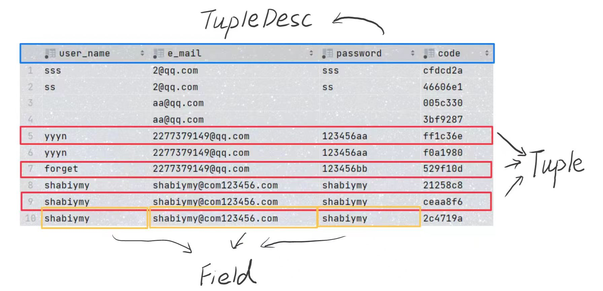
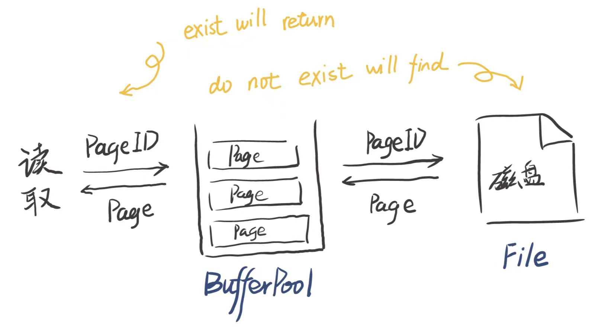
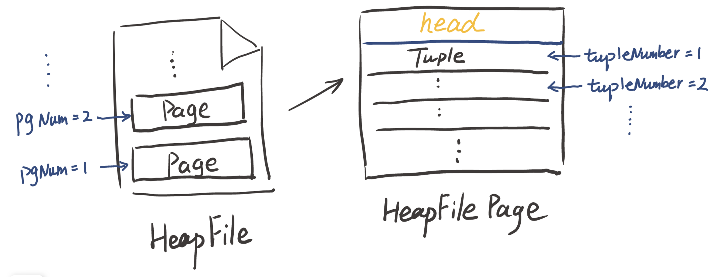
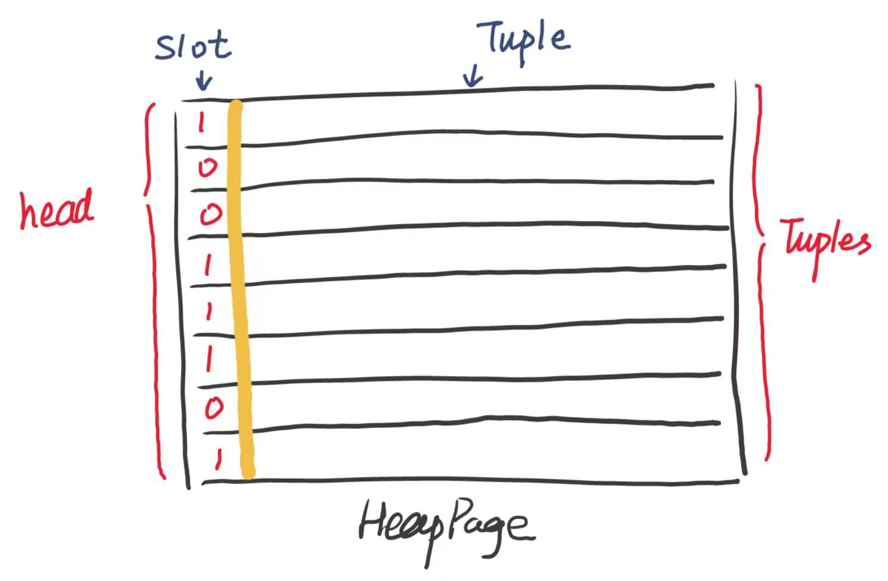

# MIT 6.830日寄-lab1


## 前言

数据库知识太菜，连lab1都做的很痛苦，主要是对这个数据库的各个组件的关系很混乱，所以做到后面就完全不知道干什么....

如果你和我一样，不喜欢看文档中的大段英文，或者对结构不太熟悉，那么笔者将尝试用自己的理解来帮你梳理这份结构。

同时也感谢同样贡献自己笔记的前辈们，他们的奉献给了我许多帮助...

我的项目地址 ：https://github.com/yyym-y/MIT6.830 

对于每一个函数我都写了一些注释，感兴趣可以看一下，给 star 就最好了 :smile:


## Exercise 1

你需要完成 `TupleDesc`  和  `Tuple`  类， 他们的文件地址为 ：

* src/java/simpledb/storage/TupleDesc.java
* src/java/simpledb/storage/Tuple.java

当你完成两个类的时候，你可以通过 TupleTest 和 TupleDescTest ； 

但是其中的一个测试 ：modifyRecordId() 你不会通过， 因为你还没有补全它，不需要担心

---

你可能对 `TupleDesc` 和 `Tuple` 到底是什么感到疑惑，我们用一张 Mysql 表来展示它：



可以看出， `TupleDesc` 实际上就是存储着表头信息；

可以发现，表头的每一列都可以看成一个独立的对象， 源码中使用了 `TDitem` 这个内部类来记录

表头的每一列包含了两个属性 ：

* 这一列数据的类型

  > 本数据库支持两种类型 ：整型（`INT_TYPE`） 字符串类型 （`STRING_TYPE`）

* 这一列的名字（可以为 null）就像上面图片的 e_mail 一样

另外大家可以阅读一下 Type 枚举类的源码...

* `TulpleDesc` 整体实现非常简单：找一个 Arraylist 存一下 TDitem， 你也可以自己做一些优化

* `Tuple` 的实现也很简单，属于小白也能无脑过...

  找一个 Arraylist 存一下 Field 接口， 遍历确定就好了

  不过有一点值得注意：每一个 `Tuple` 都是由 `Field` 构成的，而 `Field` 是一个接口，其下有两个实现类，分别是 `IntField` 和 `StringField` ，注意要和表头的类型相对应...（我写的时候就漏了...）


## Exercise 2

你需要完成 `Catalog` 类， 他的文件地址为 ：

* src/java/simpledb/common/Catalog.java

当你完成后，你可以通过 CatalogTest

----

`Catalog` 是什么呢？ 我们可以理解为他存储了这一个数据库所有表的信息

为了方便你以后的理解，我们简单描述一下一张表的基本信息：

* 这张表在磁盘的位置信息

  > 我们用 DbFile 这个接口来表示，因为存在两种存储方式，一种是堆存储`HeapFile` ， 一种是B+树`BTreeFile` ， 这些实现都围绕文件本身进行操作

* 这张表的名字 `name`

* 这张表的唯一标识 `tableId` 

  > 这张表的唯一标识来自 DbFile， 在确定 tableid 的时候你可以直接调用 BdFile 的 getID 方法

* 这张表的主键 【lab 1 不用管】

有两个点还是比较重要的：

1. Catalog 在整个项目中是唯一实例， 只要你需要使用到 Catalog， 你可以通过 `Database.getCatalog()` 来直接获取
2. 在实现 Catalog 的时候， 如果你发现一些信息在构造函数中没有输入，你可以通过DbFile 的相关函数获取


## Exercise 3

你需要完成 `BufferPool` 中的 `getPage()` 方法， 文件地址为 ：

* src/java/simpledb/storage/BufferPool.java

这一节没有单元测试，但是后面的练习都需要使用到这个函数

----

刚开始对这个 `BufferPool` 十分的不了解，以至于完成完后面的 Exercise 之后才回来补上了这个练习

我们先得对数据库读取有一定的了解：

当用户希望读取数据的时候，并不会直接在磁盘中找到存储的文件，而是先到缓冲池里面寻找

1. 如果在缓冲池里找到了内容，便会直接将内容返回
2. 如果没有找到，缓冲池会去磁盘找到对应的内容，让后将它加入缓冲池并且返回内容

图示如下：



注意如果只是完成lab 1， 那么 `getPage()` 中的两个输入 ：`TransactionId tid` 和 `Permissions perm` 都可以暂时不管，只需要简单的通过 `HashMap` 就可以存储以及快速获取了（当然你也可以使用`ConcurrentHashMap` 来保证线程安全）

如果你需要参考，可以参考一下的代码（以后一定会修改）

```java
public  Page getPage(TransactionId tid, PageId pid, Permissions perm)
    throws TransactionAbortedException, DbException {
    Page pg = map.get(pid);
    if(pg != null) return pg;
    DbFile db = Database.getCatalog().getDatabaseFile(pid.getTableId());
    pg = db.readPage(pid);
    map.put(pid, pg);
    return pg;
}
```

在 `BufferPool` 类中，也有几点需要提醒：

1. BufferPool 在整个项目中是唯一实例， 只要你需要使用到 BufferPool， 你可以通过 `Database.getBufferPool()` 来直接获取
2. 你可以通过调用 `getPageSize()` 函数来获取每一个 Page 的大小（Page 是啥后面会介绍）


## Exercise 4

你需要完成 `HeapPageID`  和  `RecordId`  以及 `HeapPage` 类， 文件地址为 ：

* src/java/simpledb/storage/HeapPageId.java
* src/java/simpledb/storage/RecordId.java
* src/java/simpledb/storage/HeapPage.java

完成这一节之后，你将可以通过 HeapPageIdTest ， RecordIDTest ， HeapPageReadTest

---

从这一个练习开始，后面就有可能变得有些繁琐起来

我们要先了解一下数据库中在磁盘中的存储方式 ：

首先数据库中每一个表都会被存储在硬盘上，表现形式为一个文件，即一个文件存储一张表

而一个文件（一张表）又被分成了不同的 Page， 每一个Page都是固定大小的并且存放固定数量的 Tuple（这里的固定数量值得是最大容量，而不是实际存储的个数），而我们从磁盘中读取也不是将整个文件读完，而是读出我们需要的那个 Page ，这样就可以提高效率

用图来表示如下



那么你一定会问，我们应该如何确定一个 Tuple 在什么位置呢 ？

我们不妨将问题缩小化，我们如何确定一个具体的 Page 呢？

可以观察到 `HeapPageId` 中有两个值 : `tableid` 和 `pgNum`

* 有个具体的 tableId 我们就可以确定一个具体的文件，因为每一个文件有唯一的 ID

* 而 pgNum 是可以知道具体的 Page 的编号， 自然可以轻松的确定 Page

那该如何确定每一个 Tuple的位置呢 ？

还记得每一个 Tuple 都有一个 RecordId 属性吗， RecordId 有两个值 ： `pid` 和 `tupleNum`

* pid 可以轻易的确定每一个具体的 Page位置并将它读出来
* tupleNum 表示这个 Tuple 在这个Page 中的编号， 自然可以做到确定位置

知道了这些， 你就可以轻易的完成 `HeapPageId` 和 `RecordId` 了

至于 `HeapPage` ， 你还需要知道如下的知识：



每一个Tuple 都对应了一个槽位（Slot）， 如果这个槽位的值是 $1$ ， 则说明这个 Tuple 是有效的， 如果这个槽位是 $0$ ， 那么这个 Tuple 是无效的

而记录这个 $0$ 和 $1$ 的是通过一个字节数组 `byte[] header` 

一个字节有 $8$ 个位， 所以一个 `byte` 就相当于 $8$ 个槽位

至于如何确定某个槽位是否为 $1$ ，我们可以通过位运算：

```java
public boolean isSlotUsed(int i) {
    int pos = i / 8; int step = i % 8;
    return ((header[pos] >> step) & 1) == 1;
}
```

同时我觉得几个难理解的点，在这里也做解释

```java
private int getNumTuples() {
    // Update -> 2023-9-20
    // 在BufferPool中定义了Page的默认大小 : 
    // `private static final int DEFAULT_PAGE_SIZE = 4096;`
    // PS : 这个4096代表的是字节数，而一个字节数包含了8个比特，所以总共的比特数就是 : 4096 * 8
    // 另外,我们还需要知道每一个tuple的大小，在实现tupleDesc类的时候我们计算过
    // PS : 因为计算的依然是字节数， 所以还需要乘 8， 另外还需要一个比特来表示这个tuple是否有效
    // 所以总共需要 tuple_size * 8 + 1 个字节
    return (int) Math.floor(
        (1.0 * BufferPool.getPageSize() * 8) / (td.getSize() * 8 + 1)
    );
}
```

```java
private int getHeaderSize() {
    // Update -> 2023-9-20
    // 每一个tuple都占了一个比特 所以总共占的比特数为 tuple_num
    // 八个比特为一个字节，所以字节数为 tuple_num / 8
    // 但小数出现的话要向上取整，所以也可以写成 : `Math.ceil(getNumTuples() / 8.0);`
    return (getNumTuples() - 1) / 8 + 1;
}
```

至此， 你便能完成这个 Exercise


## Exercise 5

你需要完成 `HeapFile` 类的 `readPage()` 和一些基础方法（包括 `iterator()`） ， 他的文件地址为 ：

* src/java/simpledb/storage/HeapFile.java

完成这一节之后，你将可以通过 HeapFileReadTest

----

`readPage()` 的核心就是确定读取文件开始的位置，你可以用一下的任意之一：

1. BufferedInputStream 的 read(File, off, len) 方法 【为喵我这个写挂了还不知道挂哪...】
2. RandomAccessFile 用来随机读取文件任意位置

至于如何快速确定文件读取的位置， 我们知道了 Page 的编号以及每个 Page 的大小，那么只需要简单相乘即可

```java
public Page readPage(PageId pid) {
    if(pid.getPageNumber() > numPages()) {
        return null;
    }
    try(RandomAccessFile file = new RandomAccessFile(this.file, "r")) {
        long offset = getOffset(pid);
        byte[] data = new byte[BufferPool.getPageSize()];
        file.seek(offset);
        for (int i = 0, n = BufferPool.getPageSize(); i < n; ++i) {
            data[i] = file.readByte();
        }
        return new HeapPage((HeapPageId) pid, data);
    } catch (IOException e) {
        throw new RuntimeException(e);
    }
}
```

至于这个 `iterator()` 【我的噩梦， 完全不会写，看了好多资料...】

有几个需要注意的点需要提醒大家：

1. 返回类型是 **BdFileIterator** 类型的， 所以我们自己 new 一个重写方法
2. 我们并不需要自己实现一个具体的迭代器，我们只是负责将不同的迭代器连接在一起，但实际上是不能实现真正的连接的，我们只需要在逻辑上实现即可。

有一说一，我觉得我讲不好，所以我直接在代码给大家展示吧

```java
public DbFileIterator iterator(TransactionId tid) {
        return new DbFileIterator() {
            private Iterator<Tuple> item = null;
            private int nowPageNum = 0; // 最后一个没有读的Page编号
            private boolean opened = false; // 判断这个DbFileIterator是否被打开

            public void readItem() {
                // 如果要读的 Page 编号超出了已有的 Page 数量
                if(nowPageNum > numPages() - 1) {
                    item = null; return;
                }
                // 读取对应 Page 的信息
                HeapPageId hpid = new HeapPageId(getId(), nowPageNum);
                try {
                    HeapPage hpg = (HeapPage) Database.getBufferPool()
                        							  .getPage(tid, hpid, null);
                    // 获取这个Page的迭代器并将 item 设为它
                    item = hpg.iterator();
                    nowPageNum ++;
                } catch (TransactionAbortedException | DbException e) {
                    throw new RuntimeException(e);
                }
            }

            @Override
            public void open() throws DbException, TransactionAbortedException {
                rewind(); // 重置 DbFileIterator 信息
                opened = true; // 开启迭代器
            }

            @Override
            public boolean hasNext() throws DbException, TransactionAbortedException {
                if(item == null) return false;
                if(! item.hasNext()) {
                    readItem();
                    return item != null;
                }
                return true;
            }

            @Override
            public Tuple next() 
                throws DbException, TransactionAbortedException, NoSuchElementException {
                if(item == null || ! opened)
                    throw new NoSuchElementException();
                if(hasNext())
                    return item.next();
                throw new NoSuchElementException();
            }

            @Override
            public void rewind() throws DbException, TransactionAbortedException {
                nowPageNum = 0;
                item = null;
                readItem();
            }

            @Override
            public void close() {
                opened = false;
            }
      };
}
```


## Exercise 6

你需要完成 `SeqScan` 类，文件地址为 ：

* src/java/simpledb/execution/SeqScan.java

完成这一节之后，你将可以通过 ScanTest

----

有一说一，这个类我在完成的时候是迷迷糊糊的....

你也可以将 SeqScan 当成我们对于 迭代器的封装，主要功能也和我们上述实现的 DbFileIterIterator 一致；

即实现将一些迭代器实现逻辑上的相连。

理解的可能不到位，大家可以在 github 上看看我的代码....


## 尾声

​		终于的终于， lab1 最终圆满完成， 有一说一，这个 lab1 并没有想象中简单的通过，从最开始的无从下手，到一点点摸索全英文的文档。从网上不断查看源码以及学习许多前辈的笔记，终于在一次次测试通过中不断的学习到新的知识...未来还有许多的 lab ， 希望都能过五关斩六将，最终圆满完成 :smile:
