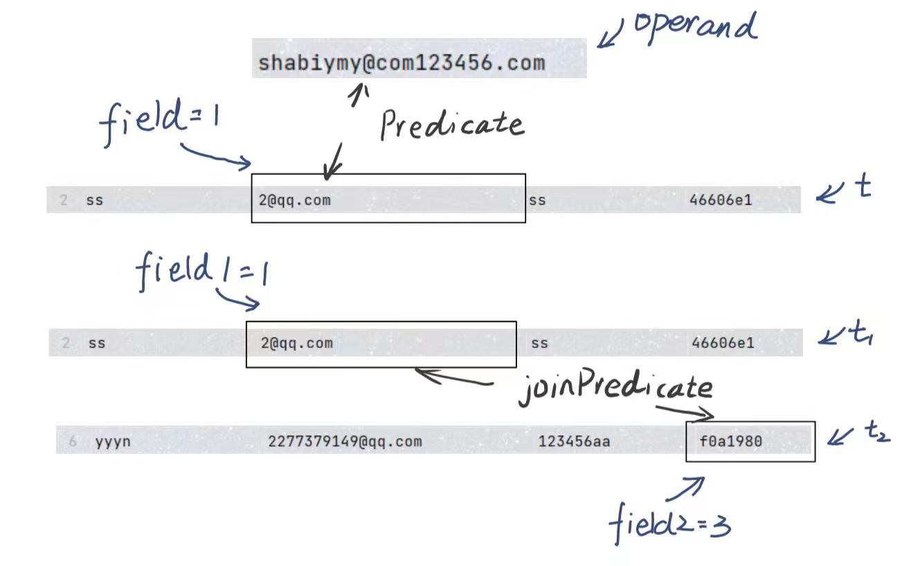

# MIT 6.830日寄-lab2


## 前言

​	不容易啊， 终于吧 lab2 完成了， 不过感觉其实做的不算慢，可能国庆的时候一直在做吧....

​	有一说一，总体来说， lab2 相对于 lab1 代码量上升了不少， 而且也有了可以优化的点，比如说 Join 的优化以及缓冲池的淘汰法则等等。

​	完成了 lab2 也不断的加深了我对于 MIT 6.830 中迭代器的理解，【小小吐槽一下：这个 lab 每做完一个部分，一测试全报错，一 debug 才发现全是 lab1 的锅...】

​	感谢贡献自己笔记的前辈们，他们的奉献给了我许多帮助...

​	我的项目地址 ：https://github.com/yyym-y/MIT6.830  【star， star，star ！！【发癫】】

​	lab1 笔记 ： [MIT 6.830日寄-lab1 - 知乎 (zhihu.com)](https://zhuanlan.zhihu.com/p/658169665)

​	更好的笔记地址 ： [https://github.com/yyym-y/note/](https://link.zhihu.com/?target=https%3A//github.com/yyym-y/note/tree/master/%E6%95%B0%E6%8D%AE%E5%BA%93/MIT6.830)


## Exercise 1

你需要完成 `Predicate`  类，`JoinPredicate` 类， `Filter` 类和  `Join`  类，文件地址为 ：

* src/java/simpledb/execution/Predicate.java
* src/java/simpledb/execution/JoinPredicate.java
* src/java/simpledb/execution/Filter.java
* src/java/simpledb/execution/Join.java

当你完成几个类的时候，你可以通过 PredicateTest ,  JoinPredicateTest ,  FilterTest ,  JoinTest ；

同时你也应该通过  systemtest / FilterTest 和 systemtest / JoinTest

-----

首先我们要先知道 `Predicate`  类和 `JoinPredicate` 类这都是用来进行比较的，只不过比较的内容和方式有所区别

* Predicate ： 给定 Field ， 比较某一个 Tuple 的 指定列和这个 Field 的关系
* JoinPredicate ： 比较 Tuple1 的 列1 与 Tuple2 的 列2 之间的关系



搞清楚了这个，这两个类就手到擒来啦，自然你就可以通过前两个测试。

 `Filter` 类和  `Join`  类大家可以理解为对大量数据的封装：

* `Filter` 类 是对 `Predicate`  类的进一步封装

  正常来说 `Predicate`  类只能实现对一个 Tuple 进行操作，但是 `Filter` 类可以对许多个 Tuple 进行操作，其内部原理是使用一个迭代器来传递Tuple， 然后再使用 `Predicate`  类对这一个 Tuple 进行判断

* `Join`  类 是对 `JoinPredicate` 类的进一步封装

  与 `Filter` 类同理， 不过因为每次比较都涉及两个 Tuple， 所以就存在两个迭代器


知道了这点，大家应该就可以完成这两个类了，不过 Join 类存在大量的优化空间

我在 Lab 中写了三种 Join 的方式 分别是 `LoopJoin`  `HashJoin`  `MergeSortJoin ` 感兴趣可以看看我的代码

为了能够更加优雅的封装 Join ， 我写了另外一个抽象类并由此实现了三个 Join 方法

```java
public class JoinTool {
    public static abstract class JoinMethod {
        private final OpIterator child1;
        private final OpIterator child2;
        private final TupleDesc td;
        private final JoinPredicate p;
        private Iterator<Tuple> item;
        private ArrayList<Tuple> tuples = new ArrayList<>();

        public JoinMethod(OpIterator child1, OpIterator child2, JoinPredicate p) {...}
        private Tuple merge(Tuple one, Tuple two) {....} // 合并两个Tuple的父方法
        public Tuple next() {...}
        public void rewind() {...}
        public abstract void getItem() throws TransactionAbortedException, DbException;
    }
    public static class LoopJoin extends JoinMethod {...} // LoopJoin
    public static class HashJoin extends JoinMethod {...} // Hashjoin
    public static class MergeSortJoin extends JoinMethod {...} // MergeSortJoin
    public static class Tool {...} // 根据Join参数快速选择 JoinMethod
}
```


PS ：有几点教训希望大家可以注意

* 本节的迭代器都是继承自 `Operator` 类， 所以open的时候需要同时开启 `Operator` , 因为在之后的测试过程中，是直接调用 `Operator` 的 next 方法的， 如果没有将 `Operator` 打开会报 `IllegalStateException("Operator not yet open")`
* 打开的代码为 `super.open()`


## Exercise 2

你需要完成 `IntegerAggregator`  类，`StringAggregator` 类，和  `Aggregate`  类，文件地址为 ：

* src/java/simpledb/execution/IntegerAggregator.java
* src/java/simpledb/execution/StringAggregator.java
* src/java/simpledb/execution/Aggregate.java

当你完成几个类的时候，你可以通过 IntegerAggregatorTest , StringAggregatorTest ,  AggregateTest；

同时你也应该通过  systemtest / AggregateTest

---


一开始看到这个类不知道它在啊什么， 但后来仔细查看了别人的资料以及代码，发现这个实际上是实现聚合的

最让我迷惑的点是如何表示分组，后来想通了后发现好傻，用一个哈希表就可以了。

我的实现方法是通过一个 `HashMap<Field, int[]>`  , 这里我有两点需要解释：

* 主键为什么是 `Field` 而不是 `gbfield`

  > 你会发现一开始如果使用 `gbfield` 也能通过测试， 但单纯是因为测试点太过于薄弱
  >
  > `Aggregate` 迭代器返回的内容格式如下 ：
  >
  > 如果分组，返回  *<**groupVal**, aggregateVal*> , 否则返回 *<*aggregateVal*>*
  >
  > 所以使用 `Field` 是最好的

* 使用 `int[]`  是用来存储计算的结果的

  > 如果是 MAX ， 那么 int[0] 存储最大值， 以此类推...

为了更好的封装，我自己写了一个 `AggOpera` 类， 优雅的进行了封装，也方便以后的拓展

```java
public class AggOpera {
    public static abstract class Basic {
        public int afield;
        public Basic(int afield) {this.afield = afield;}
        public abstract int[] oper(int [] ori, Tuple tup); // 对每个Tuple的具体操作
        public abstract int[] init(Tuple tup); // 第一个初始化
        public int getNum(Tuple tup) {...} // 快速获得这个地方的数值
    }
    public static class MAX extends Basic {...} 
    .... 
    public static class Tool {
        // 快速获取操作符
        public static Basic getBasic(Aggregator.Op op, int afield) {...}
        public static int getIndex(Aggregator.Op op) {...} // 获取答案所在索引
    }
}
```

之后就是一路畅通无阻了...


## Exercise 3

你需要完成 `HeapPage`  类的 `insertTuple()` , `deleteTuple()` 方法；

​					`HeapFile`  类的 `insertTuple()` , `deleteTuple()` 方法；

​					`BufferPool`  类的 `insertTuple()` , `deleteTuple()` 方法；

文件地址为：

* src/java/simpledb/storage/HeapPage.java
* src/java/simpledb/storage/HeapFile.java [你可以不实现 HeapFile. writePage()] 【反正我写了...】
* src/java/simpledb/storage/BufferPool.java

当你完成几个类的时候，你可以通过 HeapPageWriteTest , HeapFileWriteTest ,  BufferPoolWriteTest；

----

当我发现这个类又是要对磁盘操作的时候，我....【很慌， I / O 很垃圾...】

`HeapPage`  类的 `insertTuple()` , `deleteTuple()` 方法 实现起来并不是很难，但是也有几个我当时很头痛的点

* 千万不要直接使用 `t.getRecordId().getTupleNumber()` ,

  > tuple 原本的 TupleNumber 是无效的， HeapFile存储的Tuple是无序的，所以我们要自己重新分配 tuple 的 TupleNumber
  >
  > ```java
  > for(int tem = 0 ; tem < numSlots ; tem++) {
  >     if(! isSlotUsed(tem)) {
  >     	markSlotUsed(tem);
  >         t.setRecordId(new RecordId(pid, tem));
  >         tuples[tem] = t;
  >         break;
  >     }
  > }
  > ```

至于 HeapFile 个人感觉也挺好写，注意 Page 满了开一个新的 Page 就好了

BufferPool 注意更新一下缓冲池里面的页面也就可以了， 比较easy


## Exercise 4

你需要完成 `Insert` 类 和 `Delete` 类， 文件地址为 ：

* src/java/simpledb/execution/Insert.java
* src/java/simpledb/execution/Delete.java

当你完成几个类的时候，你可以通过 InsertTest  , DeleteTest ；

同时你也应该通过  systemtest /  InsertTest , systemtest /  DeleteTest ;

---

这两个类没什么好说的， 就是插入一串数据和删除一串数据，返回被插入 / 删除 的个数

PS ： 迭代器的 `getTupleDesc()` 是返回迭代器返回 Tuple 的 TupleDesc， 

所以这个方式返回的 TupleDesc 为 ：

```java
public TupleDesc getTupleDesc() {
    return new TupleDesc(new Type[]{Type.INT_TYPE});
}
```


## Exercise 5

你需要完成 `BufferPool` 类的 `flushPage()`， 文件地址为 ：

* src/java/simpledb/execution/Insert.java
* src/java/simpledb/execution/Delete.java

你应该通过  systemtest /  EvictionTest;

----

这个练习也十分简单， 主要是让你实现缓冲池的淘汰规则，最简单的莫过于 FIFO 了

不过也有更加优秀的淘汰方法, 如 `LRU`, `2Q`， 为了更好的封装方法，我自己写了一个类 `BufferHash` 类

```java
public class BufferHash {
    private final Die dd;
    public BufferHash(int numPage) {
        this.dd = new FIFO(numPage); // 这里选择淘汰的算法
    }
    public Page getPage(PageId pid) {return dd.map.get(pid);}
    public void insert(PageId pid, Page pg) {dd.insert(pid, pg);}
    public void del(PageId pid) {dd.del(pid);}
    public void flushPage(PageId pid) {dd.flushPage(pid);}

    public abstract static class Die {
        public ConcurrentHashMap<PageId, Page> map = new ConcurrentHashMap<>();
        // map 是缓冲池的本体
        public final int numPages;
        public Die(int numPages) {this.numPages = numPages;}
        public void flushPage(PageId pid) {...} // 这里刷新页面
        public abstract void insert(PageId pid, Page pg);
        public abstract void del(PageId pid);
    }
    public static class FIFO extends Die {....}
    public static class LRU extends Die {....}
    public static class TwoQ extends Die {....}
    ...
}
```


## 尾声

国庆节一直在写 Lab2， 所以写的还挺快？ 这个 Lab 的优化方法很多， 所以通过了所有的  Test 之后又写了很多的优化，所以好像也花了有一会...

感觉后面越来越难了， 看了看 Lab3 的查询优化， 感觉无从下手....

做这个项目的好处已经开始慢慢体现出来了， 我以前觉得枚举类很鸡肋，现在也逐渐喜欢上了枚举，同时抽象类也越来越会写，迭代器的理解也越来越深，好欸！！

希望能顺利通过以后的 Lab吧 ，Yep

