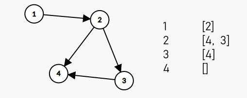
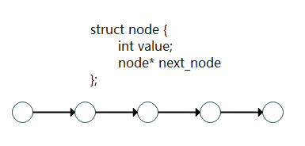
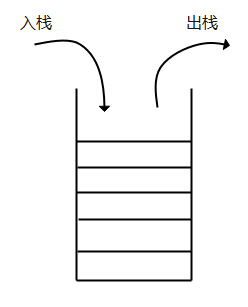
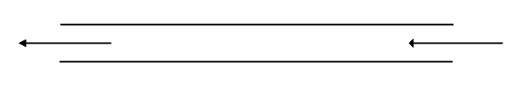

# 线性数据结构

## 概述及说明

​		对于算法竞赛选手来说， 这一章主要是熟知相关数据结构的概念， 并不需要自己去手写代码去实现（当然如果某些题目追求更好的性能就会重新手写）

**什么是数据结构 ？**

​		我们用通俗的大白话来说， 数据结构就是用来存储数据的一种方式， 对于不同的数据， 我们采用不同的数据结构来存储

​		举个例子,  如果我们想要存储一个班的成绩, 那我们可以使用一个数组来存储, 这个数组就可以看成一个数据结构, 相反如果我们想存储一张图, 我们就可以使用许多的数组组合来存储, 如下图 : 我们用四个数组就表示出来这张图的关联信息

> 关于图的表示, 之后的课程会有讲解, 这里进行简述
>
> 数组编号代表相应的节点编号, 如第一个数组代表第一个节点, 第二个数组代表第二个节点, 以此类推
>
> 每个数组的内容代表他的下一个节点有谁, 如 : `2 : [4, 3]`  代表由 `2` 可以通往 `4` 和 `3` 节点



**线性数据结构**

​		我们主要讲下面几种线性数据结构 :  `数组`	`链表`	`栈`	`队列`


## 数组

​	数组是用一段地址**连续**的存储单元依次存储的数据元素的一种数据结构, 数组中的每一个元素在内存的物理位置都是相邻的

​	一般情况下, 数组的长度都是固定的, 不能随意增加的, 这就需要我们提前知道需要多少的空间, 但这在实际使用情况一般都是不知道的, 所以一般的解决方式有两种 :

* 初始时分配最大的空间
* 使用动态数组 或者 SLT 库中的 `vector`

关于 `vector` 的使用我们附在文末

数组的时间复杂度如下所示 : 

* 查找[遍历查找] :  $O(n)$ , 如果是有序的话,使用二分查找的时间复杂度为 $O(\log n)$
* 插入 :  $O(n)$
* 删除 : $O(n)$
* 随机读取 : $O(1)$


### 编写数组友好型代码

```c++
const int N = 100000;
int arr[N][N];
// 友好型
for(int i = 0 ; i < N ; i ++) {
    for(int j = 0 ; j < N ; j ++) {
        arr[i][j] = 9;
    }
}
// 跳跃型
for(int i = 0 ; i < N ; i ++) {
    for(int j = 0 ; j < N ; j ++) {
        arr[j][i] = 7;
    }
}
```

编写友好型代码可以更好地命中缓存, 达到提升速度的效果


## 链表

​		链表是一种物理存储单元上非连续、非顺序的存储结构，数据元素的逻辑顺序是通过链表中的指针链接次序实现的。



我们在使用的时候一般使用 SLT 库的 `list`

关于 `list`  的使用我们附在文末

链表的时间复杂度如下所示

* 查找 : $O(n)$ 
* 插入操作 : $O(n)$
* 删除操作 : $O(n)$

虽然时间复杂度和数组形式上一样, 但实际上意义不同

​	作为一般规律，若需频繁查找却很少进行插入和删除操作，或其操作和数据元素在线性表中的位置密切相关时，宜采用顺序表[数组]作为存储结构。若需频繁进行插入和删除操作，则宜采用链表作为存储结构


## 栈

​		栈（stack）又名堆栈，它是一种运算受限的线性表。限定仅在表尾进行插入和删除操作的线性表。这一端被称为栈顶，相对地，把另一端称为栈底

​		向一个栈插入新元素又称作进栈、入栈或压栈，它是把新元素放到栈顶元素的上面，使之成为新的栈顶元素；从一个栈删除元素又称作出栈或退栈，它是把栈顶元素删除掉，使其相邻的元素成为新的栈顶元素

​		栈作为一种数据结构，是一种只能在一端进行插入和删除操作的特殊线性表。它按照后进先出(LIFO—last in first out)的原则存储数据，先进入的数据被压入栈底，最后的数据在栈顶，需要读数据的时候从栈顶开始弹出数据

​		用简单的大白话来说, 和我们堆放物品是一样的, 最先放置的物品放在最下面,  需要将上面的物品全部移走1才能拿到

​	  	在 SLT 库中, 我们使用 `stack` 来使用, 关于 `stack` 的使用我们附在文末



栈还有许许多多的神奇用法, 我们可以使出如单调栈等等奇奇怪怪的招式,这里的玄妙就由大家自己探索了

>  单调栈 : 
>
> 求左边第一个比该位置大的数
>
> 求右边第一个比该位置大的数
>
> $\dots$


## 队列

​		队列是一种特殊的线性表，特殊之处在于它只允许在表的前端（front）进行删除操作，而在表的后端（rear）进行插入操作，和栈一样，队列是一种操作受限制的线性表。进行插入操作的端称为队尾，进行删除操作的端称为队头。

​		队列的数据元素又称为队列元素。在队列中插入一个队列元素称为入队，从队列中删除一个队列元素称为出队。因为队列只允许在一端插入，在另一端删除，所以只有最早进入队列的元素才能最先从队列中删除，故队列又称为先进先出（FIFO—first in first out）线性表。

​		说大白话 , 队列实际上和我们日常生活中的排队十分相似, 先来的人先走, 后来的人需要排队等前面的人离开才可以离开



在 SLT 库中, 我们使用 `queue` 来使用, 关于 `queue` 的使用我们附在文末

`queue` 也有许许多多的变种, 我们也在后面附上了对应的 SLT 库以及用法

* 优先队列	`priority_queue`
* 双端队列    `deque`


## SLT 容器使用方法详解

### vector

使用vector必须包含头文件< vector >

```c++
#include<vector>
```

#### **建立一个vector**

```c++
#include<bits/stdc++.h>
#include<vector>
using namespace std;
struct Test{
  int first;
  int second;
};
int main()
{
    int arr[5] = {1,2,3,4,5};
	vector<int>vec1;  //vector<数据类型>变量名
    vector<struct Test>vec2;  //数据类型可以是结构体
    vector<int>vec3{1,2,3,4,5,6}; //创建vector的同时给其赋值
    vector<int>vec4(5 , 1); //vector<数据类型>变量名（vector大小  ， 初始值）
    vector<int>vec5(arr+1 , arr+4) ;//vector<数据类型>变量名（数组地址1，数组地址2） ，复制[数组地址1，数组地址2）
    vector<int>vec6 = vec5;
    vector<int>vec7(vec5);  //和上面的一样，直接复制
}
```

#### **vector传引用**

```c++
#include<bits/stdc++.h>
#include<vector>
using namespace std;
void Print_vector(vector<int>& arr){  //vector在传引用的时候参数类型是vector<数据类型>&
    for(auto temp : arr)
        cout << temp << " ";
}
int main()
{
    vector<int>vec1 = {1,2,3,4,5,6};
    auto& a_try = vec1; //当然也可以使用auto
    Print_vector(a_try);
}
```

#### **vector元素插入操作**

```c++
#include<bits/stdc++.h>
#include<vector>
using namespace std;
void Print_vector(auto& arr){
    for(auto temp : arr)
        cout << temp << " ";
    cout << endl;
}
int main()
{
    struct Test stc = {8,9};
    vector<int>vec1 = {1,2,3,4,5,6};
    vector<int>vec2 = {10,20,30,40,50};
    auto& a_try = vec1;
    vec1.push_back(9);  // 在vector后面插入元素   vector名.push_back(要插入的元素)；
    Print_vector(a_try);
    vec1.insert(vec1.begin() + 2 , 11);  // vector名.insert(迭代器坐标 ， 插入的元素)
    //迭代器相当于指针，vector名.begin()是获得首元素的迭代器 ， vector名.end()是获得末尾元素的迭代器
    Print_vector(a_try);
    vec1.insert(vec1.begin() + 2 , 5 , 0);  // 在vec1.begin() + 2 位置插入5个0
    Print_vector(a_try);
    vec1.insert(vec1.begin() + 2 , vec2.begin() + 1 , vec2.begin() + 4); 
    //在vec1.begin()位置插入vec2.begin()+1到vec2.begin() + 4的元素 [ vec2.begin() + 1 , vec.begin() + 4)
    Print_vector(a_try);
}
```

结果为

```c++
1 2 3 4 5 6 9
1 2 11 3 4 5 6 9
1 2 0 0 0 0 0 11 3 4 5 6 9
1 2 20 30 40 0 0 0 0 0 11 3 4 5 6 9
```


#### **vector元素删除操作**

```c++
#include<bits/stdc++.h>
#include<vector>
using namespace std;
void Print_vector(vector<int>& arr){
    for(auto temp : arr)
        cout << temp <<" ";
    cout << endl;
}
int main()
{
    vector<int>vec1 = {1,2,3,4,5,6,7};
    auto& poin = vec1;
    Print_vector(poin);
    vec1.pop_back();  // pop_backd代表删除vector最后一个元素
    Print_vector(poin);
    vec1.erase(vec1.begin()); //erase(指定要删除的迭代器)
    Print_vector(poin);
    vec1.erase(vec1.end() - 1); // 如果是用erase删除最后一个元素的话要用end()-1
    /*
    end()返回的是最后一个位置的迭代器，但是插入会在迭代器的后一个插入，删除也是在迭代器后一个删除，但是后一个实际上是没有元素		的，所以不可以
    */
    Print_vector(poin);
    vec1.erase(vec1.begin() + 2 , vec1.end() - 1); //删除迭代器1-迭代器2 ，[迭代器1 ， 迭代器2)
    Print_vector(poin);
    vec1.clear(); //直接清空vector
    Print_vector(poin);
}
```

结果为

```c++
1 2 3 4 5 6 7
1 2 3 4 5 6
2 3 4 5 6
2 3 4 5
2 3 5
2 3
```


#### **vector其他操作**

```c++
#include<bits/stdc++.h>
#include<vector>
using namespace std;
void Print_vector(vector<int>& arr){
    for(auto temp : arr)
        cout << temp <<" ";
    cout << endl;
}
int main()
{
    vector<int>vec = {1,2,3,4,5,6,7};
    vector<int>vec2 = {10,20,30,40,50,60};
    auto& poin = vec;
    auto& poin2 = vec2;
    cout << vec.empty() <<endl; //判断vector是否为空
    cout << vec.size() << endl; //当前vector的大小
    cout << vec.max_size() << endl; //vector所可以容纳的最大值
    cout << vec.capacity() <<endl;
    vec.erase(vec.begin());
    Print_vector(poin);
    cout << vec.capacity() << endl; //删除元素后，其实vector的容量没有发生变化
    int& a = vec.at(2); //下标从0开始
    cout << a << endl;  //获得相应位置的传引用
    int& last = vec.back(); //获得最后一个元素的传引用
    int& first = vec.front(); //获得第一个元素的传引用
    cout << first <<"  " << last << endl;
    vec.assign(4 , 0); //重置vector 并为其重新赋值，之前的的将会消失
    Print_vector(poin);
    vec.assign(vec2.begin() + 1 , vec2.end());
    Print_vector(poin);
    vec.assign(vec.begin() + 1 , vec.end() - 1);  //可以用这个方法留取一段连续的值
    Print_vector(poin);
    vec.swap(vec2); //交换两个vector的值
    Print_vector(poin);
    Print_vector(poin2);
    reverse(vec.begin() , vec.end() - 2); //将两个vec.begin() 到 vec.end() 的值翻转过来
    Print_vector(poin);
    sort(vec.begin() , vec.end()); //对vector进行排序，默认是从小到大
    Print_vector(poin);
    sort(vec.rbegin() , vec.rend()); //有两种方法可以实现从小到大，1.使用rbigin 和 rend
    Print_vector(poin);
    sort(vec.begin() , vec.end() ,[ ](int x , int y) {return x > y;}); //2.自己创建一个匿名函数
    Print_vector(poin);
}
```

结果为

```
0
7
4611686018427387903
7
2 3 4 5 6 7
7
4
2  7
0 0 0 0
20 30 40 50 60
30 40 50
10 20 30 40 50 60
30 40 50
40 30 20 10 50 60
10 20 30 40 50 60
60 50 40 30 20 10
60 50 40 30 20 10
```


### list

#### list基本操作

```c++
#include<bits/stdc++.h>
using namespace std;
void Print_list(auto list_){
    for(auto temp : list_)
        cout << temp << " ";
    cout <<endl;
}
int main()
{
    list<int>sample(3 , 4); //list的建立方式与vector相似
    Print_list(sample);
    sample.push_back(10); // 在list的末尾添加元素
    sample.push_front(7); // 在list的前面添加元素
    Print_list(sample);
    sample.pop_back(); //删除最后一个元素
    sample.pop_front(); //删除第一个元素
    Print_list(sample);
    sample.insert(++sample.begin(), 5); //在指定迭代器位置插入元素
    Print_list(sample);
    //sample.insert(sample.begin() + 2, 5); 注意list的迭代器只可以进行++ 或 -- 操作 ，+3等操作不支持
    auto sam = sample.begin();
    for(int temp = 0 ; temp < 2 ; temp++) sam++;
    sample.insert(sam , 8);
    Print_list(sample);
    sample.erase(--sam); //注意迭代器失效
    Print_list(sample);
    cout << sample.size() << endl; //输出list的大小
    cout << sample.empty() << endl; //判断list是否为空
    sample.sort(); //排序，注意只能使用list下的sort函数，一般的不支持
    Print_list(sample);
    sample.sort([](int a , int b){return a > b;}); //可以重写排序方法
    Print_list(sample);
    sample.reverse(); //将list翻转
    Print_list(sample);
    list<int>sample2(2,1);
    sample.swap(sample2); //交换两个list内容
    Print_list(sample);
    sample.clear(); //清空list
    return 0;
}
```

结果为

```c++
4 4 4
7 4 4 4 10
4 4 4
4 5 4 4
4 5 8 4 4
4 5 4 4
4
0
4 4 4 5
5 4 4 4
4 4 4 5
1 1
```


### stack

stack即为栈，符合FILO原则(first in last out)

#### stack基本操作

```c++
#include<bits/stdc++.h>
#include<stack>
using namespace std;
int main()
{
    stack<int> sample1;
    sample1.push(6); //将元素放入栈
    sample1.push(2);
    sample1.pop(); //将元素取出栈
    cout << sample1.top() << endl; //获得栈最顶部的值
    cout << sample1.size() << endl; // 获得栈的元素个数
    cout << (sample1.empty()) <<endl; // 判断栈是否为空
}
// stack没有迭代器，所以不可以用for-each遍历
```

结果为

```c++
6
1
0
```


### queue

queue即队列，符合FIFO原则 (first in first out)

#### queue基本操作

```c++
#include<bits/stdc++.h>
#include<queue>
using namespace std;
int main()
{
    queue<int>sample; //定义一个queue ，不能在初始化的时候赋值
    sample.push(3); //使用push在末尾放入一个元素
    cout << sample.empty() << endl; //判断queue是否为空
    sample.push(4);
    cout << sample.front() << endl; //查看队列第一个元素
    cout << sample.back() << endl;  //查看队列最后一个元素
    cout << sample.size() << endl;  //查看队列的大小
    sample.pop(); //将queue第一个元素删除
    //queue没有迭代器
    //队列本身就是一种先进先出的限制性数据结构，因此只能通过 front（）来访问队首元素，或是通过 back（）来访问队尾元素。
}
```

结果为

```c++
0
3
4
2
```


### deque

Vector容器是单向开口的连续内存空间，deque 则是一种双向开口的连续线性空间。所谓的双向开口，意思是可以在头尾两端分别做元素的插入和删除操作，当然，vector 容器也可以在头尾两端插入元素，但是在其头部操作效率奇差，无法被接受。

理解为队列与栈的结合体

#### deque的基本操作

```c++
#include<bits/stdc++.h>
using namespace std;
void Print_deque(auto deque_){
    for(auto temp : deque_)
        cout << temp << " ";
    cout << endl;
}
int main()
{
    deque<int>sample(5,1); //建立方式与其他STL一致
    Print_deque(sample);
    deque<int>sample2(sample.begin()+ 2 , sample.begin() + 4); //如果是迭代器则内容是其区间内的内容
    Print_deque(sample2);
    cout << sample.empty() << endl; //是否为空
    cout << sample.size() << endl;//大小
    sample.push_back(10); //在末尾插入元素
    sample.push_front(11); // 在最前面插入元素
    Print_deque(sample);
    cout << sample.front() << endl; //获取第一个元素
    cout << sample.back() <<endl; //获取最后一个元素
    cout << sample.at(5) << endl; //返回指定下标的元素
    sample.pop_back(); //删除最后一个元素
    sample.pop_front(); //删除第一个元素
    Print_deque(sample);
    sample.insert(sample.begin() + 2, 10); //在指定位置插入元素
    Print_deque(sample);
    sample.insert(sample.begin() + 3 ,  3 ,5); // 在指定位置插入相等的几个元素
    Print_deque(sample);
    sample.erase(sample.begin() + 3); //删除指定位置元素
    Print_deque(sample);
    sort(sample.begin() , sample.end()); //sort ， reverse ， swap 与其他一致
    Print_deque(sample);
    sample.clear();
}
```

结果为

```c++
1 1 1 1 1
1 1
0
5
11 1 1 1 1 1 10
11
10
1
1 1 1 1 1
1 1 10 1 1 1
1 1 10 5 5 5 1 1 1
1 1 10 5 5 1 1 1
1 1 1 1 1 5 5 10
```

