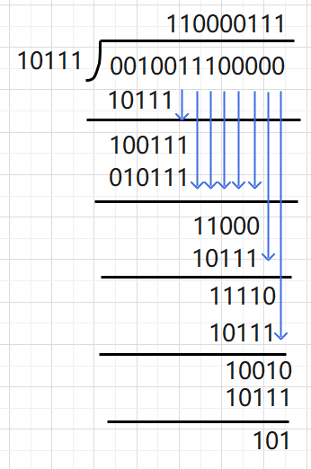
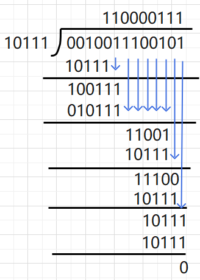

# 数据信息的表示(补)

## 求反码

假设我们需要求取 $x$ 的反码, 假设 $|x| = a$

* 当 $x \ge 0$ 的时候 :

  > 直接将 $x$ 用二进制表示即可

* 当 $x < 0$ 的时候 :

  > 将 $a$ 用二进制表示 : $[a]$, 接着对 $[a]$ 中每一位取反 $[a]^\prime$
  >
  > 之后在前面添上 $1$ 即可

## 快速求补码

### 反码法

这个方法非常适合使用硬件来求补码, 硬件电路可以非常轻而易举的实现

假设我们需要求数 $x$ 的补码, 我们假设 $|x| = a$

* 当 $x \ge 0$ 的时候 :

  > 直接将 $x$ 用二进制表示即可

* 当 $x < 0$ 的时候 :

  > 首先将 $x$ 用反码的方式表示出来 $[x]_{反}$ 
  >
  > 则补码 $[x]_{补} = [x]_{反} + 1$

我们直接举例子 : 假设我们想用补码表示 $-10$

$-10$ 的反码表示为 $\mathbf{1}\:0101$ , 之后我们做 $+1$ 处理, 那么结果为 $\mathbf{1}\:0110$

所以 $-10$ 的补码表示为 $10110$

### 扫描法

这个方法更适合我们人工手算

假设我们需要求数 $x$ 的补码, 我们假设 $|x| = a$

* 当 $x \ge 0$ 的时候 :

  > 直接将 $x$ 用二进制表示即可

* 当 $x < 0$ 的时候 :

  > 我们先将 $a$ 用二进制表示, 即表示为 $[a]$
  >
  > 之后我们**将 $[a]$ 右起第一个 $1$ 和这个 $1$ 后面的 $0$ 保持不变, 其他的所有位取反**, 得到 $[a]^\prime$
  >
  > 之后再 $[a]^\prime$ 前面加上 $1$ 即可得到补码值

我们直接举例子 : 假设我们想用补码表示 $-10$

$10$ 的补码为 $1010$ , 我们按照规则进行变换得到 $0110$ , 之后我们在前面添上 $1$ 得到 $\mathbf{1}\:0110$

所以 $-10$ 的补码表示为 $10110$

## 变形补码

变形补码又叫做模 $4$ 补码, 概念为 : **用两个二进制位来表示符号位，其余位与补码相同**

说的更通俗一点就是将最高位重复一遍即可

好处就是更好的判断溢出

如 $00$ 表示正且无溢出，$11$ 表示负且无溢出。如果右边那一位与左边那一位不一样，则表示有溢出

## 移码

所谓移码就是给当前的数加上一个偏移量, 将所有的数都表示为正数, 之后再将这个数用二进制表示即可

> IEEE 浮点表示法中的阶值就是用移码来表示的

使用移码可以直接比较大小

## 非数值数据的表示

我们主要关心汉字是怎么编码的

最早的汉字编码方式是 `GB2312` : [GB2312 编码表](https://www.toolhelper.cn/Encoding/GB2312)

关于 `GB2312` `的介绍 : [彻底搞明白 GB2312、GBK 和 GB18030 - 知乎 (zhihu.com)](https://zhuanlan.zhihu.com/p/453675608)

除此之外还有 `汉字输入码` 和 `汉字字形码`

[输入码（外码），国标码，区位码，机内码，字型码的概念与关系_内码,外码,输入码的区别-CSDN博客](https://blog.csdn.net/qpwyj/article/details/42102043)

## 数据信息的校验

[计算机怎么知道自己错了？_哔哩哔哩_  bilibili](https://www.bilibili.com/video/BV1Er421h7nd) [科普视频]

### **码距与校验**

[校验码——码距_校验码的码距-CSDN博客](https://blog.csdn.net/weixin_44330072/article/details/106860286)

### **奇偶校验**

假设现在通信双方约定好使用奇校验来进行差错检验，现在假设传输的数据为 $111001010110$ 

因为使用**奇校验**，所以 **传输的数据 + 校验码** 中所包含奇数个 $1$ ,

值得注意的是，校验码只有一位，可能是 $0$ 或者 $1$ ， 用来平衡后面数据 $1$ 的个数

所以上面我们提到的数据就变成了 $\textcolor{green}{0}111001010110$ , 如果原数据中 $1$ 的个数为偶数， 那么校验码就是 $1$

如果使用**偶校验**， 那么**传输的数据 + 校验码** 中所包含偶数个 $1$ 

具体的操作与奇校验类似

> 分析奇偶校验的效率

当只发生了一位错乱的时候 ，即 ： $\textcolor{green}{0}111001010110 \Longrightarrow \textcolor{green}{0}11100\textcolor{magenta}{0}010110$

这个时候奇偶校验可以成功的

当发生了不止一位错乱的时候，就可能出现以下情况 $\textcolor{green}{0}111001010110 \Longrightarrow \textcolor{green}{0}11\textcolor{magenta}{0}00\textcolor{magenta}{0}010110$

这个时候奇偶校验就会失效，也就会做出错误的判断

可以发现，奇偶校验的效率以及成功率并不高， 所以一般不采用这种方式

### **交叉奇偶校验**

### 海明校验

### CRC 循环冗余校验

循环冗余校验 CRC (**C**yclic **R**edundancy **C**heck)

大致的过程如下图所示：

* 收发双方约定好一个**生成多项式** $G(x)$
* 发送方基于 $G(x)$ 来计算出差错校验码（**冗余码**）， 并添加到传输数据后面一起传输
* 接收方通过 $G(x)$ 来判断是否出现误码

 PS： 所有的 $G(x)$ 的最后一项都必须是 $+1$

常见的生成多项式：
$$
\begin{cases}
	CRC-16 = x^{16} + x^{15} + x^2 + 1 \\\\
	CRC-CCITT = x^{16} + x^{12} + x^5 + 1\\\\
	CRC-32 = x^{32} + x^{26} + x^{23} + x^{22} + x^{16} + x^{12} + x^{11}+ x^{10}+ x^{8}+ x^{7}+ x^{5}+ x^{4} +x^{2}+x+1
\end{cases}
$$
为了方便演示，我们演示时使用的 $G(x) = x^4 + x^2 + x + 1$ 

我们将 $G(x)$ 的完整形式写出 ： $G(x) = 1\cdot x^4 + 0 \cdot x^3 + 1 \cdot x^2 + 1 \cdot x^1 + 1 \cdot x^0$

完整形式的系数所构成的 $01$ 串是我们计算的关键， 这里是 $10111$

计算的过程如下图所示：

* 构造被除数， 在要发送的信息后面添加上 $G(x)$ 最高次数个 $0$
* 完整形式的系数所构成的 $01$ 串作为除数
* 作 "除法" （实际上是异或运算）
* 检查余数， 余数的位数应该与 $G(x)$ 的最高次数相同，不足在前面补零

> 发送端生成冗余码

现在我们逐步演示计算的过程， 假设我们发送的信息为 $001001110$ , $G(x) = x^4 + x^2 + x + 1$

1. $G(x)$ 的最高次数为 $4$ ，所以在数字后面加上 $4$ 个 $0$ ，变成 $001001110\textcolor{red}{0000}$

2. 除数上面演示过，为 $10111$

3. 做 "除法" [每一位做异或操作]

   >  
   >
   > 值得注意的是：
   >
   > 运算过程实际是对每一位进行异或运算，如果当前位数不够， 就往后接着补
   >
   > 最后我们得到的结果就是 ：$101$

4. 补零得 $0101$

之后将这个冗余码添加到最后即可发送了， 即我们发送得数据为 ： $0010011100101$

> 接收端检验冗余码

实际上操作与发送端生成的过程是一样的， 不过这个时候如果最后的余数不为 $0$ ， 则说明发生错误

 

这样我们就实现了对信息正确性的判断，并且这个时候的成功率是非常高的

不过我们只能识别错误，但是不能够纠错，如果希望纠错，就需要使用冗余信息更多的冗余码

但是开销大，在计算机网络中一般不使用

