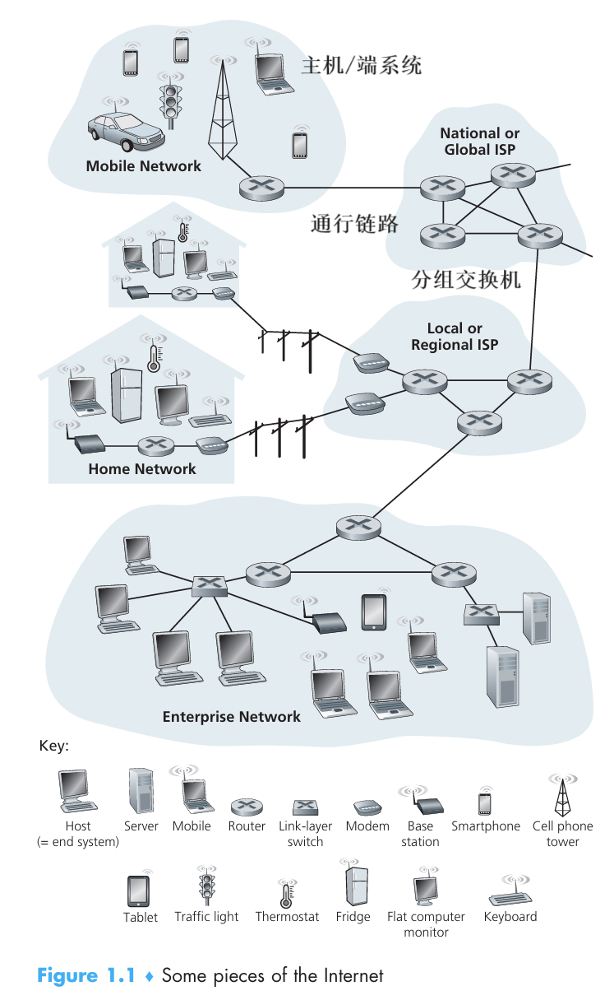
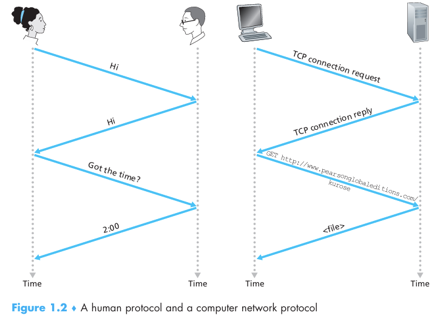
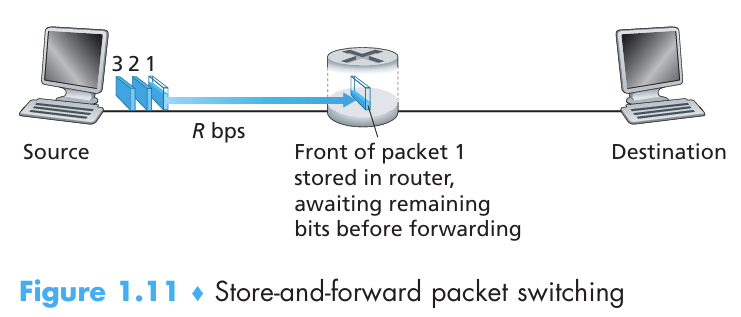

# chapter1.0-计算机网络和因特网概述

## 前言

​		这一章主要是对计算机网络和因特网进行简单的概述, 在这一章中会出现许许多多的专有名词, 第一次学习是十分难以理解的, 或者说会觉得有些不明所以, 这不重要, 主要是希望大家能够通过这章能够熟悉计算机网络中可能出现的名词, 让大家稍微能够理解个大概这一章的任务就算完成了, 事不宜迟, 我们开始吧

## 因特网介绍

​		因特网是一个世界范围的网络, 在我们的日常生活使用中, 我们通常会使用许多可以接入网络的设备, 比如说手机, 平板, 电脑等等, 这些设备叫做 **主机(host)** , 也可以被叫做 **端系统(end system)** .

​		端系统通过 **通信链路(communication link)** 和 **分组交换机(packet switch)** 与网络相连接, 当一台端系统向另一台端系统发送信息的时候, 发送端会将数据分段, 由此形成的信息包用术语来表述即为 **分组(packet)** , 现在的市面上有许许多多的分组交换机, 最常见的就是 **路由器(route)** 和 **链路层交换机(link-layer switch)** , 一个分组经历一系列同性恋路和分组交换机称为通过该网络的 **路径(route/path)**

​		端系统通过 **因特网服务提供商(Internet Service Provider  ISP)** 来接入因特网, 不同层级的 ISP 相互连接, 从而构成了庞大的网络系统. 端系统, 分组交换机, 和其他因特网部件都需要运行多个 **协议(protocol)** , **TCP/IP 协议** 是其中非常重要的协议, 我们也会在以后重点讲解

> **协议**

**对等层的实体在通讯连接的过程中遵守的规则的集合**，定义了在两个或多个通信实体之间交换的报文**格式**和**次序**，以及在报文传输和/ 或接收或其他事件方面所采取的的**动作**

可以类比成人类的交流方式

## 网络边缘

​		**网络边缘**指的是主机和应用程序，也可以解释为分布式应用和通讯基础设施的一部分

​		在最开始,我们介绍了端系统或者叫主机, 在通常情况下, 主机又可以被分为两类 : **客户(client)** 和 **服务器(server)** , 他们运行着程序, 作为网络连接的终端, 可以被笼统的称为在网络边缘

​		接下来我们需要将这些运行在网络边缘的程序和端系统 **接入网** , 为了实现这个目标, 我们需要将其接入 **边缘路由器(edge router)** , 也就是连接端设备的第一个分组交换机

我们有许许多多接入网络的方法, 如 : `WIFI` , `以太网` , `DSL`,  `光纤` 等等

同时也有许许多多的物理介质, 如 : `双绞铜线` , `同轴电缆` , `光纤` 等等

## 网络核心

在某种网络应用中, 端系统彼此交换 **报文(message)** , 这些报文会被划分为较小的数据块, 称为 **分组(packet)** , 这些分组会在分组交换机中不断传输, 在此期间会遇到的情况如下

> #### 存储转发传输(store-and-forward transmission)

每一个交换机中都有一个缓存, 当某一个分组的第一个 bit 传输到分组交换机的时候, 分组交换机不会立即将内容发送出去, 而是存储在缓存中, 知道分组的所有内容都传输到了分组交换机后才会发送出去

> #### 排队时延和丢包

​		分组交换机的缓存被维护成了一个队列的形式, 所有的接收的分组(未接收完全的分组) 都会在这个队列中排队, 大部分的分组交换机都是采用 `FIFO` 的模式的, 所以就会有些分组就需要承担 **排队时延(queuing delay)** 

​		这个队列不是无限的, 当这个队列满了的时候, 就不会再接收分组了, 就会出现 **丢包(packet loss)** 的现象

> #### 转发表和路由选择协议

