# chapter2.0-应用层

## 应用层原理

### 网络应用程序体系架构

#### 客户-服务器模式（Client-Server architecture）

该体系结构主要分为两个端——服务端（server）和客户端（client）

**服务端**

一直运行

有固定的IP地址以及端口号

当接收到客户端的请求时，它向该客户端发送所请求的对象作为响应

**客户端（eg：HTTP，FTP，SMTP）**

主动与服务端通信，向服务端发送请求

跟其他的客户端没有通信

可能是动态IP

缺点:

可拓展性差, 当访问的人数增加到一定数量的时候, 服务效率会断崖式下降

#### **P2P体系结构**

（几乎）没有一直运行的服务器

任何端系统之间可以进行通信（不同于客户服务器模式的客户端间不能通信）

任一节点既可以是客户端也可以是服务端

例子：迅雷，百度网盘等...

不足之处：安全，性能保证，稳定性不足。


#### 混合体系结构（客户-服务器体系结构和对等体系结构）

进行文件搜索时，是集中的：主机在中心服务器上注册其资源；主机向中心服务器查询资源位置。

进行文件传输时，是 P2P 的：在任意对等体（peer）之间进行传输，无需经过中心服务器。

在线检测时，是集中的：当用户上线时，向中心服务器注册其 IP 地址；用户与中心服务器联系，以找到其在线好友的位置。

两个用户之间聊天时，是 P2P 的：在任意对等体（peer）之间进行传输，无需经过中心服务器。


### 进程通信

用操作系统的话语来说, 进行通信的实际上是 **进程** , 而不是程序

如果是在同一个终端上, 那么可以用操作系统提供的方式来通信, 如 `pipe` , 共享缓冲区等等

如果是在不同的终端上, 那么通过 **交换报文** 来通信


### 客户和服务器进程

在一对进程之间的通信会话场景中，发起通信（即在该会话开始时发起与其他进程的联系）的进程是客户端进程，在会话开始时等待联系的进行是服务器进程。

虽然在 P2P 架构应用中，一个进程既能是客户端又能是服务端，但是在给定的一对进程之间的通信会话场景中，一个进程仍是客户端，另一个进程是服务端。


### 分布式进程需要解决的问题

1. 进程标识和寻址问题（和谁通信)

   > 标识接收进程，需要定义两种信息：主机的地址（这由 IP 地址来标识）；在目的主机中指定接收进程的标识符（这由端口号来标识，TCP 端口号和 UDP 端口号是不同的），即使用 ip + port 的组合来标识一个端节点。
   >
   > 知名端口查询 : [click here](https://www.iana.org/assignments/service-names-port-numbers/service-names-port-numbers.xhtml)

2. 传输层如何向应用层提供服务的问题

   > 应用层需要将信息通过层间接口交给传输层，传输层需要将信息通过层间接口交给应用层，这些信息包括：
   >
   > 要传输的报文（即 SDU）（发什么）
   >
   > 发送方进程的标识：IP + TCP/UDP port（谁发的）
   >
   > 接收方进程的标识：IP + TCP/UDP port（发给谁）

3. 如何使用传输层提供的服务，实现应用进程之间的报文交换，继而实现应用？

   > 定义应用层协议：定义运行在不同的端系统上的应用程序进程如何相互传递报文。包括交换的报文类型（例如请求报文和响应报文），各种报文类型的语法（例如报文中的各个字段及其描述），字段的语义（即字段的信息的含义），确定一个进程何时以及如何发送报文，接收到报文如何响应的规则。
   >
   > 由 RFC 文档定义的应用层协议位于公共域中，由一些公司定义的应用层协议不公开，是专用的，不位于公共域中。
   >
   > 应用层协议只是网络应用的一部分，而且是相当重要的一部分

补充 : 

传输层实体会把来自应用层或者网络层的 SDU 进行 TCP 报文段（或 UDP 数据段）的封装。

为了减少穿过层间接口的信息量和便于管理，使用一个代号表示通信的双方或单方，这个代号就是 socket，它是一个整数，这是一个本地标识。(可以类比成操作系统的文件描述符, 只要对这个操作符进行操作, 就可以完成对指定应用[文件]的通信 )

**对于使用 TCP 的应用而言，socket 是四元组（源IP，源端口，目标IP，目标端口）**的一个具有本地意义的标识：在会话关系建立时，源主机和目标主机就在本地维护一个 socket（就是一个整数）和四元组的映射关系；之后，穿过层间接口的信息将是要传输的报文（发什么）和会话关系的标识 socket。

**对于使用 UDP 的应用而言，socket 是二元组（源IP，源端口）**的一个具有本地意义的标识：穿过层间接口的信息将是要传输的报文（发什么），标识本地 IP 和本地 port 的 socket，对方进程的标识：IP + port（发给谁）。

进程通过一个称为套接字（socket）的软件接口向网络发送报文和从网络接收报文。由于这个套接字是建立网络应用程序的可编程接口，因此也把它称为应用程序和网络之间的应用程序编程接口（Application Programming Interface，API）。
[网络编程 socket详解 TCP socket和UDP socket-CSDN博客](https://blog.csdn.net/weixin_45902285/article/details/122814167)


### 可供应用程序使用的运输服务

从四个方面对应用程序服务要求进行分类：**可靠数据传输（reliable data transfer）、吞吐量、定时和安全性**

* 可靠数据传输(数据丢失率)

  > 有些应用则要求100%的可 靠数据传输（如文件）
  >
  > 有些应用（如音频）能容忍 一定比例以下的数据丢失

* 吞吐

  > 一些应用（如多媒体）必须 需要最小限度的吞吐，从而使得应用能够有效运转
  >
  > 一些应用能充分利用可供使 用的吞吐(弹性应用)

* 定时(延迟)

  > 一些应用出于有效性考虑，对数据传输有严格的时间限制 
  >
  > Internet 电话、交互式游戏 

* 安全性

  > 机密性，完整性，可认证性


### Internet 提供的运输层协议：TCP和UDP

* **TCP 服务**

1. 可靠的传输服务：

   > 通信进程依赖 TCP，能够把所有发送的数据无差错、按适当顺序进行交付。当应用程序的一段将字节流传进套接字时，它能够依靠 TCP 将相同的字节流交付给接收方的套接字，而没有字节的丢失和冗余。

2. 流量控制：

   > 发送方不会淹没接收方。

3. 拥塞控制：

   > 当发送方和接收方之间的网络出现拥塞时，TCP 的拥塞控制会抑制发送进程。

4. 不能提供的服务：

   > 时间保证、最小吞吐保证和安全。

TCP连接是面向连接的服务：在应用层数据报文开始流动之前，TCP 让客户和服务器相互交换传输层控制信息，这就是握手过程，让客户和服务器为即将到来的大量分组做准备。在握手阶段之后，一个 TCP 连接就在两个进程的套接字之间建立了。这条连接是全双工的，即连接双方的进程可以在此连接上同时进行报文收发。当应用程序结束报文发送时，必须拆除此连接


* **UDP 服务**

1. 不可靠的传输服务

2. 不提供的服务：

   > 流量控制，拥塞控制、时间、带宽保证、建立连接。


**UDP 存在的必要性**

与 TCP 相比，UDP 提供的服务少，但我们不能认为 TCP 比 UDP 好。实际上，UDP 是一种不提供不必要服务的轻量级传输协议，它仅提供最小服务。

**UDP 的优势**

1. 能够区分不同的进程，而 IP 服务不能；
2. 无需建立连接，即在两个进程通信前没有握手过程，这可以省去建立连接的时间，适合事务性的应用；
3. 不做可靠性的工作（可靠性是要付出时间代价的），如检错重发，适合那些对实时性要求比较高而对正确性要求不高的应用；
4. 没有拥塞控制和流量控制，应用能够按照设定的速率发送数据。
   

#### TCP 安全

无论是 TCP 还是 UDP 都没有提供任何加密机制，数据以明文在互联网中传输，这是不安全的

因特网界研发出 TCP 的加强版本，即安全套接字层（Secure Socket Layer，SSL）来解决 TCP 的安全性问题。用 SSL 加强后的 TCP 不仅能够做传统的 TCP 所做的一切，而且提供了关键的进程到进程的安全性服务，包括加密、数据完整性和端点鉴别。

SSL 虽然是对 TCP 的加强，但是这种强化是在应用层实现的，具体来说，应用程序需要包括 SSL 代码。

SSL 有它自己的套接字 API，当一个应用使用 SSL 时，发送进程向 SSL 套接字传递明文数据；在发送主机中的 SSL 则加密该数据并将加密的数据传递给 TCP 套接字。加密的数据经因特网传送到接收进程中的 TCP 套接字。该接收套接字将加密数据传递给 SSL，由其进行解密。最后，SSL 通过它的 SSL 套接字将明文数据传递给接收进程。


## Web 和 Http

Web 页面（Web page）是由对象组成的。一个对象（object）只是一个文件，可以通过一个 URL 地址寻址。这个对象可以是文件, 图片, 音频等等

### HTTP 协议

Web 的应用层协议是**超文本传输协议（HyperText Transfer Protocol，HTTP）**，它是 Web 的核心，HTTP/1.0 在 RFC 1945 进行了定义和 HTTP/1.1在 RFC 2616 中进行了定义。

HTTP 由两个程序实现：一个客户程序和一个服务器程序。Web 浏览器实现了 HTTP 的客户端，用于请求、接收和显示 Web 对象，Web 服务器实现了 HTTP 的服务器端，用于存储 Web 对象，对客户端请求进行响应，发送 Web 对象。

**HTTP 的默认端口是 80**，HTTP 服务器会有一个 Socket 守候在 80 端口（这是一个守候（waiting） socket），等待来自客户端的 TCP 连接。

HTTP 使用 TCP 作为它的支撑传输协议。HTTP 客户首先发起一个与服务器的 TCP 连接。一旦连接建立，该浏览器和服务器就可以通过各自的套接字接口访问 TCP。

HTTP 是一个无状态协议（stateless protocol）：HTTP 服务器并不保存关于客户的任何信息。

维护状态的协议是复杂的：必须维护历史信息（状态）（这是需要消耗空间的）；如果服务器或客户端死机，它们的状态可能不一致，二者的状态必须是一致的；无状态的服务器能够支持更多的客户端。


### HTTP 连接

**往返时间（Round-Trip Time，RTT）**是指一个短分组从客户端到服务端然后再返回客户端所花费的时间。

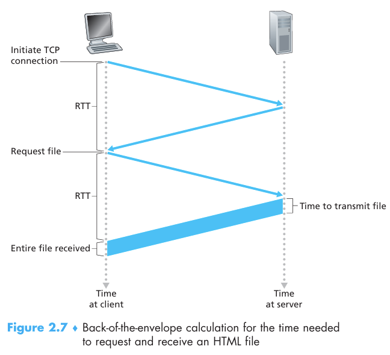

**非持久连接（non-persistent connection）**

1. 每个 TCP 连接在服务器发送一个对象后关闭，每个 TCP 连接只传输一个请求报文和响应报文。
2. 必须为每一个请求对象建立和维护一个全新的 TCP 连接，每次都需要花费建立 TCP 连接的 1 个 RTT。
3. 操作系统必须为每个 TCP 连接分配资源。
4. HTTP/1.0 使用非持久连接。

**持久连接（persistent connection）**

1. 服务器在发送响应后保持 TCP 连接打开，如果这条 TCP 连接在一定时间间隔后没有被使用，HTTP 服务器再关闭该连接。
2. 在相同的客户和服务端之间的多个对象请求可以在一个 TCP 连接上传输。
3. 分为流水方式的持久 HTTP 和非流水方式的持久 HTTP。
4. HTTP/1.1 默认使用持久连接，可以使用 “Connection:” 首部行来设置是否使用持久连接：“Connection: close” 表示不使用持久连接，`“Connection: keep-alive” `表示使用持久连接。

> 通俗一点解释非持久连接和持久连接
>
> 假设我们有一个HTML页面中包含了十个img的url
>
> 如果使用非持久连接, 那么就会产生十次的连接, 即每请求一次都要建立一次连接
>
> 如果使用持久化连接, 那么就只会有一次连接, 连接完后, 知道请求全部结束才会关闭


### HTTP 报文

#### HTTP 请求报文

```http
GET /somedir/page.html HTTP/1.1
Host: www someschool.edu
Connection: close
User-agent: Mozilla/50
Accept-language: fr
```

报文使用普通的 ASCII 文本来书写的，方便查看。

第一行叫作请求行（request line），请求行有 3 个字段：方法字段、URL 字段和 HTTP 版本字段。在这里，方法字段的值是 GET，URL 字段的值是 /somedir/page.html，HTTP 版本字段的值是 HTTP/1.1。请求行后面的几行都是首部行（header line）。

方法字段可以取不同的值，包括 HTTP/1.0 的 GET，POST，HEAD，HTTP/1.1 的 PUT 和 DELETE。

请求报文的通用格式为 : 

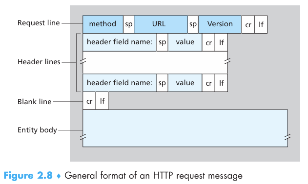

注意, 结尾并不是简单的 `\n` , 而是 `\r\n`

GET 方法不要有实体体，POST 方法要有实体体


#### HTTP 相应报文

```http
HTTP/1.1 200 OK
Connection: close
Date: Tue, 18 Aug 2015 15:44:04 GMT
Server: Apache/2.2.3 (CentOS)
Last-Modified: Tuer 18 Aug 2015 15:11:03 GMT
Content-Length: 6821
Content-Type: text/html

(data data data data data ...)
```

第一行叫作状态行（status line），包括 3 个字段：协议版本字段、状态码和相应状态信息。

状态行之后是 6 个首部行。首部行后面是实体体（entity body）。

“Content-Length: 6821”：采用 TCP 的应用层协议需要自己维护报文和报文的界限，TCP 向上层提供的服务不会区分报文的边界（例如，在发送方发送两个 15k 的报文，在接收方 TCP 可能向上层传输一个 30k 的报文）。应用程序使用 “Content-Length” 来区分报文的边界。

> 为什么要指定 `Content-Length`
>
> 如果使用持久化连接, 如果没有指定, 字符就会被截断(Content-Length <　RightLength) , 截断后剩余的字符串就会影响之后的解析
>
> [用了这么久HTTP, 你是否了解Content-Length和Transfer-Encoding ? - 掘金 (juejin.cn)](https://juejin.cn/post/6844903937825488909)

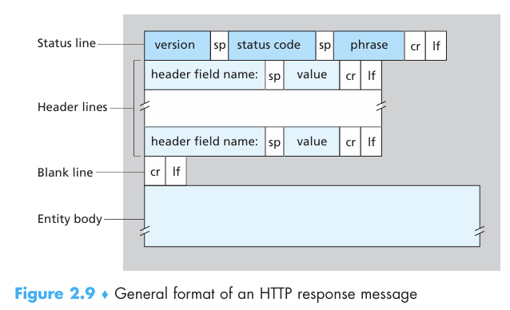

### HTTP其他


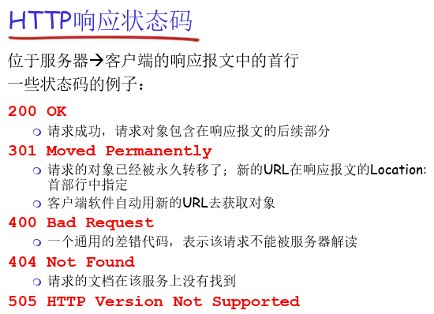

### cookie

一个 Web 站点希望能够识别用户，或者希望把内容与用户身份联系起来，所以，HTTP 使用了 cookie。cookie 在 RFC6265 中定义，它允许站点对用户进行追踪。

cookie 技术有 4 个组件：

在 HTTP 响应报文中的一个 cookie 首部行，如 Set-Cookie: 2022；

在 HTTP 请求报文中的一个 cookie 首部行，如 cookie: 2022；

在用户端系统中保留有一个 cookie 文件，并由用户的浏览器进行管理；

在 Web 站点有一个后端数据库，存放 cookie 对应的表项。

cookie 会侵害用户隐私。


### Web 缓存

Web 缓存器（Web cache）也叫代理服务器（Proxy server），是能够代替原始 Web 服务器来满足 HTTP 请求的实体。Web 缓存器有自己的硬盘存储空间，并在存储空间中保存最近请求过的对象的副本

配置用户的浏览器，使得用户所有的 HTTP 请求首先指向 Web 缓存器。这样，当浏览器请求对象时

1. 浏览器先创建一个到 Web 缓存器的 TCP 连接，并向 Web 缓存器中的对象发送一个 HTTP 请求；
2. Web 缓存器进行检查，看看本地是否存放了该对象副本。如果有，Web 缓存器就用 HTTP 响应报文向客户浏览器返回该对象；
3. 如果 Web 缓存器中没有该对象，它就打开一个与该对象的初始服务器的 TCP 连接。Web 缓存器则在这个缓存器到服务器的 TCP 连接上发送一个对该对象的 HTTP 请求。在收到请求后，初始服务器向 Web 缓存器发送具有该对象的 HTTP 响应报文。
4. 当 Web 缓存器收到该对象时，它在本地存储空间中存储一份副本，并用 HTTP 响应报文向客户的浏览器发送该副本（通过现有的客户浏览器和 Web 缓存器之间的 TCP 连接）

好处：大大减少对客户请求的响应时间，减少了通信量，也就降低了费用。

> 如何确定缓存是否过期
>
> HTTP 协议提供了一种条件 GET （conditional GET）方法的机制来保证缓存器中的对象副本是最先的。
>
> 一个条件 GET 请求报文要求：
>
> ① 请求报文使用 GET 方法；
>
> ② 请求报文中包含一个 “If-Modified-Since:” 首部行。
>
> Web 缓存向初始服务器请求对象时，会收到包含 “Last-Modified: Wed, 9 Sep 2015 09:23:24” 首部行的响应报文，Web 缓存在存储对象时也会存储对象的最后修改日期；在下次 Web 浏览器再次向 Web 缓存请求相同的对象时，Web 缓存里有这个对象，但是 Web 缓存不知道这个对象是否是最新的，所以 Web 缓存就发送一个条件 GET 请求报文（“If-Modified-Since:” 的值为 Wed, 9 Sep 2015 09:23:24）给初始服务器。初始服务器仅当自指定日期之后该对象被修改过，才会发送新的对象；否则，初始服务器会向 Web 缓存发送一个响应报文：
> ```http
> HTTP/1.1 304 Not Modified
> Date: Satf 10 Oct 2015 15:39:29
> Server: Apache/1 3 0 (Unix)
> (empty entity body)
> ```


## FTP

FTP，File Transfer Protocol，文件传输协议，[RFC959](https://www.rfc-editor.org/rfc/rfc959.html)

客户端向远程主机上传文件或从远程主机下载文件（上传或下载都是相对于客户端而言的），这样可以多个用户通过网络共享文件；FTP 服务器守候在 21 号端口上。

采用客户/服务器模式：客户端是发起传输的一方；服务器是远程主机。

1. FTP 客户端首先与 FTP 服务器建立 TCP 控制连接（TCP control connection）；

2. 用户输入用户名和口令（命令：USER，PASS），通过控制连接完成用户身份认证（FTP 是明文传输的）；

3. 完成身份认证后，客户端通过控制连接发送命令浏览远程目录（命令：LIST）；

4. FTP 服务器收到一个文件传输命令（RETR，STOR）时，服务器会打开一个到客户端的数据连接（**即服务器主动与客户端的 20 号端口建立 TCP 数据连接（TCP data connection）**），通过数据连接，服务器把文件传输给客户端；

5. 一个文件传输完毕后，FTP 服务器关闭 TCP 连接。

6. 当再次另一个文件传输命令时，服务器会打开第二个到客户端的数据连接。

控制连接：带外（out of bound）传送（带外是不传输数据的意思，带内是传输数据的意思）。

**FTP 服务器维护用户的状态信息**：当前路径、用户账户与控制连接对应，所以 FTP 是有状态的协议。

> 控制连接用于在两个主机之间传输控制信息，如口令，用户标识，存放、获取文件等命令。数据连接用于实际发送一个文件,发送完文件之后数据连接会关闭。因为FTP协议使用一个独立的控制连接，所以，也称FTP的控制信息是带外（out-of-band）传送的
>
> [计算机网络基础知识——【FTP协议】概述篇 - 知乎 (zhihu.com)](https://zhuanlan.zhihu.com/p/337513218)


## Email

电子邮件系统 3 个主要组成部分

电子邮件是一种异步通信媒介，即当人们方便时就可以收发邮件，不必与他人的计划进行协调。

电子邮件系统的 3 个主要组成部分：**用户代理（user agent）、邮件服务器（mail server）和简单邮件传输协议（Simple Mail Transfer Protocol，SMTP）**。
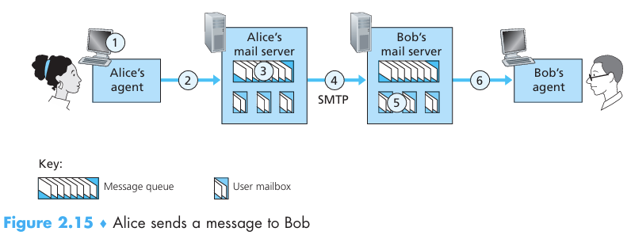

* **用户代理**

又名"邮件阅读器"，允许用户阅读、回复、转发、保存和撰写报文，如腾讯的 Foxmail，网易的网易邮件大师，还有微软的 Outlook，谷歌的 Gmail。邮件代理可以向它的邮件服务器发送邮件，这时邮件就放在邮件服务器的外出报文队列中；邮件代理可以从其邮件服务器的邮箱中获取报文，也就是获取邮件

* **邮件服务器**

邮件服务器形成了电子邮件体系结构的核心。

对于发送方而言，李四的邮件服务器在一个报文队列（message queue）中保持待发送的报文并在以后尝试再次发送。

对于接收方而言，每个接收方（如张三）在某个邮件服务器上有一个邮箱（mailbox）。张三的邮箱管理和维护着发送给他的报文。

邮件服务器之间使用 SMTP 协议来传输报文。SMTP 使用 TCP 可靠数据传输服务。SMTP 也有两个部分：运行在发送方邮件服务器的客户端和运行在接收方邮件服务器的服务器端。每台邮件服务器上既运行 SMTP 的客户端也运行 SMTP 的服务器端。

* **SMTP**

使用 TCP 在客户端和服务器之间传送报文，端口号为25。

它限制所有邮件报文的体部分（不只是其首部）只能采用简单的 7 比特 ASCII 表示。

> 如果邮件内包含不是由 ASCII 码值得数据, 可以使用 bate64 位编码进行编码, 之后再解码

SMTP 一般不使用中间邮件服务器发送邮件，邮件并不在中间的某个邮件服务器存留。

SMTP 使用持久连接，即在相同的 TCP 连接上可以发多个报文，直到没有报文发送再关闭 TCP 连接。

每个报文以 CRLF. CRLF 结束，其中的 CR 和 LF 分别表示回车和换行

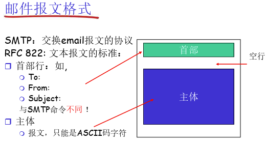


## DNS

主机名和 IP 地址的区别

- 使用主机名（hostname）标识

  人类乐于接受以主机名的方式来标识因特网上的主机，有一定的意义，便于记忆。

  主机名几乎没有提供关于主机在因特网中的信息。

  主机名可能由不定长的字母数字组成，路由器难以处理。

* 使用 IP 地址（IP address）标识

  IP 地址由 4 个字节组成，有着严格的层次结构。每个字节都被句点分隔开来，每个字节使用 $0 \sim 255$ 的十进制数字来表示。

  IP 地址具有层次结构，当我们从左向右扫描它时，可以得到越来越多具体的关于主机在互联网中位置的信息。

  

路由器钟爱于定长的、有着层次结构的 IP 地址。

> 主机别名和规范主机名
>
> 主机别名是一般给普通群众记忆的, 如 `www.baidu.com` 这种
>
> 但是规范主机名包含了更加详细的信息, 每一台都有一个唯一的规范主机名, 方便DNS服务器进行解析服务
>
> 同时一个 主机别名可以被解析成不同的规范主机名, 实现负载均衡的效果


### DNS 系统需要解决的问题

问题1（命名）：如何命名设备 -> 使用层次化命名。

问题2（解析）：如何完成主机名到 IP 地址的转换 -> 使用分布式的数据库来维护和响应名字查询。

问题3（维护）：如何维护域名系统（增加或删除一个域名）


### DNS 的总体思路

分层的、基于域的命名机制；

由分层的 DNS 服务器实现的若干分布式的数据库完成主机名到 IP 地址的转换；

DNS 协议是应用层协议，运行在 UDP 之上（不需要握手过程，是事务性操作）端口号为 53；

核心的 Internet 功能，但以应用层协议实现（互联网体系结构的复杂性大多数位于网络的“边缘”）


### DNS 的作用

它的主要目的是能进行主机名到 IP 地址**转换**的目录服务。注意：只是实现主机名到 IP 地址的单向转换，而不包括 IP 地址到主机名的转换。

其他目的：

1. 主机别名（host aliasing）到规范主机名（canonical hostname）的转换；
2. 邮件服务器别名（mail server aliasing）到规范主机名的转换；
3. 负载均衡（load balance）：在多个服务器之间进行负载分配


### DNS 如何命名设备

采用层次树状结构的命名方法。Internet 根被划分为几百个顶级域（top level domains）。

顶级域分为通用顶级域（如.com，.edu；.gov；.org  .firm）和国家顶级域（如 .cn，.us 等）。

每个（子）域下面可划分多个子域（subdomains）。到树叶就是主机了。

使用"."间隔表示不同的级别。

域的域名：从树枝向上到树根，表示一个域；主机的域名：从树叶向上到树根，表示一台主机。

域的管理：一个域管理其下的子域；创建一个新的域，必须征得它所属域的同意。

域与物理网络无关：域遵从组织界限，而不是物理网络（同一个域的主机可以不在一个网络，同一个网络的主机未必都在一个域里面），域的划分是逻辑的，而不是物理的。

名字空间会被分若干的区域 : 

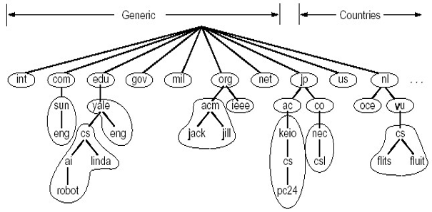

[什么是 DNS 区域？ | Cloudflare (cloudflare-cn.com)](https://www.cloudflare-cn.com/learning/dns/glossary/dns-zone/)


### DNS 工作过程概述

当运行在用户主机上的某些应用程序需要将主机名转为 IP 地址时，这些应用程序将调用 DNS 客户端，把需要被转换的主机名交给 DNS 客户端；DNS 客户端收到主机名后，会向网络中发送一个 DNS 查询报文；经过若干毫秒或若干秒的时延后，用户主机上的 DNS 客户端接收到一个提供了主机名到 IP 地址映射的 DNS 回答报文；这个映射结果会被传递给调用 DNS 的应用程序，这样应用程序就拿到了主机名对应的 IP 地址了。


### DNS 采用分布式、层次数据库

采用一个名字服务器来解析，存在的问题：单点故障（可靠性问题）；通信容量（扩展性问题）；远距离的集中式数据库（时延问题）；庞大的数据库（维护问题）。

将所有主机名的映射分布在所有的 DNS 服务器上。DNS 服务器有 3 种类型：**根 DNS 服务器、顶级域（Top Level Domain，TLD）DNS 服务器和权威 DNS 服务器**。这些 DNS 服务器以层次结构组织起来。

* 根 DNS 服务器：有400多个根名字服务器遍及全世界。这些根名字服务器由13 个不同的组织管理。根名字 DNS 服务器列表见https://www.iana.org/domains/root/servers。根名字服务器提供 TLD 服务器的 IP 地址。
* 顶级域 DNS 服务器(TLD 服务器)：对于每个顶级域（如 com，org，net，edu 和 gov）和所有国家的顶级域（如 uk，cn，us）都有 TLD 服务器。TLD 服务器提供了权威 DNS 服务器的 IP 地址。
* 权威 DNS 服务器：在互联网上具有公共可访问主机的每个组织机构必须提供公共可访问的 DNS 记录，这些记录将这些主机名映射为 IP 地址。一个组织机构的权威 DNS 服务器收藏了这些 DNS 记录。

本地 DNS 服务器（local DNS server）是另一类重要的 DNS 服务器，但它不属于 DNS 服务器的层次结构。每个 ISP 都有一个本地 DNS 服务器（也叫默认名字服务器，Local 是说这个 DNS 服务器里发起 DNS 请求的主机近）。当主机发起 DNS 请求时，该请求被发往 DNS 服务器，它起着代理的作用，并将该请求转发到 DNS 服务器层次结构中。

> 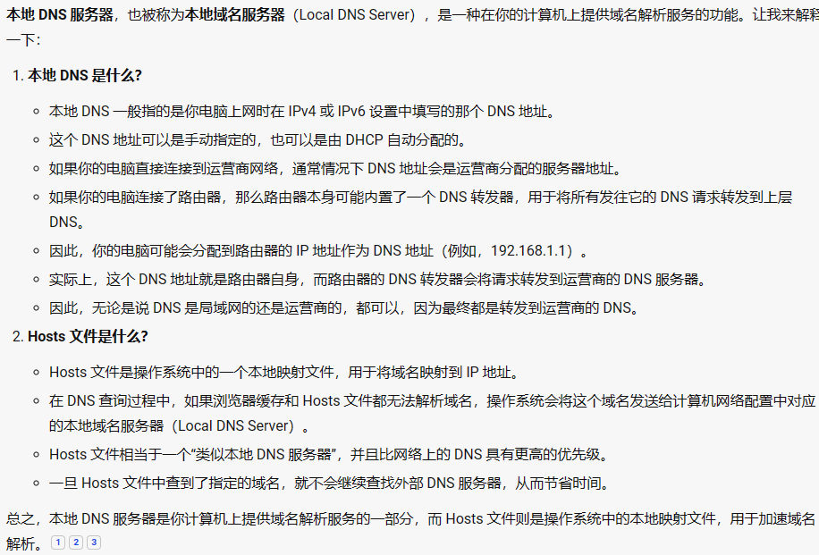


### **查询方式**

递归查询（recursive query）和迭代查询（iterative query）。递归类似于接力，迭代则是一个本地 DNS 服务器轮询根服务器，多个 TLD 服务器，权威服务器得到 IP 地址。

[DNS迭代查询和递归查询 - 知乎 (zhihu.com)](https://zhuanlan.zhihu.com/p/61394192)


### **DNS 缓存**

缓存的目的是为了改善时延性能并减少在互联网上到处传输的 DNS 报文数量。缓存信息是存在本地 DNS 服务器里面的。DNS 服务器在一段时间后(通常设置为两天)将丢弃缓存的信息（这是因为主机名到 IP 地址的映射不是永久的）。缓存保证性能，删除保证一致性。

> 缓存多久要看 DNS 报文中的 TTL 字段


### **DNS 记录和报文**

资源记录（Resource Record，RR），提供了主机名到 IP 地址的映射。资源记录是一个包含了下列字段的4元组: (Name， Value，Type，TTL)。

**Type 的含义**

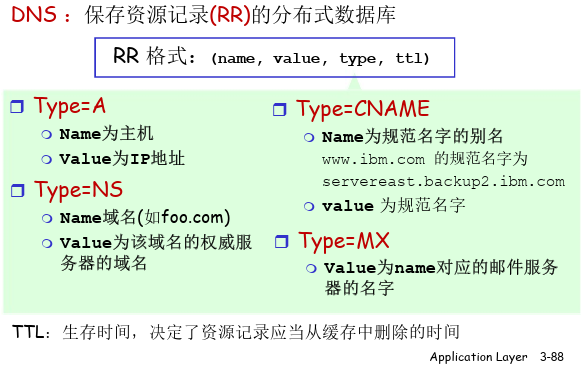

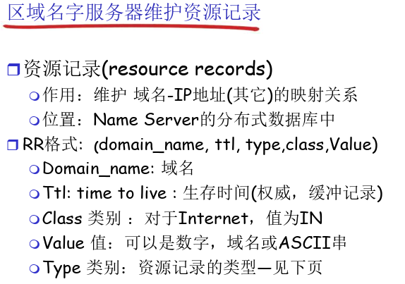

**查询和响应报文的报文格式相同**

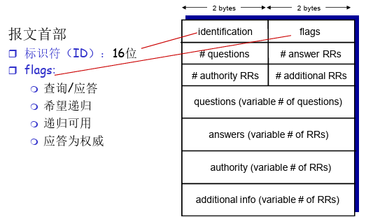

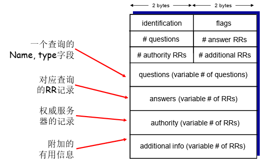

> 因为有 ID 的存在, 所以允许 DNS 服务器以流水线的形式并发的处理大量的请求

### 新增 RR

当新增一个域时，需要在上级域的名字服务器中增加两条记录，指向这个新增的子域的域名和域名服务器的地址；需要在新增子域的名字服务器上增加名字到 IP 地址的记录。


## P2P 应用

[【计网 P2P】计算机网络 P2P（Peer to Peer）详解：中科大郑烇老师笔记 （七）_peer to peer 写盘-CSDN博客](https://blog.csdn.net/hhw_hhw/article/details/133992258)

[详解P2P技术 - 知乎 (zhihu.com)](https://zhuanlan.zhihu.com/p/141471587)

* **BitTorrent (BT技术)**

[BT技术原理（BitTorrent）_bittorrent原理-CSDN博客](https://blog.csdn.net/m0_38139979/article/details/82915202)

文件被分为一个一个 256kb 的块；

每个 peer 使用一个 Bitmap 结构记录自己拥有这个文件的哪些块；

所有 peer 实时交换彼此对文件的各个块拥有情况的信息；

拥有文件全部的节点称为种子，完全没有文件块的节点称为吸血鬼；

从请求角度来看，新加入的 peer，完全不拥有一个文件，会先随机请求 4 个文件块，然后再请求稀缺的块（稀缺优先）

从服务角度来看，有很多个 peer 请求文件块时，在三个周期的前两个周期，拥有文件块的 peer 会优先向给自己提供过更好服务的 peer 优先提供服务，其余 peer 需要排队（这就是有限疏通，unchoked）。在三个周期的最后一个周期，拥有文件块的 peer 会随机选取一个等待的 peer，给它提供服务（为了发现将来可以更好给自己提供服务的 peer）。

新节点通过文件的Tracking Server提供的peer列表，来加入网络。Tracking Server 是由网站维护的


* **p2p : 集中式目录**

文件传输是分散的， 但是定位内容的过 程是高度集中的

所有上线的 pear 都需要在资源服务器上注册, 并定时向其发送信息确保在线, 当 A 请求 B资源的时候, 服务器会查询 B 资源在哪个 pear 中, 之后两个pear进行 p2p 连接

> 特点 :　单点故障；性能瓶颈；版权侵犯；定位资源是集中式的，文件传输是分散的


* **Gnutella(使用洪泛法查询)** **全分布式目录**

查询者会向自己的邻居发起查询，如果还没有查询到，这些邻居会再向自己的邻居查询，这样查询就像洪水一样扩散开来，达到一传十十传百的效果；需要限制泛洪：TTL（查询多少次后就必须返回），标记查询。
通过软件配置的节点列表来加入 P2P 系统，离开时需要通知对等方


* **KaZaA (半分散式目录)**

有组长和组员之分 :

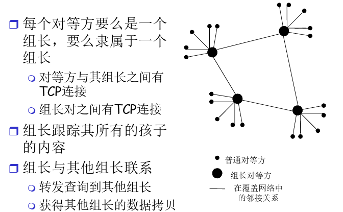

**组长与组长之间通过完全分布式P2P传输，组长和组员通过集中式目录P2P传输**

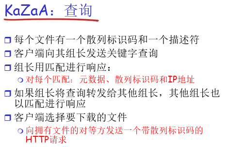


## CDN

