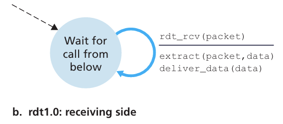

# chapter3.0-传输层

[【计网 传输层概述】 中科大郑烇老师笔记 （十）_中科大-郑烇老师计算机网络笔记-CSDN博客](https://blog.csdn.net/hhw_hhw/article/details/134284084)

## 概述

运输层协议为不同主机上的 **进程** 之间实现了逻辑通信

发送方会将应用层的数据拆封成 **报文段(segment)** , 然后传递给网络层

接受方会接收网络层的数据并重组为报文段, 然后传递给应用层

传输层有许许多多的协议, 在 Internet 中主要是 **UDP** 和 **TCP**

### 应用层 VS 传输层

网络层服务：主机之间的逻辑通信

传输层服务：进程间的逻辑通信

- 依赖于网络层的服务：延时、带宽
- 并对网络层的服务进行增强：数据丢失、顺序混乱、加密
- 有些服务是可以加强的：不可靠 -> 可靠；安全
- 但有些服务是不可以被加强的：带宽，延迟


### Internet传输层协议

前面讲到, Internet传输层的协议主要有两种 **UDP** 和 **TCP** , 他们有如下的区别:

**可靠的、保序的传输：TCP**

> 多路复用、解复用
>
> 拥塞控制
>
> 流量控制
>
> 建立连接

**不可靠、不保序的传输：UDP**

> 多路复用、解复用
>
> 没有为尽力而为的IP服务添加更多的其它额外服务

**都不提供的服务：**

> 延时保证
>
> 带宽保证

补充 : 我们知道, 在传输层下面的网络层的 IP 服务是尽力而为交付服务, 是不可靠的, 而在传输层之上是可以提供可靠的服务的, 所以需要传输层操作, 定义相关的协议规定,尽可能让传输层传递的数据是可靠的


## 多路复用/解复用


简单解释一下什么叫多路复用和解复用

多路复用:

对于传输层来说, 他会接收许许多多来自应用层的数据, 他们可能来自不同的端口, 而多路复用值得是 : 传输层会将这些信息封装, 将他们统一成一个逻辑体, 传输层对这些封装了不同端口信息的逻辑体一视同仁, 并将他们转发至网络层

解复用:

传输层收到这些封装了不同端口的逻辑体, 将其中的端口信息拆分出来, 之后让指定的端口接收信息

### 多路复用/解复用的原理

主要还是依赖 `socket` 来实现

一个 TCP / UDP 的报文段基本形式如下图所示 :


#### UDP 原理

UDP 的 `socket` 包含以下字段 : 标识符, 目的IP地址, 目的端口号, PID

创建 UDP socket:

```python
clientSocket = socket(AF_INET, SOCK_DGRAM)
```

没有Bind,ClientSocket和OS为之分配的某个端口号捆绑（客户端使用什么端口号无所谓，客户端主动找服务器）

1. 当主机收到UDP报文段：
   - 检查报文段的目标端口号
   - 用该端口号将报文段定位给套接字
   - 套接字表示 PID, 最后交付到对应进程
2. 如果两个不同源IP地址/源端口号的数据报，但是有相同的目标IP地址和端口号，则被定位到相同的套接字


#### TCP 原理

TCP 的 `socket` 包含以下字段 : 标识符, 源IP地址, 源端口号, 目的IP地址, 目的端口号, PID

传输层会同时比较 源IP地址, 源端口号, 目的IP地址, 目的端口号这四个值来精确确定一个目标socket


## 无连接运输: UDP

UDP 的特点:

> “no frills,” “bare bone”Internet 传输协议
>
> “尽力而为”的服务，报文段可能：**丢失 , 送到应用进程的报文段乱序**
> 无连接：**UDP发送端和接收端之间没有握手 , 每个UDP报文段都被独立地处理**
> UDP被用于： **流媒体（丢失不敏感，速率敏感、应用可控制传输速率）DNS SNMP**
> 在UDP上可行可靠传输: **在应用层增加可靠性, 应用特定的差错恢复**


UDP 的优点 : 

1. 不建立连接（会增加延时）
2. 简单：在发送端和接收端没有连接状态
3. 报文段的头部很小(开销小)
4. 无拥塞控制和流量控制：UDP可以尽可能快的发送报文段
   - 应用->传输的速率= 主机->网络的速率


### UDP 校验和

校验和主要是判断数据是否在传输过程中被破坏

校验和的位数一般是 $16$ 位

[轻松掌握UDP校验和 - 混沌奇迹 - 博客园 (cnblogs.com)](https://www.cnblogs.com/young-ma/p/16225829.html)

> 回滚 :
>
> 我们知道两个 $16$ 位的二进制相乘可能会溢出到 $17$ 位, 我们先将计算的结果截取成 $16$ 位
>
> 之后如果有进位就将结果 $+1$


## 可靠数据传输原理

我们知道 IP 协议是不可靠的, 而 TCP 协议是可靠的, 我们如何才能从不可靠变成可靠, 这是可靠数据传输协议 (rdt) 要做的事情

我们将解释不同阶段 rdt 的原理 :


### rdt 1.0

在 rdt 1.0 假设中, 我们传输的信道是完全可靠的, 也就是说 : 传输过程中完全不会出现差错, 接收端能完美的收到发送方发送的全部的正确的数据

在这种情况下 : rdt 就非常简单了,  发送方只需要简单的发送即可, 接收方只需要简单的接收即可




### rdt 2.0

在 rdt 2.0 的假设中, 信道是不可靠的, 发送的数据可能会出现差错, 比特 $1$ 可能会变成比特 $0$ , 可能会有缺位,

但是在我们的假设中, 信道传输不会有丢包的情况, 传输的数据一定能发到接收方

对于这种情况, rdt2.0 采用 **自动重传协议(ARQ)** 

发送方和接收方的步骤如下 :

**发送方**

发送方将上层的数据进行计算，计算出校验码，并将需要传递的数据和检验和一并打包进行发送，发送之后，并不能发送下一个分组，需要等到接收方回传确认的字段，才能继续发送（也就是说，在发送完分组，并且在接收方回传确认字段之前，不能发送下一个分组，被称为停等协议）。

发送分组之后有三种可能

> 接收端回传字段为肯定确认，则发送端可以发送下一个分组
>
> 接收端回传字段为否定确认，发送端需要重传该分组

**接收方**

接收方接收到分组数据之后，通过校验码验证数据正确或者错误，如果错误，返回NAK，如果正确，返回ACK。

***该协议存在的问题：如果接收端回传的确认字段在传输中出现差错，会导致错误重传，或者缺少重传***

> 如将 `NAK` 错误的传输成 `ACK`


### rdt 2.1

相比于 rdt 2.0, rdt 2.1 引入了序号的机制, 发送方和接收方的动作为 :

**发送端**

从上层中获取数据之后，将数据和校验和、分组序号（分组需要由1比特表示，所以只能表示0,1，循环使用），进行打包发送。
发送后有三种可能 :

* 接收端回传的数据为ACK和0（假设第一次传输数据，为0，回传的确认字段也为0，如果分组序号为1，则回传的确认字段也为1），则发送端发送下一个分组。
* 接收端回传的数据为ACK和1（假设同上），因为发送的分组为0，但是回传的确认字段为1，则表明该分组没有传输成功，需要重传分组为0的分组。
* 接收端回传的数据为NAK和0或1（假设同上），说明传递的数据出现差错，需要重传分组。

**接收端**

接收端收到分组时，将数据计算和校验码进行校验，如果出现错误，则返回NAK并返回该分组序号，如果不出现错误，返回ACK和该分组序号


### rdt 2.2

rdt2.2的发送方与rdt2.1的发送方相似，由于确认字段没有NAK，所以不会判断确认字段，只会判断回传确认分组的分组序号。
当发送端发送分组之后，（假设第一个分组序号为0）

- 如果返回的是ACK和0，则表示确认收到分组。
- 如果返回的是ACK和1，则表示该分组没有被正确接收到，需要重传

**接收方**

接收方接收到分组之后，将数据和校验和进行校验，如果正确返回当前确认分组的确认字段ACK0，如果分组出现差错，则返回上一个分组的确认字段ACK1，发送方接收之后，就会重传该分组。


### rdt 3.0

rdt 3.0 中假设信道会发生丢包的现象, 也就是说, 接收方可能就收不到发送方发送的数据

rdt 3.0 延续了 rdt 2.2 的设计, 同时新增了一个定时器功能 : 

**发送方**

发送方每发送一个分组，便启动一个定时器，如果接收到确认字段的回传会终止计时器，如果长时间接收不到确认分组，会触发重传。

**接收方**

接收方接收到分组之后，将数据与校验码进行校验，如果正确会返回ACK0，如果错误，返回ACK1。（与rdt2.2协议相同）


### 流水线可靠数据传输协议

[滑动窗口协议详解 - 知乎 (zhihu.com)](https://zhuanlan.zhihu.com/p/482716790)

#### 滑动窗口的大小限制

[(小白)学习记录---计算机网络---滑动窗口协议：发送窗口大小与序号空间大小关系_帧序号比特数与窗口值的关系-CSDN博客](https://blog.csdn.net/jiangcunyu1998/article/details/105635403)

回退N帧：发送窗口MAX <= 序号空间大小 - 1

选择重传：发送窗口 + 接收窗口 <= 序号空间

> 如果超出这个窗口大小的话，就会导致收到重复的包，因为窗口编号比如0-7，那最大窗口大小就是0-6，那gbn举例，如果gbn接收方窗口大小是1，单次确认，发送主机发送了0-7（因为发送窗口是最大是7，所以可以发送0-7），然后接收方收到了0-7，并且接收到的每个编号的分组都给了相应的ack回复包（注意此时是gbn协议），那此时接受方开始接收下一轮的0-7的包接收方的窗口（只有1个分组大小）移动到了0，然而此时上一轮的0-7号分组的ACK确认包的0号ACK确认包在网络链路上因为各种原因丢失，那此时会触发发送方的超时重传机制，会将上一轮的0-7号重新发送一遍（因为gbn的协议规定的就是只给第一个分组启动定时器，时间一到未收到第一个分组的确认ack包，不管剩下的1-7分组接收方有没有收到都会全部重发），而此时接收方确实已经收到了第一轮的0-7的包要准备收第二轮的0-7的包，而发送方因为上一轮的0号确认包没收到，触发超时重传机制，将上一轮的0-7重传了一遍，这里就不用讲了，肯定就是老包重发了一遍，到接收端，接收端当新包解封装交给上层了。gbn协议是这样，sr也是为了防止同样的原因
>
> PS : 假设数据编号是 $0 \sim 7$ , 那么编号序列为 $0,1,2,3,4,5,6,7,0,1,2,3,4,\dots$ 无论窗口的大小是多少都是这样


