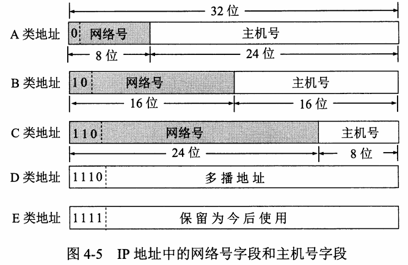
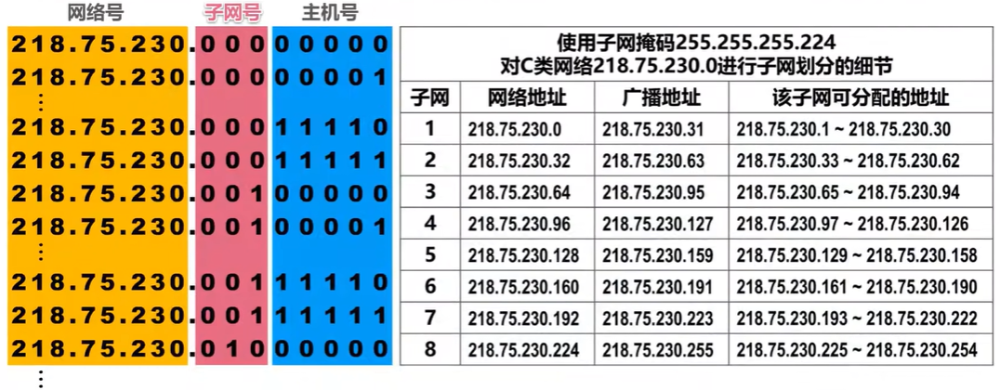
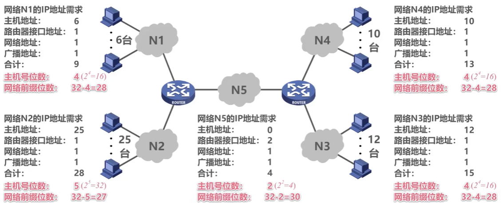

# chapter4.0-网络层

## 网络层概述

网络层的主要任务是**实现网络互连**，进而**实现数据包在各网络之间的传输**

要实现网络层任务，需要解决一下主要问题: 

* **网络层向运输层提供怎样的服务**（“可靠传输”还是“不可靠传输”）

  > 我们知道在网络中是有丢包等现象的,在这个问题中, 我们主要讨论到底要不要在网络层就让数据传输变得连续可靠
* **网络层寻址问题**

  > 在数据链路层,寻址是使用物理地址MAC地址的, 在网络层寻址自然也需要地址
* **路由选择问题**

  > 从 $A$ 到 $B$ 有多种到达的方法, 这个问题的核心是如何去选择路径

## 网络层提供的两种服务

在计算机网络领域，网络层应该向运输层提供怎样的服务（“**面向连接**”还是“**无连接**”）曾引起了长期的争论

争论焦点的实质就是：**在计算机通信中，可靠交付应当由谁来负责**？是**网络**还是**端系统**？

### 面向连接的虚电路服务

**一种观点：让网络负责可靠交付**

这个方法实际上是模拟了电话通讯的方式, 即电信网络, 其期望由网络进行可靠交付

> 通信之前先建立**虚电路** (Virtual Circuit)，以保证双方通信所需的一切网络资源
>
> 如果再使用可靠传输的网络协议，就可使所发送的分组无差错按序到达终点，不丢失、不重复
>
> **发送方** 发送给 **接收方** 的所有分组都沿着同一条虚电路传送

注意:

> 虚电路表示这只是一条逻辑上的连接，分组都沿着这条逻辑连接按照存储转发方式传送，而并不是真正建立了一条物理连接
>
> 电路交换的电话通信是先建立了一条真正的连接。
>
> 因此分组交换的虚连接和电路交换的连接只是类似，但并不完全一样

### 无连接的数据报服务

**另一种观点：网络提供数据报服务**

这种观点是目前互联网主流采用的方法 :

> 网络层向上只提供简单灵活的、**无连接的**、**尽最大努力交付**的**数据报服务**
>
> 网络在发送分组时不需要先建立连接。每一个分组（即 IP 数据报）独立发送，与其前后的分组无关（不进行编号）
>
> **网络层不提供服务质量的承诺**。即所传送的分组可能出错、丢失、重复和失序（不按序到达终点），当然也不保证分组传送的时限。
>
> **发送方** 发送给 **接收方** 的分组可能沿着不同路径传送

这种方式的最大特点是 : **尽最大努力交付**

> 如果主机（即端系统）中的进程之间的通信需要是可靠的，那么就由网络的**主机中的运输层负责可靠交付（包括差错处理、流量控制等）**
>
> **采用这种设计思路的好处是**：网络的造价大大降低，运行方式灵活，能够适应多种应用

两种服务的比较如下图:

---

## IPV4 地址

### 概述

**IP 地址就是给每个连接在互联网上的主机（或路由器）分配一个在全世界范围是唯一的 32 位的标识符**

> 一下 tip : IPV4 说明地址一共有 $4$ 个字节, 也就是 $32$ 位, 同理 IPV6说明地址有 $16$ 位, 也就是 $128$ 位
>
> 由于子网划分的情况, IP 地址不一定是全球唯一的, 但是面对公网的 IP 地址一定是全球唯一的

> 和 IP 地址挂钩的是 IP 协议 :
>
> 网际协议 IP 是 TCP/IP 体系中两个最主要的协议之一, 与 IP 协议配套使用的还有三个协议：
>
> - 地址解析协议 ARP (Address Resolution Protocol)
> - 网际控制报文协议 ICMP (Internet Control Message Protocol)
> - 网际组管理协议 IGMP (Internet Group Management Protocol)

接下来我们重点介绍一下几种编码方式的 IPV4地址: 

### 分类编址的 IPV4 地址

这种编码方式将地址分为了 $A, B, C, D, E$ 五类地址:

 

我们以 $A$ 类地址为例子, 向大家讲述这几类地址的一些基本概念及知识

> 以下知识适用于 $A,B,C$ 类地址, $D,E$ 类我们后面讲

前 $8$ 位代表网络号, 剩余的位用于标注一个具体的主机 (网络号的位数随地址的种类变化)

> 网络号标识属于哪一个网段, 主机号标识是这个网段中哪一个具体的终端

以 $A$ 类例子为例, 最小的网络号为 ${\color{Purple} 0}0000001$ , 最大的网络号为 ${\color{Purple} 0}1111110$ , 而理论上最大的网络号 ${\color{Purple} 0}1111111$ , 也就是 $127$ 是用于本地环回测试的, 不对外分配

对于主机号来说, 最小的主机号为 $000000000000000000000001$ , 最大主机号为 $111111111111111111111110$

而理论最大主机号 $111111111111111111111111$  为这个网段的广播地址

而全 $0$ 的主机号 : $000000000000000000000000$ 被用来标识这个网络

所以我们可以总结出以下的几个结论:

> $A$ 类地址最多可分配 $2^{7} - 2$ 个网络数量, 每个网络可分配 $2^{24} - 2$ 个主机号
>
> $B$ 类地址最多可分配 $2^{14} - 2$ 个网络数量, 每个网络可分配 $2^{16} - 2$ 个主机号
>
> $C$ 类地址最多可分配 $2^{21} - 2$ 个网络数量, 每个网络可分配 $2^{8} - 2$ 个主机号

由点分十进制表示法快速判断地址类别:

> $A$ 类 : $( net< 127)$ ,  $B$ 类 : $(128 < net < 191)$ ,  $C$ 类 : $(192 < net < 223)$

> ***基于IP地址的一些特点 :***
>
> **IP 地址是一种分等级的地址结构**
>
> * IP 地址管理机构在分配 IP 地址时只分配网络号，而剩下的主机号则由得到该网络号的单位自行分配。这样就方便了 IP 地址的管理。
> * 路由器仅根据目的主机所连接的网络号来转发分组（而不考虑目的主机号），这样就可以使路由表中的项目数大幅度减少，从而减小了路由表所占的存储空间。
>
>  **IP 地址是标志一个主机（或路由器）和一条链路的接口**
>
> * 当一个主机同时连接到两个网络上时，该主机就必须同时具有两个相应的 IP 地址，其网络号 net-id 必须是不同的。这种主机称为多归属主机 (multihomed host)。
> * 由于一个路由器至少应当连接到两个网络（这样它才能将 IP 数据报从一个网络转发到另一个网络），因此一个路由器至少应当有两个不同的 IP 地址
>
> **用转发器或网桥连接起来的若干个局域网仍为一个网络**，因此这些局域网都具有同样的网络号 net-id
>
> **所有分配到网络号 net-id 的网络，无论是范围很小的局域网，还是可能覆盖很大地理范围的广域网，都是平等的**

### 划分子网的IPV4地址

这种编码方式的出现实际上是为了弥补分类编址利用率低下的缺点, 所以这种方式是对上面我们将的一种补充

> **简单描述一下上面方法的缺点:**
>
> 某单位有一个大型的局域网需要连接到英特网。如果申请一个C 类网络地址，其可分配的IP 地址数量只254个，不够使用。因此，该单位申请了一个B 类网络地址，其可分配的IP 地址数量达到了65534个。给每台计算机和路由器的接口分配一个IP 地址后，还有大量的IP 地址剩余。这些剩余的IP 地址只能由该单位的同一个网络使用
>
> 如果想要将原来的网络划分成三个独立的网路。假设子网一仍然使用原先申请到的B 类网络地址，那么就需要为另外两个子网各自申请一个网络地址

就我们上面举的例子中可以想到一个解决方式 :

如果可以从IP 地址的主机号部分借用一些位作为子网号来区分不同的子网，就可以利用原有网络中剩余的大量IP 地址，而不用申请新的网络地址。

但是我们和计算机又如何知道分类地址中主机号有多少比特被用作子网号了呢？

所以就有了划分子网的工具：**子网掩码**

#### 子网掩码

> 划分子网纯属一个**单位内部的事情**。单位对外仍然表现为没有划分子网的网络。
>
> 从主机号**借用**若干个位作为**子网号** subnet-id，而主机号 host-id 也就相应减少了若干个位

> 凡是从其他网络发送给本单位某个主机的 IP 数据报，仍然是根据 IP 数据报的目的网络号 net-id，先找到连接在本单位网络上的路由器。
>
> 然后此路由器在收到 IP 数据报后，再按目的网络号 net-id 和子网号 subnet-id 找到目的子网。
>
> 最后就将 IP 数据报直接交付目的主机

子网掩码形如 $11111111111111111110000000000000$ , 前面 $1$ 个位数为 网络号位数 $+$ 子网号位数

在使用的时候只需要将子网掩码与 IP 地址相与即可, 即:
$$
网络地址 = 子网掩码 \quad \& \quad \mathrm{IP} \: 地址 
$$
划分子网后的 IP 分配规则实际上和 分类编址的分配的规则十分相似, 这里不再所赘述

> **默认子网掩码**
>
> 在没有分配子网的 IP 地址中, 子网掩码中 $1$ 的位数为该类地址网络号的位数

> 子网掩码是一个网络或一个子网的重要属性。
>
> 路由器在和相邻路由器交换路由信息时，必须把自己所在网络（或子网）的子网掩码告诉相邻路由器。
>
> 路由器的路由表中的每一个项目，除了要给出目的网络地址外，还必须同时给出该网络的子网掩码。
>
> 若一个路由器连接在两个子网上，就拥有两个网络地址和两个子网掩码。

### 无分类编址的IPV4地址 (CIDR)

在这一部分, 我们将介绍无分类域间路由选择CIDR:

在我们上面介绍的两种方法中, 因为依然存在利用率低下的情况, 所以提出了本方法, 它浓缩了上面两种的精髓

> 消除了传统的A类，B类和类地址以及划分子网的概念
>
> 融合子网地址与子网码，方便子网分

一个无编址的 IPV4 地址形如 : $192.168.23.44/20$ 

斜线左边代表一个具体的 IP 地址, 右边代表网络位的位数, 通过 CIDR, 我们也可以获得和上面两种编码方式一样的信息, 如 : 最大IP地址等 (分析过程简单, 略)

#### 路由聚合 (构造超网)

如图, 有下面的这个拓扑结构, $R1, R2$ 两个路由器直接相连

$R1, R2$ 会周期性的传递自身的路由表, 如果不进行路由聚合, 那么当进行交换的时候 $R2$ 就会多出 $5$ 个表项

为了压缩这五个表项, 就提出了路由聚合的概念, 也就是 **取这些表项的公共前缀**

我们将公共的网络号提取出来, 其他的全部补 $0$ , 就成功的构造了一个超网

对本例来说: 超网为 $127.1.4.0/22$

### ipv4 地址应用规划

[4.3.5 IPv4地址的应用规划_哔哩哔哩_ bilibili](https://www.bilibili.com/video/BV1c4411d7jb?p=47)

这一部分主要是讲如何分配子网 IP 地址让 IP 地址的利用率提高 :

我们以下面这个需求举例:

#### 定长子网掩码 FLSM

**定长子网掩码（FLSM，Fixed Length Subnet Mask）是指在同一网络中，所有子网的子网掩码长度都是相同的**这意味着每个子网可以容纳的主机数量也是相同的

因为最大需要的 IP 地址数量为 $28$ , 并且子网数量为 $5$ , 所以我们从主机号中借 $3$ 个位

那么子网掩码为 $255.255.255.224$ , 由此, 我们就可以得出分配的方案

可以观察到有许许多多的浪费, 利用率并不高

#### 变长子网掩码 VLSM

这个方法的技术支撑为 : 无分类域间路由选择CIDR

我们计算出网络前缀位数 :

之后我们便可以分配 IP 了: 值得注意的是 :

分配原则是 **"每个子块的起点位置不能随意选取，只能选取块大小整数倍的地址作为起点 "**。建议先给大的子块分配

分配结果如下 :

## 路由选择协议

在这一部分主要是了解路由表是如何构建的, 主要有两种方法, 分别是静态路由配置和动态路由配置

### 静态路由配置

静态路由配置为人工手动配置, 开销小, 但不能适应网络的变化

静态路由配置由于人工配置的错误性, 可能会造成路由环路的问题, 导致无法传输数据

### 动态路由选择

动态路由选择是路由器自己学习交换路由信息来构建路由表,

但是相对来说开销回比静态路由大

在整个英特网中, 采用分层次的路由选择协议

> **自治系统 AS**：在单一的技术管理下的一组路由器，而这些路由器使用一种 AS 内部的路由选择协议和共同的度量以确定分组在该 AS 内的路由，同时还使用一种 AS 之间的路由选择协议用以确定分组在 AS之间的路由。
>
> 自治系统之间的路由选择简称为域间路由选择，自治系统内部的路由选择简称为域内路由选择
>
> 域间路由选择使用外部网关协议EGP这个类别的路由选择协议
>
> 域内路由选择使用内部网关协议IGP这个类别的路由选择协议
>
> **网关协议**的名称可称为**路由协议**

我们将常见的域间路由选择和域内路由选择常见的协议列举如下:

我们接下来将会讲解三个常见的路由选择协议:

#### RIP 协议

**RIP协议（Routing Information Protocol，路由信息协议）**是一种基于距离矢量的内部网关协议，即**根据跳数来度量路由开销**，进行路由选择。

相比于其它路由协议（如OSPF、ISIS等），RIP协议实现更简单，对带宽、配置和管理等要求也更低，但受到路由跳数和收敛速度的限制，跳数大于15就认为网络不可达，所以无法用在大型复杂网络中

我们直接用图片来展示这一个过程：

不过 RIP 有一个缺点， 那就是错误信息传递慢的问题

#### OSPF 协议

[什么是OSPF？为什么需要OSPF？ - 华为 (huawei.com)](https://info.support.huawei.com/info-finder/encyclopedia/zh/OSPF.html)

#### BGP协议
