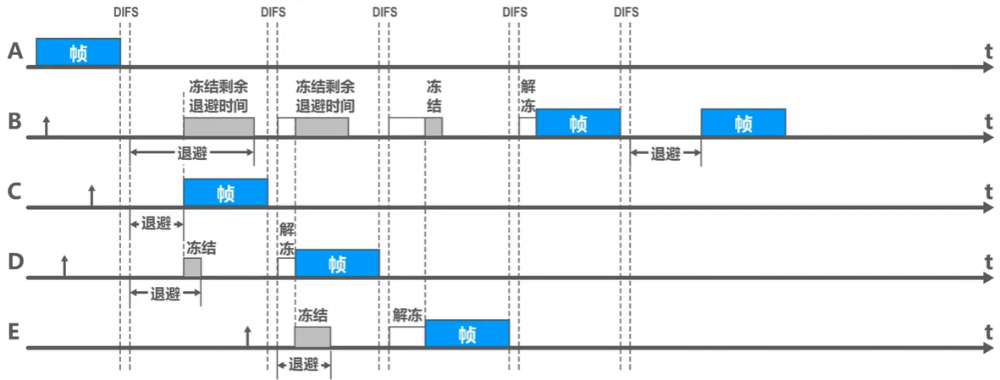

# chapter5.0 - 数据链路层

## 概述

> **数据链路层存在的原因以及理由**

我们知道 TCP/IP 协议所在的网络层和传输层可以确保应用层发送的信息是可以可靠的传输到另一台主机中的, TCP/IP 协议中主要是解决传送的数据报乱序以及丢失所产生的问题, 但并不会怀疑我传来的数据报到底是不是有错误的

而物理层只是规定了比特 $1$ 和 比特 $0$ 到底是怎么传输的, 即我们应该怎么将我们的一串二进制数据转化为电磁信号或者光信号发出去并且如何接受比特.

你会发现少了一环 : 在物理层传输的数据实际上是可能出错的, 如果不经过处理直接交给网络层就会导致数据出错, 这正是我们数据链路层要解决的核心问题: **如何确保传输过来的 $01$ 串是正确的**

在这一章中, 我们循序渐进的讲解整个数据链路层是如何工作并且拓展的

> **数据链路层的地位**

因为数据链路层可以保障传输的 $01$ 串内容是正确的, 所以所有交换装置都必须实现数据链路层

主机 $H1$ 到主机 $H2$ 所经过的网络可以是多种不同类型的

**注意：不同的链路层可能采用不同的数据链路层协议**

> **局域网属于数据链路层**

局域网虽然是个网络。但我们并不把局域网放在网络层中讨论。这是因为在网络层要讨论的是多个网络互连的问题，是讨论分组怎么从一个网络，通过路由器，转发到另一个网络。

而在同一个局域网中，分组怎么从一台主机传送到另一台主机，但并不经过路由器转发。从整个互联网来看，局域网仍属于数据链路层的范围

> **数据链路层的几个共同问题**

* **`链路` 和 `数据链路` 概念不同**

**链路**：一个节点到相邻节点的一段物理路线，而中间任何其他的交换节点

> 在数据通信的时候，两台计算机之间的通信路径往往要经过许多段这样的链路，可见链路只是一条路径的组成部分

**数据链路 (data link)**：**除了物理线路外，还必须有通信协议来控制这些数据的传输**。若把实现这些协议的硬件和软件加到链路上，就构成了数据链路

> 现在最常用的方法是使用适配器（即网卡）来实现这些协议的硬件和软件
>
> **一般的适配器都包括了数据链路层和物理层这两层的功能**

也有人采用另外的术语。这就是把**链路分为物理链路和逻辑链路**

> 物理链路就是上面所说的链路
>
> 逻辑链路就是上面的数据链路，是物理链路加上必要的通信协议

* **数据链路层的协议数据单元: 帧**

## 三个基本问题

三个基本问题分别是 **封装成帧** , **透明传输** , **差错检验**

### 封装成帧

封装成帧是指数据链路层给上层交付的协议数据单元添加帧头和帧尾使之成为帧

一个帧的帧长 = 这个帧的数据部分长度 + 帧头的长度 + 帧尾的长度

每一个数据链路层都会规定帧的数据部分的最大长度, 也叫 **最大传输单元MTU(max transfer Unit)**

我们会用 **帧定界符** 来确定确定一个帧的开始以及结尾, 帧定界符一般是不可打印的

`SOH` 用十六进制表示为 $\mathrm{0x01}$ , `EOT` 用十六进制表示为 $\mathrm{0x04}$

数据链路层只有完整的收到帧开始符合帧结束符才认为这个帧接收完毕, 如果遇到其他情况将直接丢弃

### 透明传输

透明传输是指**数据链路层对上层交付的传输数据没有任何限制**，好像数据链路层不存在一样

在这个部分, 我们主要解决帧定界符在帧的数据部分出现的问题, 如果数据部分出现帧定界符, 我们会在前面插入转义字符

这个转义字符为 ESC (十六进制表示为 $\mathrm{0x1B}$)

### 差错检验

这个是数据链路层的核心功能之一,  数据链路层广泛使用 `CRC循环冗余校验` 来校验错误

关于 `CRC循环冗余校验` 的解释, 请看这篇文章 : 

[奇偶校验 + 循环冗余校验 - 知乎 (zhihu.com)](https://zhuanlan.zhihu.com/p/650922035)

## 点对点协议 PPP

 我们知道, 互联网中的用户通常都需要接入到 `ISP` 才能连接上互联网, 而在这个过程中, 数据链路层采用的协议一般是 **点对点协议PPP** 

在这个部分, 我们将重点介绍一下 点对点协议PPP

### PPP协议帧各部分的组成

- 帧的首部：开始标识 $F$ 占1个字节，用十六进制 $7E$ 表示；$A$ 占 $1$ 个字节，$C$ 占一个字节，协议占 $2$ 个字节

  > $A$ 代表地址, 一般是十六进制 $FF$ , $C$ 是控制字段, 一般是十六进制 $03$
  >
  > 这两个字段都是无意义的

- IP数据报也就是信息部分不超过 $1500$ 个字节

- $FCS$ 占2个字节

  > $FCS$ 是循环冗余校验码存放的地方

- 帧的尾部：包含 $FCS$ (帧检验序列)和尾部标识 $7E$ 占据 $1$ 个字节。

**协议字段（两个字节长）不同的值代表不同的协议**

1. 当协议字段为 $\mathrm{0x0021}$时，PPP帧的信息字段就是 IP 数据报。
2. 当协议字段为 $\mathrm{0xC021}$ 时，PPP帧的信息字段就是 PPP 链路控制协议 LCP 的数据。
3. 当协议字段为 $\mathrm{0x8021}$ 时，PPP帧的信息字段就是网络层的控制数据。

### PPP 协议的透明传输

**面向字节的异步链路：字节填充法（插入“转义字符”）**

1. 将信息字段中出现的每个$\mathrm{0x7E}$ 字节转变为 $\mathrm{ (0x7D,0x5E)}$ (数值减去 $\mathrm{0x20}$)
2. 将信息字段中出现的每个 $\mathrm{0x7D}$ 字节转变为 $\mathrm{(0x7D,0x5D)}$ (数值减去 $\mathrm{0x20}$)
3. 若信息字段出现 `ASCII` 码的控制字符（即数值小于 $\mathrm{0x20}$ 的字符），则在该字符前面要加上一个 $\mathrm{0x7D}$ 。同时将该字符的编码改变。(数值加上 $\mathrm{0x20}$)

**面向比特的同步链路：比特填充法（插入“比特0”）**

每连续出现五个连续的 $1$ , 就往后面插入一个 $0$

### PPP 协议的工作状态

从工作状态上来看, PPP 协议已经不只是一个简单的数据链路层协议了, 还包含了物理层和网络层的内容

我们按照步骤一一讲述 PPP 协议的工作状态

* 当我们的用户呼叫路由器请求上网的时候, PPP协议双方就会建立一条物理层的连接

* 接着 `LCP` 开始协商配置选项

  > 这个时候会发送 `LCP` 的**配置请求帧** , 通常要发送多个这样的帧才能协商成功
  >
  > 链路的另一端可以发送的响应有下面几种:
  >
  > **配置确认帧(Configure-Ack)** : 所有选项都接受
  >
  > **配置否认帧(Configure-Nak)** : 所有选项都理解但不能接受，
  >
  > **配置拒绝帧(Configure-Reject)** : 选项有的无法识别或不能接受，需要协商

* 协商结束后双方就建立了 **LCP链路** , 接下来就进入**鉴别状态**

  > 所谓鉴别, 实际上就是身份验证
  >
  > 可以使用**口令鉴别协议 PAP (Password Authentication Protocol)**，或 **口令握手鉴别协议 CHAP(Challenge-Handshake Authentication Protocol)。**

* 鉴别成功后就进入了**网络协议状态**

  > NCP 给新接入的 PC 机分配一个临时的 IP 地址，使 PC 机成为因特网上的一个主机

* 之后便是**链路打开状态**

  > 链路的两个 PPP 端点可以彼此向对方发送分组。两个 PPP 端点还可发送回送请求**LCP分组(Echo-Request)**和**回送回答 LCP 分组(Echo-Reply)**，以检查链路的状态

* 当出现故障或者结束通讯的时候进入**链路静止状态**

## 使用广播信道的数据链路层

这一项技术一般在局域网或者无线网络中使用, 我们知道最简单的计算机通信方式是直接将两个主机两两相连, 但是如果主机较少的情况下, 这样确实会十分的便捷, 但是如果主机过多的情况下, 这会造成严重的问题

我们假设有 $n$ 台主机, 如果我们都两两相连的话, 那么就需要 $\frac{n(n-1)}{2}$ 条线路相连才能满足

当 $n$ 足够大的时候开销就会非常大, 所以就提出了复用的想法, 即这些主机通行会共用总线

可能的共用方法有 :

现在我们在广域网中不会使用这种方式, 而是使用分组交换的方式(我们之后会讲), 但是由于无线网络的天然特性以及在局域网中的优点, 使用广播信道依然实用, 所以我们依然需要学习

使用广播信道的数据链路层最大的问题就是会**产生冲突**, 当两台主机同时通信的时候, 就会造成冲突

所以我们接下来学习的协议都是为了解决冲突

关于静态划分信道这一部分, 我们在这部分进行讲解

感兴趣可以直接点击跳转 : [yyym blog (yyym-y.github.io) // 复用技术](https://yyym-y.github.io/2024/03/30/ComputerNetwork_note6/#复用技术)

我们重点讲解 **动态接入控制**

### 动态接入控制

动态接入控制也可以理解为动态划分信道, 相比于静态划分信道, 动态划分信道更加的灵活, 效率更高

我们将讲解一下这几个动态接入控制协议:

**ALOHA 协议** 	**CSMA 协议**	**CSMA/CD 协议** 	**CSMA/CA 协议**	**令牌传递协议**

#### ALOHA 协议

一个讲的还行的视频 : [3.26.ALOHA协议 _哔哩哔哩_ bilibili](https://www.bilibili.com/video/BV1ae4y1g7Ek?p=26)

所谓的 ALOHA 协议其实非常简单, 换算成人话就是: 我想发我就发, 如果发生冲突了, 我就等一段随机事件之后再发送

纯粹的 ALOHA 协议的效率会非常低, 所以为了提高他的效率, 就有了 **时隙ALOHA协议**

它与传统的 ALOHA 协议只有一个区别, 就是对发送的时间有要求, 时间被分成了一个又一个的时间片, 只有在时间片的开始才能发送信息

尽管如此, 碰撞冲突的概率还是非常大, 效率大概是传统的两倍, 现在基本已经不再使用 ALOHA 协议了

#### CSMA 协议

CSMA 协议是我们后面两个协议的基础, 理解了 `CSMA` 协议会方便你之后的理解

CSMA 协议又叫 **载波监听多路访问协议**

其核心为 : 在发送信息之前会监听信道上是否空闲, 如果空闲就按照一定的策略发送消息

> 如何监听型号是否空闲或者冲突
>
> 在有线局域网中, 如果使用 CSMA 协议, 数据链路层会监测信道的电压值 (光纤的话是其他测量值)
>
> 如果这个电压值低于某一个阈值, 就认为当前信道是空闲的
>
> 如果这个电压值高于某一个阈值, 就认为当前信道发生了冲突
>
> 注意: 监测是监测当前终端接入口的电压, 忽略了信号在信道的传播时延, 这也是为什么某些情况下空闲发送但是会冲突的原因

CSMA 协议有下面几种策略:

* **1 - 坚持CSMA**

  > 如果监听到当前信道是空闲的, 就会立即将要发送的数据发送出去, 否则就会一直监听下去
  >
  > 如果监听到当前信道是冲突的, 就会退避一段随机时间后再监听信道

* **非坚持CSMA**

  > 如果监听到当前信道是空闲的, 就会立即将要发送的数据发送出去
  >
  > 如果检测到当前信道是忙/冲突的时候将会退避一段随机时间后再监听
  >
  > **为什么要退避一段时间再监听**
  >
  > 假设我们有 $10$ 台机器使用 `1 - 坚持CSMA` , 那么当信道从忙转到空闲的时候, 这 $10$ 台机器就会一起发送信息, 这样冲突的概率会非常大
  >
  > 但是由于非坚持CSMA的特点, 造成了某些时刻信道空闲但是没有机器发送信息, 造成了资源浪费

* **p - 坚持CSMA**

  > 如果监听到当前信道是空闲的, 就会以 $p$ 的发送概率将发送的数据发送出去, 否则就会一直监听下去
  >
  > 如果检测到当前信道是忙/冲突的时候将会退避一段随机时间后再监听
  >
  > > 由于 $p<1$，所以即使信道是空闲的，节点也可能不会立即发送数据，这可能会导致信道资源的浪费

  

  **注意, CSMA在发现冲突的时候, 会坚持将数据帧发送完毕 , 这样就造成了浪费** 

#### CSMA/CD 协议

我们发现 CSMA 协议 在发生冲突的时候会依然将数据帧发完,

**而 CSMA/CD 协议会一直监听信道, 如果检测到冲突就会立即停止发送数据帧**

概括来说就是 : **先听后发, 边听边发, 冲突停发, 随机重发**

对于 CSMA/CD 协议我们有一些需要注意的点:

* **CSMA/CD 协议一般在以太网中使用 (有线网络)**

* **CSMA/CD 协议只支持半双工, 不支持全双工**

  > 如果两端同时发送消息, 必然会冲突

* **发送端检测到冲突的最长时间为 $2\tau$**

  > 我们以下面的一张图为例:
  >
  >  
  >
  > 当冲突点无限接近于 $B$ 点的时候, $A$ 检测到冲突的时间就无限接近于 $2\tau$
  >
  > $2\tau$ 也被称为 **冲突窗口** 和 **争用期**

* **确保帧的长度足够长以便可以实现冲突停发**

  > 我们假设数据帧的长度过小, 发送这个数据帧的时间 $t < 2\tau$ , 那么在检测到冲突的时候已经将数据帧发完了
  >
  > 如果在剩余的时间也发送了其他数据帧, 就不知道到底是哪一个数据帧出现了错误
  >
  > 于是就必须规定发送数据帧的时间要大于争用期 $2\tau$
  >
  > $最小帧长 = 2 \times 传播时延 \times 数据率 = 2\tau\times 数据率$
  >
  > 以太网规定了最小帧长为 $64$ 个字节, 也就是 $64B$

* **重传的时间和策略**

  > CSMA/CD 协议采用的重传的策略为 **p - 坚持CSMA**
  >
  > 至于退避的时间采用 **截断二进制指数退避算法**
  >
  > > 截断二进制指数退避算法的规则如下:
  > >
  > > 退避时间为 $t = r\times 2\tau\quad r\in [0, 1, \cdots, 2^{k} - 1] \quad k = \min(10, 重传次数)$
  > >
  > > 如果我们此时的重传次数为 $3$ , 那么将会从 $[0,1,2,3,4,5,6,7]$ 中随机选一个数作为 $r$ 计算退避时间
  >
  > 当退避计时器的时间还未减小到零时而信道又转变为忙状态，这时就冻结退避计时器的数值，重新等待信道变为空闲, 继续启动退避计时器。
  >
  > 重传的最大次数有限制 : **最大重传次数为 $16$ 次** , 如果超出这个数, 就会向上层报错
  >
  > > 为什么要用 $2\tau$ 作为最基本的时间
  > >
  > > 如果重传双方都是小于 $2\tau$ 时间, 可能再次造成冲突

#### CSMA/CA 协议

我们知道 CSMA/CD 协议是一个优秀的协议, 他在有线网中能正常的工作, 但是在无线网络中就无法正常的工作了

首先是载波监听十分的困难, 无线网络因为其自身的特性, 可能会出现隐蔽站的问题

同时无线网是无法进行 360 度信道碰撞检测 : 在无限局域网中 , 无线信号 360 度发送 , 是无法检测所有方向的碰撞的

> $A, C$ 站点 , 要给 $B$ 站点发送数据 , 发送前检测信道 , 如果 $A,C$ 都检测不到信号 , 认为信道空闲 , 同时向 $B$ 发送数据 , 此时就会导致冲突 ;
>
> 如果 $A$ 要给 $B$ 发送数据 , $C$ 没有检测到信号 , 此时强行给 $C$ 发送数据 , 就会导致冲突 ;
>

所以就有了 CSMA/CA 协议, 这里的 CA 是避免碰撞的意思

除此之外, 我们还需要了解一些概念

> 802.11标准规定，所有的站点必须**在持续检测到信道空闲一段指定时间后才能发送帧**，**这段时间称为帧间间隔IFS**
>
> 帧间间隔的长短取决于该站点要发送的帧的类型:
>
> * 高优先级帧需要等待的时间较短，因此可优先获得发送权
> * 低优先级帧需要等待的时间较长。若某个站的低优先级帧还没来得及发送，而其他站的高优先级已发送到信道上，则信道变为忙态，因而低优先级帧就只能再推迟发送了。这样就减少了发生碰撞的机会。
>
> 常见的两种帧间间隔如下:
>
> * 短帧间间隔 **SIFS**(28us)
>
>   > 最短的帧间间隔，用来分隔开属于一次对话的各帧。一个站点应当能够在这段时间内从发送方式切换到接收方式。使用 SIFS 的帧类型有 ACK帧 、CTS帧、由过长的 MAC帧 分片后的数据帧、以及所有回答 AP 探询的帧和在 PCF 方式中接入点 AP 发送出的任何帧。
>
> * DCF帧间间隔 **DIFS**(128us)
>
>   > 它比短帧间间隔SIFS要长得多，在DCF方式中用来发送数据帧和管理帧

接下来我们来讲讲 CSMA/CA 的工作原理:

* 当源站想要发送一个数据帧的时候, 他会监测当前信道是否空闲

* 如果信道空闲, 他会等待一个 DIFS 时间后再发送自己的数据帧

> 等待DIFS数据帧是为了如果有其他更高优先级的帧要发送就让它先发送

* 当目的站接收到这个数据帧之后, 经过检验通过后, 在等待一个 SIFS 间隔后再发送 ACK 帧

> SIFS 是用来分隔开一次对话的各个帧, 在 SIFS期间, 源站有时间从发送方转化为接收方
>
> 如果源站没有接收到 ACK 帧, 由超时计时器控制的时间过后会按照重传策略重传

* 在这个过程中, 如果有其他站想要发送信息, 载波监听会发现信道忙, 就会处于退避状态

* 当信道空闲的时候, 就会等待一个 DIFS 后, 再等待一个随机退避时间后再发送

> 等待一个随机退避时间是为了不让多个站点同时发送帧发生冲突

接下来我们讲讲什么情况下需要退避随机时间,什么时候不需要

* 不退避随机时间

  > 发送第一个帧不用随机退避，只需等待一个DIFS

* 退避随机时间

  > 1. 在发送数据帧之前检测到信道处于忙状态时;
  > 2. 在每一次重传一个数据帧时;
  > 3. 在每一次成功发送后要连续发送下一个帧时(这是为了避免一个站点长时间占用信道)

接下来我们讲讲 CSMA/CA 的退避时间算法

首先会随机选取一个退避时间, 这个退避时间使用 **截断二进制指数退避算法** 来选择

不过这个时候的 $k$ 取值为 $k =\min(6, 退避次数)$

规则如下:

* 当退避计时器的时间减小到零时，就开始发送数据;
* 当退避计时器的时间还未减小到零时而信道又转变为忙状态，这时就冻结退避计时器的数值，重新等待信道变为空闲，再经过时间DIFS后，继续启动退避计时器。

最后我们介绍一下 CSMA/CA 的信道预约和虚拟载波监听

源站会发送 **RTS 帧**, 这个帧会它包括源地址、目的地址以及**这次通信(包括相应的确认帧)所需的持续时间。**

若目的站正确收到源站发来的RTS帧，且媒体空闲，就发送一个响应控制帧，称为允许发送CTS(CearTosend)，它也包括这次通信所需的持续时间(从RTS帧中将此持续时间复制到CTS帧中)。

除源站和目的站以外的其他各站，在收到CTS帧(或数据帧)后就推迟接入到无线局域网中。这样就保证了源站和目的站之间的通信不会受到其他站的干扰。

> CTS 帧是广播发送, 也就是说: 如果其他站收到 CTS 帧, 那么在 CTS 中申请的那段时间内就都不会发送帧

如果RTS帧发生碰撞，源站就收不到CTS帧，需执行退避算法重传RTS帧。

由于 `RTS` 帧和 `CTS` 帧很短，发送碰撞的概率、碰撞产生的开销及本身的开销都很小。而对于一般的数据帧，其发送时延往往大于传播时延(因为是局域网)，碰撞的概率很大，且一旦发生碰撞而导致数据帧重发，则浪费的时间就很多，因此用很小的代价对信道进行预约往往是值得的。

一般有三种情况可以使用:

* 使用RTS帧和CTS帧
* 不使用RTS帧和CTS帧
* 只有当数据帧的长度超过某一数值时才使用RTS帧和CTS帧

除此之外, 数据帧也能携带通所需要的时间, 这就是虚拟载波监听机制

由于利用虚拟载波监听机制，站点**只要监听到RTS帧、CTS帧或数据帧中的任何一个，就能知道信道被占用的持续时间**，而不需要真正监听到信道上的信号，因此虚拟载波监听机制能减少隐蔽站带来的碰撞问题。

## 以太网的 MAC 层

我们前面解决了多台主机同时想要发送信息的问题, 这样就确认了如何保证发送方可以发送到接收方

接下来我们就需要解决接收方的问题了: 如何确定这条信息是发送给自己的

当多个主机连接到一条广播总线上的时候, 每一台机器都需要一个地址来标识自身, 在数据链路层, 这个标识就是 **MAC 地址**

MAC 地址理论上是全球唯一的, 一个MAC 地址由下面的几个部分构成:

- 一个地址块可以生成 224 个不同的地址。这种 48 位地址称为 MAC-48，它的通用名称是 EUI-48
- 生产适配器时，6 字节的 MAC 地址已被固化在适配器的 ROM，因此，**MAC 地址也叫做硬件地址 (hardware address) 或物理地址**
- “MAC 地址”实际上就是适配器地址或适配器标识符 EUI-48

**MAC 地址还分为单播地址, 组地址 和广播地址**

## 使用集线器的共享式以太网

早期的传统以太网是使用**粗同轴电缆**的共享总线以太网，后来发展到使用价格相对便宜的**细同轴电缆**

这也就是我们之前将过的方法, 即只是用一条线来连接所有的主机

然而，实践证明这种使用无源电缆线和大量机械接口的总线型以太网并不像人们想象的那么可靠

若总线上某一个连接点接触不良或者断开, 都有可能对整个总线网络带来巨大的打击

于是人们提出了使用集线器的共享式以太网

他是用双绞线和 RJ-45 接口进行连接, 价格更便宜也更方便

* 使用集线器的以太网虽然物理拓扑是星型的，但在逻辑上仍然是一个总线网。总线上的各站点共享总线资源，使用的还是CSMA/CD协议
* 集线器只工作在物理层，它的每个接口仅简单地转发比特，并不进行碰撞检测。碰撞检测的任务由各站点中的网卡负责。
* 集线器一般都有少量的容错能力和网络管理功能例如，若网络中某个站点的网卡出现了故障而不停地发送帧，集线器可以检测到这个问题，在内部断开与出故障网卡的连线，使整个以太网能正常工作

> 集线器的工作方式就是转发各端口的信号

IEEE于1990年制定了**10BASE-T**星型以太网的标准802.3i，这种以太网是局域网发展史上的一座非常重要的里程碑，它为以太网在局域网中的统治地位奠定了牢固的基础。

> **10BASE-T** :  $10$ 代表传输速率为 $10Mb/s$ , BASE 值采用基带信号进行传输, $T$ 值使用双绞线作为传输媒体
>
> 10BASE-T 的传输距离较短, 每个站点到集线器的距离不能超过 $100m$
>
> 如果使用光纤作为连接媒体, 那么名字就是 **10BASE-F** , 它的传输距离较长, 可以达到 $1km$

## 在物理层拓展以太网

在早期广泛使用粗同轴电缆或细同轴电缆共享总线以太网时，为了提高网络的地理覆盖范围，常用的是**工作在物理层的转发器**。

IEEE 802.3标准规定，两个网段可用一个转发器连接起来，任意两个站点之间最多可以经过三个网段。

但是随着集线器共享式以太网的发展, 转发器以前不再那么流行, 现在已经流行使用光纤进行拓展距离

当集线器的接口用完后, 可以使用一个主干集线器将两个不同的碰撞域相连, 从而达到拓展的目的

但是使用这种方式会降低吞吐率, 毕竟碰撞域变大了

## 在数据链路层拓展以太网

### 使用网桥拓展以太网

我们在上一节讲到, 可以使用一个主干集线器将两个不同的碰撞域连接起来形成一个碰撞域, 但是这样做会造成吞吐量的下降

但是如果我们使用网桥进行连接的话, 就会解决这个问题

我们简单说明一下网桥的工作原理

> 当 $A$ 向 $D$ 发送一个单播帧的时候, 网桥收到这个帧, 在表中查看是否有 MAC 帧指定的 MAC 地址
>
> 查表发现 $D$ 在接口 $2$ 中, 于是向 $2$ 发出

> 当 $A$ 向 $C$ 发送一个单播帧的时候, 网桥收到这个帧, 发现 $C$ 的 MAC 地址在接口 $1$
>
> 但是这个帧就是从 $1$ 中来的, 于是直接不转发了

> 当 $A$ 发送广播帧的时候, 网桥不会查表, 直接向所有端口转发

注意, 网桥也遵循 CSMA/CD 协议

网桥的转发表使用的是自学习算法 : 

> 当一个 MAC 帧转发到网桥的时候, 网桥会源地址进行登记, 如 $A \to B$ , 那么就会登记 $A$ 的地址以及接口号
>
> 如果 $B$ 的 MAC 地址无法找到, 那么就会盲目的转发 (向除了这个帧发送的接口转发)

https://www.bilibili.com/video/BV1NT411g7n6?p=35

为了提高网络的可靠性, 通常一个网络中会添加冗余的网桥来提高可靠性:

但这样就产生了环路, 如果发送广播帧(或盲目转发单播帧) 的时候就会形成广播风暴, 浪费资源

于是网桥采用**生成树协议 (STP)** , 找到了最小生成树

不管网桥之间连接成了怎样复杂的带环拓扑，网桥之间通过**交互网桥协议单元(Bridge Protocol DatUnit，BPDU)**，找出原网络拓扑的一个连通子集(即生成树)，在这个子集里整个连通的网络中不存在环路。

当首次连接网桥或网络拓扑发生变化时(人为改变或出现故障)，网桥都会重新构造生成树，以确保网络的连通。

## 交换式以太网

https://www.bilibili.com/video/BV1NT411g7n6?&p=36

网桥的接口非常少, 不能满足我们的需求, 于是就有了交换机出现, 它相对于网桥来说功能更齐全

### 以太网交换机

交换式以太网以 **以太网交换机** 为核心

以太网交换机同样使用转发表, 转发表的生成同样是自学习算法, 当布置冗余交换机的时候, 也是使用生成树协议来避免广播风暴

* 实质上就是一个多接口的网桥,每个接口都以全双工方式直接与主机或以太网交换机相连，还具有并行性，即使多对主机能同时通信(而网桥只能一次分析和转发一个帧)。相互通信的主机都是独占传输媒体，无碰撞地传输数据。

  > 注意, 交换机的接口可以接上不同的系统, 你可以接一台明确的主机, 这个时候另一台主机向这个主机发送信息的时候是不用考虑碰撞的问题的, 因为交换机可以规避碰撞, 也就不需要使用 CSMA/CD 协议
  >
  > 交换机的接口也可以接一个共享式以太网, 这个时候就需要使用 CSMA/CD 协议了
  >
  > 第一种方式可以做到全双工, 第二种形式只能做到半双工

* 接口处还有存储器，能在输出端口繁忙时把到来的帧进行暂时缓存。

* 以太网交换机是一种即插即用设备，其内部的帧交换表(又称为地址表)是通过自学习算法自动地逐渐建立起来的。

* 有直通(不检查)和存储转发两种方式，使用硬件转发，速度更快。

  > 直通的话只需要接收到目的 MAC 地址就可以直接进行转发了, 更快
  >
  > 但是直通不会进行 MAC 帧的监测, 也就是说如果出错也不会发现, 而是直接发送出去

[共享式以太网与交换式以太网的区别](https://www.bilibili.com/video/BV1NT411g7n6?p=38)

> 省流: 共享式以太网扩大了广播域, 扩大了碰撞域
>
> 交换式以太网扩大了广播域, 不改变碰撞域

## 虚拟局域网 VLAN

在主机数量过大的局域网中广播，会耗费较多的资源，当网络配置错误的时候，还可能造成无限兜圈子，造成广播风暴。所以，利用以太网交换机建立虚拟局域网（VLAN），就可以把一个较大局域网分割成一些较小的局域网，也即广播域。

虚拟局域网 VLAN 是由一些局域网网段构成的与物理位置无关的逻辑组，而这些网段具有某些共同的需求。每一个 VLAN 的帧都有一个明确的标识符，指明发送这个帧的计算机属于哪一个 VLAN。虚拟局域网其实只是局域网给用户提供的一种服务，而并不是一种新型局域网。

如图, 我们可以吧使用交换机相连的几台主机划分成不同的 VLAN 网段, 这样, 同一个 VLAN 的主机就可以相互通行, 不同VLAN 的主句就不能相互通行

[VLAN 的工作原理](https://www.bilibili.com/video/BV1NT411g7n6?p=41)
