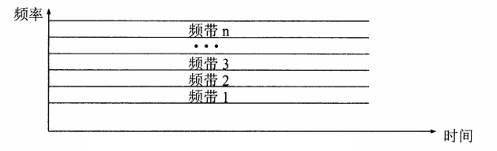
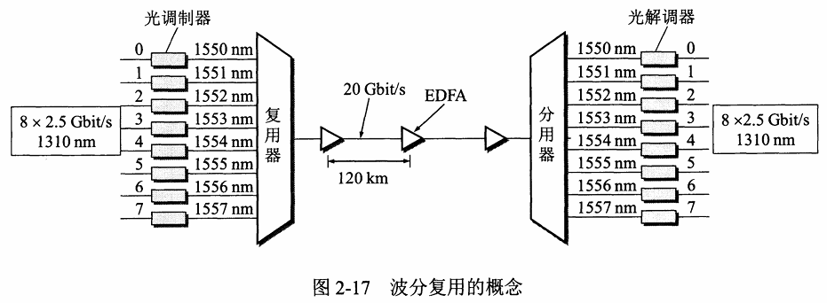

# chapter6.0 - 物理层

## 物理层概述

​		我们知道, 现在的计算机网络中的硬件设备和传输媒介的种类非常的多并且复杂, 所以物理层的作用正是要尽可能地屏蔽掉硬件设备、传输媒体和通信方式, 让物理层之上的数据链路层感受不到这些硬件设备的不同. 即物理层的主要功能是提供**透明**的**比特流**传输

物理层的协议，也叫物理层规程。可以将物理层的主要任务描述为确定与传输媒体的接口有关的一些特性

* **机械特性 (mechanical characteristics) ：**指明接口所有接线器的形状、尺寸、引脚数和排列 等，如RJ45。

* **电气特性 (electrical characteristics) ：**指明在接口电缆的各条线上出现的电压的范围

* **功能特性 (functional characteristics) ：**指明某条线上出现的某一电平的电压表示何种意义。

* **过程特性 (procedural characteristics) ：**指明对于不同功能的各种可能事件的出现顺序

## 数据通讯的基础知识

### 数据通信系统模型

我们先来讲解一下数据通信系统模型

我们可以将一个通信系统划分为三个部分: **源系统**（包括信源和发送器）、**传输系统**（或传输网络）和**目的系统**（包括接收器和信宿）

源系统可以分为两个部分:

* **源点(source)** : 源点设备产生要传输的数据
* **发送器 :** 源点生成的数字比特流要通过发送器编码后才能发送, **典型的发送器就是调制器**

目的系统可以分为两个部分:

* **接收器 :** 接收传输系统传送的数据, 并八绕转换为终点能处理的形式, **典型的接收器就是解调器**
* **终点(destination) :** 处理这些数字比特流的设备

通信是为了传送消息（话音、文字、图像、视频），而数据为运送消息的实体。物理层上数据的传输的形式为信号(数据的电气或电磁表现)

根据信号中代表消息的参数的取值方式不同，可以分为两类：

- **模拟信号**：对应**时域**的信号取值是**连续**的。
- **数字信号**：对应**时域**的信号取值是**离散**的。（代表不同离散值的基本波形称为码元）

### 有关信道的一些概念

**信道(channel) 和电线不一样, 它是用来表示向某一个方向传送信息的媒介**

从通信的双方信息交互方式来看, 可以分为三种方式

* 单向通行(单工通信)
* 双向交替通行(半双工通信)
* 双向同时通信(全双工通信)

来自信源的信号常称为**基带信号**，像计算机输出的代表各种文字或图像文件的数据信号都属于基带信号。基带信号往往包含较多一般信道不能传输的低频成分或直流成分，为了解决这一问题，就必须对基带信号进行**调制**(modulation)。

调制可分为两大类 :

* **仅对基带信号的波形进行变换**

  > 它能够与信道特性相适应。变换后的信号仍然是基带信号，这类调制称为**基带调制**。由于这种基带调制是把数字信号转换为另一种形式的数字信号，也被称为编码(coding)。

* **使用载波(carrier)进行调制**

  > 把基带信号的频率范围搬移到较高的频段，并转换为模拟信号，这样就能够更好地在模拟信道中传输。**经过载波调制后的信号称为带通信号**（即仅在一段频率范围内能够通过信道），而**使用载波的调制称为带通调制**。

常用的编码方式：不归零制、归零制、曼彻斯特编码、差分曼彻斯特编码

* 不归零制 :  正电平代表 $1$，负电平代表 $0$ 。
* 归零制 : 正脉冲代表 $1$ ，负脉冲代表 $0$ 。
* 曼彻斯特编码 : 位周期中心的向上跳变代表 $0$ ，位周期中心的向下跳变代表 $1$ 。但也可反过来定义。
* 差分曼彻斯特编码 : 在每一位的中心处始终都有跳变。位开始边界有跳变代表 $0$, 位开始边界没有跳变代表 $1$

基本的通带调制方法：调幅（**AM**）、调频（**FM**）、调相（**PM**）。或混合的正交振幅调制（**QAM**）

* **调幅(AM) :** 即载波的振幅随基带数字信号而变化。例如，$0$ 或 $1$ 分别对应于无载波或有载波输出。
* **调频(FM) :** 即载波的频率随基带数字信号而变化。例如，$0$ 或 $1$ 分别对应于频率 $f_1$ 和 $f_2$
* **调相(PM) :** 即载波的初始相位随基带数字信号而变化。例如，$0$ 或 $1$ 分别对应于相位 $0$ 度或 $180$ 度

### 信道的极限容量

​		信号在信道（传输介质）上传输的过程中，可以看成由很多不同频率的分量的传输，因为高频分量的不等量衰减，接收方收到的信号是**衰减**和**变形**(失真)的。 但在接收方，若可以在失真的波形中识别出原来的波形，则可以视为对通信质量无影响。数字通信只有两种需要识别的波形，更难被影响

​		若接收端接收到的信号波形失去了码元之间的清楚界限，称为**码间串扰**。一般来说，从 $0 \sim f_c$这一频段，振幅在传输过程不会明显衰减，$f_c$ 称为**截止频率**（**赫兹/Hz**）

**物理带宽**(Hz) 为传输过程中振幅不会明显衰减的**频率范围**。 是一种**物理特性**，通常取决于介质材料的构成、厚度、 长度等

> #### **理想信道的最大传输速率**

[怎样形象理解码元？ - 知乎 (zhihu.com)](https://www.zhihu.com/question/280404107)

[奈氏准则和香农定理_哔哩哔哩_ bilibili](https://www.bilibili.com/video/BV1jH4y1z79W) (非常详细)

**奈式准则**

在无噪声信道中，当 **物理带宽为 $B$ Hz，信号离散等级为 $V$ 级**

则该信道能提供的**最大数据速率为 :**  $2B\log_2V (bps)$ , 其中**码元传输的最大速率**是 $2B(Hz)$

> $V$ 表示每个码元离散电平的数目（码元的离散电平数目是指有多少种不同的码元，比如有 $16$ 种不同的码元，则需要 $4$ 位二进制位，因此数据传输率是码元传输率的 $4$ 倍）

奈奎斯特证明，**任意一个信号通过了一个物理带宽为 $B$ 的低通滤波器，那么只要进行每秒 $2B$ 次的采样，就可以完全重构出被滤掉的信号 **, 任何高于$2B$ 次的采样都毫无意义，会造成码间串扰，影响判决

从上面的公式，我们看出，要想增加最大传输率即数字带宽，只有增加物理带宽或离散等级，但是物理带宽是物理特性，不可能随意增加；**只有增加离散等级了**，即让每一个码元携带更多比特的信息量

[计算机网络——奈氏准则(奈奎斯特定理)-CSDN博客](https://blog.csdn.net/qq_43627631/article/details/111240359)

> #### **噪声信道的最大传输速率**

**香农定理**

香农定理：在噪声信道中，如果物理带宽为 $B$ Hz，信噪比为 $\frac{S}{N}$，那么最大的**传输速率（数字带宽）** :
$$
C=B \log(1+ \frac{S}{N})(bps)
$$
很多情况下噪声用**分贝(dB)** 表示：（噪声为 $30$ dB（分贝），则信噪比为 $\frac{S}{N} = 1000$）。换算关系公式：
$$
分贝值 = 10 \lg \frac{N}{S} (bps)
$$
香农公式表明，信道的带宽或信道中的信噪比越大，信息的极限传输速率就越高

[【计算机网络】物理层 : 香农定理 ( 噪声 | 信噪比 | 香农定理 | “香农定理“公式 | “香农定理“ 计算示例 | “奈氏准则“ 与 “香农定理“ 对比 与 计算示例)★_奈氏准则和香农公式-CSDN博客](https://blog.csdn.net/shulianghan/article/details/108002782)

> 通常情况下 : 如果一道题要求极限数据传输速率, 既可以用香农定理又可以用奈式准则, 那我们需要两个都算一遍之后求取最小值

## 物理层下的传输媒体

物理层的功能是搬运比特，承载比特的就是传输介质，事实上，传输介质是多种多样的。按照是否有形，将其分为**导引型**（**有线**）传输介质和**非导引型**（**无线**）传输介质两大类。

#### 导引型传输介质

**双绞线** , 最古老又最常用的传输媒体。由两根相互绝缘的铜导线并排再经过规则的方式绞合构成，一条电缆可包含多对双绞线。其中抗干扰性能的比较排序（从强到弱）：

> 无屏蔽双绞线 UTP
> 外层整体加铝箔屏蔽层的双绞线 STP(F/UTP)
> 每对双绞线加铝箔屏蔽层的双绞线 U/FTP
> 每对双绞线和外层整体都加铝箔屏蔽层的双绞线 F/FTP

**同轴电缆**，由内导体铜质芯线、绝缘层、网状编织的外导体屏蔽层和绝缘保护套组成，具有较好的抗干扰性能。被广泛用于传输较高速率的数据。目前主要用于有线电视网的居民小区中。

**光缆**，包含多条并排光纤。光纤由纤芯和包层组成，由于纤芯的折射率远高于包层的，使得光在纤芯内部全放射而能不断前进。在光纤中常用的光的波段为850nm，1300nm，1550nm。若一条光纤中可以存在多条不同入射角度的光纤传输，称为多模光纤，适合近距离传输。单模光纤的价格较贵，适合远距离传输

#### 非导引型传输介质

利用无线电波在自由空间的传播来实现无线传输。一般使用特高频(300MHz~3GHz)、 超高频(3GHz~30GHz)、 极高频(30GHz~300GHz), 主要使用2GHz~40GHz。

## 复用技术

[深入浅出计算机网络 - 2.6 信道复用技术_哔哩哔哩_ bilibili](https://www.bilibili.com/video/BV1hd4y1P7AE)

复用技术是让多用户**共享**同一根 信道（干线），复用技术是用在干线上的技术，它要解决**干线起点如何共用**，**干线终点如何分离**的问题。

### 频分多路复用

**FDM（Frequency Division Multiplexing）**：各路信号在同样的时间占用不同的带宽资源

- 在干线起点，信道的频谱被分成若干段（子带），每个用户占据一段来传输自己的信号，到了干线的终点，每个子带的信号被单独分离出来给各个用户。
- **相邻用户使用的频段（子带）之间，通常留有一定的 带宽，以免混淆，这个频段被称作保护带**

### 时分多路复用

**时分多路复用TDM（Time Division Multiplexing）**：所有用户在不同的时间占用同样的频带宽度

* 在时间上共享信道：将时间划分为非常短的时间片，每个用户周期性地在自己的时间片内使用整个带宽。
* 广泛用于 电话系统和蜂窝系统系统
* TDM要求时间上必须同步，为了适应时钟的微小变化，可能要求增加保护时间间隔
* 如果各用户需要的带宽不均衡，有的需要多，有的需要很少，而TDM用户时间片的使用却是一样的，将造成信道的浪费，不高效

### 统计时分多路复用

**统计时分多路复用STDM (Statistic TDM)**

- 动态分配信道，不使用信道的用户不分配，分给有需要的用户使用，利用率可提高2~4倍（**按需分配**）
- 实现技术较复杂，通常只在高速远程通信中使用，如 ATM
- 用户平均使用信道的情况不适用

### **波分多路复用**

**波分多路复用WDM (Wavelength Division Multiplexing)**

- 本质跟 FDM一样，在光纤上复用信号
- 按照不同的波长，干线分成了若干份，承载了不同用户的光信号，到了终点，分离器分离出不同波长的光信号。
- 当相邻波长间隔非常接近，子信道的数目非常大，WDM变成了DWDM（Dense，密集波分多路复用）

### **码分多路复用**

**码分多路复用CDMA (Code Division Multiple Access)**

* CDMA允许每个站利用整个频段发送信号，而且没有任何时间限制
* 各用户使用特殊挑选的不同码型，因此各用户之间不会造成干扰。
* 在CDMA中，每个比特时间被细分成m个更短的时间间隔，这更短的时间间隔被称为码片；通常地，每个比特被分为64或128。码片序列是正交的，能够同时传输 ，广泛用于3G网通信

> 打个比喻：许多人在两两交谈，TDM可以看成是许多人在大厅里按照顺序交谈；FDM可以看成是不同的人按照不同语调同时进行交谈。 而CDMA可以看成是每对交谈者使用不同语言，有讲中文的、英文的、法语的，讲中文的只听见中文，其它语言对他来说就是噪声

> **详细解释码分多路复用 :** 
>
> 在一个 CDMA 系统中, 我们假设有多台设备 $A$ , $B$ , $C$ $\dots$ , 每一个系统有一个专属的向量, 这个向量一般有 $m$ 位 ($m$ 一般为 $64$ 或 $128$ , 为了方便举例 我们假设 $m = 8$) , 我们假设 $A$ 的向量为 $\vec{A} = 00011011$ , $B$ 的向量为 $\vec{B} = 00101110$ 
>
> 我们用 $-1$ 代表 $0$ , 用 $1$ 代表 $1$ , 用这两个数代替上面的 $0$ 和 $1$ , 这样我们就可以构建两个不同的**码片序列** :
>
> $[A] = [-1,-1,-1,1,1,-1,1,1]$ 和 $[B] = [-1,-1,1,-1,1,1,1,-1]$
>
> 不同的设备都有一个属于自己的向量, 这些向量均不相同(一般使用伪随机码序列), 并且需要满足下面的条件 :
>
> **两个向量之间规格化内积 = 0** , 即 : $A\cdot B = \frac{1}{m} \sum\limits_{i = 1}^m A_iB_i = 0$
>
> **一个向量与另一个向量的反码之间规格化内积 = 0** , 即 : $A\cdot \bar{B} = \frac{1}{m} \sum\limits_{i = 1}^m A_i\bar{B_i} = 0$
>
> **一个向量自身的规格化内积 = 1** , 即 : $A\cdot A = \frac{1}{m} \sum\limits_{i = 1}^m A_iA_i = 1$
>
> **一个向量与自身的反码规格化内积 = -1** , 即 : $A\cdot \bar{A} = \frac{1}{m} \sum\limits_{i = 1}^m A_i\bar{A}_i = -1$
>
> 在发送信息的时候, 如果 $B$ 想给 $A$ 发送消息, 那么需要知道 $A$ 所对应的向量
>
> 如果想发送 $1$ , 那么 $B$ 就会发送 $A$ 的向量, 即发送 $[A] = [-1,-1,-1,1,1,-1,1,1]$
>
> 如果想发送 $0$ , 那么 $B$ 就会发送 $A$ 向量的反码, 即发送 $[\bar{A}] = [1,1,1,-1,-1,1,-1,-1]$
>
> 当 $A$ 接收到发送的信号后, 就会将受到的序列与自己的向量做规格化内积 :
>
> 如果结果为 $0$ 表示没有发给自己的信息, $-1$ 指收到 $0$ , $1$ 表示收到 $1$
>
> > **码片的叠加**
> >
> > 如果相同时发送给多个设备, 假设我们想同时发送给 $A$和 $B$ ($A$ 发送 $1$ , $B$ 发送 $0$)
> >
> > 那么就需要叠加向量 $[A] = [-1,-1,-1,1,1,-1,1,1]$ 和 $[\bar{B}] = [1,1,-1,1,-1,-1,-1,1]$
> >
> > 叠加的方式其实是相加即可， 叠加的结果为 $[0,0,-2,2,0,-2,0,2]$
> >
> > $A$ , $B$ 收到后各自解析即可得到正确的内容

