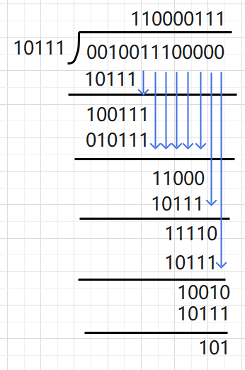
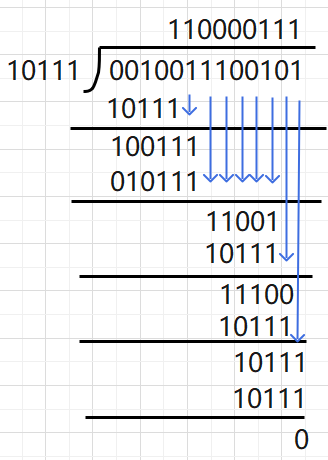

# 奇偶校验 + 循环冗余校验

## 引入

在计算机通行的过程中，我们常常使用  $0$ 或者 $1$ 来表示数据，而在实际传输的过程中，我们可以用实体线或者无线传输

但不可避免的是， 传输过程中必然会产生干扰，干扰较少无伤大雅，但是如果导致数据错误就是个严重问题了

由于干扰，我们可能错误的识别信号，将 $0$ 识别为 $1$ , 将 $1$ 识别为 $0$ , 或者根本无法识别

所以我们必须想办法来判断是否产生了错误

下面我们将介绍两种解决方法

## 奇偶校验

假设现在通信双方约定好使用奇校验来进行差错检验，现在假设传输的数据为 $111001010110$ 

因为使用**奇校验**，所以 **传输的数据 + 校验码** 中所包含奇数个 $1$ ,

值得注意的是，校验码只有一位，可能是 $0$ 或者 $1$ ， 用来平衡后面数据 $1$ 的个数

所以上面我们提到的数据就变成了 $\textcolor{green}{0}111001010110$ , 如果原数据中 $1$ 的个数为偶数， 那么校验码就是 $1$

如果使用**偶校验**， 那么**传输的数据 + 校验码** 中所包含偶数个 $1$ 

具体的操作与奇校验类似

> 分析奇偶校验的效率

当只发生了一位错乱的时候 ，即 ： $\textcolor{green}{0}111001010110 \Longrightarrow \textcolor{green}{0}11100\textcolor{magenta}{0}010110$

这个时候奇偶校验可以成功的

当发生了不止一位错乱的时候，就可能出现以下情况 $\textcolor{green}{0}111001010110 \Longrightarrow \textcolor{green}{0}11\textcolor{magenta}{0}00\textcolor{magenta}{0}010110$

这个时候奇偶校验就会失效，也就会做出错误的判断

可以发现，奇偶校验的效率以及成功率并不高， 所以一般不采用这种方式

## 循环冗余校验CRC

循环冗余校验 CRC (**C**yclic **R**edundancy **C**heck)

大致的过程如下图所示：

* 收发双方约定好一个**生成多项式** $G(x)$
* 发送方基于 $G(x)$ 来计算出差错校验码（**冗余码**）， 并添加到传输数据后面一起传输
* 接收方通过 $G(x)$ 来判断是否出现误码

 PS： 所有的 $G(x)$ 的最后一项都必须是 $+1$

常见的生成多项式：
$$
\begin{cases}
	CRC-16 = x^{16} + x^{15} + x^2 + 1 \\\\
	CRC-CCITT = x^{16} + x^{12} + x^5 + 1\\\\
	CRC-32 = x^{32} + x^{26} + x^{23} + x^{22} + x^{16} + x^{12} + x^{11}+ x^{10}+ x^{8}+ x^{7}+ x^{5}+ x^{4} +x^{2}+x+1
\end{cases}
$$
为了方便演示，我们演示时使用的 $G(x) = x^4 + x^2 + x + 1$ 

我们将 $G(x)$ 的完整形式写出 ： $G(x) = 1\cdot x^4 + 0 \cdot x^3 + 1 \cdot x^2 + 1 \cdot x^1 + 1 \cdot x^0$

完整形式的系数所构成的 $01$ 串是我们计算的关键， 这里是 $10111$

计算的过程如下图所示：

* 构造被除数， 在要发送的信息后面添加上 $G(x)$ 最高次数个 $0$
* 完整形式的系数所构成的 $01$ 串作为除数
* 作 "除法" （实际上是异或运算）
* 检查余数， 余数的位数应该与 $G(x)$ 的最高次数相同，不足在前面补零

> 发送端生成冗余码

现在我们逐步演示计算的过程， 假设我们发送的信息为 $001001110$ , $G(x) = x^4 + x^2 + x + 1$

1. $G(x)$ 的最高次数为 $4$ ，所以在数字后面加上 $4$ 个 $0$ ，变成 $001001110\textcolor{red}{0000}$

2. 除数上面演示过，为 $10111$

3. 做 "除法"

   >  
   >
   > 值得注意的是：
   >
   > 运算过程实际是对每一位进行异或运算，如果当前位数不够， 就往后接着补
   >
   > 最后我们得到的结果就是 ：$101$

4. 补零得 $0101$

之后将这个冗余码添加到最后即可发送了， 即我们发送得数据为 ： $0010011100101$

> 接收端检验冗余码

实际上操作与发送端生成的过程是一样的， 不过这个时候如果最后的余数不为 $0$ ， 则说明发生错误

 

这样我们就实现了对信息正确性的判断，并且这个时候的成功率是非常高的

不过我们只能识别错误，但是不能够纠错，如果希望纠错，就需要使用冗余信息更多的冗余码

但是开销大，在计算机网络中一般不使用