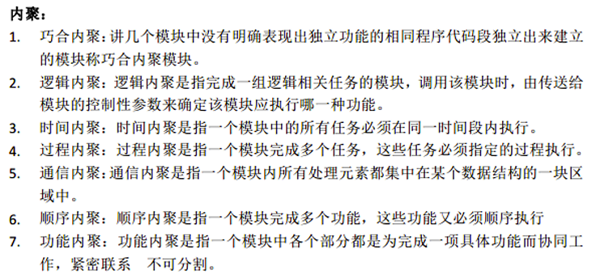
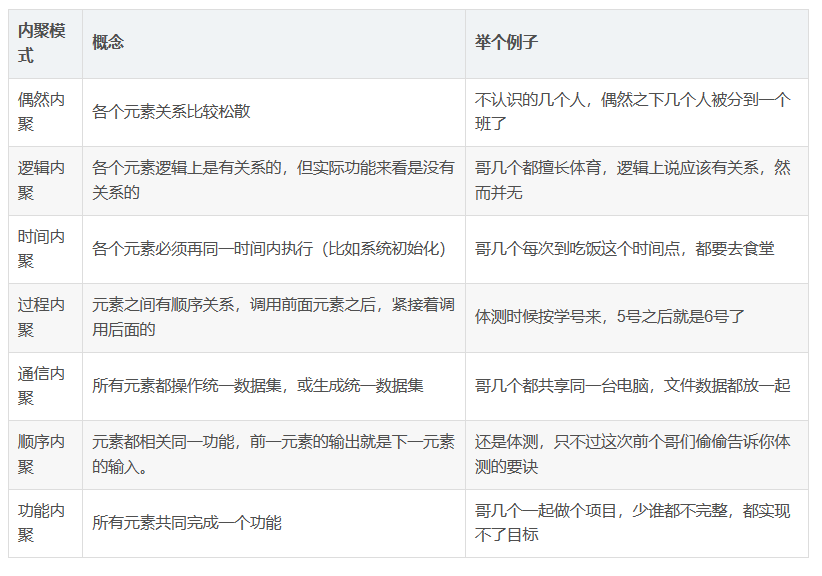
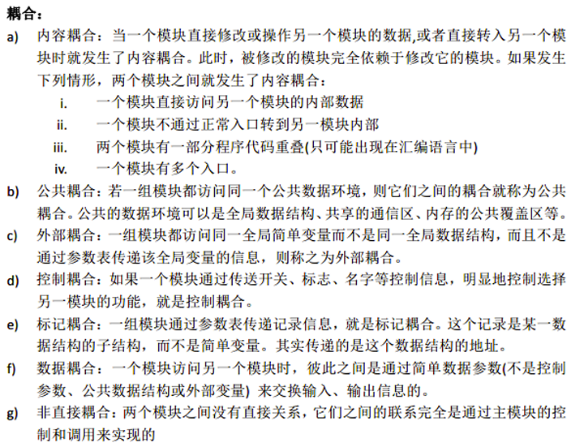
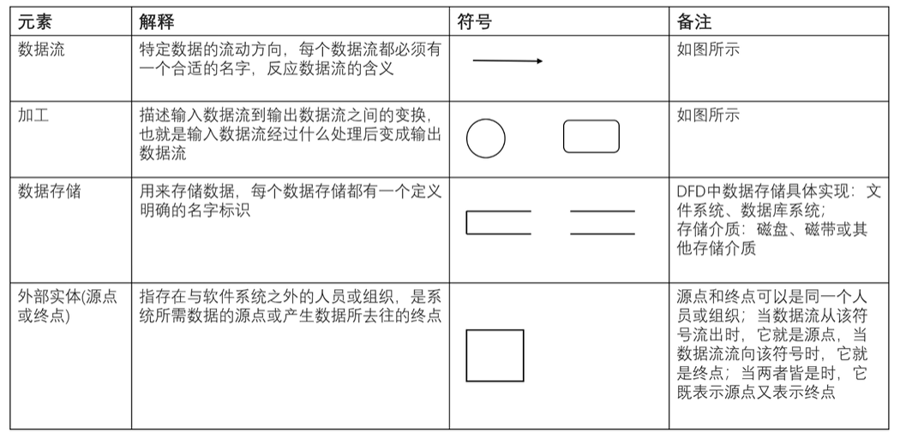
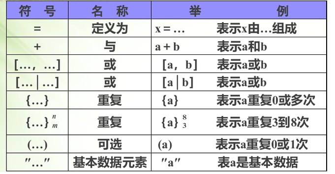
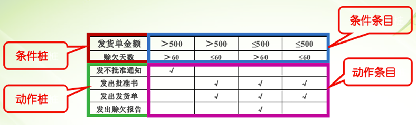
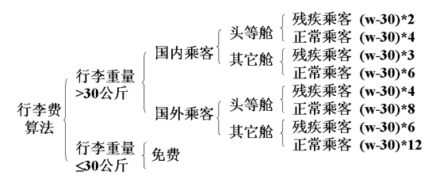
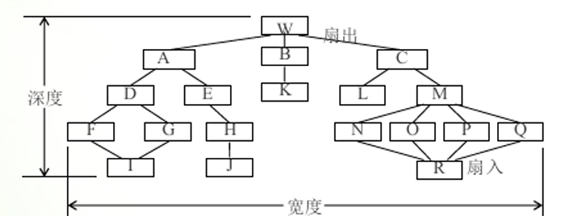

### 什么是软件工程

软件工程是结合计算机科学, 数学, 管理科学等原理, 开发软件的过程. 软件工程借鉴传统工程的原则和方法, 以提高质量, 降低成本为目的


### 软件危机

软件危机指在计算机软件的开发和维护过程中所遇到的一系列严重问题。随着计算机在各个领域的广泛应用，软件的需求量越来越大，软件的复杂度也越来越高，导致软件的开发远远满足不了社会发展的需要，超出预算的经费、超过预期的交付时间的事情经常发生。由于缺乏文档以及没有好的开发方法的指导，使得大量已有的软件难以维护，到20世纪60年代中期出现了人们难以控制的局面，即“软件危机”。

### 软件生存周期

软件生存周期（各阶段）由以下六个阶段组成：

（1）计算机系统工程：回答要解决的问题是什么？该问题有行的通的解决办法吗？若有解决问题的办法，则需要多少费用、资源、时间？

（2）需求分析：回答“为了解决这个问题，目标系统必须做什么”，确定目标系统的功能

（3）设计：回答 “待开发软件怎么做” 这个问题。把确定的各项功能需求转换成需要的体系结构。设计软件的结构，确定程序由哪些模块组成及模块间的关系，同时设计该项目的应用系统的总体数据结构和数据库结构。为每个模块完成的功能进行具体描述，把功能描述转变为精确的、结构化的过程描述

（4）编码：把每个模块的控制结构转换成计算机可接受的程序代码。写出的程序应是结构好，清晰易读，并且与设计一致。

（5）测试：通过各种类型的测试使软件达到预定的要求。

（6）运行和维护：通过各种必要的维护活动使系统持久地满足用户需要。


### 软件过程模型

#### 瀑布模型

简单来说就是一条流水线下去, 干完一步才能继续下一步, 一般情况下是不会使用它作为软件开发的模型的, 除非是较为简单的情况下

一般情况下是穿插在其他模型中使用

他的缺点是 : 

不同接口会产生大量的文档, 提高工作人员的工作量

客户只有在最后阶段才会知道产品长什么样, 可能会不满足客户的需求


#### 原型模型

用最快最经济的成本开发一个可以运行的程序来, 交给用户进行评估, 根据用户的反馈再决定是否要进行修改, 这个修改是持续进行的, 也就是说, 用户评价一次, 修改一次, 之后再次给用户评价,以此类推

优点

用户在项目开发中占主导地位

满足用户的动态需求, 减少开发时候的风险

1. 具有最终系统的基本特征
2. 构造方便、快速、造价低

缺点

不适合大型复杂的项目进行开发


#### 增量模型

将系统模块化,  从而分批次的分析设计编码这些模块

相对于瀑布模型, 增量模型不是直接将整个产品提交给用户的, 而是每次提交一个模块

增量模型可以理解为是瀑布模型和原型模型的结合体

每一次提交后都可以给用户进行评估

优点 : 

开发顺序十分灵活, 同时一个模块的错误也不会影响到整个软件系统

缺点 :

有些软件系统可能不能模块话

同时对软件管理人员和开发人员有这很大的要求


#### 螺旋模型

最大的特点是引入了风险分析的机制, 可以理解为是增量模型的加强版

分为四步走 : 指定计划 -> 风险分析 -> 工程实施(编码) -> 评审 -> ...[重复]

- 最大的特点在于引入了其他模型不具备的**风险分析**，使软件在无法排除重大风险时有机会停止。
- 螺旋模型更适合**大型的昂贵的系统级**的软件应用

缺点

建设周期长，而软件技术发展比较快，所以经常出现软件开发完毕后，和当前的技术水平有了较大的差距，无法满足当前用户需求


#### 喷泉模型

喷泉模型主要是在面向对象的过程中使用, 每个阶段没有太大的边界, 可以交叉完成

优点 :

效率很高

具有较好的可移植性。
容易适应各种运行环境。
迭代，无间隙。
各阶段是相互重叠和多次反复的

软件的某个部分通常被重复多次。	

缺点:

管理难度大


#### 基于构件的开发模型

简单来说就是复用之前的结构模块或者代码, 类似与动态链接库(.dll)或者函数, 被多次使用

优点 : 

减少开发bug以及增加开发效率


### 基于计算机的系统

基于计算机的系统 :

**通过处理信息来完成某些预定义目标而组织在一起的元素的集合和排列**

组成基于计算机系统的元素主要有 :

**软件, 硬件, 人员, 数据库, 文档和规程**


### 可行性分析基本

可行性分析是从经济, 技术, 法律三个主要方面进行分析的


### 需求工程的六个阶段

需求获取, 需求分析和协商, 系统建模, 需求规约, 需求验证


### 模块独立

衡量模块独立的两个标准是什么？它们各表示什么含义？

答：衡量模块独立性的两个定性的度量标准：耦合性和内聚性。

耦合性是模块之间的相对独立性（互相连接的紧密程度）的度量。

内聚性是一个模块内部各个元素彼此结合的紧密程度的度量。

耦合性与内聚性是模块独立性的两个定性的度量标准，将软件系统划分模块时，尽量做到高内聚、低耦合，提高模块的独立性，为设计高质量的软件结构奠定基础。

### 内聚



#### 巧合内聚

一个模块中没有任何的联系, 只是吧分散的功能放在了一起

```c++
void fun() {
    int a = 10; a ++;
    int b = 10; b ++;
}
```

#### 逻辑内聚

几个逻辑上相关的功能放在了同一个模块

```c++
int fun(int a, int b, bool flag) {
    if(flag)
        return max(a, b);
    else return min(a, b);
}
```

#### 时间内聚

某一些功能必需在一个时间段完成(初始化), 把这些在同一个时间段执行的功能放在一个模块中

```c++
void init(int* arr, int* a, int* b) {
    for(int i = 0 ; i < n ; i ++)
        arr[i] = 0;
   	*a = 100; *b = 100;
}
```

#### 过程内聚

一个模块中有多个功能, 功能必需按照先后顺序执行

```c++
int avg_x = 0
void init(int* arr, int n) {
    int avg_x = 0;
    for(int i = 0 ; i < n ; i ++)
        avg_x += arr[i];
    // 先求了和才能求平均数
    avg_x /= n;
}
```

#### 通信内聚

一个模块内的包含的功能都在使用同一个数据集或者数据

```c++
int* getDate() {
    static int a = 10;
    return &a;
}
void fun(int* a, int* b) {
    int* date = getDate();
    *a += *date; // 1.
    *b -= *date; // 2.
    (*date) --;    // 3.
}
```

#### 顺序内聚

模块内处理元素和同一个功能相关, 且一个处理元素作为后一个处理元素的输入

```c++
int cul_sig(int* arr, int n) {
    // 计算平均数
    int avg_x = 0;
    for(int i = 0 ; i < n ; i ++)
        avg_x += arr[i];
    avg_x /= n;
  	// 计算方差
    int sig_x = 0;
    for(int i = 0 ; i < n ; i++)
        sig_x += (arr[i] - avg_x) * (arr[i] - avg_x);
    sig_x /= n;
    return sig_x;
}
```

#### 功能内聚

只实现一个功能呢

```c++
void add(int*a, int b) {
    (*a) += b;
}
```





### 耦合




#### 内容耦合

模块一直接访问模块二的数据, 需要避免

#### 公共耦合

两个模块访问全局数据结构

```c++
struct show{
    int a, b;
}sample;

void fun1() {
    sample.a = 10;
}

void fun2() {
    sample.b = 100;
}
```


#### 外部耦合

两个模块访问全局简单变量

```c++
int a = 10;

void fun1() {
    a = 10;
}

void fun2() {
    a = 100;
}
```


#### 控制耦合

模块一传递逻辑给模块二

```c++
int fun(int a, int b, bool flag) {
    if(flag)
        return max(a, b);
    else return min(a, b);
}
void fun2() {
    int a = 10, b = 100;
    int c = fun(a, b, true);
}
```


#### 标记耦合

模块一传递数据结构给模块二

```c++
struct show{
    int a, b;
};

void fun1(struct show* put) {
    put->a = 10;
}

void fun2() {
   	struct show tem = {5, 10};
    fun1(&tem);
}
```


#### 数据耦合

模块一传递基本数据类型

```c++
int fun1(int num) {
    return num + 10;
}
void fun2() {
    int b = fun1(10);
}
```


#### 非直接耦合

没有啥关系, 可以独自运行


### 数据流图



顶层图一般只有一个加工, 一般没有文件


### 数据字典



### 判定表和判定树





### 结构图的几个概念

**深度**

深度是指结构图中控制的层数 [和树的深度计算方式一致] (下 : 5)

**宽度**

是指结构图中同一层次上模块总数的最大值 (下 : 7)

**扇入**

一个模块的扇入是指该模块直接调用该模块的模块数目 (下 : M : 4)

**扇出**

一个模块的扇出是指能直接调用该模块的模块数目 (下: R:4)


